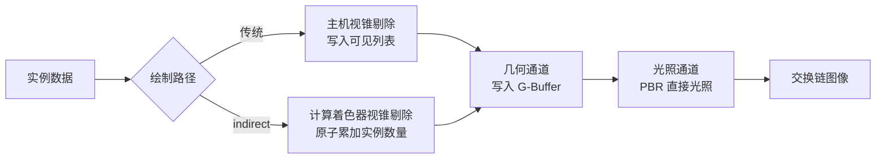

# Vulkan Indirect Draw 对比示例

Windows 平台上的 Vulkan 延迟渲染示例，用同一份场景、同一份着色器，对比两条几何提交路径：

- 传统路径：主机遍历全部实例做视锥剔除，为每个可见实例记录一条 `vkCmdDrawIndexed`
- indirect 路径：计算着色器在显存中完成视锥剔除并填写绘制命令，主机只记录一条 `vkCmdDrawIndexedIndirect`

两条路径共用同一个顶点着色器与片元着色器，都通过可见列表间接寻址实例数据，因此输出画面逐像素相同，差异只体现在提交方式上。

## 依赖

第三方库以 git submodule 形式引入：

| 库 | 用途 |
| --- | --- |
| `external/glfw` | 窗口与输入 |
| `external/glm` | 矩阵与向量运算 |
| `external/stb` | 读取 jpg/png 纹理、写出抓取的画面 |

Vulkan 头文件、`vulkan-1.lib` 与 `glslc.exe` 来自本机安装的 Vulkan SDK，路径由 CMake 变量 `VULKAN_SDK_DIR` 指定，默认 `D:/path/to/VulkanSDK`。

## 准备与构建

```
git submodule update --init --recursive
scripts\fetch_assets.bat
scripts\build.bat
```

`scripts\fetch_assets.bat` 下载 obj 模型与配套的 PBR 纹理（albedo、法线、金属度、粗糙度、环境光遮蔽）到 `assets/backpack`。

`scripts\build.bat` 调用 Visual Studio 自带的 CMake 与 Ninja 完成配置与编译，并用 `glslc` 把 `shaders` 下的 GLSL 编译成 SPIR-V 到 `build/shaders`。

## 运行

```
build\VulkanIndirectDrawDemo.exe
```

命令行参数：

| 参数 | 含义 | 默认值 |
| --- | --- | --- |
| `--instances N` | 场景实例数量 | 200000 |
| `--lights N` | 点光源数量 | 64 |
| `--far F` | 远裁剪面距离，决定可见实例数量 | 160 |
| `--indirect` | 启动时使用 indirect 路径 | 关闭 |
| `--switch-every S` | 每 S 秒自动切换一次绘制路径 | 关闭 |
| `--auto-exit S` | 运行 S 秒后自动退出 | 关闭 |
| `--capture 文件名` | 退出前把画面写成 PNG 并打印像素统计 | 关闭 |

操作方式：

| 按键 | 作用 |
| --- | --- |
| `W` `A` `S` `D` | 前后左右移动 |
| `Q` `E` | 下降与上升 |
| 方向键 | 转动视角 |
| 左 Shift | 加速移动 |
| 空格 | 切换绘制路径 |
| Esc | 退出 |

窗口标题与标准输出每半秒给出一次统计：实例数量、可见实例数量、绘制命令条数、帧时间、主机剔除耗时、主机记录命令耗时、设备时间（时间戳查询测得）。

一键对比：

```
scripts\compare.bat 200000 420 8
```

三个参数依次为实例数量、远裁剪面距离、每条路径的运行秒数。脚本分别运行两条路径，抓取画面并打印两张 PNG 的 SHA256 校验值。

## 实测数据

测试环境为 NVIDIA GeForce RTX 5080，分辨率 1600x900，模型 67907 个三角形，64 个点光源，呈现模式为立即模式。

20 万实例，远裁剪面 160，可见 435 个实例：

| 路径 | 绘制命令 | 帧时间 | 主机剔除 | 主机记录命令 | 设备时间 |
| --- | --- | --- | --- | --- | --- |
| 传统 | 435 | 2.68 ms | 0.51 ms | 0.57 ms | 1.51 ms |
| indirect | 1 | 1.76 ms | 0.00 ms | 0.16 ms | 1.52 ms |

20 万实例，远裁剪面 420，可见 2905 个实例：

| 路径 | 绘制命令 | 帧时间 | 主机剔除 | 主机记录命令 | 设备时间 |
| --- | --- | --- | --- | --- | --- |
| 传统 | 2905 | 12.69 ms | 0.51 ms | 2.63 ms | 9.40 ms |
| indirect | 1 | 9.81 ms | 0.00 ms | 0.28 ms | 9.42 ms |

100 万实例，远裁剪面 160，可见 435 个实例：

| 路径 | 绘制命令 | 帧时间 | 主机剔除 | 主机记录命令 | 设备时间 |
| --- | --- | --- | --- | --- | --- |
| 传统 | 435 | 5.04 ms | 2.75 ms | 0.64 ms | 1.53 ms |
| indirect | 1 | 1.87 ms | 0.00 ms | 0.21 ms | 1.55 ms |

设备时间在两条路径上一致，说明像素与顶点的工作量相同；帧时间的差距全部来自主机侧：实例总量决定剔除耗时，可见实例数量决定记录绘制命令的耗时，这两项在 indirect 路径上都由显卡承担。

两条路径抓取的 PNG 校验值相同，可见剔除结果与渲染结果完全一致。

运行时用空格键或者 `--switch-every` 参数反复切换路径，两条路径的可见实例数量始终相同，验证层没有报告任何问题。

## 渲染流程



G-Buffer 由三张颜色附件与一张深度附件组成：

| 附件 | 格式 | 内容 |
| --- | --- | --- |
| 0 | `R8G8B8A8_UNORM` | albedo 三通道与环境光遮蔽 |
| 1 | `R16G16B16A16_SFLOAT` | 世界空间法线与粗糙度 |
| 2 | `R16G16B16A16_SFLOAT` | 世界空间位置与金属度 |
| 深度 | `D32_SFLOAT` | 深度 |

法线贴图通过屏幕空间导数构造切线空间，因此 obj 解析器只需要提供位置、纹理坐标与法线。光照通道使用 Cook-Torrance BRDF：GGX 法线分布、Schlick-GGX 几何项与 Schlick 菲涅尔近似，配合 Reinhard 色调映射与伽马校正。

## 源码结构

| 文件 | 内容 |
| --- | --- |
| `src/main.cpp` | 命令行解析、主循环、输入与统计显示 |
| `src/vk_context.cpp` | 实例、调试信息回调、物理设备、逻辑设备与交换链 |
| `src/vk_resources.cpp` | 缓冲与纹理的创建上传、多级渐远纹理生成、着色器模块加载 |
| `src/obj_loader.cpp` | obj 解析、顶点去重、模型居中与包围球计算 |
| `src/scene.cpp` | 实例网格生成、跟随相机的光源平铺、相机控制、视锥平面提取、主机侧剔除 |
| `src/renderer.cpp` | 渲染通道、描述符、三条管线、两条绘制路径与时间戳查询 |
| `src/frame_capture.cpp` | 画面回读、像素统计与 PNG 写出 |
| `shaders/cull.comp` | 视锥剔除与绘制命令填写 |
| `shaders/gbuffer.vert` `shaders/gbuffer.frag` | 几何通道 |
| `shaders/fullscreen.vert` `shaders/lighting.frag` | 光照通道 |

## 资源来源

模型与纹理来自 [LearnOpenGL](https://learnopengl.com/data/models/backpack.zip)，原始模型作者 Berk Gedik。压缩包内的 `specular.jpg` 实际是金属度贴图，`diffuse.jpg` 实际是 albedo 贴图，本示例按 PBR 语义使用它们。
