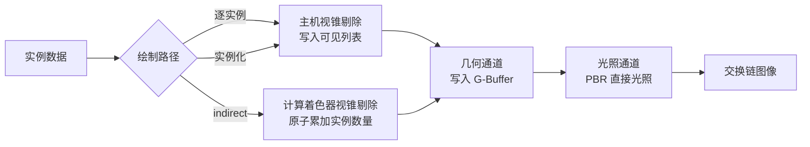

# Vulkan Indirect Draw 对比示例

Windows 平台上的 Vulkan 延迟渲染示例，用同一份场景、同一份着色器，对比三条几何提交路径：

- 逐实例路径：主机遍历全部实例做视锥剔除，为每个可见实例记录一条 `vkCmdDrawIndexed`
- 实例化路径：主机做同样的剔除，全部可见实例合并成一条 `vkCmdDrawIndexed`，实例数量为可见数量
- indirect 路径：计算着色器在显存中完成视锥剔除并填写绘制命令，主机只记录一条 `vkCmdDrawIndexedIndirect`

三条路径共用同一个顶点着色器与片元着色器，都通过可见列表间接寻址实例数据，因此输出画面逐像素相同，差异只体现在提交方式上。前两条路径的剔除结果写进同一个可见列表缓冲，区别只在于把可见列表下标交给 `firstInstance` 还是交给 `gl_InstanceIndex`。

## 依赖

第三方库以 git submodule 形式引入：

| 库 | 用途 |
| --- | --- |
| `external/glfw` | 窗口与输入 |
| `external/glm` | 矩阵与向量运算 |
| `external/stb` | 读取 jpg/png 纹理、写出抓取的画面 |
| `external/imgui` | 参数控制面板与耗时显示 |
| `external/implot` | 耗时曲线绘制 |

Vulkan 头文件、`vulkan-1.lib` 与 `glslc.exe` 来自本机安装的 Vulkan SDK，路径由 CMake 变量 `VULKAN_SDK_DIR` 指定，默认 `D:/path/to/VulkanSDK`。

## 准备与构建

```
git submodule update --init --recursive
scripts\fetch_assets.bat
scripts\build.bat
```

`scripts\fetch_assets.bat` 下载 obj 模型与配套的 PBR 纹理（albedo、法线、金属度、粗糙度、环境光遮蔽）到 `assets/backpack`。

`scripts\build.bat` 调用 Visual Studio 自带的 CMake 与 Ninja 完成配置与编译，并用 `glslc` 把 `shaders` 下的 GLSL 编译成 SPIR-V 到 `build/shaders`。

## 运行

```
build\VulkanIndirectDrawDemo.exe
```

界面面板负责全部参数控制与信息显示：

| 控件 | 作用 |
| --- | --- |
| 绘制路径单选按钮 | 在逐实例、实例化、indirect 三条路径之间切换 |
| 实例数量 | 参与绘制的实例数量，取值范围到实例容量为止 |
| 光源数量 | 参与光照计算的点光源数量 |
| 远裁剪面 | 决定视锥深度，也就决定可见实例数量 |
| 移动速度 | 相机移动速度 |
| GPU 锁频 | 显示探测到的 NVIDIA 显卡，按"查询当前频率"按钮调用 `nvidia-smi` 读一次实时核心/显存频率，两个下拉框列出该显卡支持的全部频率档位供选择，锁频/解锁按钮调用 `nvidia-smi -lgc/-lmc`/`-rgc/-rmc` |

`nvidia-smi` 由程序同步启动并等待结束，一次调用会阻塞主线程几十到一百多毫秒，因此只有按下按钮才会调用它，没有任何定时轮询，帧时间曲线不会被这种与绘制无关的因素干扰。

面板同时显示实例总数、可见实例数量与绘制命令条数，另附操作指南。

耗时统计区域按计时项逐一列出：帧时间、主机剔除、命令缓冲记录过程按功能步骤拆分出的各项（命令缓冲起始、剔除计算调度、G-Buffer 通道、光照通道、界面绘制、抓帧拷贝、提交命令）、设备时间。逐实例绘制路径下 G-Buffer 通道耗时项包含整条逐实例绘制循环，循环内部不逐次计时。每一项都显示最近一百帧的平均值与标准差，下方配一张曲线，横轴是启动以来经过的时间，只画出最近十秒；纵轴上下限取同一批数据的最小值与最大值，再各向外留一成余量，与横轴取自同一批数据。按时间而不是按帧数取窗口，不同帧率下横轴跨度一致，纵轴也不会把早已滚出画面的旧尖峰一直算进来。曲线图高一百五十像素，并且不画坐标轴标题：坐标轴刻度文字与四周留白固定占掉近七十像素，图矮的时候留给曲线的只剩十几像素，纵轴范围取得再准也看不出起伏。

界面上的实例数量与光源数量都在启动时按容量分配好了缓冲，滑动过程中不重建任何 Vulkan 资源。实例按到网格中心的距离排序，减少数量时留下的是相机附近的一团，场景密度保持不变。

### GPU 锁频

锁频的全部行为都由本机 `nvidia-smi`（NVIDIA 驱动自带）完成，程序只负责拼命令行和展示结果：

| 步骤 | 调用 | 说明 |
| --- | --- | --- |
| 探测 | `--query-gpu=index,name`、`--query-supported-clocks=gr`、`--query-supported-clocks=mem` | 取第一块 NVIDIA 显卡的名字与它支持的核心/显存频率档位，档位降序填进两个下拉框。探测不到显卡或调用失败时，面板里如实显示原因，不影响渲染继续运行 |
| 锁频 | `-lgc 下限,上限`、`-lmc 下限,上限` | 按下拉框选中的档位把核心与显存频率都固定成这一个值（上下限填同一个数） |
| 解锁 | `-rgc`、`-rmc` | 交还给驱动自动调频。程序退出前如果处于锁频状态会自动解锁 |

`--core-clock` 与 `--memory-clock` 让锁频在启动阶段就完成，不必先开界面点按钮：程序在两个档位列表里各取与传入值最接近的一项并锁定，然后把实际锁到的值和请求值一起打印出来。这两个参数必须同时给出，只给一个直接报错退出。请求值不在档位列表里是允许的，取最接近的那一项即可，例如请求 2800 MHz 而最接近的档位是 2797 MHz 时锁的就是 2797 MHz。

选中的档位不等于显卡实际跑到的频率，这一点必须注意：

- 下拉框里的档位只是驱动报告"支持"的取值，锁频命令下发之后，显卡仍受功耗、温度、电压与驱动策略约束，实际频率可能低于档位，也可能因为负载不足自己降到更低的一档；
- 消费级显卡常常直接拒绝 `-lgc`/`-lmc`，或者需要以管理员身份运行本程序才生效，此时面板会显示锁频失败以及 `nvidia-smi` 返回的原因；
- 因此锁频是否真的生效，只能看实测频率，不能看档位。面板下方的核心频率与显存频率两张图就是为此准备的。

这两张图的数据来自后台线程，每 1 秒调用一次 `nvidia-smi --query-gpu=clocks.gr,clocks.mem`，采样结果按启动以来的秒数记进历史。放在单独的线程里是为了让等待 `nvidia-smi` 的时间不落在主循环上——同步调用一次要几十到一百多毫秒，放在主线程里就会在帧时间曲线上留下每秒一个的尖峰。曲线的画法与耗时曲线完全一致：只画最近十秒，纵轴取这段数据的最小值与最大值再各向外留一成余量，横轴同为启动以来的秒数，纵轴单位为 MHz。`--no-interface` 的测量模式下不启动这个线程，测量过程完全不受采样影响。

面板上的"查询当前频率"按钮是另一条独立路径：它在主线程上同步查一次并把结果显示成文字，代价是这一次调用会卡住主线程。不想看到尖峰就不要按它，看曲线即可。

命令行参数用于自动化测量，与界面控制同一套状态：

| 参数 | 含义 | 默认值 |
| --- | --- | --- |
| `--instances N` | 启动时的实例数量 | 200000 |
| `--lights N` | 启动时的点光源数量 | 64 |
| `--far F` | 启动时的远裁剪面距离 | 160 |
| `--instanced` | 启动时使用实例化路径 | 关闭 |
| `--indirect` | 启动时使用 indirect 路径 | 关闭 |
| `--no-interface` | 不显示界面面板 | 显示 |
| `--switch-every S` | 每 S 秒依次切换到下一条绘制路径 | 关闭 |
| `--sweep-instances S` | 每 S 秒在若干实例数量之间轮换 | 关闭 |
| `--auto-exit S` | 运行 S 秒后自动退出 | 关闭 |
| `--core-clock N` | 启动时锁定的核心频率，单位 MHz，取最接近的可选档位 | 不锁频 |
| `--memory-clock N` | 启动时锁定的显存频率，单位 MHz，取最接近的可选档位 | 不锁频 |
| `--capture 文件名` | 退出前把画面写成 PNG 并打印像素统计 | 关闭 |
| `--report 文件名` | 退出前把本次运行的平均耗时以 CSV 形式追加到该文件 | 关闭 |

`--report` 由程序自己打开文件写入，测量结果不经过控制台重定向。文件为空时先写一行表头，之后每次运行追加一行：

```
draw_path,instances,visible_instances,draw_commands,frame_ms_avg,frame_ms_stddev,cpu_cull_ms_avg,cpu_cull_ms_stddev,
cpu_record_begin_ms_avg,cpu_record_begin_ms_stddev,cpu_record_cull_dispatch_ms_avg,cpu_record_cull_dispatch_ms_stddev,
cpu_record_gbuffer_pass_ms_avg,cpu_record_gbuffer_pass_ms_stddev,cpu_record_lighting_pass_ms_avg,cpu_record_lighting_pass_ms_stddev,
cpu_record_ui_ms_avg,cpu_record_ui_ms_stddev,cpu_record_capture_ms_avg,cpu_record_capture_ms_stddev,
cpu_record_submit_ms_avg,cpu_record_submit_ms_stddev,gpu_ms_avg,gpu_ms_stddev
```

每个计时项占两列，平均值与标准差各一列。统计跳过启动后的一点五秒预热，之后的每一帧都计入这个从预热结束到程序退出的完整窗口。程序的控制台输出全部使用英文。

实例容量取一百万与 `--instances` 的较大值，界面滑块的上限就是这个容量。

键盘操作：

| 按键 | 作用 |
| --- | --- |
| `W` `A` `S` `D` | 前后左右移动 |
| `Q` `E` | 下降与上升 |
| 方向键 | 转动视角 |
| 左 Shift | 加速移动 |
| 空格 | 依次切换到下一条绘制路径 |
| Esc | 退出 |

一键对比：

```
scripts\compare.bat 200000 420 8
```

三个参数依次为实例数量、远裁剪面距离、每条路径的运行秒数。脚本关闭界面分别运行三条路径，把耗时写进 `intermediate\compare_report.csv`，把三张 PNG 的 SHA256 写进 `intermediate\compare_hashes.csv`。

一致性验证与耗时测量：

```
scripts\verify_paths.bat
scripts\measure.bat
```

前者在一千、两万、二十万、一百万实例下分别运行三条路径，对比可见实例数量；后者在三组配置下测量三条路径的耗时。两个脚本都关闭界面运行，结果分别写进 `intermediate\verify_report.csv` 与 `intermediate\measure_report.csv`。

全部脚本的提示文字与生成的报告都使用英文，报告一律是 CSV 格式，可以直接导入表格软件。

## 实测数据

测试环境为 NVIDIA GeForce RTX 5080，分辨率 1600x900，模型 67907 个三角形，64 个点光源，呈现模式为立即模式，测量时关闭界面面板。以下数据取自 `scripts\measure.bat` 生成的 CSV 报告的平均值列。关闭界面面板、不抓取画面时，记录：界面绘制与记录：抓帧拷贝这两项恒为零，下表不再单独列出。

20 万实例，远裁剪面 160，可见 435 个实例：

| 路径 | 绘制命令 | 帧时间 | 主机剔除 | 记录：起始 | 记录：剔除调度 | 记录：G-Buffer 通道 | 记录：光照通道 | 记录：提交命令 | 设备时间 |
| --- | --- | --- | --- | --- | --- | --- | --- | --- | --- |
| 逐实例 | 435 | 2.594 ms | 0.473 ms | 0.023 ms | 0.000 ms | 0.429 ms | 0.016 ms | 0.056 ms | 1.492 ms |
| 实例化 | 1 | 2.200 ms | 0.478 ms | 0.021 ms | 0.000 ms | 0.050 ms | 0.013 ms | 0.054 ms | 1.487 ms |
| indirect | 1 | 1.749 ms | 0.000 ms | 0.020 ms | 0.031 ms | 0.044 ms | 0.013 ms | 0.055 ms | 1.493 ms |

20 万实例，远裁剪面 420，可见 2905 个实例：

| 路径 | 绘制命令 | 帧时间 | 主机剔除 | 记录：起始 | 记录：剔除调度 | 记录：G-Buffer 通道 | 记录：光照通道 | 记录：提交命令 | 设备时间 |
| --- | --- | --- | --- | --- | --- | --- | --- | --- | --- |
| 逐实例 | 2905 | 12.830 ms | 0.491 ms | 0.043 ms | 0.000 ms | 2.552 ms | 0.037 ms | 0.092 ms | 9.487 ms |
| 实例化 | 1 | 10.335 ms | 0.507 ms | 0.044 ms | 0.000 ms | 0.102 ms | 0.020 ms | 0.082 ms | 9.470 ms |
| indirect | 1 | 9.878 ms | 0.000 ms | 0.047 ms | 0.061 ms | 0.085 ms | 0.020 ms | 0.084 ms | 9.465 ms |

100 万实例，远裁剪面 160，可见 435 个实例：

| 路径 | 绘制命令 | 帧时间 | 主机剔除 | 记录：起始 | 记录：剔除调度 | 记录：G-Buffer 通道 | 记录：光照通道 | 记录：提交命令 | 设备时间 |
| --- | --- | --- | --- | --- | --- | --- | --- | --- | --- |
| 逐实例 | 435 | 4.366 ms | 2.203 ms | 0.033 ms | 0.000 ms | 0.437 ms | 0.020 ms | 0.069 ms | 1.489 ms |
| 实例化 | 1 | 3.970 ms | 2.194 ms | 0.033 ms | 0.000 ms | 0.070 ms | 0.017 ms | 0.064 ms | 1.487 ms |
| indirect | 1 | 1.758 ms | 0.000 ms | 0.019 ms | 0.030 ms | 0.043 ms | 0.012 ms | 0.054 ms | 1.508 ms |

设备时间在三条路径上一致，说明像素与顶点的工作量相同；帧时间的差距全部来自主机侧，而且可以分开看两个来源：

记录：G-Buffer 通道这一项由可见实例数量决定。逐实例路径要在这里跑完整条逐实例绘制循环，可见实例数量越多，这一项越大，是三组数据里差距最大的一处，可见实例 2905 个时从 2.552 ms 降到 0.102 ms；可见实例只有 435 个时降幅相应变小。indirect 路径把这一项压到最低（一条 indirect 绘制命令），但会多出记录：剔除调度这一项开销（0.03~0.06 ms），这一项在另外两条路径上恒为零。

主机剔除这一项由实例总量决定，实例化路径与逐实例路径一样要在主机上遍历全部实例，因此一百万实例下两者都是两毫秒以上。indirect 路径把这一项交给计算着色器，主机侧归零，这是它相对实例化路径的全部优势来源。

换句话说，实例化绘制消除的是命令条数带来的开销，indirect 绘制在此基础上进一步消除了遍历实例的开销。可见实例越多，实例化相对逐实例的收益越明显；实例总量越大，indirect 相对实例化的收益越明显。

三条路径抓取的 PNG 校验值相同，可见剔除结果与渲染结果完全一致。

在一千、两万、二十万、一百万实例下，三条路径给出的可见实例数量分别为 269、666、666、666，逐项相同。

运行时反复切换路径并同时改变实例数量，可见实例数量始终与另外两条路径吻合，验证层没有报告任何问题。

## 渲染流程



前两条路径在这张图上走同一条分支，它们的差别只在几何通道里提交了多少条绘制命令。

G-Buffer 由三张颜色附件与一张深度附件组成：

| 附件 | 格式 | 内容 |
| --- | --- | --- |
| 0 | `R8G8B8A8_UNORM` | albedo 三通道与环境光遮蔽 |
| 1 | `R16G16B16A16_SFLOAT` | 世界空间法线与粗糙度 |
| 2 | `R16G16B16A16_SFLOAT` | 世界空间位置与金属度 |
| 深度 | `D32_SFLOAT` | 深度 |

法线贴图通过屏幕空间导数构造切线空间，因此 obj 解析器只需要提供位置、纹理坐标与法线。光照通道使用 Cook-Torrance BRDF：GGX 法线分布、Schlick-GGX 几何项与 Schlick 菲涅尔近似，配合 Reinhard 色调映射与伽马校正。界面在光照通道内、全屏三角形之后绘制。

界面文本使用系统自带的微软雅黑，字形范围由界面文本本身构建，启动时逐个码点确认字体里有对应字形，缺字直接终止。

## 源码结构

| 文件 | 内容 |
| --- | --- |
| `src/main.cpp` | 命令行解析、主循环与界面状态 |
| `src/vk_context.cpp` | 实例、调试信息回调、物理设备、逻辑设备与交换链 |
| `src/vk_resources.cpp` | 缓冲与纹理的创建上传、多级渐远纹理生成、着色器模块加载 |
| `src/obj_loader.cpp` | obj 解析、顶点去重、模型居中与包围球计算 |
| `src/scene.cpp` | 实例网格生成与排序、跟随相机的光源平铺、相机控制、视锥平面提取、主机侧剔除 |
| `src/renderer.cpp` | 渲染通道、描述符、三条管线、三条绘制路径与时间戳查询 |
| `src/timing.cpp` | 计时项定义、滑动窗口统计、启动至今的历史曲线、测量报告的在线统计 |
| `src/user_interface.cpp` | imgui 与 implot 初始化、字体与字形校验、控制面板、耗时曲线绘制 |
| `src/gpu_clock_lock.cpp` | 调用 `nvidia-smi` 探测显卡、读取支持的频率档位、锁频与解锁 |
| `src/frame_capture.cpp` | 画面回读、像素统计与 PNG 写出 |
| `shaders/cull.comp` | 视锥剔除与绘制命令填写 |
| `shaders/gbuffer.vert` `shaders/gbuffer.frag` | 几何通道 |
| `shaders/fullscreen.vert` `shaders/lighting.frag` | 光照通道 |

## 资源来源

模型与纹理来自 [LearnOpenGL](https://learnopengl.com/data/models/backpack.zip)，原始模型作者 Berk Gedik。压缩包内的 `specular.jpg` 实际是金属度贴图，`diffuse.jpg` 实际是 albedo 贴图，本示例按 PBR 语义使用它们。
