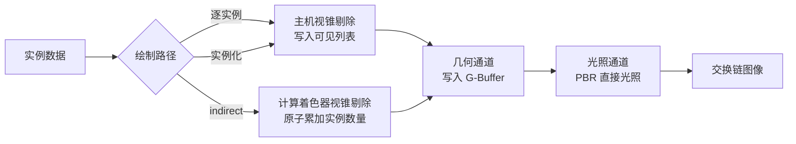

# Vulkan Indirect Draw 对比示例

Windows 平台上的 Vulkan 延迟渲染示例，用同一份场景、同一份着色器，对比三条几何提交路径：

- 逐实例路径：主机遍历全部实例做视锥剔除，为每个可见实例记录一条 `vkCmdDrawIndexed`
- 实例化路径：主机做同样的剔除，全部可见实例合并成一条 `vkCmdDrawIndexed`，实例数量为可见数量
- indirect 路径：计算着色器在显存中完成视锥剔除并填写绘制命令，主机只记录一条 `vkCmdDrawIndexedIndirect`

三条路径共用同一个顶点着色器与片元着色器，都通过可见列表间接寻址实例数据，因此输出画面逐像素相同，差异只体现在提交方式上。前两条路径的剔除结果写进同一个可见列表缓冲，区别只在于把可见列表下标交给 `firstInstance` 还是交给 `gl_InstanceIndex`。

## 依赖

第三方库以 git submodule 形式引入：

| 库 | 用途 |
| --- | --- |
| `external/glfw` | 窗口与输入 |
| `external/glm` | 矩阵与向量运算 |
| `external/stb` | 读取 jpg/png 纹理、写出抓取的画面 |
| `external/imgui` | 参数控制面板与耗时显示 |

Vulkan 头文件、`vulkan-1.lib` 与 `glslc.exe` 来自本机安装的 Vulkan SDK，路径由 CMake 变量 `VULKAN_SDK_DIR` 指定，默认 `D:/path/to/VulkanSDK`。

## 准备与构建

```
git submodule update --init --recursive
scripts\fetch_assets.bat
scripts\build.bat
```

`scripts\fetch_assets.bat` 下载 obj 模型与配套的 PBR 纹理（albedo、法线、金属度、粗糙度、环境光遮蔽）到 `assets/backpack`。

`scripts\build.bat` 调用 Visual Studio 自带的 CMake 与 Ninja 完成配置与编译，并用 `glslc` 把 `shaders` 下的 GLSL 编译成 SPIR-V 到 `build/shaders`。

## 运行

```
build\VulkanIndirectDrawDemo.exe
```

界面面板负责全部参数控制与信息显示：

| 控件 | 作用 |
| --- | --- |
| 绘制路径单选按钮 | 在逐实例、实例化、indirect 三条路径之间切换 |
| 实例数量 | 参与绘制的实例数量，取值范围到实例容量为止 |
| 光源数量 | 参与光照计算的点光源数量 |
| 远裁剪面 | 决定视锥深度，也就决定可见实例数量 |
| 移动速度 | 相机移动速度 |

面板同时显示帧时间、主机剔除耗时、主机记录命令耗时、设备时间，以及实例总数、可见实例数量与绘制命令条数，另附操作指南。

界面上的实例数量与光源数量都在启动时按容量分配好了缓冲，滑动过程中不重建任何 Vulkan 资源。实例按到网格中心的距离排序，减少数量时留下的是相机附近的一团，场景密度保持不变。

命令行参数用于自动化测量，与界面控制同一套状态：

| 参数 | 含义 | 默认值 |
| --- | --- | --- |
| `--instances N` | 启动时的实例数量 | 200000 |
| `--lights N` | 启动时的点光源数量 | 64 |
| `--far F` | 启动时的远裁剪面距离 | 160 |
| `--instanced` | 启动时使用实例化路径 | 关闭 |
| `--indirect` | 启动时使用 indirect 路径 | 关闭 |
| `--no-interface` | 不显示界面面板 | 显示 |
| `--switch-every S` | 每 S 秒依次切换到下一条绘制路径 | 关闭 |
| `--sweep-instances S` | 每 S 秒在若干实例数量之间轮换 | 关闭 |
| `--auto-exit S` | 运行 S 秒后自动退出 | 关闭 |
| `--capture 文件名` | 退出前把画面写成 PNG 并打印像素统计 | 关闭 |
| `--report 文件名` | 退出前把本次运行的平均耗时追加到该文件 | 关闭 |

`--report` 由程序自己打开文件写入，测量结果不经过控制台重定向。统计跳过启动后的一点五秒预热，之后的每一帧都计入平均值。

实例容量取一百万与 `--instances` 的较大值，界面滑块的上限就是这个容量。

键盘操作：

| 按键 | 作用 |
| --- | --- |
| `W` `A` `S` `D` | 前后左右移动 |
| `Q` `E` | 下降与上升 |
| 方向键 | 转动视角 |
| 左 Shift | 加速移动 |
| 空格 | 依次切换到下一条绘制路径 |
| Esc | 退出 |

一键对比：

```
scripts\compare.bat 200000 420 8
```

三个参数依次为实例数量、远裁剪面距离、每条路径的运行秒数。脚本关闭界面分别运行三条路径，抓取画面并打印三张 PNG 的 SHA256 校验值。

一致性验证与耗时测量：

```
scripts\verify_paths.bat
scripts\measure.bat
```

前者在一千、两万、二十万、一百万实例下分别运行三条路径，对比可见实例数量；后者在三组配置下测量三条路径的耗时。两个脚本都关闭界面运行，结果由程序写进 `intermediate` 下的报告文件。

## 实测数据

测试环境为 NVIDIA GeForce RTX 5080，分辨率 1600x900，模型 67907 个三角形，64 个点光源，呈现模式为立即模式，测量时关闭界面面板。

20 万实例，远裁剪面 160，可见 435 个实例：

| 路径 | 绘制命令 | 帧时间 | 主机剔除 | 主机记录命令 | 设备时间 |
| --- | --- | --- | --- | --- | --- |
| 逐实例 | 435 | 2.51 ms | 0.455 ms | 0.484 ms | 1.50 ms |
| 实例化 | 1 | 2.11 ms | 0.430 ms | 0.109 ms | 1.50 ms |
| indirect | 1 | 1.71 ms | 0.000 ms | 0.138 ms | 1.49 ms |

20 万实例，远裁剪面 420，可见 2905 个实例：

| 路径 | 绘制命令 | 帧时间 | 主机剔除 | 主机记录命令 | 设备时间 |
| --- | --- | --- | --- | --- | --- |
| 逐实例 | 2905 | 12.38 ms | 0.511 ms | 2.430 ms | 9.29 ms |
| 实例化 | 1 | 10.17 ms | 0.539 ms | 0.198 ms | 9.28 ms |
| indirect | 1 | 9.66 ms | 0.000 ms | 0.247 ms | 9.27 ms |

100 万实例，远裁剪面 160，可见 435 个实例：

| 路径 | 绘制命令 | 帧时间 | 主机剔除 | 主机记录命令 | 设备时间 |
| --- | --- | --- | --- | --- | --- |
| 逐实例 | 435 | 4.15 ms | 2.000 ms | 0.559 ms | 1.50 ms |
| 实例化 | 1 | 3.83 ms | 2.021 ms | 0.223 ms | 1.49 ms |
| indirect | 1 | 1.72 ms | 0.000 ms | 0.137 ms | 1.51 ms |

设备时间在三条路径上一致，说明像素与顶点的工作量相同；帧时间的差距全部来自主机侧，而且两项开销可以分开看：

主机记录命令这一项由可见实例数量决定。实例化路径把逐实例的绘制命令合并成一条，这一项从 2.430 ms 降到 0.198 ms，是三组数据里差距最大的一处；可见实例只有 435 个时降幅相应变小。

主机剔除这一项由实例总量决定，实例化路径与逐实例路径一样要在主机上遍历全部实例，因此一百万实例下两者都是两毫秒左右。indirect 路径把这一项交给计算着色器，主机侧归零，这是它相对实例化路径的全部优势来源。

换句话说，实例化绘制消除的是命令条数带来的开销，indirect 绘制在此基础上进一步消除了遍历实例的开销。可见实例越多，实例化相对逐实例的收益越明显；实例总量越大，indirect 相对实例化的收益越明显。

三条路径抓取的 PNG 校验值相同，可见剔除结果与渲染结果完全一致。

在一千、两万、二十万、一百万实例下，三条路径给出的可见实例数量分别为 269、666、666、666，逐项相同。

运行时反复切换路径并同时改变实例数量，可见实例数量始终与另外两条路径吻合，验证层没有报告任何问题。

## 渲染流程



前两条路径在这张图上走同一条分支，它们的差别只在几何通道里提交了多少条绘制命令。

G-Buffer 由三张颜色附件与一张深度附件组成：

| 附件 | 格式 | 内容 |
| --- | --- | --- |
| 0 | `R8G8B8A8_UNORM` | albedo 三通道与环境光遮蔽 |
| 1 | `R16G16B16A16_SFLOAT` | 世界空间法线与粗糙度 |
| 2 | `R16G16B16A16_SFLOAT` | 世界空间位置与金属度 |
| 深度 | `D32_SFLOAT` | 深度 |

法线贴图通过屏幕空间导数构造切线空间，因此 obj 解析器只需要提供位置、纹理坐标与法线。光照通道使用 Cook-Torrance BRDF：GGX 法线分布、Schlick-GGX 几何项与 Schlick 菲涅尔近似，配合 Reinhard 色调映射与伽马校正。界面在光照通道内、全屏三角形之后绘制。

界面文本使用系统自带的微软雅黑，字形范围由界面文本本身构建，启动时逐个码点确认字体里有对应字形，缺字直接终止。

## 源码结构

| 文件 | 内容 |
| --- | --- |
| `src/main.cpp` | 命令行解析、主循环与界面状态 |
| `src/vk_context.cpp` | 实例、调试信息回调、物理设备、逻辑设备与交换链 |
| `src/vk_resources.cpp` | 缓冲与纹理的创建上传、多级渐远纹理生成、着色器模块加载 |
| `src/obj_loader.cpp` | obj 解析、顶点去重、模型居中与包围球计算 |
| `src/scene.cpp` | 实例网格生成与排序、跟随相机的光源平铺、相机控制、视锥平面提取、主机侧剔除 |
| `src/renderer.cpp` | 渲染通道、描述符、三条管线、三条绘制路径与时间戳查询 |
| `src/user_interface.cpp` | imgui 初始化、字体与字形校验、控制面板 |
| `src/frame_capture.cpp` | 画面回读、像素统计与 PNG 写出 |
| `shaders/cull.comp` | 视锥剔除与绘制命令填写 |
| `shaders/gbuffer.vert` `shaders/gbuffer.frag` | 几何通道 |
| `shaders/fullscreen.vert` `shaders/lighting.frag` | 光照通道 |

## 资源来源

模型与纹理来自 [LearnOpenGL](https://learnopengl.com/data/models/backpack.zip)，原始模型作者 Berk Gedik。压缩包内的 `specular.jpg` 实际是金属度贴图，`diffuse.jpg` 实际是 albedo 贴图，本示例按 PBR 语义使用它们。
