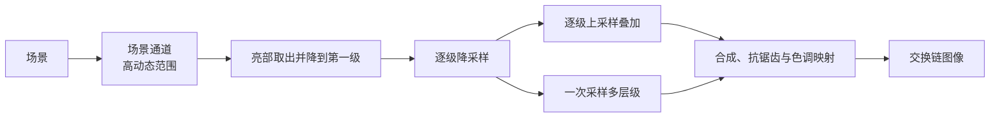

# bloom：泛光与亮部闪烁

构建方式见仓库根目录的 README。

## 简介

暗背景上有一个缓慢移动的高动态范围光源球，另加几条宽度不足一个像素的细亮条。整条泛光链全程在线性
高动态范围空间里做。

| 控件 | 取值 |
| --- | --- |
| 亮部取出 | 不做泛光、硬阈值、软阈值 |
| 降采样链 | 逐级高斯、一降一升、一次采样多层级 |
| 层级数 | 1 到 5 |
| 阈值与泛光强度 | 阈值 0.5 到 6，强度 0 到 1.5 |
| 抗锯齿与色调映射的顺序 | 先抗锯齿、先色调映射 |

## 渲染流程



## 实现要点

### 三种链实现与两种阈值

同一个时刻抓帧，与不做泛光的画面比较：

| 配置 | 平均绝对差 | 差值超过 8 的像素占比 | 最大差值 |
| --- | --- | --- | --- |
| 硬阈值，逐级高斯 | 0.032 | 0.000% | 6 |
| 软阈值，逐级高斯 | 0.032 | 0.000% | 6 |
| 硬阈值，一降一升 | 0.032 | 0.000% | 6 |
| 硬阈值，一次采样多层级 | 0.133 | 0.835% | 16 |
| 硬阈值，逐级高斯，先色调映射后抗锯齿 | 1.549 | 4.961% | 52 |

逐级高斯与一降一升的结果逐像素一致：两者都是每一次只把上一级叠一层，核的形状不同但叠加顺序相同，在
这张只有一片柔和光晕的画面上看不出差别。一次采样多层级把五级按权重一次合成，粗层级的权重比逐级叠加
高，光晕因此更大，最大差值到十六。

硬阈值与软阈值在这一时刻的差别小于千分之一：光源的亮度远高于阈值，两者的分歧只落在过渡带那一条很窄
的环上。

### 抗锯齿与色调映射的先后

同样的泛光，把抗锯齿从色调映射之前挪到之后，与不泛光的画面相差 1.549，最大差值 52，变化的像素接近
百分之五。排在之前时平滑作用在高的动态范围上，光源的高光参与加权；排在之后时高光已经被压到显示范围
内，再平滑得到的过渡带明显更窄。这一档是本 case 里差别最明显的一项。

### 光源移动时的帧间差

阈值取 1.0、强度取 1.0，把时刻从 0.00 推到 0.03 秒再各抓一帧：

| 阈值 | 平均绝对差 | 差值超过 8 的像素占比 | 最大差值 |
| --- | --- | --- | --- |
| 硬阈值 | 0.282 | 1.421% | 15 |
| 软阈值 | 0.282 | 1.421% | 15 |

两个阈值在这一步的帧间差相同。光源的移动幅度在当前阈值与强度下不到一个像素，硬阈值截断出来的那一圈
还没有发生整块进出，闪烁要在这条分界更靠近光源的亮度时才会显现。

## 界面控件

| 控件 | 作用 |
| --- | --- |
| 亮部取出 | 不做泛光、硬阈值或软阈值 |
| 降采样链 | 三种实现 |
| 层级数 | 1 到 5，每加一级多两趟全屏拷贝 |
| 阈值与泛光强度 | 泛光的两个主要参数 |
| 抗锯齿与色调映射 | 先后顺序 |
| GPU 锁频 | 与间接绘制 case 共用同一个面板 |

面板同时显示绘制命令条数与渲染通道数，另附操作指南；耗时面板按本 case 的通道拆分逐项列出。

## 命令行参数

| 参数 | 含义 | 默认值 |
| --- | --- | --- |
| `--threshold 名字` | 亮部取出，取 `none`、`hard` 或 `soft` | hard |
| `--chain 名字` | 降采样链，取 `gaussian`、`kawase` 或 `multi` | gaussian |
| `--levels N` | 层级数，1 到 5 | 4 |
| `--threshold-value F` | 阈值 | 1.5 |
| `--intensity F` | 泛光强度 | 0.6 |
| `--order 名字` | 顺序，取 `aa_first` 或 `tonemap_first` | aa_first |
| `--time F` / `--freeze` | 动画时刻与冻结 | 0，关闭 |
| `--no-interface` / `--auto-exit S` / `--capture F` / `--report F` / `--control-port N` | 与其他 case 一致 | |

键盘操作：`Esc` 退出。

## 测试方法

```
build\meow_bloom.exe --threshold none --time 0 --freeze --auto-exit 3 --no-interface --capture intermediate\bl_none.png
build\meow_bloom.exe --threshold hard --chain gaussian --time 0 --freeze --auto-exit 3 --no-interface --capture intermediate\bl_hard.png
build\meow_bloom.exe --threshold soft --chain gaussian --time 0 --freeze --auto-exit 3 --no-interface --capture intermediate\bl_soft.png
build\meow_bloom.exe --threshold hard --chain multi --time 0 --freeze --auto-exit 3 --no-interface --capture intermediate\bl_multi.png
build\meow_bloom.exe --threshold hard --chain gaussian --order tonemap_first --time 0 --freeze --auto-exit 3 --no-interface --capture intermediate\bl_order.png
```

测量设备时间：启动一个进程锁频并打开控制服务，按段发送命令，程序把每段的结果追加到 CSV：

```
build\meow_bloom.exe --no-interface --control-port 21000 --core-clock 2880 --memory-clock 15001 --time 0 --freeze --report intermediate\bl_measure.csv
```

连上 21000 端口后，`threshold`/`chain`/`levels`/`threshold-value`/`intensity`/`order`/`time` 改配置，
`begin` 与 `end` 圈定一段测量，`quit` 退出。

## 源码结构

| 文件 | 内容 |
| --- | --- |
| `src/main.cpp` | 桌面入口：命令行解析、主循环与界面状态 |
| `src/android_main.cpp` | 安卓入口：NativeActivity 生命周期、表面与交换链、主循环 |
| `src/renderer.cpp` | 场景通道、亮部取出与降采样链、上采样链、一次采样多层级与合成通道 |
| `src/case_ui.cpp` | 本 case 的控制面板与全部界面文本 |
| `src/timing_items.cpp` | 本 case 的计时项定义 |
| `shaders/scene.frag` | 程序生成的高动态范围场景 |
| `shaders/downsample.frag` | 亮部取出与逐级降采样，两套取样核 |
| `shaders/upsample.frag` `shaders/combine.frag` | 逐级叠加与一次采样多层级 |
| `shaders/present.frag` `shaders/fullscreen.vert` | 合成、抗锯齿两种顺序与色调映射 |

## 安卓端差异

- 实例与设备申请 Vulkan 1.1；`minSdk` 24 是 Vulkan 1.0 的最低 API 等级。
- 分块架构上每一次切换渲染目标都是一次片上存储的加载与写出，层级数的代价比桌面更大。
- 设备时间只在设备支持时间戳时测量。
- GPU 锁频面板不显示：它依赖桌面的 `nvidia-smi`。
- 帧率上限 60 FPS，避免无界空转发热。

### 安卓测试方法

```
adb -s <serial> install -r android\app\build\outputs\apk\debug\app-debug.apk
adb -s <serial> logcat -s MeowVulkanDemo
```

应用内置回环 TCP 控制服务（端口 21000），安卓端经 `adb forward tcp:21000 tcp:21000` 映射到本机。
