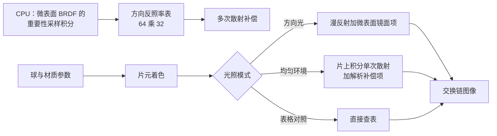

# brdf_models：微表面 BRDF 与能量守恒

构建方式见仓库根目录的 README。

## 简介

一个球，三种光照配置、三种法线分布、三种几何项、两种菲涅耳，外加一个 Kulla-Conty
多次散射补偿开关，枚举取值定义在着色器与主机两侧（
[`shaders/brdf_common.glsl:20-33`](shaders/brdf_common.glsl#L20-L33)、
[`src/renderer.h:14-31`](src/renderer.h#L14-L31)）。球体是解析生成的 UV 球（
[`src/scene_setup.cpp:143-187`](src/scene_setup.cpp#L143-L187)），材质与光照参数每帧填进 uniform（
[`src/main.cpp:106-124`](src/main.cpp#L106-L124)），球与炉子背景各由一条管线绘制（
[`src/renderer.cpp:606-612`](src/renderer.cpp#L606-L612)
）。核心是白炉子测试：把入射环境换成处处相等的辐射亮度，此时物体的出射辐射亮度就等于方向反照率，
球面亮度与背景相等才说明这个 BRDF 没有漏能量。炉子模式下背景画的就是这份均匀环境（
[`shaders/background.frag:12-18`](shaders/background.frag#L12-L18)），球面走均匀环境那一支着色路径（
[`shaders/sphere.frag:34-49`](shaders/sphere.frag#L34-L49)
）。

面板上的每一项都对应一个界面状态字段（[`src/case_ui.cpp:107-137`](src/case_ui.cpp#L107-L137)）。

| 控件 | 取值 |
| --- | --- |
| 光照模式 | 方向光、均匀环境（片上积分数值）、表格对照 |
| 法线分布 | GGX、Beckmann、Blinn-Phong |
| 几何项 | Smith（高度相关）、Schlick、不做遮蔽 |
| 菲涅耳 | Schlick、常数 F0 |
| 多次散射补偿 | 开、关 |
| 粗糙度 / 金属度 / 基础颜色 | 材质参数 |
| 均匀环境亮度 / 平行光强度 / 曝光倍数 | 光照与显示 |
| 积分采样数 | 16 到 256，只在均匀环境的数值那一档有效 |

方向反照率表在启动时用 CPU 算一次（[`src/renderer.cpp:217`](src/renderer.cpp#L217)），64 乘 32 个格子（
[`src/scene_setup.h:9`](src/scene_setup.h#L9)）、每格 4096 个采样（
[`src/renderer.cpp:18`](src/renderer.cpp#L18)），用时 245
毫秒。

## 渲染流程



球与材质参数由 `fillUniform` 每帧写进 uniform 缓冲（[`src/main.cpp:106-124`](src/main.cpp#L106-L124)
），光照模式、法线分布、几何项与多次散射开关打包在 `options` 里，菲涅耳、积分采样数与曝光倍数在
`miscParams` 里，逐粗糙度的平均反照率跟着一起上传（
[`shaders/brdf_common.glsl:5-15`](shaders/brdf_common.glsl#L5-L15)）。方向反照率表在启动时建一次（
[`src/renderer.cpp:209-280`](src/renderer.cpp#L209-L280)），法线分布改变时重建（
[`src/renderer.cpp:531-534`](src/renderer.cpp#L531-L534)
）。片元着色器按光照模式分成方向光与均匀环境两支，均匀环境下的单次散射那一份要么在片上积分，
要么直接查表（[`shaders/sphere.frag:24-49`](shaders/sphere.frag#L24-L49)
）。

## 实现要点

### 微表面 BRDF

Cook-Torrance 形式把 BRDF 拆成法线分布、几何项与菲涅耳三部分（[`shaders/brdf_common.glsl:192-203`](shaders/brdf_common.glsl#L192-L203)）：

$$
f(l, v) = \frac{D(\hat n \cdot \hat h) \, G(\hat n \cdot \hat v, \hat n \cdot \hat l) \, F(\hat v \cdot
\hat h)}{4 (\hat n \cdot \hat v)(\hat n \cdot \hat
l)}
$$

实现里把分母并进几何项，用一个可见性项 $V = G / (4 (\hat n \cdot \hat v)(\hat n \cdot \hat l))$ 写成（
[`shaders/brdf_common.glsl:73-91`](shaders/brdf_common.glsl#L73-L91)
）：

$$
f = D \cdot V \cdot F
$$

三种法线分布都用同样的粗糙度参数 $\alpha = \text{roughness}^2$，由同一个函数按分布分支给出（
[`shaders/brdf_common.glsl:55-71`](shaders/brdf_common.glsl#L55-L71)
）：

| 分布 | $D$ |
| --- | --- |
| GGX | $\dfrac{\alpha^2}{\pi\left((\hat n \cdot \hat h)^2(\alpha^2 - 1) + 1\right)^2}$ |
| Beckmann | $\dfrac{\exp\left(-\dfrac{\tan^2\theta_h}{\alpha^2}\right)}{\pi \alpha^2 \cos^4\theta_h}$ |
| Blinn-Phong | $\dfrac{p + 2}{2\pi}(\hat n \cdot \hat h)^p$，其中 $p = \dfrac{2}{\alpha^2} - 2$ |

高度相关的 Smith 可见性项（[`shaders/brdf_common.glsl:86-90`](shaders/brdf_common.glsl#L86-L90)，CPU
建表用同一份公式 [`src/scene_setup.cpp:37-46`](src/scene_setup.cpp#L37-L46)
）：

$$
V = \frac{0.5}{\lambda_v + \lambda_l},
\qquad
\lambda_v = (\hat n \cdot \hat l)\sqrt{(\hat n \cdot \hat v)^2(1 - \alpha^2) + \alpha^2},
\qquad
\lambda_l = (\hat n \cdot \hat v)\sqrt{(\hat n \cdot \hat l)^2(1 - \alpha^2) + \alpha^2}
$$

Schlick 的几何近似与完全不做遮蔽作为对照（[`shaders/brdf_common.glsl:76-83`](shaders/brdf_common.glsl#L76-L83)）。

菲涅耳用 Schlick 近似，常数 $F_0$ 那一档直接返回 $F_0$（[`shaders/brdf_common.glsl:93-99`](shaders/brdf_common.glsl#L93-L99)）：

$$
F = F_0 + (1 - F_0)(1 - \hat v \cdot \hat h)^5
$$

金属度决定 $F_0$ 与漫反射反照率两个量（[`shaders/sphere.frag:20-21`](shaders/sphere.frag#L20-L21)
）。同样的粗糙度与光照下，三种法线分布的高光宽度不同。粗糙度 0.25、亮度不低于 200
的像素占比：

| 法线分布 | 高光面积 | 最亮值 |
| --- | --- | --- |
| GGX | 0.0687% | 231.0 |
| Beckmann | 0.1029% | 231.0 |
| Blinn-Phong | 0.1026% | 231.0 |

同样的参数下 GGX 的高光核心最窄，Beckmann 与 Blinn-Phong 接近：GGX
把更多的能量放在尾部，核心因此更集中。GGX 与 Beckmann 的画面的平均绝对差 0.0853，超过 8 个灰阶的像素
0.115%，最大差 13。几何项在粗糙度 0.7 时的差别：Smith 与 Schlick 的平均绝对差 0.0302（最大
3），把几何项整个去掉之后平均绝对差 0.1173，最大差
252——掠射角上不做遮蔽会让亮度发散。

两种菲涅耳写法的差别只在掠射角：Schlick 的角向修正项 $(1 - \hat v \cdot \hat h)^5$ 要等到 $\hat v \cdot
\hat h$ 接近 0 才明显，而微表面法线集中在法线附近，采样出来的 $\hat v \cdot \hat h$ 大多接近
1。常见配置下两种写法的画面差不到一个灰阶；把粗糙度推到 1 再测，最大差 4 个灰阶，超过 2 个灰阶的像素占
0.152%。这也是很多实时渲染实现直接用 $F_0$
近似的原因。

### 方向反照率与白炉子测试

方向反照率是法线方向为 $\hat n$
时反射出去的能量占入射能量的比例，建表时对每个格子按这个积分做蒙特卡洛采样（
[`src/scene_setup.cpp:86-119`](src/scene_setup.cpp#L86-L119)），片上积分的同一份估计量在
[`shaders/brdf_common.glsl:155-172`](shaders/brdf_common.glsl#L155-L172)
：

$$
E(\hat n \cdot \hat v) = \int_{\Omega} f(l, v) \, (\hat n \cdot \hat l) \, d\omega_l
$$

如果入射辐射亮度在半球上处处相等、设为 $L$，出射辐射亮度就是：

$$
L_o = \int_{\Omega} f(l, v) \, L \, (\hat n \cdot \hat l) \, d\omega_l = E(\hat n \cdot \hat v) \cdot L
$$

把球放进这样一份环境里，球面上每一点都应当与背景一样亮，只要这个 BRDF
没有让能量凭空消失或凭空出现。这就是白炉子测试，背景与球面对应的着色分支分别在
[`shaders/background.frag:14-15`](shaders/background.frag#L14-L15) 与
[`shaders/sphere.frag:38-48`](shaders/sphere.frag#L38-L48)
。

单次散射的微表面 BRDF
一定会漏能量：光线在微面之间弹了两次以上的那部分没有被算进去，均匀环境下片上积分只累加单次散射那一支（
[`shaders/sphere.frag:40-42`](shaders/sphere.frag#L40-L42)）。漏掉的量与粗糙度直接相关。取白色金属（$F_0
= 1$）、环境辐射亮度
0.5，实测球心的线性辐射亮度与背景辐射亮度之比：

| 粗糙度 | 单次散射 | 缺失能量 | 补偿后 |
| --- | --- | --- | --- |
| 0.2 | 1.000 | 0.0% | 1.000 |
| 0.4 | 0.960 | 4.0% | 1.000 |
| 0.6 | 0.824 | 17.6% | 1.000 |
| 0.8 | 0.556 | 44.4% | 1.000 |
| 1.0 | 0.308 | 69.2% | 1.000 |

背景本身的实测值是 0.50138（真实值 0.5，剩下的偏差来自八位整数量化）。补偿之后每一档都回到 0.50138，与背景在一个灰阶之内相等。

沿球面从正对视线走到边缘（$\hat n \cdot \hat v$ 从 1 降到 0.294），粗糙度 1.0 时单次散射的实测值从
0.1545 升到 0.2893，始终只有背景的 0.31 到 0.58 倍；补上多次散射之后整条曲线都压在 0.50138
上，与背景完全一致。

### 补偿项

Kulla-Conty 的做法是用方向反照率反推漏掉的那部分，把它作为一项新的 BRDF 加回去（
[`shaders/brdf_common.glsl:183-190`](shaders/brdf_common.glsl#L183-L190)
）：

$$
f_{ms}(l, v) = \frac{(1 - E(\hat n \cdot \hat v))(1 - E(\hat n \cdot \hat l))}{\pi \left(1 - E_{avg}\right)} F_{ms}
$$

其中 $E_{avg} = 2\int_0^1 E(\mu)\mu \, d\mu$
是整个半球上按余弦加权的平均值，建表时在余弦方向上用梯形法算出来（
[`src/scene_setup.cpp:123-137`](src/scene_setup.cpp#L123-L137)），查询时按粗糙度索引直接读（
[`shaders/brdf_common.glsl:146-151`](shaders/brdf_common.glsl#L146-L151)）。颜色因子是（
[`shaders/brdf_common.glsl:175-180`](shaders/brdf_common.glsl#L175-L180)
）：

$$
F_{ms} = \frac{F_{avg}^2 E_{avg}}{1 - F_{avg}(1 - E_{avg})},
\qquad
F_{avg} = F_0 + \frac{1 - F_0}{21}
$$

$1/21$ 是 Schlick 项在余弦加权半球上的平均值。$F_0 = 1$ 时 $F_{avg} = 1$、$F_{ms} =
1$，补偿项把缺失的能量补齐；$F_0$
小的介电材料补偿量也小，这符合物理：反射得少，多次弹射能补回来的自然也少。

均匀环境下这一项对整个半球的积分有闭式解。把 $L(\omega) = 1$ 代进出射辐射：

$$
\int_\Omega f_{ms}(l,v)(\hat n \cdot \hat l) \, d\omega_l
= \frac{F_{ms}(1 - E(\hat n \cdot \hat v))}{\pi(1 - E_{avg})} \int_\Omega (1 - E(\hat n \cdot \hat
l))(\hat n \cdot \hat l) \,
d\omega_l
$$

而 $\int_\Omega E(\hat n \cdot \hat l)(\hat n \cdot \hat l) d\omega_l = \pi E_{avg}$（这正是 $E_{avg}$
的定义），所以括号里的积分等于 $\pi(1 -
E_{avg})$，整个式子化简成：

$$
F_{ms} \left(1 - E(\hat n \cdot \hat v)\right)
$$

实现里就用这个闭式解补均匀环境下的那一份，不需要再积分一次（[`shaders/sphere.frag:45-47`](shaders/sphere.frag#L45-L47)）。

介电材料（金属度 0、基础颜色 0.7、粗糙度 0.6）的实测：补偿开与关的球心辐射亮度都是
0.36535，差别落在一个灰阶以内。$F_0 = 0.04$ 时 $F_{avg} = 0.0857$、$F_{ms} \approx
0.0046$，补偿量本身就只有千分之几。

方向光下的补偿则是可见的，补偿项作为第二项镜面反射加在单次散射之后（
[`shaders/sphere.frag:30-32`](shaders/sphere.frag#L30-L32)）：粗糙度 0.9
的白色金属，开关补偿的画面平均绝对差 8.20，超过 8 个灰阶的像素 19.9%，最大差
56。

### 方向反照率表

表在启动时用 CPU 算一次：粗糙度方向 64 格取格子中心，余弦方向 32 格取到 0 与 1 两个端点（
[`src/scene_setup.cpp:73-83`](src/scene_setup.cpp#L73-L83)）；每格用 4096 个低差异采样点做蒙特卡洛积分（
[`src/renderer.cpp:18`](src/renderer.cpp#L18)
）。采样与估计量如下：

按法线分布自身采样半程向量 $\hat h$，概率密度是 $p_h = D(\hat h)(\hat n \cdot \hat h)$，从 $\hat h$ 换到
$\hat l$ 的雅可比是 $1/(4(\hat v \cdot \hat h))$，各分布对应的采样变换在
[`shaders/brdf_common.glsl:102-121`](shaders/brdf_common.glsl#L102-L121) 与
[`src/scene_setup.cpp:13-35`](src/scene_setup.cpp#L13-L35)。把它代进估计量，$D$ 与 $4(\hat v \cdot \hat
h)$
一起约掉：

$$
E \approx \frac{1}{N}\sum_{i=1}^{N} \frac{f(l_i, v)(\hat n \cdot \hat l_i)}{p_l(l_i)}
= \frac{1}{N}\sum_{i=1}^{N} \frac{4 \, V \, F \, (\hat v \cdot \hat h_i)(\hat n \cdot \hat l_i)}{\hat n \cdot \hat h_i}
$$

化简之后估计量与法线分布无关，分布只影响采样点落在哪里，建表侧的累加在
[`src/scene_setup.cpp:109-119`](src/scene_setup.cpp#L109-L119)，片上积分侧的累加在
[`shaders/brdf_common.glsl:160-171`](shaders/brdf_common.glsl#L160-L171)
。建表与片元着色器用同一套低差异序列（Hammersley，
[`src/scene_setup.cpp:54-63`](src/scene_setup.cpp#L54-L63) 与
[`shaders/brdf_common.glsl:123-136`](shaders/brdf_common.glsl#L123-L136)
），两条路径的结果因此可以直接对照。查询时把余弦坐标对到格子中心，粗糙度直接按格子索引（
[`shaders/brdf_common.glsl:140-144`](shaders/brdf_common.glsl#L140-L144)
）。

粗糙度 1.0 时片元里数值积分的采样数收敛情况（球心辐射亮度，建表用的 4096 个采样给出 0.15664）：

| 采样数 | 球心辐射亮度 |
| --- | --- |
| 16 | 0.16802 |
| 32 | 0.16100 |
| 64 | 0.15664 |
| 128 | 0.15450 |
| 256 | 0.15450 |

128 个采样之后已经收敛。把片上的数值积分换成查表，结果同样对得上：粗糙度 0.2、0.4、0.6、0.8
两边的球心辐射亮度分别是 0.50138、0.48133、0.41311、0.27892，逐位相同；粗糙度 1.0 是 0.15450 对
0.15664，差 1.4%，原因是表在粗糙度方向上取的是 0.9922
这一格。

### 设备时间

锁定核心频率 2880 兆赫、显存频率 15001 兆赫，每段测量七秒：

| 配置 | 设备时间 |
| --- | --- |
| 方向光 | 0.013 |
| 均匀环境，片上积分 16 个采样 | 0.036 |
| 均匀环境，片上积分 64 个采样 | 0.108 |
| 均匀环境，片上积分 128 个采样 | 0.204 |
| 均匀环境，片上积分 256 个采样 | 0.394 |
| 均匀环境，查表 | 0.012 |

片上积分与采样数成正比，256 个采样比方向光贵三十倍；查表只有两次纹理读取（
[`shaders/sphere.frag:38`](shaders/sphere.frag#L38) 与
[`shaders/sphere.frag:46`](shaders/sphere.frag#L46)），与方向光同价。建表那 245
毫秒是一次性的，法线分布不变就不需要重算（[`src/renderer.cpp:531-534`](src/renderer.cpp#L531-L534)
），这正是把方向反照率预先积分出来的理由。

## 界面控件

| 控件 | 作用 |
| --- | --- |
| 光照模式 | 方向光、均匀环境的片上积分、均匀环境的查表对照 |
| 法线分布 | GGX、Beckmann、Blinn-Phong，切换时重建方向反照率表 |
| 几何项 | 高度相关的 Smith、Schlick、不做遮蔽 |
| 菲涅耳 | Schlick 或常数 F0 |
| 多次散射补偿 | 白炉子测试的关键开关 |
| 粗糙度 / 金属度 / 基础颜色 | 材质参数，金属度决定漫反射项是否存在 |
| 均匀环境亮度 / 曝光倍数 | 让炉子测试落在响应区间内 |
| 积分采样数 | 片上积分的质量与代价权衡 |
| 移动速度 | 相机移动速度 |
| GPU 锁频 | 与间接绘制 case 共用同一个面板 |

## 命令行参数

| 参数 | 含义 | 默认值 |
| --- | --- | --- |
| `--lighting 名字` | 取 `directional`、`furnace` 或 `table` | directional |
| `--distribution 名字` | 取 `ggx`、`beckmann` 或 `blinn_phong` | ggx |
| `--geometry 名字` | 取 `smith`、`schlick` 或 `none` | smith |
| `--fresnel 名字` | 取 `schlick` 或 `constant` | schlick |
| `--no-multiscatter` | 关掉多次散射补偿 | 开启 |
| `--roughness F` | 粗糙度，0.02 到 1 | 0.4 |
| `--metallic F` | 金属度，0 到 1 | 0 |
| `--base-color F` | 基础颜色，0 到 1 | 0.7 |
| `--light F` | 平行光强度 | 3.0 |
| `--environment F` | 均匀环境辐射亮度 | 0.5 |
| `--samples N` | 片上积分采样数，16 到 256 | 128 |
| `--exposure F` | 曝光倍数 | 1.0 |
| `--no-interface` | 不显示界面面板 | 显示 |
| `--auto-exit S` | 运行 S 秒后自动退出 | 关闭 |
| `--capture 文件名` | 退出前把画面写成 PNG 并打印像素统计 | 关闭 |
| `--report 文件名` | 退出前把本次运行的平均耗时以 CSV 形式追加到该文件 | 关闭 |
| `--control-port N` | 打开 TCP 控制服务并监听该端口 | 关闭 |
| `--core-clock N` | 启动时锁定的核心频率，单位 MHz，取最接近的可选档位 | 不锁频 |
| `--memory-clock N` | 启动时锁定的显存频率，单位 MHz，取最接近的可选档位 | 不锁频 |

键盘操作：`W` `A` `S` `D` 前后左右移动，`Q` `E` 下降与上升，方向键转动视角，左 Shift 加速，Esc 退出。

## 测试方法

白炉子测试逐档抓帧，白色金属、环境亮度 0.5：

```
build\meow_brdf_models.exe --lighting furnace --metallic 1 --base-color 1 --roughness 0.6 --no-multiscatter --auto-exit 3 --no-interface --capture intermediate\br_furnace_0.6_off.png
build\meow_brdf_models.exe --lighting furnace --metallic 1 --base-color 1 --roughness 0.6 --auto-exit 3 --no-interface --capture intermediate\br_furnace_0.6_on.png
build\meow_brdf_models.exe --lighting table --metallic 1 --base-color 1 --roughness 0.6 --no-multiscatter --auto-exit 3 --no-interface --capture intermediate\br_table_0.6_off.png
```

抓到的画面里，背景是那份均匀环境，球的球心处法线与视线夹角余弦恰好是 1，读取球心与背景的像素值就能算出方向反照率。像素值到线性辐射亮度的换算要反着做一遍：先按 sRGB 传递函数解码，再解 ACES 拟合的二次方程

$$
(2.43y - 2.51)x^2 + (0.59y - 0.03)x + 0.14y = 0
$$

取落在 $[0,1]$ 的那个根，最后除以曝光倍数。

片上积分的采样数收敛：

```
build\meow_brdf_models.exe --lighting furnace --metallic 1 --base-color 1 --roughness 1.0 --no-multiscatter --samples 16 --auto-exit 3 --no-interface --capture intermediate\br_samples_16.png
build\meow_brdf_models.exe --lighting furnace --metallic 1 --base-color 1 --roughness 1.0 --no-multiscatter --samples 256 --auto-exit 3 --no-interface --capture intermediate\br_samples_256.png
```

方向光下的对照：

```
build\meow_brdf_models.exe --lighting directional --distribution ggx --roughness 0.25 --exposure 0.3 --auto-exit 3 --no-interface --capture intermediate\br_ndf_ggx.png
build\meow_brdf_models.exe --lighting directional --distribution beckmann --roughness 0.25 --exposure 0.3 --auto-exit 3 --no-interface --capture intermediate\br_ndf_beckmann.png
build\meow_brdf_models.exe --lighting directional --distribution blinn_phong --roughness 0.25 --exposure 0.3 --auto-exit 3 --no-interface --capture intermediate\br_ndf_blinn.png
build\meow_brdf_models.exe --lighting directional --metallic 1 --base-color 1 --roughness 0.9 --no-multiscatter --auto-exit 3 --no-interface --capture intermediate\br_dir_ms_off.png
build\meow_brdf_models.exe --lighting directional --metallic 1 --base-color 1 --roughness 0.9 --auto-exit 3 --no-interface --capture intermediate\br_dir_ms_on.png
```

测量设备时间：启动一个进程锁频并打开控制服务，按段发送命令，程序把每段的结果追加到 CSV：

```
build\meow_brdf_models.exe --no-interface --control-port 21000 --core-clock 2880 --memory-clock 15001 --report intermediate\br_measure.csv
```

连上 21000 端口后，`lighting`/`distribution`/`geometry`/`fresnel`/`multiscatter`/`samples`/`roughness`/
`metallic`/`base-color`/`light`/`environment`/`exposure` 改配置，`begin` 与 `end` 圈定一段测量，`quit`
退出。

## 源码结构

| 文件 | 内容 |
| --- | --- |
| `src/main.cpp` | 桌面入口：命令行解析、主循环与界面状态 |
| `src/android_main.cpp` | 安卓入口：NativeActivity 生命周期、表面与交换链、主循环 |
| `src/renderer.cpp` | 背景与球两条管线、方向反照率表的创建与上传、时间戳查询 |
| `src/scene_setup.cpp` | 法线分布的重要性采样、方向反照率表与平均值表、UV 球 |
| `src/case_ui.cpp` | 本 case 的控制面板与全部界面文本 |
| `src/timing_items.cpp` | 本 case 的计时项定义 |
| `shaders/brdf_common.glsl` | 三种法线分布、三种几何项、菲涅耳、多次散射补偿、片上积分，两个片元着色器共用 |
| `shaders/background.frag` `shaders/fullscreen.vert` | 炉子测试里显示那份均匀环境 |
| `shaders/sphere.vert` `shaders/sphere.frag` | 球的三条着色路径 |

## 安卓端差异

- 实例与设备申请 Vulkan 1.1；`minSdk` 24 是 Vulkan 1.0 的最低 API 等级。
- 建表那 245 毫秒在移动端处理器上会明显更慢，而且切换法线分布就要重算；实际引擎里这一步是离线的，运行期只读表。
- 片上积分的代价在移动端的算术单元上更突出，查表与积分的差距会比桌面更大。
- 设备时间只在设备支持时间戳时测量。
- GPU 锁频面板不显示：它依赖桌面的 `nvidia-smi`。
- 相机固定在初始化位置，没有键盘输入；触摸事件交给 ImGui 的安卓后端。
- 帧率上限 60 FPS，避免无界空转发热。

### 安卓测试方法

```
adb -s <serial> install -r android\app\build\outputs\apk\debug\app-debug.apk
adb -s <serial> logcat -s MeowVulkanDemo
```

应用内置回环 TCP 控制服务（端口 21000），安卓端经 `adb forward tcp:21000 tcp:21000` 映射到本机，命令与桌面端相同。
