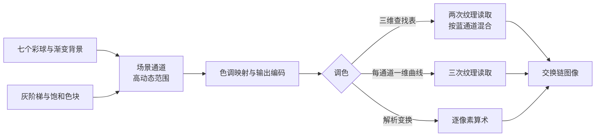

# color_lut：颜色查找表与调色

构建方式见仓库根目录的 README。

## 简介

场景是七个高饱和度的彩球（[`src/scene_setup.cpp:112-130`](src/scene_setup.cpp#L112-L130)）加一段解析渐变
背景（[`shaders/background.frag:14-21`](shaders/background.frag#L14-L21)），屏幕底部另有两排参考块：左边
十六级灰阶，右边八块饱和色（[`src/scene_setup.cpp:132-191`](src/scene_setup.cpp#L132-L191)）。画面先画进
一张半精度浮点的高动态范围图像（[`src/renderer.cpp:12`](src/renderer.cpp#L12)、
[`src/renderer.cpp:137-140`](src/renderer.cpp#L137-L140)），再整幅过一次色调映射与输出编码
（[`shaders/grade.frag:43-55`](shaders/grade.frag#L43-L55)），最后按所选方式调色
（[`shaders/grade.frag:88-97`](shaders/grade.frag#L88-L97)）。四条路径共用同一段目标风格，可以直接两两对照。

| 控件 | 取值 |
| --- | --- |
| 处理方式 | 不做处理、三维查找表、每通道一维曲线、解析变换 |
| 三维表格尺寸 | 8 到 64 |
| 曝光倍数、平行光强度、环境项强度 | 场景与显示参数 |

调色的目标是：先加一条 S 曲线，再按亮度把色温从冷推到暖，最后按亮度调整饱和度
（[`shaders/grade.frag:24-41`](shaders/grade.frag#L24-L41)，CPU 侧同一份实现见
[`src/scene_setup.cpp:9-26`](src/scene_setup.cpp#L9-L26)）。三步都是逐像素的算术，写出公式就是：

$$
\begin{aligned}
s &= \operatorname{mix}\left(c,\ c^2(3 - 2c),\ 0.6\right) \\
l &= 0.2126 s_r + 0.7152 s_g + 0.0722 s_b \\
s &\leftarrow s \cdot \operatorname{mix}\left((0.92, 0.97, 1.10),\ (1.05, 1.00, 0.92),
\ \operatorname{smoothstep}(0.2, 0.8, l)\right) \\
s &\leftarrow \operatorname{mix}\left(\bar{s},\ s,\ \operatorname{mix}(0.55, 1.10,
 \operatorname{smoothstep}(0.05, 0.45, l))\right)
\end{aligned}
$$

其中 $\bar{s}$ 是 $s$ 的亮度。色温与饱和度两项都依赖亮度，而亮度是三个分量的组合——这正是每通道一维曲线做不到的部分。

## 渲染流程



场景通道把七个彩球、渐变背景与两排参考块画进高动态范围的中间图像
（[`src/renderer.cpp:750-787`](src/renderer.cpp#L750-L787)），三条场景管线在一个函数里创建
（[`src/renderer.cpp:370-516`](src/renderer.cpp#L370-L516)）。调色通道是一个全屏三角形，读取中间图像，
做色调映射与输出编码，再按所选方式调色后写进交换链图像
（[`src/renderer.cpp:790-812`](src/renderer.cpp#L790-L812)）。两个渲染通道各自的附件与依赖关系分别在这里
创建（[`src/renderer.cpp:37-92`](src/renderer.cpp#L37-L92)、[`src/renderer.cpp:94-133`](src/renderer.cpp#L94-L133)），
中间图像带采样用途（[`src/renderer.cpp:137-140`](src/renderer.cpp#L137-L140)）。

四条路径的差别全部落在调色片元着色器的分派上（[`shaders/grade.frag:88-97`](shaders/grade.frag#L88-L97)），
色调映射与输出编码对四条路径是同一段（[`shaders/grade.frag:43-55`](shaders/grade.frag#L43-L55)）。

## 实现要点

### 三维查找表的排布与采样

三维查找表把 $[0,1]^3$ 的颜色空间切成 $N^3$ 个格子，每个格子记下调色之后的值
（[`src/scene_setup.cpp:28-52`](src/scene_setup.cpp#L28-L52)）。运行时按三个分量定位，在格子里做三线性插值：

$$
f(r, g, b) \approx \sum_{i,j,k \in \{0,1\}} w_i(r) \, w_j(g) \, w_k(b) \; f\!\left(
\frac{\lfloor r \rfloor + i}{N-1}, \frac{\lfloor g \rfloor + j}{N-1}, \frac{\lfloor b \rfloor + k}{N-1}\right)
$$

硬件只能双线性插值二维纹理，所以三维表摊平成一条二维条带：横向排 $N$ 块，每块是蓝通道的一个切片，块内横轴是红、纵轴是绿
（[`src/scene_setup.cpp:41-43`](src/scene_setup.cpp#L41-L43)）。查一次表是两次纹理读取，两次之间按蓝通道的小数部分混合，等效于三线性插值
（[`shaders/grade.frag:58-72`](shaders/grade.frag#L58-L72)）。蓝通道的格子坐标：

$$
b' = b (N - 1), \qquad
k = \lfloor b' \rfloor, \qquad
t = b' - k
$$

第 $k$ 块里红绿通道的纹理坐标要把块偏移算进去，并且落在格子中心上
（[`shaders/grade.frag:66-70`](shaders/grade.frag#L66-L70)）：

$$
u = \frac{k N + r(N - 1) + 0.5}{N^2}, \qquad
v = \frac{g(N - 1) + 0.5}{N}
$$

$N = 64$ 时条带是 4096 乘 64 的纹理，$N = 8$ 时是 64 乘 8（纹理宽度取尺寸的平方，
[`src/renderer.cpp:274-275`](src/renderer.cpp#L274-L275)）。表格越小误差越大，实测（与解析变换比较，整幅画面）：

| 表格尺寸 | 平均绝对差 | 最大差值 |
| --- | --- | --- |
| 8 | 1.446 | 6 |
| 16 | 0.601 | 3 |
| 32 | 0.351 | 2 |
| 48 | 0.346 | 1 |
| 64 | 0.384 | 1 |

三十二格之后误差已经落到八位整数量化的噪声底（差一个灰阶），再加格子不会更准。八格时格子边长 0.143，插值出来的是一块块被拉平的色块，最大差 6 个灰阶。

### 查找表的采样必须是零级

查找表本身是一张会自动生成多级渐远纹理的纹理（[`src/renderer.cpp:274-275`](src/renderer.cpp#L274-L275)）。
如果采样器的最大层级放开，色块边缘那种屏幕空间导数很大的地方会被吸到粗层上，插值出来的颜色跟着糊掉。
采样器把最大层级限制为零（[`src/renderer.cpp:546-557`](src/renderer.cpp#L546-L557)），三维表与一维曲线共用
这一个采样器（[`src/renderer.cpp:239-246`](src/renderer.cpp#L239-L246)）。实测：放开层级时与解析变换的
平均绝对差 1.98 到 4.21、最大差 134 到 141；把最大层级限制为零之后平均绝对差降到 0.35 到 0.60、最大差
1 到 3。查找表在任何情况下都只应该读最细的一级。

### 每通道一维曲线

一维曲线给每个通道单独存一条映射
（[`src/scene_setup.cpp:54-67`](src/scene_setup.cpp#L54-L67)，纹理在创建时上传
[`src/renderer.cpp:542-544`](src/renderer.cpp#L542-L544)）：

$$
(r_d, g_d, b_d) = \left(f_r(r), f_g(g), f_b(b)\right)
$$

它假设三个分量互不影响，因此只能表达沿三个轴各自独立的变化（[`shaders/grade.frag:75-81`](shaders/grade.frag#L75-L81)）。
用它去逼近前面那段目标风格，在灰阶上分毫不差——因为灰色输入正好落在这条近似的定义域上：

| 灰阶编号 | 解析变换（实测） | 一维曲线（实测） | 最大差 |
| --- | --- | --- | --- |
| 8 | 162 157 151 | 162 157 151 | 0 |
| 11 | 232 220 201 | 233 221 201 | 1 |
| 15 | 255 248 226 | 255 249 227 | 1 |

在饱和色块上情况就不同了。色温与饱和度都按亮度取值，同一个分量在不同色相下应当有不同的响应，一维曲线只能按分量自己的数值决定，于是整块偏离：

| 色块 | 原图 | 解析变换 | 一维曲线 | 最大差 |
| --- | --- | --- | --- | --- |
| 红 | 214 99 85 | 233 87 71 | 240 89 79 | 8 |
| 橙 | 214 181 69 | 243 194 36 | 240 194 58 | 22 |
| 黄 | 213 210 99 | 240 225 71 | 239 225 98 | 27 |
| 绿 | 99 197 123 | 87 214 107 | 86 212 125 | 18 |
| 蓝 | 85 167 213 | 67 179 223 | 69 177 207 | 16 |
| 紫 | 197 112 208 | 219 103 229 | 223 105 203 | 26 |
| 灰 | 186 186 186 | 211 200 183 | 212 201 183 | 1 |
| 浅灰 | 223 223 223 | 248 235 214 | 248 235 215 | 1 |

橙与黄两块的蓝通道差得最多（22 与 27 个灰阶）：解析变换会把这种高亮度的颜色压暗并偏暖，一维曲线只看到蓝通道的数值不大，就按中性灰的响应去处理它。两块中性灰的差只有一个灰阶，与灰阶梯的结论一致。

整幅画面的差别：一维曲线与解析变换的平均绝对差 7.016，超过 8 个灰阶的像素占 32.0%，最大差 38。
不做任何处理与解析变换的平均绝对差 20.916，超过 8 个灰阶的像素占 94.5%，最大差 39——也就是说目标风格的强度与一维近似的误差在同一个量级上。

### 解析变换作为真值

解析变换那条路径逐像素算上面那几行公式（[`shaders/grade.frag:24-41`](shaders/grade.frag#L24-L41)），
不查任何表，用作对照的真值。参考块的线性辐射亮度是已知常数（灰阶梯的取值在 [`src/scene_setup.cpp:143-147`](src/scene_setup.cpp#L143-L147)，
八块饱和色在 [`src/scene_setup.cpp:165-170`](src/scene_setup.cpp#L165-L170)），经过色调映射与输出编码之后可以得到确定的输入值，
再套一遍解析变换就能算出理论像素值。实测与理论逐块对照：

| 色块 | 线性辐射亮度 | 理论像素 | 实测像素 |
| --- | --- | --- | --- |
| 红 | 0.60 0.10 0.08 | 232.8 87.1 71.5 | 233 87 71 |
| 橙 | 0.60 0.32 0.06 | 243.5 194.1 36.3 | 243 194 36 |
| 紫 | 0.42 0.12 0.52 | 218.6 102.9 228.9 | 219 103 229 |
| 灰 | 0.35 0.35 0.35 | 211.2 200.2 182.7 | 211 200 183 |

十六级灰阶同样逐块对得上，最大误差一个灰阶。着色器里的解析变换与 CPU 侧建表用的那份实现一致
（[`shaders/grade.frag:24-41`](shaders/grade.frag#L24-L41) 与 [`src/scene_setup.cpp:9-26`](src/scene_setup.cpp#L9-L26)），
两条路径的差来自查找表的表达方式。

### 设备时间

锁定核心频率 2880 兆赫、显存频率 15001 兆赫，每段测量六秒：

| 处理方式 | 整帧 | 场景通道 | 调色通道 |
| --- | --- | --- | --- |
| 不做处理 | 0.025 | 0.018 | 0.008 |
| 解析变换 | 0.026 | 0.017 | 0.009 |
| 每通道一维曲线 | 0.027 | 0.018 | 0.009 |
| 三维查找表，8 格 | 0.027 | 0.018 | 0.009 |
| 三维查找表，64 格 | 0.027 | 0.017 | 0.010 |

四条路径的调色通道都在 0.008 到 0.010 毫秒之间，差别落在测量精度里。这一段的目标风格只有几十条算术指令，
比查表的纹理读取还便宜；查找表的价值在变换复杂的时候才体现出来——比如几十个节点的曲线、完整的胶片模拟、或者由美术在外部工具里调好只能以数据形式给出的映射。
表格尺寸从 8 涨到 64 也没有可测的代价，因为查表始终只是两次纹理读取。

## 界面控件

| 控件 | 作用 |
| --- | --- |
| 处理方式 | 四条路径，解析变换是真值 |
| 三维表格尺寸 | 8 到 64，改变时重建查找表 |
| 曝光倍数 | 调色在色调映射与输出编码之后进行，改变曝光会改变调色的输入 |
| 平行光强度 / 环境项强度 | 场景的光照 |
| 移动速度 | 相机移动速度 |
| GPU 锁频 | 与间接绘制 case 共用同一个面板 |

面板同时显示绘制命令条数与渲染通道数，另附操作指南；耗时面板按本 case 的通道拆分逐项列出，设备时间分成场景与调色两段。

## 命令行参数

| 参数 | 含义 | 默认值 |
| --- | --- | --- |
| `--mode 名字` | 处理方式，取 `none`、`lut3d`、`curves` 或 `analytic` | analytic |
| `--lut-size N` | 三维表格尺寸，8 到 64 | 32 |
| `--exposure F` | 曝光倍数 | 1.0 |
| `--light F` | 平行光强度 | 0.85 |
| `--ambient F` | 环境项强度 | 0.10 |
| `--no-interface` | 不显示界面面板 | 显示 |
| `--auto-exit S` | 运行 S 秒后自动退出 | 关闭 |
| `--capture 文件名` | 退出前把画面写成 PNG 并打印像素统计 | 关闭 |
| `--report 文件名` | 退出前把本次运行的平均耗时以 CSV 形式追加到该文件 | 关闭 |
| `--control-port N` | 打开 TCP 控制服务并监听该端口 | 关闭 |
| `--core-clock N` | 启动时锁定的核心频率，单位 MHz，取最接近的可选档位 | 不锁频 |
| `--memory-clock N` | 启动时锁定的显存频率，单位 MHz，取最接近的可选档位 | 不锁频 |

键盘操作：`W` `A` `S` `D` 前后左右移动，`Q` `E` 下降与上升，方向键转动视角，左 Shift 加速，Esc 退出。抓帧时要加 `--no-interface`，否则界面面板会盖住参考块。

## 测试方法

四条路径各抓一帧：

```
build\meow_color_lut.exe --mode none --auto-exit 3 --no-interface --capture intermediate\cl_none.png
build\meow_color_lut.exe --mode analytic --auto-exit 3 --no-interface --capture intermediate\cl_analytic.png
build\meow_color_lut.exe --mode curves --auto-exit 3 --no-interface --capture intermediate\cl_curves.png
build\meow_color_lut.exe --mode lut3d --lut-size 16 --auto-exit 3 --no-interface --capture intermediate\cl_lut_16.png
```

参考块的位置：灰阶梯从归一化设备坐标的 $x = -0.97$ 起，色块从 $x = 0.20$ 起，每块宽 0.055、间隔 0.006、高 0.10，
底边在 $y = -0.97$；换算到像素坐标时 $x$ 向右、$y$ 向下，每块取中心一小块的平均值即可。

测量设备时间：启动一个进程锁频并打开控制服务，按段发送命令，程序把每段的结果追加到 CSV：

```
build\meow_color_lut.exe --no-interface --control-port 21000 --core-clock 2880 --memory-clock 15001 --report intermediate\cl_measure.csv
```

连上 21000 端口后，`mode`/`lut-size`/`exposure`/`light`/`ambient` 改配置，`begin` 与 `end` 圈定一段测量，`quit` 退出。

## 源码结构

| 文件 | 内容 |
| --- | --- |
| `src/main.cpp` | 桌面入口：命令行解析、主循环与界面状态 |
| `src/android_main.cpp` | 安卓入口：NativeActivity 生命周期、表面与交换链、主循环 |
| `src/renderer.cpp` | 场景通道、调色通道、查找表的创建与上传、四条管线 |
| `src/scene_setup.cpp` | 彩球与参考块的几何、解析调色变换、三维表与一维曲线的生成 |
| `src/case_ui.cpp` | 本 case 的控制面板与全部界面文本 |
| `src/timing_items.cpp` | 本 case 的计时项定义 |
| `shaders/scene.vert` `shaders/scene.frag` | 彩球的光照，直接写线性辐射亮度 |
| `shaders/background.frag` `shaders/fullscreen.vert` | 渐变背景 |
| `shaders/patch.vert` `shaders/patch.frag` | 参考块，颜色字段就是线性辐射亮度 |
| `shaders/grade.frag` | 色调映射与输出编码，接着按所选方式调色 |

## 安卓端差异

- 实例与设备申请 Vulkan 1.1；`minSdk` 24 是 Vulkan 1.0 的最低 API 等级。
- 安卓上常把查找表打进 APK 作为资源，本 case 为了自证正确性在启动时按公式生成。
- 调色通道是一次全屏纹理读取加写出，移动端分块架构下的带宽代价比桌面更突出。
- 设备时间只在设备支持时间戳时测量。
- GPU 锁频面板不显示：它依赖桌面的 `nvidia-smi`。
- 相机固定在初始化位置，没有键盘输入；触摸事件交给 ImGui 的安卓后端。
- 帧率上限 60 FPS，避免无界空转发热。

### 安卓测试方法

```
adb -s <serial> install -r android\app\build\outputs\apk\debug\app-debug.apk
adb -s <serial> logcat -s MeowVulkanDemo
```

应用内置回环 TCP 控制服务（端口 21000），安卓端经 `adb forward tcp:21000 tcp:21000` 映射到本机，命令与桌面端相同。
