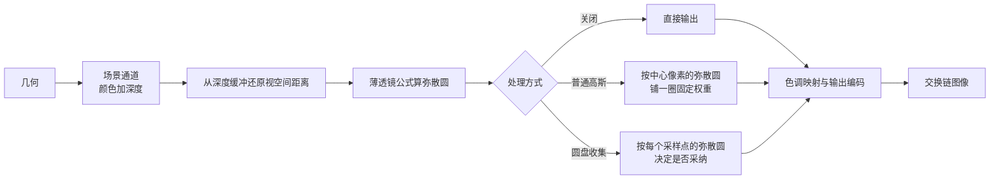

# depth_of_field：景深与散景

构建方式见仓库根目录的 README。

## 简介

一块地面加五排按深度排布的小亮球，另有一个前景大球与一个背景大球（[`src/scene_setup.cpp:68-100`](src/scene_setup.cpp#L68-L100)）。
场景先画进一张高动态范围图像加一张深度图（[`src/renderer.cpp:35-90`](src/renderer.cpp#L35-L90)），深度附件同时当纹理采样
（[`src/renderer.cpp:139-141`](src/renderer.cpp#L139-L141)），景深通道用它还原每个像素的视空间距离
（[`shaders/dof.frag:24-30`](shaders/dof.frag#L24-L30)），再按薄透镜模型算弥散圆
（[`shaders/dof.frag:33-45`](shaders/dof.frag#L33-L45)）。

| 控件 | 取值 |
| --- | --- |
| 处理方式 | 关闭、普通高斯、圆盘收集（[`src/renderer.h:12-17`](src/renderer.h#L12-L17)） |
| 焦距 / 光圈数 / 对焦距离 | 镜头参数（[`src/main.cpp:107-109`](src/main.cpp#L107-L109)） |
| 弥散圆半径上限 | 1 到 64 像素（[`src/case_ui.cpp:102`](src/case_ui.cpp#L102)） |
| 采样数 | 4 到 512（[`src/case_ui.cpp:104`](src/case_ui.cpp#L104)） |
| 抖动强度 | 0 到 1，采样点绕圆盘旋转（[`shaders/dof.frag:58`](shaders/dof.frag#L58)） |
| 光圈叶片数 | 0 到 12，零表示圆形（[`shaders/dof.frag:61-68`](shaders/dof.frag#L61-L68)） |
| 曝光倍数、平行光强度、环境项强度 | 场景与显示参数（[`src/main.cpp:114-116`](src/main.cpp#L114-L116)） |

关闭一档相当于针孔相机，所有深度都清楚，作为对照的基准：这一档直接取中心像素的颜色经过色调映射，跳过全部采样（[`shaders/dof.frag:91-94`](shaders/dof.frag#L91-L94)）。

## 渲染流程



场景通道用一次索引绘制把整套几何写进颜色与深度两个附件（[`src/renderer.cpp:665-687`](src/renderer.cpp#L665-L687)），
几何的顶点格式里带一个自发光字段，小亮球因此远高于显示范围（[`src/scene_setup.cpp:84-93`](src/scene_setup.cpp#L84-L93)、
[`shaders/scene.frag:26`](shaders/scene.frag#L26)）。深度附件在场景通道结束时写出内容并停在只读布局，
之后可以当纹理读（[`src/renderer.cpp:47-54`](src/renderer.cpp#L47-L54)），
采样时用最近邻，避免邻域深度被插值抹平（[`src/renderer.cpp:482-484`](src/renderer.cpp#L482-L484)）。

景深通道挂在交换链图像上（[`src/renderer.cpp:92-131`](src/renderer.cpp#L92-L131)），一次全屏三角形绘制取来画面颜色与深度
（[`src/renderer.cpp:702-709`](src/renderer.cpp#L702-L709)、
[`shaders/fullscreen.vert:6-11`](shaders/fullscreen.vert#L6-L11)），按处理方式分成三支，最后统一走同一个色调映射与输出编码
（[`shaders/dof.frag:86-136`](shaders/dof.frag#L86-L136)、
[`shaders/dof.frag:72-84`](shaders/dof.frag#L72-L84)）。

## 实现要点

### 薄透镜与弥散圆

薄透镜成像满足：

$$
\frac{1}{z} + \frac{1}{z'} = \frac{1}{f}
$$

其中 $z$ 是物距、$z'$ 是像距、$f$ 是焦距。只有正好落在对焦距离 $z_f$ 上的物点会成一点，其余物点在像面上摊成直径如下的圆：

$$
c = \frac{f^2 (z - z_f)}{N \, z \, (z_f - f)}
$$

$N$ 是光圈数（焦距除以入瞳直径）。成像面上的尺寸换算到像素半径是：

$$
r_{px} = \frac{1}{2} \cdot \frac{c}{w_{sensor}} \cdot W_{image}
$$

两步合在片元着色器的 `circleOfConfusion` 里（[`shaders/dof.frag:33-45`](shaders/dof.frag#L33-L45)）：
先乘出分母 $N \, z \, (z_f - f)$（[`shaders/dof.frag:39`](shaders/dof.frag#L39)），再算直径 $c$
（[`shaders/dof.frag:43`](shaders/dof.frag#L43)），最后换算成像素半径（[`shaders/dof.frag:44`](shaders/dof.frag#L44)）。
感光面宽度与镜头参数共用一套世界单位，着色器里取常数 0.036（[`shaders/dof.frag:35`](shaders/dof.frag#L35)），
画面宽度从 uniform 里取（[`shaders/dof.frag:8`](shaders/dof.frag#L8)）。
同一套公式在 CPU 侧另有一份实现（[`src/scene_setup.cpp:102-114`](src/scene_setup.cpp#L102-L114)）。

默认参数（$f = 0.05$，$f/1.4$，对焦 2.9，感光面宽 0.036，画面宽 1600）下的半径：

| 物距 | 0.80 | 1.20 | 1.60 | 2.00 | 2.40 | 2.90 | 3.60 | 4.50 | 6.00 | 8.00 | 12.00 |
| --- | --- | --- | --- | --- | --- | --- | --- | --- | --- | --- | --- |
| 半径（像素） | 36.55 | 19.73 | 11.31 | 6.27 | 2.90 | 0 | 2.71 | 4.95 | 7.19 | 8.88 | 10.56 |

近景一侧的半径增长比远景快：同一个 $\lvert z - z_f \rvert$ 在近处对应的相对偏移更大。物距 0.8 处的半径已经超过 32 像素的上限，被钳住
（[`shaders/dof.frag:48-51`](shaders/dof.frag#L48-L51)）。

同一物距换光圈：

| 光圈 | f/1.2 | f/1.4 | f/2.8 | f/5.6 | f/11 |
| --- | --- | --- | --- | --- | --- |
| 物距 1.2 处的半径 | 23.01 | 19.73 | 9.86 | 4.93 | 2.51 |

半径与光圈数成反比：光圈数翻一倍，弥散圆缩小一半。实测的清晰度（全图拉普拉斯响应的平均值，越大越锐）：

| 配置 | 平均拉普拉斯响应 |
| --- | --- |
| 关闭 | 0.9422 |
| 圆盘收集，f/1.4 | 0.5624 |
| 圆盘收集，f/2.8 | 0.5430 |
| 圆盘收集，f/8 | 0.6409 |

f/8 比 f/2.8 明显更锐，但都低于关闭那一档；对焦距离从 2.9 挪到 1.4 或 5.5 之后清晰度分别回到 0.6179 与 0.5791，因为画面上清楚的那一层换了位置。

### 从深度缓冲还原视空间距离

深度缓冲里存的是投影之后的归一化深度，用近平面与远平面还原成视空间距离：

$$
z_{view} = \frac{near \cdot far}{far - d \cdot (far - near)}
$$

$d$ 是深度缓冲里读到的值，取值在 0 到 1 之间，$d = 0$ 对应近平面、$d = 1$ 对应远平面。还原写成一个函数
（[`shaders/dof.frag:24-30`](shaders/dof.frag#L24-L30)），近平面与远平面从 uniform 里取
（[`shaders/dof.frag:8`](shaders/dof.frag#L8)），桌面端的取值是 0.1 与 30
（[`src/main.cpp:22-23`](src/main.cpp#L22-L23)）。这一步是精确的，不做任何近似：投影矩阵由 `glm::perspective` 生成
（[`../../common/src/scene.cpp:156-157`](../../common/src/scene.cpp#L156-L157)），归一化深度的区间是 0 到 1
（[`../../CMakeLists.txt:111`](../../CMakeLists.txt#L111)），矩阵的第三行本来就是按这个关系构造的。

### 三种处理方式

**普通高斯**只看中心像素的弥散圆，在它周围铺一圈固定的权重（[`shaders/dof.frag:99-114`](shaders/dof.frag#L99-L114)）：

$$
L_o = \frac{\sum_{i} w_i \, L_i}{\sum_i w_i},
\qquad
w_i = \exp\left(-2.5 \, \lVert o_i \rVert^2\right)
$$

采样点的位置是 $o_i$ 乘上中心像素的半径（[`shaders/dof.frag:108`](shaders/dof.frag#L108)），
权重只由采样点离中心的距离决定（[`shaders/dof.frag:107`](shaders/dof.frag#L107)），与邻居的深度无关。它的毛病有两个方向：前景物体的模糊拉不出它本该盖住的那片背景，
因为背景像素的半径很小、根本不会去收集远处的前景；反过来，对焦平面上的锐利物体又会被前景像素收进模糊里，造出一圈不该有的软边。

**圆盘收集**每个采样点先算自己的弥散圆，够大才被采纳（[`shaders/dof.frag:117-135`](shaders/dof.frag#L117-L135)）：

$$
\text{采纳当且仅当} \quad r(\text{采样点}) \ge \lVert o_i \rVert
$$

中心像素无条件记入（[`shaders/dof.frag:119-120`](shaders/dof.frag#L119-L120)），
其余采样点按这条规则筛（[`shaders/dof.frag:128-131`](shaders/dof.frag#L128-L131)）。
这条规则的物理含义是：采样点所在的物点摊成的圆，半径必须够到当前像素。这样近景的模糊就能盖到背景上，而对焦平面上的锐利表面也不会被前景污染。

采样点在圆盘上按黄金角螺旋排布，抖动项让整圈采样点一起旋转一个角度：

$$
r_i = \sqrt{\frac{i + 0.5}{N}},
\qquad
\theta_i = i \cdot 2.39996323 + \text{jitter} \cdot 2\pi
$$

半径与角度的计算在 `diskSample` 里（[`shaders/dof.frag:54-59`](shaders/dof.frag#L54-L59)），
`jitter` 从 uniform 的第三项取（[`shaders/dof.frag:10`](shaders/dof.frag#L10)）。叶片数大于零时把圆盘按角度裁成正多边形，得到六边形一类的散景形状：

$$
r_i \leftarrow \frac{r_i}{\max\left(\dfrac{\cos(\text{sector}/2)}{\cos(\text{local})},\ \epsilon\right)},
\qquad
\text{sector} = \frac{2\pi}{\text{blades}}
$$

裁剪把采样点的角度先折进所在扇区（[`shaders/dof.frag:64-65`](shaders/dof.frag#L64-L65)），
再按扇区边界的内切圆半径与顶点半径之比缩放（[`shaders/dof.frag:66-67`](shaders/dof.frag#L66-L67)）。

三种方式的画面（默认参数）：

| 对照 | 平均绝对差 | 超过 8 的像素占比 | 最大差值 |
| --- | --- | --- | --- |
| 关闭 与 圆盘收集 | 1.8732 | 2.930% | 212 |
| 关闭 与 普通高斯 | 2.0846 | 3.216% | 212 |
| 普通高斯 与 圆盘收集 | 0.4357 | 1.255% | 184 |

普通高斯与圆盘收集的差集中在物体的轮廓上：把画面分成 4 乘 4 块，差别最大的两块平均绝对差 1.293 与 1.127，其余块都不到 1。
全图清晰度两者几乎相同（0.5634 与 0.5624），因为地面的深度变化平缓，两种规则在平缓区域给出的结果一致，分歧只在轮廓附近。

### 采样数与噪声

圆盘收集的采样点是一组固定的螺旋点（[`shaders/dof.frag:54-59`](shaders/dof.frag#L54-L59)），采样数决定噪声水平。以 512 个采样为参考：

| 采样数 | 平均绝对差 | 超过 8 的像素占比 | 最大差值 |
| --- | --- | --- | --- |
| 8 | 0.4460 | 0.746% | 202 |
| 16 | 0.2449 | 0.470% | 196 |
| 32 | 0.1561 | 0.339% | 175 |
| 64 | 0.0870 | 0.231% | 128 |
| 128 | 0.0486 | 0.147% | 91 |
| 256 | 0.0285 | 0.081% | 59 |

最大差值都出现在散景光斑上：光斑是一整片均匀的圆盘，采样数不够时圆盘里出现明显的噪声颗粒。如果采样点固定不动（抖动强度取零），画面会变成一圈圈规则的同心环，比噪声更难看。

### 弥散圆半径上限

真实相机在近景一侧的弥散圆可以非常大，屏幕空间却没有被前景挡住的那些背景颜色。
把半径钳到一个上限，既能压住这种拉伸，也能控制在景深通道里要读多少个像素（[`shaders/dof.frag:48-51`](shaders/dof.frag#L48-L51)）。
上限作用在中心像素与每一个采样点上（[`shaders/dof.frag:96-97`](shaders/dof.frag#L96-L97)、
[`shaders/dof.frag:128`](shaders/dof.frag#L128)）。实测默认光圈与小光圈下的差别：

| 配置 | 平均拉普拉斯响应 |
| --- | --- |
| 半径上限 4 像素 | 0.3080 |
| 半径上限 64 像素 | 0.3197 |

半径上限从 4 提到 64 只让画面略锐一点（0.3080 到 0.3197），因为场景里真正需要大半径的只有近景那一小片。

### 设备时间

锁定核心频率 2880 兆赫、显存频率 15001 兆赫，每段测量六秒：

| 配置 | 整帧 | 场景通道 | 景深通道 |
| --- | --- | --- | --- |
| 关闭 | 0.020 | 0.012 | 0.008 |
| 普通高斯（49 个采样） | 0.090 | 0.012 | 0.078 |
| 圆盘收集，8 个采样 | 0.061 | 0.012 | 0.049 |
| 圆盘收集，32 个采样 | 0.184 | 0.012 | 0.172 |
| 圆盘收集，128 个采样 | 0.649 | 0.012 | 0.637 |
| 圆盘收集，512 个采样 | 2.529 | 0.012 | 2.517 |
| 圆盘收集，256 个采样，f/1.2 | 1.311 | 0.012 | 1.300 |
| 圆盘收集，256 个采样，f/1.2，半径上限 4 | 1.038 | 0.012 | 1.026 |

三个时间戳分别写在场景通道开始（[`src/renderer.cpp:642-646`](src/renderer.cpp#L642-L646)）、场景通道结束
（[`src/renderer.cpp:688-691`](src/renderer.cpp#L688-L691)）与整帧结束（
[`src/renderer.cpp:761-764`](src/renderer.cpp#L761-L764)）三处，相邻两个之差就是两段设备时间
（[`src/renderer.cpp:602-614`](src/renderer.cpp#L602-L614)）。

景深通道的代价与采样数成正比（128 到 512 是四倍，0.637 到 2.517 也是四倍）。
采样数相同时，光圈越大越贵：同样是 256 个采样，f/1.2 下半径更大，收集的区域更宽，1.300 比钳到 4 像素的 1.026 贵四分之一，多出来的部分是缓存局部性变差。

## 界面控件

| 控件 | 作用 |
| --- | --- |
| 处理方式 | 关闭、普通高斯、圆盘收集 |
| 焦距 / 光圈数 / 对焦距离 | 决定弥散圆的大小与清晰层的位置 |
| 弥散圆半径上限 | 控制最大模糊半径与收集范围 |
| 采样数 / 抖动强度 | 质量与代价的权衡 |
| 光圈叶片数 | 散景光斑的形状，零为圆形 |
| 曝光倍数 / 平行光强度 / 环境项强度 | 场景与显示 |
| 移动速度 | 相机移动速度，本 case 的尺度较小 |
| GPU 锁频 | 与间接绘制 case 共用同一个面板 |

## 命令行参数

| 参数 | 含义 | 默认值 |
| --- | --- | --- |
| `--mode 名字` | 处理方式，取 `off`、`gaussian` 或 `disk` | disk |
| `--focal F` | 焦距 | 0.05 |
| `--fnumber F` | 光圈数 | 1.4 |
| `--focus F` | 对焦距离 | 2.9 |
| `--max-radius F` | 弥散圆半径上限（像素） | 32 |
| `--samples N` | 采样数，4 到 512 | 128 |
| `--jitter F` | 抖动强度 | 0.5 |
| `--blades N` | 光圈叶片数，0 到 12 | 0 |
| `--exposure F` | 曝光倍数 | 1.0 |
| `--light F` | 平行光强度 | 0.9 |
| `--ambient F` | 环境项强度 | 0.08 |
| `--no-interface` | 不显示界面面板 | 显示 |
| `--auto-exit S` | 运行 S 秒后自动退出 | 关闭 |
| `--capture 文件名` | 退出前把画面写成 PNG 并打印像素统计 | 关闭 |
| `--report 文件名` | 退出前把本次运行的平均耗时以 CSV 形式追加到该文件 | 关闭 |
| `--control-port N` | 打开 TCP 控制服务并监听该端口 | 关闭 |
| `--core-clock N` | 启动时锁定的核心频率，单位 MHz，取最接近的可选档位 | 不锁频 |
| `--memory-clock N` | 启动时锁定的显存频率，单位 MHz，取最接近的可选档位 | 不锁频 |

键盘操作：`W` `A` `S` `D` 前后左右移动，`Q` `E` 下降与上升，方向键转动视角，左 Shift 加速，Esc 退出。本 case 的场景尺度只有几个单位，移动速度的默认值相应调小了。

## 测试方法

三种处理方式各抓一帧：

```
build\meow_depth_of_field.exe --mode off --auto-exit 3 --no-interface --capture intermediate\dof_off.png
build\meow_depth_of_field.exe --mode gaussian --auto-exit 3 --no-interface --capture intermediate\dof_gaussian.png
build\meow_depth_of_field.exe --mode disk --samples 128 --auto-exit 3 --no-interface --capture intermediate\dof_disk.png
```

采样数收敛：

```
build\meow_depth_of_field.exe --mode disk --samples 8 --auto-exit 3 --no-interface --capture intermediate\dof_samples_8.png
build\meow_depth_of_field.exe --mode disk --samples 512 --auto-exit 3 --no-interface --capture intermediate\dof_samples_512.png
```

光圈与光圈形状：

```
build\meow_depth_of_field.exe --mode disk --fnumber 2.8 --samples 256 --auto-exit 3 --no-interface --capture intermediate\dof_f2.8.png
build\meow_depth_of_field.exe --mode disk --fnumber 8.0 --samples 256 --auto-exit 3 --no-interface --capture intermediate\dof_f8.png
build\meow_depth_of_field.exe --mode disk --blades 6 --fnumber 1.2 --samples 256 --auto-exit 3 --no-interface --capture intermediate\dof_blades6.png
```

清晰程度可以用全图的拉普拉斯响应平均值衡量，模糊越重这个值越小。

测量设备时间：启动一个进程锁频并打开控制服务，按段发送命令，程序把每段的结果追加到 CSV：

```
build\meow_depth_of_field.exe --no-interface --control-port 21000 --core-clock 2880 --memory-clock 15001 --report intermediate\dof_measure.csv
```

连上 21000 端口后，`mode`/`samples`/`blades`/`focal`/`fnumber`/`focus`/`max-radius`/
`jitter`/`exposure`/`light`/`ambient` 改配置，`begin` 与 `end` 圈定一段测量，`quit` 退出。

## 源码结构

| 文件 | 内容 |
| --- | --- |
| `src/main.cpp` | 桌面入口：命令行解析、主循环与界面状态 |
| `src/android_main.cpp` | 安卓入口：NativeActivity 生命周期、表面与交换链、主循环 |
| `src/renderer.cpp` | 场景通道（颜色加可采样的深度）、景深通道、两条管线 |
| `src/scene_setup.cpp` | 地面与亮球的几何、弥散圆的 CPU 侧参考实现 |
| `src/case_ui.cpp` | 本 case 的控制面板与全部界面文本 |
| `src/timing_items.cpp` | 本 case 的计时项定义 |
| `shaders/scene.vert` `shaders/scene.frag` | 场景的光照与自发光 |
| `shaders/dof.frag` `shaders/fullscreen.vert` | 深度还原、弥散圆、三种处理方式与输出编码 |

## 安卓端差异

- 实例与设备申请 Vulkan 1.1；`minSdk` 24 是 Vulkan 1.0 的最低 API 等级。
- 深度附件在桌面与移动端都可以直接当纹理采样，但移动端分块架构下把深度写出到内存再读回来代价更高；实际引擎里常把线性深度写进颜色附件的第一张图，与颜色共用一次读取。
- 采样数与半径上限在移动端要压得更低，256 个采样在桌面是 1.3 毫秒，在移动端会明显更贵。
- 设备时间只在设备支持时间戳时测量。
- GPU 锁频面板不显示：它依赖桌面的 `nvidia-smi`。
- 相机固定在初始化位置，没有键盘输入；触摸事件交给 ImGui 的安卓后端。
- 帧率上限 60 FPS，避免无界空转发热。

### 安卓测试方法

```
adb -s <serial> install -r android\app\build\outputs\apk\debug\app-debug.apk
adb -s <serial> logcat -s MeowVulkanDemo
```

应用内置回环 TCP 控制服务（端口 21000），安卓端经 `adb forward tcp:21000 tcp:21000` 映射到本机，命令与桌面端相同。
