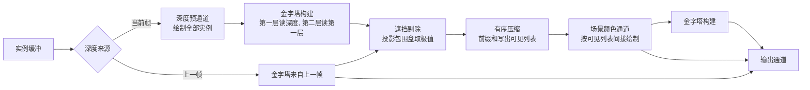

# hzb_culling：HZB 遮挡剔除与极值取向

构建方式见仓库根目录的 README。

## 简介

场景里三块大的遮挡物挡在前面，后面散布两万个小方块，两部分实例由同一个函数按固定种子摆放
（[`src/renderer.cpp:43-68`](src/renderer.cpp#L43-L68)）。遮挡剔除在计算着色器里完成：每个实例的包围盒
八个角点投影到屏幕，得到包围盒的屏幕范围与最近深度，投影落在相机背后或者整个落在画面之外的实例不做判定，直接保留为可见
（[`shaders/cull.comp:72-90`](shaders/cull.comp#L72-L90)），取出覆盖到的整片金字塔纹素，与包围盒的最近
深度比较（[`shaders/cull.comp:31-55`](shaders/cull.comp#L31-L55)），可见标志写进标志缓冲
（[`shaders/cull.comp:110-111`](shaders/cull.comp#L110-L111)）。可见列表与间接绘制命令由一次连续前缀和
写出，顺序按实例编号排列，实例数与索引数一并写进命令
（[`shaders/scan.comp:40-79`](shaders/scan.comp#L40-L79)）。

| 选项 | 取值 |
| --- | --- |
| 是否启用遮挡剔除 | 打开、关闭 |
| 金字塔取值取向 | 最远深度、最近深度 |
| 层级选择 | 固定层级、按包围盒屏幕投影尺寸 |
| 深度来源 | 上一帧、当前帧 |
| 包围盒扩大系数 | 1.0 到 1.8 |
| 金字塔可视化 | 打开、关闭 |

## 渲染流程



深度来源决定通道顺序：取自当前帧时先跑一遍深度预通道，再用本帧的金字塔做剔除；取自上一帧时剔除在帧首
直接读上一帧留下的金字塔（[`src/renderer.cpp:1040`](src/renderer.cpp#L1040)、
[`src/renderer.cpp:1061-1084`](src/renderer.cpp#L1061-L1084)）。深度预通道用只写深度的片元着色器把全部实例
画一遍（[`src/renderer.cpp:821-852`](src/renderer.cpp#L821-L852)），金字塔第一层读全分辨率深度附件，第二层
读第一层（[`src/renderer.cpp:458-471`](src/renderer.cpp#L458-L471)），八乘八取一次极值
（[`shaders/hzb.comp:35-44`](shaders/hzb.comp#L35-L44)）。剔除一次派发覆盖全部实例，每个实例一个线程
（[`src/renderer.cpp:854-862`](src/renderer.cpp#L854-L862)），压缩是一次单线程组派发
（[`src/renderer.cpp:864-905`](src/renderer.cpp#L864-L905)）。场景颜色通道按可见列表间接绘制一次
（[`src/renderer.cpp:1119-1138`](src/renderer.cpp#L1119-L1138)），取自上一帧深度时随后再创建本帧的金字塔，
供下一帧使用（[`src/renderer.cpp:1145-1158`](src/renderer.cpp#L1145-L1158)），最后是输出通道
（[`src/renderer.cpp:1160-1174`](src/renderer.cpp#L1160-L1174)）。

## 实现要点

### 极值取向决定剔除是否可靠

金字塔每一级的纹素存的是它覆盖范围内深度的极值，取向由一帧常量里的开关给出
（[`shaders/hzb.comp:32-44`](shaders/hzb.comp#L32-L44)）。取最远深度时判定取这一片纹素的最大值，包围盒的
最近点比它更远就整块剔除（[`shaders/cull.comp:45-54`](shaders/cull.comp#L45-L54)），整个包围盒确实在场景
几何之后，剔除不会漏掉可见物体；取最近深度时判定取最小值，只要包围盒覆盖到的任意一个纹素上有近处物体，
整个包围盒就会被剔掉，跨在遮挡物边缘上的方块因此整块消失。覆盖的纹素数量超过上限时一律判定为可见
（[`shaders/cull.comp:26-28`](shaders/cull.comp#L26-L28)、[`shaders/cull.comp:41-43`](shaders/cull.comp#L41-L43)）。

放大到 1600 乘 900 的抓帧上，以不启用剔除的画面为基准逐像素比较：

| 取向与配置 | 平均绝对差 | 差值大于 8 的像素占比 | 最大差值 | 可见实例 |
| --- | --- | --- | --- | --- |
| 最远深度 固定 0 级 | 0.000 | 0.000% | 0 | 925 |
| 最远深度 按投影尺寸 | 0.000 | 0.000% | 0 | 925 |
| 最远深度 固定 1 级 | 0.000 | 0.000% | 0 | 2353 |
| 最远深度 扩大系数 1.6 | 0.000 | 0.000% | 0 | 1506 |
| 最远深度 当前帧深度 | 0.000 | 0.000% | 0 | 925 |
| 最近深度 固定 0 级 | 4.727 | 4.096% | 152 | 45 |
| 最近深度 固定 1 级 | 5.413 | 4.445% | 141 | 45 |
| 最近深度 扩大系数 1.6 | 3.893 | 3.347% | 157 | 37 |

取最远深度的五种配置与不启用剔除的画面逐像素完全相同，包括相机转到正负二十五度与四十度的位置。取最近
深度时，可见实例从 925 掉到 45，画面上有百分之四左右的像素丢掉本来可见的方块。

### 层级选择与包围盒扩大

层级越粗，一个纹素覆盖的范围越大，它的极值被背景顶到最远处的机会越多，能做出的判定就越少：固定 1 级时
可见实例是 2353，固定 0 级是 925。固定层级直接取一帧常量里的编号
（[`shaders/cull.comp:92`](shaders/cull.comp#L92)）；按包围盒屏幕投影尺寸选层级时，先把包围盒在最低一级上
覆盖的纹素数算出来，任一方向超过八个纹素就抬到第 1 级
（[`shaders/cull.comp:93-99`](shaders/cull.comp#L93-L99)）。场景里的方块都落在 0 级上，结果与固定 0 级
一致；这条公式的意义在于让一次测试读取的纹素数量与包围盒覆盖的像素数无关，方块贴近相机时测试开销不会
跟着涨。

包围盒扩大系数把测试用的包围盒放大，半边长乘以这个系数之后再取八个角点
（[`shaders/cull.comp:64-65`](shaders/cull.comp#L64-L65)），跨在遮挡物边缘上的方块更容易保住，代价是漏剔
变多：系数从 1.0 调到 1.6，可见实例从 925 升到 1506。

### 深度来源

深度取自上一帧时不需要预通道，剔除在帧首就能给出结果，代价是画面滞后一帧；深度取自当前帧时先跑一遍
深度预通道（[`src/renderer.cpp:1061-1064`](src/renderer.cpp#L1061-L1064)），得到的遮挡关系与当前画面完全
一致，代价是全部实例都要过一遍深度。两条路径的差别只在通道的组织方式：当前帧深度时金字塔在剔除之前已经
创建完成（[`src/renderer.cpp:1071-1084`](src/renderer.cpp#L1071-L1084)），上一帧深度时留在场景通道之后
（[`src/renderer.cpp:1145-1158`](src/renderer.cpp#L1145-L1158)）；场景通道的深度附件在两种路径下一次沿用
预通道的结果、一次清空，由两个渲染通道对象分别描述
（[`src/renderer.cpp:109-169`](src/renderer.cpp#L109-L169)、[`src/renderer.cpp:1121-1123`](src/renderer.cpp#L1121-L1123)）。
判定使用的深度与颜色通道写出的深度在两条路径下相同，抓帧结果也完全相同。

### 有序压缩

剔除通道只把可见标志写到标志缓冲（[`shaders/cull.comp:110-111`](shaders/cull.comp#L110-L111)），可见列表
与间接绘制命令由一次连续前缀和写出，顺序按实例编号排列：每个线程先取走自己负责的二十个标志并求局部和
（[`shaders/scan.comp:40-50`](shaders/scan.comp#L40-L50)），组内做一次前缀和得到每个线程之前有多少个可见
实例（[`shaders/scan.comp:52-63`](shaders/scan.comp#L52-L63)），按这个偏移量把编号顺序落进可见列表
（[`shaders/scan.comp:65-71`](shaders/scan.comp#L65-L71)），再由零号线程写出间接绘制命令
（[`shaders/scan.comp:73-79`](shaders/scan.comp#L73-L79)）。用原子加做压缩时写出顺序随线程组的调度变化，
场景里有大量小方块彼此重叠，深度在浮点意义下完全相同的像素上，绘制顺序一变颜色就跟着变，画面会出现少量
随运行变化的像素。改成按编号顺序写出以后，可见列表的顺序完全确定，抓帧结果可以逐像素比较，取最远深度的
保守判定也因此能被验证到像素级。

一个线程组负责 1024 乘 20 个元素，实例数量上限是 20480
（[`src/renderer.h:13-14`](src/renderer.h#L13-L14)），超出上限时直接报错退出
（[`src/renderer.cpp:614-618`](src/renderer.cpp#L614-L618)）。

### 设备时间

锁定核心频率 2880 兆赫、显存频率 15001 兆赫，每段测量四秒：

| 配置 | 设备时间 | 深度预通道 | 剔除与压缩 | 金字塔构建 | 场景与输出 | 可见实例 | 绘制命令 |
| --- | --- | --- | --- | --- | --- | --- | --- |
| 关闭剔除 | 0.089 | 0.000 | 0.030 | 0.015 | 0.044 | 20003 | 1 |
| 最远深度 固定 0 级 | 0.051 | 0.000 | 0.027 | 0.014 | 0.010 | 925 | 1 |
| 最远深度 按投影尺寸 | 0.052 | 0.000 | 0.028 | 0.014 | 0.010 | 925 | 1 |
| 最远深度 固定 1 级 | 0.052 | 0.000 | 0.026 | 0.014 | 0.012 | 2353 | 1 |
| 最远深度 扩大系数 1.6 | 0.055 | 0.000 | 0.030 | 0.014 | 0.010 | 1506 | 1 |
| 最近深度 固定 0 级 | 0.047 | 0.000 | 0.027 | 0.014 | 0.006 | 45 | 1 |
| 最远深度 当前帧深度 | 0.091 | 0.045 | 0.024 | 0.015 | 0.007 | 925 | 2 |

场景与输出一段从 0.044 毫秒降到 0.010 毫秒，剔除与压缩一段是 0.027 毫秒，整帧从 0.089 毫秒降到 0.051
毫秒。剔除与压缩这一段的开销主要花在对两万个元素的压缩上，金字塔取值本身的开销很小：关闭剔除时这一段
仍然要跑一遍标志写入与压缩，耗时 0.030 毫秒。剔除与压缩这一段由一对时间戳圈住剔除与压缩两次派发
（[`src/renderer.cpp:1086-1097`](src/renderer.cpp#L1086-L1097)），四个阶段的查询编号在计时项里固定
（[`src/renderer.h:16-27`](src/renderer.h#L16-L27)），设备不支持时间戳时这几栏恒为零
（[`src/renderer.cpp:608-610`](src/renderer.cpp#L608-L610)）。

金字塔构建是两级固定的 0.014 到 0.015 毫秒。深度取自当前帧时整帧升到 0.091 毫秒，多出来的 0.045 毫秒
是深度预通道把两万个实例全部画一遍的代价，比剔除在颜色通道里省下来的 0.034 毫秒还高。这个小场景里几何
本身很便宜，剔除省下的光栅化工作量抵不过预通道的几何开销；剔除的收益要等单个实例的着色或片元开销变大、
或者实例数量再涨一个数量级之后才体现出来。

### 金字塔可视化

打开可视化以后，选定层级铺开显示成一张灰度图：深度换算成视空间距离，近处亮，背景与最远处画成黑色
（[`shaders/present.frag:19-37`](shaders/present.frag#L19-L37)）。0 级（全分辨率的八分之一）有 20.5% 的
像素落在几何上，1 级（六十四分之一）只剩 15.4%：级别越粗，纹素的极值被背景顶掉的比例越高，这张图直接
解释了为什么 1 级的剔除数量比 0 级少。

## 界面控件

| 控件 | 作用 |
| --- | --- |
| 启用遮挡剔除 | 打开或关闭遮挡测试，关闭时全部实例都进可见列表 |
| 金字塔取值取向 | 最远深度做保守判定、最近深度做激进判定 |
| 层级选择 | 固定层级或按包围盒屏幕投影尺寸 |
| 固定层级 | 0 级或 1 级 |
| 深度来源 | 上一帧深度或当前帧深度 |
| 包围盒扩大系数 | 1.0 到 1.8 |
| 显示金字塔层级 | 把选定层级铺开显示 |
| 水平角度 | 相机水平旋转，负六十度到正六十度 |
| GPU 锁频 | 与间接绘制 case 共用同一个面板 |

面板同时显示实例总数、可见实例数、剔除实例数与绘制命令条数；耗时面板按本 case 的阶段拆分逐项列出。

## 命令行参数

| 参数 | 含义 | 默认值 |
| --- | --- | --- |
| `--culling` / `--no-culling` | 是否启用遮挡剔除 | 启用 |
| `--extreme farthest\|nearest` | 金字塔取值取向 | farthest |
| `--level-mode fixed\|auto` | 层级选择方式 | fixed |
| `--level N` | 固定模式下的层级，0 或 1 | 0 |
| `--depth-source previous\|current` | 深度来源 | previous |
| `--expansion F` | 包围盒扩大系数，1.0 到 2.0 | 1.0 |
| `--visualize` | 显示金字塔层级 | 关闭 |
| `--yaw F` | 相机水平角度 | 0 |
| `--no-interface` / `--auto-exit S` / `--capture F` / `--report F` / `--control-port N` | 与其他 case 一致 | |

键盘操作：`Esc` 退出。

## 测试方法

抓帧比较极值取向：

```
build\meow_hzb_culling.exe --no-culling --yaw 30 --auto-exit 3 --no-interface --capture intermediate\hzb_off.png
build\meow_hzb_culling.exe --culling --extreme farthest --level-mode fixed --level 0 --yaw 30 --auto-exit 3 --no-interface --capture intermediate\hzb_far.png
build\meow_hzb_culling.exe --culling --extreme nearest --level-mode fixed --level 0 --yaw 30 --auto-exit 3 --no-interface --capture intermediate\hzb_near.png
```

测量设备时间：启动一个进程锁频并打开控制服务，按段发送命令，程序把每段的结果追加到 CSV：

```
build\meow_hzb_culling.exe --no-interface --control-port 21000 --core-clock 2880 --memory-clock 15001 --report intermediate\hzb_measure.csv
```

连上 21000 端口后，`culling`/`extreme`/`level-mode`/`level`/`depth-source`/`expansion`/`visualize`/`yaw` 改
配置，`begin` 与 `end` 圈定一段测量，`quit` 退出。

## 源码结构

| 文件 | 内容 |
| --- | --- |
| `src/main.cpp` | 桌面入口：命令行解析、主循环与界面状态 |
| `src/android_main.cpp` | 安卓入口：NativeActivity 生命周期、表面与交换链、主循环 |
| `src/renderer.cpp` | 深度预通道、金字塔构建、遮挡剔除、有序压缩、场景与输出五个阶段的记录 |
| `src/case_ui.cpp` | 本 case 的控制面板与全部界面文本 |
| `src/timing_items.cpp` | 本 case 的计时项定义 |
| `shaders/box.vert` | 立方体展开，特化常量区分直接按实例编号绘制与按可见列表绘制 |
| `shaders/box.frag` `shaders/depth_only.frag` | 方块着色与只写深度的片元着色器 |
| `shaders/hzb.comp` | 八乘八取极值建金字塔，按取向取最远或最近深度 |
| `shaders/cull.comp` | 包围盒投影、层级选择与遮挡判定 |
| `shaders/scan.comp` | 前缀和有序压缩，写出可见列表与间接绘制命令 |
| `shaders/fullscreen.vert` `shaders/present.frag` | 全屏三角形与最终输出、金字塔层级可视化 |

## 安卓端差异

- 实例与设备申请 Vulkan 1.1；`minSdk` 24 是 Vulkan 1.0 的最低 API 等级。
- 移动端的分块架构对金字塔这种跨层级随机访存更敏感，层次遍历的收益需要在真机上另测。
- 设备时间只在设备支持时间戳时测量。
- GPU 锁频面板不显示：它依赖桌面的 `nvidia-smi`。
- 帧率上限 60 FPS，避免无界空转发热。

### 安卓测试方法

```
adb -s <serial> install -r android\app\build\outputs\apk\debug\app-debug.apk
adb -s <serial> logcat -s MeowVulkanDemo
```

应用内置回环 TCP 控制服务（端口 21000），安卓端经 `adb forward tcp:21000 tcp:21000` 映射到本机。
