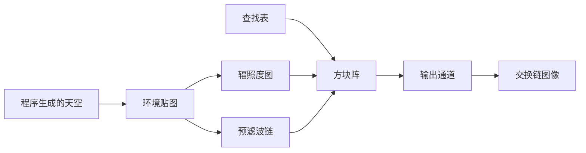

# ibl：基于图像的光照与分离求和

构建方式见仓库根目录的 README。

## 简介

程序生成的天空环境（渐变底色加三个亮斑），加上一个金属度与粗糙度都可调的方块阵。环境光照拆成三块
预计算：

| 预计算 | 内容 | 尺寸 |
| --- | --- | --- |
| 环境贴图 | 把天空写进一张等距圆柱投影的贴图 | 256 x 128 |
| 辐照度图 | 在法线半球上积分，得到漫反射分量 | 32 x 16 |
| 预滤波链 | 按粗糙度做 GGX 卷积，六级各对应一个粗糙度 | 128 x 64 起，逐级减半 |
| 查找表 | 法线与视线夹角、粗糙度决定的镜面系数 | 128 x 128 |

预计算只在启动时与按下「重新预计算」之后各跑一遍，不计入每帧成本。

## 渲染流程



## 实现要点

### 分离求和与直接采样

同一个视角抓帧比较（方块阵按行铺开粗糙度，前两行非金属、后两行金属）：

| 对比 | 平均绝对差 | 差值超过 8 的像素占比 | 最大差值 |
| --- | --- | --- | --- |
| 直接采样环境贴图 与 分离求和 | 21.324 | 33.427% | 183 |
| 关掉视差矫正 与 打开 | 0.955 | 2.564% | 21 |

直接采样时粗糙度完全不起作用：所有方块的高光都是环境贴图本身的形状，金属球看起来像镜子，粗糙的
金属球也一样亮。分离求和之后，粗糙度决定取预滤波链的哪一级，高光随粗糙度从锐利变成雾面，漫反射分量
由辐照度图给出，非金属球的反射明显弱于金属球。两者的差别覆盖三分之一的像素，最大差值一百八十三。

视差矫正把取样方向按探针的包围形状修正，关掉之后探针按无限远环境作假设，反射的位置会随方块的
位置漂移，两个配置相差百分之二点五的像素。

## 界面控件

| 控件 | 作用 |
| --- | --- |
| 使用分离求和 | 打开时走预计算的三块，关闭时直接采样环境贴图 |
| 视差矫正 | 按探针包围形状修正取样方向 |
| 重新预计算 | 手动再跑一遍四趟预计算 |
| GPU 锁频 | 与间接绘制 case 共用同一个面板 |

## 命令行参数

| 参数 | 含义 | 默认值 |
| --- | --- | --- |
| `--no-split-sum` | 直接采样环境贴图，不做分离求和 | 开启 |
| `--no-parallax` | 关掉视差矫正 | 开启 |
| `--no-interface` / `--auto-exit S` / `--capture F` / `--report F` / `--control-port N` | 与其他 case 一致 | |

键盘操作：`Esc` 退出。

## 测试方法

```
build\meow_ibl.exe --auto-exit 3 --no-interface --capture intermediate\ibl_split.png
build\meow_ibl.exe --no-split-sum --auto-exit 3 --no-interface --capture intermediate\ibl_direct.png
build\meow_ibl.exe --no-parallax --auto-exit 3 --no-interface --capture intermediate\ibl_nopar.png
```

## 源码结构

| 文件 | 内容 |
| --- | --- |
| `src/main.cpp` | 桌面入口：命令行解析、主循环与界面状态 |
| `src/android_main.cpp` | 安卓入口：NativeActivity 生命周期、表面与交换链、主循环 |
| `src/renderer.cpp` | 四趟预计算的离屏目标与管线、方块阵与输出通道 |
| `src/case_ui.cpp` | 本 case 的控制面板与全部界面文本 |
| `src/timing_items.cpp` | 本 case 的计时项定义 |
| `shaders/sky_common.glsl` | 程序生成的天空、方向与投影坐标互换、低差异序列 |
| `shaders/environment.frag` `shaders/irradiance.frag` `shaders/prefilter.frag` `shaders/brdf_lut.frag` | 四趟预计算 |
| `shaders/box.vert` `shaders/pbr.frag` | 方块阵的展开与基于图像的光照 |
| `shaders/fullscreen.vert` `shaders/present.frag` | 全屏三角形与最终输出 |

## 安卓端差异

- 实例与设备申请 Vulkan 1.1；`minSdk` 24 是 Vulkan 1.0 的最低 API 等级。
- 预滤波链在本 case 里用六张独立贴图实现，安卓上与桌面一致。
- 设备时间只在设备支持时间戳时测量。
- GPU 锁频面板不显示：它依赖桌面的 `nvidia-smi`。
- 帧率上限 60 FPS，避免无界空转发热。

### 安卓测试方法

```
adb -s <serial> install -r android\app\build\outputs\apk\debug\app-debug.apk
adb -s <serial> logcat -s MeowVulkanDemo
```

应用内置回环 TCP 控制服务（端口 21000），安卓端经 `adb forward tcp:21000 tcp:21000` 映射到本机。
