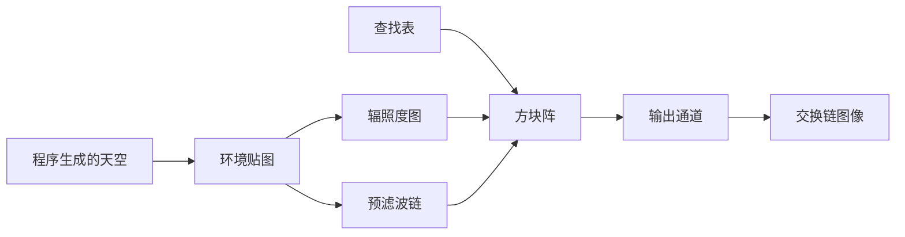

# ibl：基于图像的光照与分离求和

构建方式见仓库根目录的 README。

## 简介

程序生成的天空环境（渐变底色加三个亮斑，[`shaders/sky_common.glsl:6-26`](shaders/sky_common.glsl#L6-L26)），
加上一个金属度与粗糙度都可调的方块阵（[`src/renderer.cpp:35-59`](src/renderer.cpp#L35-L59)）。环境光照的
输入与三块分量都在启动时预计算：

| 预计算 | 内容 | 尺寸 |
| --- | --- | --- |
| 环境贴图 | 把天空写进一张等距圆柱投影的贴图（[`shaders/environment.frag:10-13`](shaders/environment.frag#L10-L13)） | 256 x 128 |
| 辐照度图 | 在法线半球上积分，得到漫反射分量（[`shaders/irradiance.frag:12-29`](shaders/irradiance.frag#L12-L29)） | 32 x 16 |
| 预滤波链 | 按粗糙度做 GGX 卷积，六级各对应一个粗糙度（[`shaders/prefilter.frag:14-44`](shaders/prefilter.frag#L14-L44)） | 128 x 64 起，逐级减半 |
| 查找表 | 法线与视线夹角、粗糙度决定的镜面系数（[`shaders/brdf_lut.frag:17-55`](shaders/brdf_lut.frag#L17-L55)） | 128 x 128 |

四张表的尺寸在渲染器里以常量给出（[`src/renderer.cpp:17-22`](src/renderer.cpp#L17-L22)）。四趟预计算只在
启动时与按下「重新预计算」之后各跑一遍，不计入每帧成本
（[`src/renderer.cpp:672-742`](src/renderer.cpp#L672-L742)）。

## 渲染流程



预计算的四趟各写一张离屏贴图：环境贴图、辐照度图与查找表各画一个全屏三角形
（[`src/renderer.cpp:679-707`](src/renderer.cpp#L679-L707)），预滤波链按层级逐个画，每一级把自己的
粗糙度用推入常量送进着色器（[`src/renderer.cpp:709-741`](src/renderer.cpp#L709-L741)）。方块阵通道用
一次带索引的实例化绘制画出全部方块（[`src/renderer.cpp:757-776`](src/renderer.cpp#L757-L776)），最后
一个全屏三角形把方块阵的颜色搬到交换链图像上（[`src/renderer.cpp:779-803`](src/renderer.cpp#L779-L803)）。

## 实现要点

### 分离求和与直接采样

同一个视角抓帧比较（方块阵按行铺开粗糙度，前两行非金属、后两行金属，
[`src/renderer.cpp:47-48`](src/renderer.cpp#L47-L48)）：

| 对比 | 平均绝对差 | 差值超过 8 的像素占比 | 最大差值 |
| --- | --- | --- | --- |
| 直接采样环境贴图 与 分离求和 | 21.324 | 33.427% | 183 |
| 关掉视差矫正 与 打开 | 0.955 | 2.564% | 21 |

分离求和把镜面反射在半球上的积分拆成与光照有关、与材质有关的两项：

$$
\int_\Omega L_i(l)\,f(l,v,n)\,(n\cdot l)\,dl \;\approx\;
\underbrace{\int_\Omega L_i(l)\,D(l,v,n,\alpha)\,(n\cdot l)\,dl}_{P}\;\cdot\;\bigl(F_0\,A + B\bigr)
$$

第一项按粗糙度预滤波成六级环境贴图，用重要性采样铺开方向并按 $n\cdot l$ 权重归一化
（[`shaders/prefilter.frag:27-44`](shaders/prefilter.frag#L27-L44)）；第二项只由法线与视线的夹角余弦
$n\cdot v$ 和粗糙度决定，预积分成一张二维查找表，$A$ 累加未加权的可见性、$B$ 累加菲涅尔加权后的可见性：

$$
A(n\cdot v,\alpha)=\frac{1}{N}\sum_i \frac{\bigl(1-(1-v\cdot h_i)^5\bigr)\,G(n\cdot v,n\cdot l_i)}{n\cdot v},
\qquad
B(n\cdot v,\alpha)=\frac{1}{N}\sum_i \frac{(1-v\cdot h_i)^5\,G(n\cdot v,n\cdot l_i)}{n\cdot v}
$$

其中 $G$ 是法线与视线、法线与光线两个 Schlick-GGX 项之积
（[`shaders/brdf_lut.frag:11-15`](shaders/brdf_lut.frag#L11-L15)、
[`shaders/brdf_lut.frag:48-52`](shaders/brdf_lut.frag#L48-L52)）。漫反射分量在法线半球上按余弦权重取平均，
存下来的值就是辐照度除以 $\pi$：

$$
\frac{1}{\pi}\int_\Omega L_i(l)\,(n\cdot l)\,dl
$$

（[`shaders/irradiance.frag:19-29`](shaders/irradiance.frag#L19-L29)）。两个预积分都用低差异序列铺开采样
方向（[`shaders/sky_common.glsl:42-55`](shaders/sky_common.glsl#L42-L55)）。

运行时漫反射取辐照度图、镜面取预滤波链与查找表，两项相加
（[`shaders/pbr.frag:70-73`](shaders/pbr.frag#L70-L73)），粗糙度在相邻两级预滤波贴图之间线性混合
（[`shaders/pbr.frag:34-44`](shaders/pbr.frag#L34-L44)），菲涅尔基底由金属度在 0.04 与方块颜色之间插值
（[`shaders/pbr.frag:56`](shaders/pbr.frag#L56)）。直接采样时粗糙度完全不起作用：漫反射与镜面都直接对
原始环境贴图取样（[`shaders/pbr.frag:74-77`](shaders/pbr.frag#L74-L77)），所有方块的高光都是环境贴图
本身的形状，金属球看起来像镜子，粗糙的金属球也一样亮。分离求和之后，粗糙度决定取预滤波链的哪一级，
高光随粗糙度从锐利变成雾面，漫反射分量由辐照度图给出，非金属球的反射明显弱于金属球。两者的差别覆盖
三分之一的像素，最大差值一百八十三。

视差矫正把取样方向朝探针位置修正之后与原方向混合
（[`shaders/pbr.frag:61-65`](shaders/pbr.frag#L61-L65)）；关掉之后探针按无限远环境作假设
（[`shaders/pbr.frag:59-60`](shaders/pbr.frag#L59-L60)），反射的位置会随方块的位置漂移，两个配置相差
百分之二点五的像素。

## 界面控件

| 控件 | 作用 |
| --- | --- |
| 使用分离求和 | 打开时走预计算的三块，关闭时直接采样环境贴图 |
| 视差矫正 | 按探针位置修正取样方向（[`shaders/pbr.frag:61-65`](shaders/pbr.frag#L61-L65)） |
| 重新预计算 | 手动再跑一遍四趟预计算 |
| GPU 锁频 | 与间接绘制 case 共用同一个面板 |

## 命令行参数

| 参数 | 含义 | 默认值 |
| --- | --- | --- |
| `--no-split-sum` | 直接采样环境贴图，不做分离求和 | 开启 |
| `--no-parallax` | 关掉视差矫正 | 开启 |
| `--no-interface` / `--auto-exit S` / `--capture F` / `--report F` / `--control-port N` | 与其他 case 一致 | |

键盘操作：`Esc` 退出。

## 测试方法

```
build\meow_ibl.exe --auto-exit 3 --no-interface --capture intermediate\ibl_split.png
build\meow_ibl.exe --no-split-sum --auto-exit 3 --no-interface --capture intermediate\ibl_direct.png
build\meow_ibl.exe --no-parallax --auto-exit 3 --no-interface --capture intermediate\ibl_nopar.png
```

## 源码结构

| 文件 | 内容 |
| --- | --- |
| `src/main.cpp` | 桌面入口：命令行解析、主循环与界面状态 |
| `src/android_main.cpp` | 安卓入口：NativeActivity 生命周期、表面与交换链、主循环 |
| `src/renderer.cpp` | 四趟预计算的离屏目标与管线、方块阵与输出通道 |
| `src/case_ui.cpp` | 本 case 的控制面板与全部界面文本 |
| `src/timing_items.cpp` | 本 case 的计时项定义 |
| `shaders/sky_common.glsl` | 程序生成的天空、方向与投影坐标互换、低差异序列 |
| `shaders/environment.frag` `shaders/irradiance.frag` `shaders/prefilter.frag` `shaders/brdf_lut.frag` | 四趟预计算 |
| `shaders/box.vert` `shaders/pbr.frag` | 方块阵的展开与基于图像的光照 |
| `shaders/fullscreen.vert` `shaders/present.frag` | 全屏三角形与最终输出 |

## 安卓端差异

- 实例与设备申请 Vulkan 1.1；`minSdk` 24 是 Vulkan 1.0 的最低 API 等级。
- 预滤波链在本 case 里用六张独立贴图实现，安卓上与桌面一致。
- 设备时间只在设备支持时间戳时测量。
- GPU 锁频面板不显示：它依赖桌面的 `nvidia-smi`。
- 帧率上限 60 FPS，避免无界空转发热。

### 安卓测试方法

```
adb -s <serial> install -r android\app\build\outputs\apk\debug\app-debug.apk
adb -s <serial> logcat -s MeowVulkanDemo
```

应用内置回环 TCP 控制服务（端口 21000），安卓端经 `adb forward tcp:21000 tcp:21000` 映射到本机。
