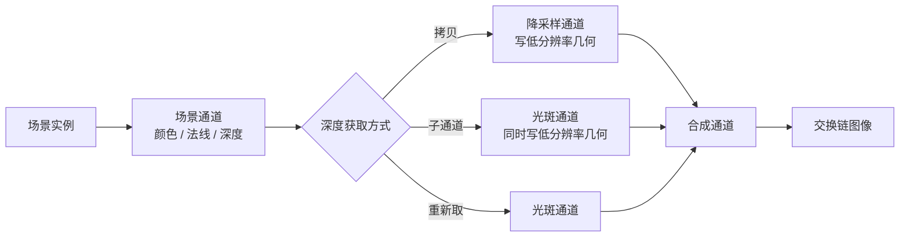

# low_res：低分辨率层与引导式上采样

构建方式见仓库根目录的 README。

## 简介

一个由相互遮挡的板组成的高频场景，上面叠一层贴在近处物体上的薄雾与一片缓慢移动的柔和光斑。这一层
按可调的比例在离屏渲染，再合成回全分辨率。

| 控件 | 取值 | 说明 |
| --- | --- | --- |
| 比例 | 全分辨率、二分之一、四分之一 | 低分辨率层的分辨率 |
| 上采样方式 | 双线性、深度法线加权 | 合成时的放大方式 |
| 深度与法线的获取 | 拷贝为颜色附件、子通道内写出、从全分辨率重新取 | 低分辨率几何的来源 |

## 渲染流程



场景通道输出全分辨率的高动态范围颜色、法线与深度。低分辨率层从全分辨率的深度还原视空间深度，按
距离给出一层薄雾，再叠上缓慢移动的光斑。合成通道把低分辨率层放大到全分辨率，与场景颜色相加后做
色调映射。

## 实现要点

### 上采样方式的差别

薄雾贴在近处物体上：物体的视空间深度在二到六之间，背景在远平面上，两者在物体的轮廓处形成台阶。
低分辨率层在这个台阶两侧取值相差很大，直接双线性放大会把台阶糊开，轮廓上出现一圈串色。用全分辨率
的深度与法线给低分辨率邻域加权之后，跨物体的邻域权重接近零。

以全分辨率的结果为基准，逐像素比较（同一时刻，动画冻结）：

| 比例 | 上采样 | 平均绝对差 | 差值超过 32 的像素占比 | 最大差值 |
| --- | --- | --- | --- | --- |
| 二分之一 | 双线性 | 0.417 | 0.511% | 138 |
| 二分之一 | 深度法线加权 | 0.381 | 0.325% | 81 |
| 四分之一 | 双线性 | 0.859 | 0.911% | 139 |
| 四分之一 | 深度法线加权 | 0.717 | 0.524% | 101 |

比例降到四分之一时双线性的最大差值是 139，加上深度法线加权之后降到 101，差值超过 32 的像素从
0.911% 降到 0.524%。二分之一时最大差值从 138 降到 81。比例越低，双线性的串色越明显，加权能压住的
部分也越多。

### 深度与法线的三种获取方式

同样的四分之一比例与深度法线加权：

| 获取方式 | 与全分辨率基准的平均绝对差 | 差值超过 32 的占比 | 最大差值 |
| --- | --- | --- | --- |
| 拷贝为颜色附件 | 0.717 | 0.524% | 101 |
| 子通道内写出 | 0.717 | 0.524% | 101 |
| 从全分辨率重新取 | 0.836 | 0.673% | 118 |

前两种方式写出的低分辨率几何完全相同，逐像素差值为零；第三种方式把坐标对齐到低分辨率纹素中心之后
再从全分辨率的深度与法线取值，取值与前两种一致，但经过一次额外的坐标对齐与采样，结果略有出入。

### 设备时间与工作量

锁频 2880/15001 之后按段测量：

| 比例 | 上采样 | 获取方式 | 低分辨率层 | 绘制命令 | 设备时间 |
| --- | --- | --- | --- | --- | --- |
| 全分辨率 | 深度法线加权 | 拷贝 | 1600 x 900 | 4 | 0.141 ± 0.015 ms |
| 二分之一 | 深度法线加权 | 拷贝 | 800 x 450 | 4 | 0.115 ± 0.014 ms |
| 四分之一 | 深度法线加权 | 拷贝 | 400 x 225 | 4 | 0.111 ± 0.013 ms |
| 四分之一 | 双线性 | 拷贝 | 400 x 225 | 4 | 0.031 ± 0.012 ms |
| 四分之一 | 深度法线加权 | 子通道内写出 | 400 x 225 | 3 | 0.108 ± 0.013 ms |
| 四分之一 | 深度法线加权 | 从全分辨率重新取 | 400 x 225 | 3 | 0.117 ± 0.013 ms |

比例从全分辨率降到四分之一，设备时间从 0.141 降到 0.111 毫秒，省下的是低分辨率层的着色与带宽。
上采样的开销与比例无关：四分之一比例下双线性只要 0.031 毫秒，换成五点乘五点的深度法线加权就涨到
0.111 毫秒，多出来的 0.080 毫秒全在合成通道里，按全分辨率的像素数计费。获取方式的差别不大，
拷贝方式比子通道方式多一条绘制命令，重新取方式把开销挪进合成通道的每个邻域采样里，所以在深度法线
加权下三者的设备时间接近。

## 界面控件

| 控件 | 作用 |
| --- | --- |
| 比例 | 低分辨率层的比例 |
| 上采样方式 | 双线性或深度法线加权 |
| 深度与法线的获取 | 三种获取方式 |
| 双边强度 | 深度加权里深度差的系数 |
| 光斑强度 | 低分辨率层的整体强度 |
| GPU 锁频 | 与间接绘制 case 共用同一个面板 |

面板同时显示绘制命令条数与低分辨率层的尺寸，另附操作指南；耗时面板按本 case 的通道拆分逐项列出。

## 命令行参数

| 参数 | 含义 | 默认值 |
| --- | --- | --- |
| `--ratio 名字` | 比例，取 `full`、`half` 或 `quarter` | quarter |
| `--upsample 名字` | 上采样方式，取 `bilinear` 或 `bilateral` | bilateral |
| `--depth 名字` | 获取方式，取 `copy`、`subpass` 或 `reconstruct` | copy |
| `--bilateral F` | 双边强度，1 到 400 | 60 |
| `--glow F` | 光斑强度，0 到 4 | 1.2 |
| `--time F` | 动画时刻，单位秒 | 0 |
| `--freeze` | 冻结动画，配合 `--time` 抓固定时刻的画面 | 关闭 |
| `--no-interface` / `--auto-exit S` / `--capture F` / `--report F` / `--control-port N` | 与其他 case 一致 | |

键盘操作：`Esc` 退出。

## 测试方法

冻结动画，同一时刻抓不同配置的画面：

```
build\meow_low_res.exe --ratio quarter --upsample bilinear --depth copy --time 0 --freeze --auto-exit 3 --no-interface --capture intermediate\lr_quarter_bilinear.png
build\meow_low_res.exe --ratio quarter --upsample bilateral --depth copy --time 0 --freeze --auto-exit 3 --no-interface --capture intermediate\lr_quarter_bilateral.png
build\meow_low_res.exe --ratio full --upsample bilateral --depth copy --time 0 --freeze --auto-exit 3 --no-interface --capture intermediate\lr_full.png
```

测量设备时间：启动一个进程锁频并打开控制服务，按段发送命令，程序把每段的结果追加到 CSV：

```
build\meow_low_res.exe --no-interface --control-port 21000 --core-clock 2880 --memory-clock 15001 --time 0 --freeze --report intermediate\lr_measure.csv
```

连上 21000 端口后，`ratio`/`upsample`/`depth`/`bilateral`/`glow`/`time` 改配置，`begin` 与 `end` 圈定
一段测量，`quit` 退出。

## 源码结构

| 文件 | 内容 |
| --- | --- |
| `src/main.cpp` | 桌面入口：命令行解析、主循环与界面状态 |
| `src/android_main.cpp` | 安卓入口：NativeActivity 生命周期、表面与交换链、主循环 |
| `src/renderer.cpp` | 场景、降采样、光斑与合成四个通道，三套低分辨率几何的获取路径 |
| `src/case_ui.cpp` | 本 case 的控制面板与全部界面文本 |
| `src/timing_items.cpp` | 本 case 的计时项定义 |
| `shaders/scene.vert` `shaders/scene.frag` | 场景实例的展开与方向光着色，写出颜色与法线 |
| `shaders/downgrade.frag` | 把全分辨率的深度与法线降到低分辨率 |
| `shaders/glow.frag` `shaders/glow_geometry.frag` | 低分辨率层的薄雾与光斑，后者同时写出低分辨率几何 |
| `shaders/fullscreen.vert` `shaders/composite.frag` | 全屏三角形与双线性、深度法线加权两种上采样 |

## 安卓端差异

- 实例与设备申请 Vulkan 1.1；`minSdk` 24 是 Vulkan 1.0 的最低 API 等级。
- 分块架构下把深度作为采样输入会触发额外的搬运，三种获取方式的设备时间差别需要在真机上测量。
- 设备时间只在设备支持时间戳时测量。
- GPU 锁频面板不显示：它依赖桌面的 `nvidia-smi`。
- 帧率上限 60 FPS，避免无界空转发热。

### 安卓测试方法

```
adb -s <serial> install -r android\app\build\outputs\apk\debug\app-debug.apk
adb -s <serial> logcat -s MeowVulkanDemo
```

应用内置回环 TCP 控制服务（端口 21000），安卓端经 `adb forward tcp:21000 tcp:21000` 映射到本机。
