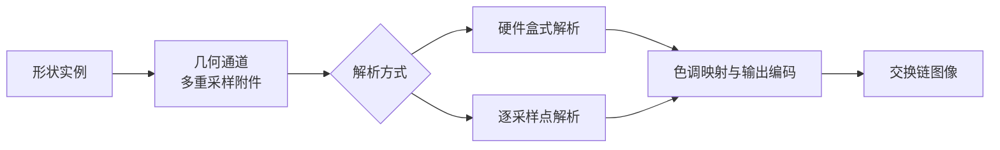

# msaa：多重采样的覆盖、着色次数与自定义解析

构建方式见仓库根目录的 README。

## 简介

三个子场景共用一套几何提交：形状的位置、尺寸与透明度放在实例缓冲里，顶点着色器按顶点编号推出矩形角点，一次实例化绘制完成。

| 子场景 | 内容 |
| --- | --- |
| 全屏三角 | 两块形状铺满视口，内部处处被单一图元覆盖 |
| 交叠三角与植被 | 一批相互交叠、边缘留有背景的形状，其中一片走镂空的 alpha test |
| 高动态范围 | 背景亮度远高于 1，形状很暗 |

| 控件 | 说明 |
| --- | --- |
| 采样数 | 1x、2x、4x、8x，超过设备上限时自动降档 |
| 解析方式 | 硬件盒式解析，或者逐采样点编码、求平均、解码 |
| 镂空走 alpha to coverage | 打开时镂空形状用 alpha to coverage，关闭时用 alpha test |
| 片元开销 | 片元着色器里循环的次数 |
| 背景亮度 | 高动态范围子场景的背景亮度 |

片元调用次数由片元着色器里的原子累加统计，帧末经缓冲回读。

## 渲染流程



几何通道写多重采样的颜色（半精度浮点，背景亮度可以超过 1）与深度；解析把多重采样结果合成到单采样浮点贴图；最后一个全屏三角形做色调映射与输出编码。采样数为一的时候没有采样点可解析，直接把颜色附件拷到解析目标。

## 实现要点

### 着色次数不随采样数放大

片元着色按每像素每图元执行一次，多重采样只在光栅化与深度测试阶段按采样点处理，着色器本身只跑一次。片元调用计数的实测在 1x、4x、8x 下分别是 312403、319195、320972，相差不到百分之三，这点差别来自边界像素上被部分覆盖的图元被再次计入。

### 只改变边缘

多重采样只在同一个像素被多个图元或背景共同覆盖的边界处改变结果。全屏三角内部处处被单一图元覆盖，1x 与 4x 的抓帧逐像素完全一致；交叠子场景的差别集中在形状的边缘，实测 1.18% 的像素不同。

### 高动态范围的解析顺序

按线性值求平均再色调映射，边界上的平均值会落在高光与暗部之间，色调映射把这段压扁，边界看起来没有抗锯齿；先把各采样点编码到感知空间求平均、再解码回来，过渡带才与硬件盒式解析的观感接近。两种解析方式在本 case 的交叠子场景上相差 0.45% 的像素。

### alpha to coverage

alpha to coverage 用片元输出的 alpha 对已通过覆盖与深度测试的采样点再做一次概率判定，给 alpha test 的硬边补上过渡。它需要采样数大于一，且管线状态与深度写入都要配合。

## 界面控件

| 控件 | 作用 |
| --- | --- |
| 场景 | 三个子场景 |
| 背景亮度 | 高动态范围子场景的背景亮度 |
| 采样数 | 1x 到 8x |
| 解析方式 | 硬件盒式或逐采样点 |
| 镂空走 alpha to coverage | 镂空形状的处理方式 |
| 片元开销 | 片元着色器的循环次数 |
| GPU 锁频 | 与间接绘制 case 共用同一个面板 |

面板同时显示绘制命令条数、片元调用次数与场景说明，另附操作指南；耗时面板按本 case 的通道拆分逐项列出。

## 命令行参数

| 参数 | 含义 | 默认值 |
| --- | --- | --- |
| `--scene N` | 子场景编号，0 到 2 | 0 |
| `--samples N` | 采样数，取 1、2、4 或 8 | 4 |
| `--resolve 名字` | 解析方式，取 `hardware` 或 `custom` | hardware |
| `--no-coverage` | 启动时关闭 alpha to coverage | 开启 |
| `--fragment-cost N` | 片元着色器的循环次数，1 到 256 | 32 |
| `--background F` | 背景亮度，0 到 8 | 2 |
| `--no-interface` / `--auto-exit S` / `--capture F` / `--report F` / `--control-port N` | 与其他 case 一致 | |

键盘操作：`Esc` 退出。

## 测试方法

```
build\meow_msaa.exe --auto-exit 4 --no-interface --scene 0 --samples 1 --capture intermediate\ms_s0_1.png
build\meow_msaa.exe --auto-exit 4 --no-interface --scene 0 --samples 4 --capture intermediate\ms_s0_4.png
build\meow_msaa.exe --auto-exit 4 --no-interface --scene 1 --samples 1 --capture intermediate\ms_s1_1.png
build\meow_msaa.exe --auto-exit 4 --no-interface --scene 1 --samples 4 --capture intermediate\ms_s1_4.png
build\meow_msaa.exe --auto-exit 4 --no-interface --scene 1 --samples 4 --resolve custom --capture intermediate\ms_s1_custom.png
```

| 对比 | 差异像素占比 | 最大差值 |
| --- | --- | --- |
| 全屏三角 1x 与 4x | 0.00% | 0 |
| 交叠场景 1x 与 4x | 1.18% | 140 |
| 交叠场景 1x 与 8x | 1.20% | 140 |
| 交叠场景 4x 硬件与自定义解析 | 0.45% | 44 |

全屏三角的两张逐像素完全一致，交叠场景的差别集中在形状边缘。

| 采样数 | 片元调用次数 |
| --- | --- |
| 1x | 312403 |
| 4x | 319195 |
| 8x | 320972 |

片元调用次数基本不随采样数变化。

参数可以在同一次运行里改变：

```
adb -s <serial> forward tcp:21000 tcp:21000
```

桌面端用 `--control-port 21000` 启动后，连接并逐行发命令：`samples`/`resolve`/`scene`/`coverage`/`fragment-cost`/`background` 改配置，`begin` 与 `end` 圈定一段测量，`quit` 退出。

## 源码结构

| 文件 | 内容 |
| --- | --- |
| `src/main.cpp` | 桌面入口：命令行解析、主循环与界面状态 |
| `src/android_main.cpp` | 安卓入口：NativeActivity 生命周期、表面与交换链、主循环 |
| `src/renderer.cpp` | 三个渲染通道、几何管线（两套 alpha to coverage 状态）、解析与色调映射管线、重建路径 |
| `src/case_ui.cpp` | 本 case 的控制面板与全部界面文本 |
| `src/timing_items.cpp` | 本 case 的计时项定义 |
| `shaders/shape.vert` `shaders/shape.frag` | 形状的顶点展开、镂空、片元计数与着色开销 |
| `shaders/fullscreen.vert` | 全屏三角形 |
| `shaders/resolve_custom.frag` | 逐采样点解析 |
| `shaders/tonemap.frag` | 色调映射与输出编码 |

## 安卓端差异

- 实例与设备申请 Vulkan 1.1；`minSdk` 24 是 Vulkan 1.0 的最低 API 等级。
- 采样数上限由设备的 `framebufferColorSampleCounts` 与 `framebufferDepthSampleCounts` 共同决定，超出时自动降到相邻可选档位。
- 分块架构下片上存储与多重采样的配合与桌面不同，带宽差别需要在真机上测量。
- 设备时间只在设备支持时间戳时测量。
- GPU 锁频面板不显示：它依赖桌面的 `nvidia-smi`。
- 帧率上限 60 FPS，避免无界空转发热。

### 安卓测试方法

```
adb -s <serial> install -r android\app\build\outputs\apk\debug\app-debug.apk
adb -s <serial> logcat -s MeowVulkanDemo
```

应用内置回环 TCP 控制服务（端口 21000），安卓端经 `adb forward tcp:21000 tcp:21000` 映射到本机。
