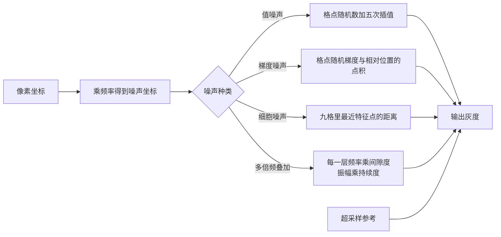

# noise：程序化噪声与多倍频叠加

构建方式见仓库根目录的 README。

## 简介

整幅画面由一个全屏三角形（[`shaders/fullscreen.vert:6-11`](shaders/fullscreen.vert#L6-L11)）配一段噪声片元
着色器直接算出来（[`shaders/noise.frag:141-147`](shaders/noise.frag#L141-L147)），没有纹理也没有几何。四种
噪声共用一个二维坐标与一套正弦散列（[`shaders/noise.frag:19-22`](shaders/noise.frag#L19-L22)），可以直接
对照：值噪声（[`shaders/noise.frag:37-49`](shaders/noise.frag#L37-L49)）、Perlin 梯度噪声
（[`shaders/noise.frag:52-66`](shaders/noise.frag#L52-L66)）、Worley 细胞噪声
（[`shaders/noise.frag:69-81`](shaders/noise.frag#L69-L81)），以及把梯度噪声按倍频叠加的多倍频叠加
（[`shaders/noise.frag:95-109`](shaders/noise.frag#L95-L109)）。参考一档按每个像素覆盖的区域做超采样
（[`shaders/noise.frag:119-133`](shaders/noise.frag#L119-L133)），用来衡量逐像素求值在频率过高时的欠采样误差。

| 控件 | 取值 |
| --- | --- |
| 种类 | 值噪声、Perlin 梯度噪声、Worley 细胞噪声、多倍频叠加、超采样参考 |
| 频率 | 1 到 128，每单位坐标里放多少个格子 |
| 倍频数 | 1 到 8 |
| 持续度 / 间隙度 | 0.1 到 0.9 / 1.2 到 4 |
| 参考超采样数 | 1 到 8，每边的平方根 |
| 时间 / 自动推进 | 图案平移，用来观察时域闪烁 |
| 显示缩放 | 0.2 到 4 |

## 渲染流程



逐像素求值的入口按种类分派到四种噪声（[`shaders/noise.frag:111-139`](shaders/noise.frag#L111-L139)），
参数装在一个统一的缓冲里（[`shaders/noise.frag:7-10`](shaders/noise.frag#L7-L10)、
[`src/renderer.h:20-24`](src/renderer.h#L20-L24)）。每一帧由一个全屏三角形绘制完成
（[`src/renderer.cpp:382-392`](src/renderer.cpp#L382-L392)），每像素的求值次数在主机侧统计
（[`src/renderer.cpp:28-37`](src/renderer.cpp#L28-L37)）。图案随时间的平移只需要给坐标加一项
（[`shaders/noise.frag:143-144`](shaders/noise.frag#L143-L144)）。

## 实现要点

### 三种基础噪声

**值噪声**在整数格点上放一个随机数，格内用一条曲线插值（[`shaders/noise.frag:37-49`](shaders/noise.frag#L37-L49)）。
插值曲线决定格点之间的过渡（[`shaders/noise.frag:31-34`](shaders/noise.frag#L31-L34)）：

$$
f(t) = 6t^5 - 15t^4 + 10t^3
$$

这条五次曲线在 $t = 0$ 与 $t = 1$ 处的一阶与二阶导数都是零，因此格点之间不会出现折线或者方向性的人工痕迹。
随机数用正弦散列得到（[`shaders/noise.frag:19-22`](shaders/noise.frag#L19-L22)）：

$$
h(x, y) = \operatorname{fract}\left(\sin(127.1 x + 311.7 y) \cdot 43758.5453\right)
$$

**Perlin 梯度噪声**在格点上放一个随机方向（角度由同一个散列给出，[`shaders/noise.frag:24-28`](shaders/noise.frag#L24-L28)），
四个角对当前点的贡献是梯度与相对位置的点积（[`shaders/noise.frag:58-61`](shaders/noise.frag#L58-L61)）：

$$
g_{i,j} = \vec{G}_{i,j} \cdot \left(\vec{p} - \vec{c}_{i,j}\right)
$$

四个角的值再按同一条五次曲线做双线性混合（[`shaders/noise.frag:56`](shaders/noise.frag#L56)、
[`shaders/noise.frag:63`](shaders/noise.frag#L63)）。它的关键性质是在格点上取值恰好为零——因为相对位置是零向量——所以画面里不会出现值噪声那种格点附近的「台阶」感，分布也更接近高斯。

**Worley 细胞噪声**在每个格子里放一个特征点，取当前点到最近特征点的距离（[`shaders/noise.frag:69-81`](shaders/noise.frag#L69-L81)）：

$$
f(\vec{p}) = \min_{i,j \in \{0,1,2\}^2} \left\lVert \vec{F}_{i,j} - \vec{p} \right\rVert
$$

只查周围九格就够：循环在格心周围各取一环（[`shaders/noise.frag:73-79`](shaders/noise.frag#L73-L79)），
特征点必定落在自己所在的格子里，而更远的格子里的点距离一定大于当前格子的内切圆半径。结果是一片片细胞状的亮斑与边界。

四种噪声在同一频率（24）下的分布：

| 种类 | 均值 | 标准差 | 最小值 | 最大值 | 相邻像素平均绝对差 |
| --- | --- | --- | --- | --- | --- |
| 值噪声 | 126.97 | 59.48 | 0.0 | 254.0 | 1.9761 |
| Perlin 梯度噪声 | 127.52 | 39.85 | 5.0 | 247.0 | 2.1812 |
| Worley 细胞噪声 | 108.59 | 47.28 | 0.0 | 255.0 | 3.3382 |
| 多倍频叠加，五层 | 127.50 | 23.55 | 45.0 | 206.0 | 2.3698 |

值噪声的取值铺满整个 0 到 255，因为它是格点随机数的插值，格点之间的值就是两者的加权平均；Perlin 的标准差只有 39.85，因为四个角的点积有正有负，多数位置的取值靠近中间。
Worley 的均值偏低（108.59）、相邻像素差最大（3.34），因为它的画面里有一片片接近零的暗区与陡峭的边界。

### 多倍频叠加

每一层的频率与振幅按固定比例递推，最后按振幅之和归一化（[`shaders/noise.frag:95-109`](shaders/noise.frag#L95-L109)）：

$$
f(\vec{p}) = \frac{\sum_{i=0}^{N-1} a_i \, g\!\left(\vec{p} \cdot s_i\right)}{\sum_{i=0}^{N-1} a_i},
\qquad
a_i = \text{持续度}^{\,i},
\qquad
s_i = \text{间隙度}^{\,i}
$$

$g$ 是基础噪声。持续度取 0.5、间隙度取 2 时，每一层的频率翻倍、振幅减半，正好是常见的一比二关系。倍频数对画面统计的影响：

| 倍频数 | 求值次数 | 标准差 | 最小值 | 最大值 |
| --- | --- | --- | --- | --- |
| 1 | 1 | 39.850 | 5.0 | 247.0 |
| 2 | 2 | 29.495 | 30.0 | 222.0 |
| 3 | 3 | 25.887 | 37.0 | 215.0 |
| 4 | 4 | 24.302 | 45.0 | 208.0 |
| 5 | 5 | 23.553 | 45.0 | 206.0 |
| 6 | 6 | 23.187 | 45.0 | 206.0 |

每加一层，标准差都在下降并逐渐收敛（39.85 到 23.19）。原因是各层的取值互相独立，叠加之后分布向中间集中，加上归一化又把总振幅固定住了：层数越多，画面越"软"，极值越少。
第六层的标准差只比第五层低 0.37，说明持续度 0.5 之下超过五层已经看不出区别——实际用的时候不必叠太多层，代价却是每层一次完整求值。

### 频率过高时的欠采样

频率 96、五层、持续度 0.8 时，最高一层的频率已经达到每像素一个周期的量级。逐像素求值与按像素足迹超采样的参考比较：

| 指标 | 逐像素求值 | 超采样参考 |
| --- | --- | --- |
| 平均绝对差（两者之间） | 3.8004 | — |
| 超过 8 的像素占比 | 7.30% | — |
| 相邻像素平均绝对差 | 10.9315 | 8.0348 |
| 标准差 | 18.266 | 16.809 |

逐像素求值的相邻像素差比参考高 36%（10.93 对 8.03），标准差高 8.7%：多出来的都是欠采样产生的假高频。
静态画面里这些假高频表现为随机颗粒，一旦图案随时间平移，它们就会变成整片闪烁——这也是程序化噪声在远处必须按屏幕空间导数衰减振幅或者提前把高频层滤掉的原因。

参考本身也要收敛，以每边 8 个采样为基准。参考的超采样格点由像素在噪声空间里的足迹给出，足迹来自屏幕空间导数
（[`shaders/noise.frag:122-132`](shaders/noise.frag#L122-L132)）：

| 每边的采样数 | 平均绝对差 | 超过 8 的像素占比 | 最大差值 |
| --- | --- | --- | --- |
| 1（只取中心） | 1.5877 | 1.23% | 35 |
| 2 | 0.4834 | 0.14% | 23 |
| 4 | 0.2359 | 0.01% | 11 |

只取中心就是逐像素求值本身，与八乘八的差 1.59；四乘四之后误差 0.24。

### 设备时间

锁定核心频率 2880 兆赫、显存频率 15001 兆赫，每段测量六秒：

| 配置 | 每像素求值次数 | 设备时间 |
| --- | --- | --- |
| 值噪声 | 1 | 0.008 |
| Perlin 梯度噪声 | 1 | 0.011 |
| Worley 细胞噪声 | 1（九格） | 0.022 |
| 多倍频叠加，一层 | 1 | 0.012 |
| 多倍频叠加，二层 | 2 | 0.019 |
| 多倍频叠加，四层 | 4 | 0.033 |
| 多倍频叠加，八层 | 8 | 0.061 |
| 参考，四乘四乘五层 | 80 | 0.581 |
| 参考，八乘八乘五层 | 320 | 2.330 |

多倍频叠加的代价与层数成正比，每层 0.007 毫秒左右。单层的三种噪声里 Worley 最贵（0.022，是值噪声的近三倍），
因为它要遍历九格并算距离；Perlin 比值噪声贵一点，因为每个格点要算一次正余弦得到梯度方向。
参考路径的求值次数是层数与超采样数的乘积（[`src/renderer.cpp:28-37`](src/renderer.cpp#L28-L37)），八乘八乘五层要 320 次，2.33 毫秒，只适合离线对照。

## 界面控件

| 控件 | 作用 |
| --- | --- |
| 种类 | 四种噪声加参考 |
| 频率 | 每单位坐标的格子数 |
| 倍频数 / 持续度 / 间隙度 | 多倍频叠加的三个参数 |
| 参考超采样数 | 参考路径的质量 |
| 时间 / 自动推进 | 图案平移，观察时域闪烁 |
| 显示缩放 | 亮度缩放 |
| GPU 锁频 | 与间接绘制 case 共用同一个面板 |

面板同时显示绘制命令条数、渲染通道数与本帧每像素的噪声求值次数。

## 命令行参数

| 参数 | 含义 | 默认值 |
| --- | --- | --- |
| `--kind 名字` | 种类，取 `value`、`perlin`、`worley`、`fbm` 或 `reference` | fbm |
| `--frequency F` | 频率 | 12 |
| `--octaves N` | 倍频数，1 到 8 | 5 |
| `--persistence F` | 持续度 | 0.5 |
| `--lacunarity F` | 间隙度 | 2.0 |
| `--reference N` | 参考超采样数，每边的采样数 | 4 |
| `--time F` / `--animate` | 图案平移的时刻与自动推进 | 0，关闭 |
| `--display F` | 显示缩放 | 1.0 |
| `--no-interface` | 不显示界面面板 | 显示 |
| `--auto-exit S` | 运行 S 秒后自动退出 | 关闭 |
| `--capture 文件名` | 退出前把画面写成 PNG 并打印像素统计 | 关闭 |
| `--report 文件名` | 退出前把本次运行的平均耗时以 CSV 形式追加到该文件 | 关闭 |
| `--control-port N` | 打开 TCP 控制服务并监听该端口 | 关闭 |
| `--core-clock N` | 启动时锁定的核心频率，单位 MHz，取最接近的可选档位 | 不锁频 |
| `--memory-clock N` | 启动时锁定的显存频率，单位 MHz，取最接近的可选档位 | 不锁频 |

键盘操作：`Esc` 退出。

## 测试方法

四种噪声各抓一帧：

```
build\meow_noise.exe --kind value --frequency 24 --auto-exit 3 --no-interface --capture intermediate\no_kind_value.png
build\meow_noise.exe --kind perlin --frequency 24 --auto-exit 3 --no-interface --capture intermediate\no_kind_perlin.png
build\meow_noise.exe --kind worley --frequency 24 --auto-exit 3 --no-interface --capture intermediate\no_kind_worley.png
build\meow_noise.exe --kind fbm --frequency 24 --octaves 5 --auto-exit 3 --no-interface --capture intermediate\no_kind_fbm.png
```

倍频数逐档抓帧：

```
build\meow_noise.exe --kind fbm --frequency 24 --octaves 1 --auto-exit 3 --no-interface --capture intermediate\no_oct_1.png
build\meow_noise.exe --kind fbm --frequency 24 --octaves 6 --auto-exit 3 --no-interface --capture intermediate\no_oct_6.png
```

欠采样对照：

```
build\meow_noise.exe --kind fbm --frequency 96 --octaves 5 --persistence 0.8 --auto-exit 3 --no-interface --capture intermediate\no_alias_point.png
build\meow_noise.exe --kind reference --frequency 96 --octaves 5 --persistence 0.8 --reference 8 --auto-exit 3 --no-interface --capture intermediate\no_alias_ref.png
```

测量设备时间：启动一个进程锁频并打开控制服务，按段发送命令，程序把每段的结果追加到 CSV：

```
build\meow_noise.exe --no-interface --control-port 21000 --core-clock 2880 --memory-clock 15001 --report intermediate\no_measure.csv
```

连上 21000 端口后，`kind`/`octaves`/`reference`/`frequency`/`persistence`/`lacunarity`/`time`/`display` 改配置，
`begin` 与 `end` 圈定一段测量，`quit` 退出。

## 源码结构

| 文件 | 内容 |
| --- | --- |
| `src/main.cpp` | 桌面入口：命令行解析、主循环与界面状态 |
| `src/android_main.cpp` | 安卓入口：NativeActivity 生命周期、表面与交换链、主循环 |
| `src/renderer.cpp` | 全屏通道、管线与时间戳查询 |
| `src/case_ui.cpp` | 本 case 的控制面板与全部界面文本 |
| `src/timing_items.cpp` | 本 case 的计时项定义 |
| `shaders/noise.frag` | 散列、三种基础噪声、多倍频叠加、超采样参考 |
| `shaders/fullscreen.vert` | 全屏三角形 |

## 安卓端差异

- 实例与设备申请 Vulkan 1.1；`minSdk` 24 是 Vulkan 1.0 的最低 API 等级。
- 移动端的分块架构下屏幕空间导数在块的边界处由硬件近似给出，参考路径的像素足迹会略有跳变；实际使用中求值频率应当随距离衰减，避免高频层进入欠采样区间。
- 设备时间只在设备支持时间戳时测量。
- GPU 锁频面板不显示：它依赖桌面的 `nvidia-smi`。
- 帧率上限 60 FPS，避免无界空转发热。

### 安卓测试方法

```
adb -s <serial> install -r android\app\build\outputs\apk\debug\app-debug.apk
adb -s <serial> logcat -s MeowVulkanDemo
```

应用内置回环 TCP 控制服务（端口 21000），安卓端经 `adb forward tcp:21000 tcp:21000` 映射到本机，命令与桌面端相同。
