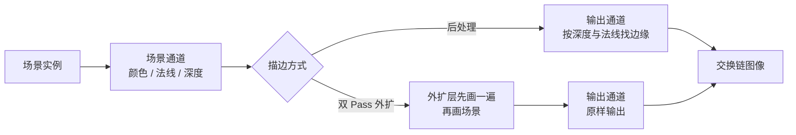

# outline：后处理描边与双 Pass 外扩

构建方式见仓库根目录的 README。

## 简介

场景由十八个立方体与八块薄片组成（[`src/renderer.cpp:82-106`](src/renderer.cpp#L82-L106)）：立方体的六个面各给
四个顶点、法线按面给出（[`src/renderer.cpp:39-62`](src/renderer.cpp#L39-L62)），薄片只有一个面
（[`src/renderer.cpp:64-80`](src/renderer.cpp#L64-L80)）。两种方式给这个场景画描边：

| 描边方式 | 做法 | 额外几何 | 额外绘制命令 |
| --- | --- | --- | --- |
| 后处理描边 | 在输出通道里比较深度与法线的不连续（[`shaders/outline.frag:30-45`](shaders/outline.frag#L30-L45)） | 无 | 无 |
| 双 Pass 外扩 | 几何沿法线推出去（[`shaders/hull.vert:20-32`](shaders/hull.vert#L20-L32)），外扩层与场景各用一套剔除方式画出包在外面的一圈（[`src/renderer.cpp:562-573`](src/renderer.cpp#L562-L573)） | 有 | 有 |

## 渲染流程



外扩层与场景在同一个渲染通道里，先画外扩层再画场景（[`src/renderer.cpp:750-779`](src/renderer.cpp#L750-L779)）：
外扩层沿法线推出给定的世界空间距离（[`shaders/hull.vert:23-27`](shaders/hull.vert#L23-L27)），画的时候用与场景
不同的剔除方式（[`src/renderer.cpp:562-573`](src/renderer.cpp#L562-L573)），只写描边颜色、法线附件留空
（[`shaders/hull.frag:18-20`](shaders/hull.frag#L18-L20)）；场景用 `LESS_OR_EQUAL`
（[`src/renderer.cpp:375-379`](src/renderer.cpp#L375-L379)）盖在它上面，露出来的部分就是描边。输出通道按方式
在两条合成管线里选一条（[`src/renderer.cpp:824-828`](src/renderer.cpp#L824-L828)），不描边与双 Pass 外扩都走原样
输出（[`shaders/present.frag:21-25`](shaders/present.frag#L21-L25)）。

## 实现要点

### 两种方式画出来的描边

相机距离 2.6（[`src/main.cpp:98`](src/main.cpp#L98)）、边缘阈值 0.005（[`src/main.cpp:95`](src/main.cpp#L95)），统计
描边颜色的像素数：

| 描边方式 | 描边像素合计 | 薄片所在的横带 | 立方体所在的横带 |
| --- | --- | --- | --- |
| 无描边 | 0 | 0 | 0 |
| 后处理，深度通道加用法线通道（[`shaders/outline.frag:38-44`](shaders/outline.frag#L38-L44)） | 56933 | 5878 | 51055 |
| 后处理，只用深度通道（[`shaders/outline.frag:38-41`](shaders/outline.frag#L38-L41)） | 45748 | 5878 | 39870 |
| 后处理，只用法线通道（[`shaders/outline.frag:42-44`](shaders/outline.frag#L42-L44)） | 34476 | 0 | 34476 |
| 双 Pass 外扩（[`src/renderer.cpp:760-768`](src/renderer.cpp#L760-L768)） | 157228 | 23824 | 133404 |

只用法线通道时薄片那一带一个描边像素都没有：薄片的法线（[`src/renderer.cpp:67`](src/renderer.cpp#L67)）与背景的
法线（[`src/renderer.cpp:737-739`](src/renderer.cpp#L737-L739)）都是朝向相机的方向，法线通道看不出它们之间的
边界，只有深度通道能。这正是后处理描边的阈值敏感所在，换一个场景就需要重新调阈值。双 Pass 外扩不依赖
任何阈值，描边像素数是后处理的近三倍，代价是几何要多画一遍。

### 相机拉远之后的线宽

| 相机距离 | 后处理描边像素 | 双 Pass 外扩描边像素 |
| --- | --- | --- |
| 2.6 | 56933 | 157228 |
| 6.0 | 29199 | 57214 |

相机拉远之后物体变小，两者的描边像素都减少。后处理减少百分之四十九，与轮廓周长缩小的比例一致，因为
它的线宽固定在屏幕空间（[`shaders/outline.frag:26`](shaders/outline.frag#L26)）；双 Pass 外扩减少百分之六十四，
多出来的那一部分来自外扩距离在世界空间里固定（[`shaders/hull.vert:25`](shaders/hull.vert#L25)），投影到屏幕上
随之变细。

### 设备时间与工作量

锁频 2880/15001 之后按段测量：

| 描边方式 | 绘制命令条数 | 设备时间 |
| --- | --- | --- |
| 无描边 | 3 | 0.017 ms |
| 后处理 | 3 | 0.024 ms |
| 双 Pass 外扩 | 5 | 0.018 ms |

后处理描边不增加绘制命令，多出来的是输出通道里对深度与法线的十次采样
（[`shaders/outline.frag:27-45`](shaders/outline.frag#L27-L45)）。双 Pass 外扩增加两条绘制命令（立方体与薄片
各多画一遍）（[`src/renderer.cpp:760-768`](src/renderer.cpp#L760-L768)），设备时间与不描边接近，因为本 case 的
几何很轻。

## 界面控件

| 控件 | 作用 |
| --- | --- |
| 方式 | 无描边、后处理描边或双 Pass 外扩 |
| 用深度通道 / 用法线通道 | 后处理描边的两个通道分别开关 |
| 边缘阈值 | 后处理描边的阈值 |
| 后处理线宽 | 后处理描边在屏幕空间的线宽，单位像素 |
| 外扩距离 | 双 Pass 外扩沿法线推出的世界空间距离 |
| 相机距离 | 相机到场景的距离 |
| GPU 锁频 | 与间接绘制 case 共用同一个面板 |

面板同时显示绘制命令条数，另附操作指南；耗时面板按本 case 的通道拆分逐项列出。

## 命令行参数

| 参数 | 含义 | 默认值 |
| --- | --- | --- |
| `--mode 名字` | 描边方式，取 `none`、`post` 或 `hull` | post |
| `--no-depth-channel` | 后处理描边不用深度通道 | 使用 |
| `--no-normal-channel` | 后处理描边不用法线通道 | 使用 |
| `--threshold F` | 后处理描边的边缘阈值 | 0.005 |
| `--line-width F` | 后处理描边的线宽，单位像素 | 2.0 |
| `--extrude F` | 双 Pass 外扩的推出去的距离 | 0.03 |
| `--camera F` | 相机到场景的距离 | 2.6 |
| `--no-interface` / `--auto-exit S` / `--capture F` / `--report F` / `--control-port N` | 与其他 case 一致 | |

键盘操作：`Esc` 退出。

## 测试方法

三种方式各抓一帧，比较描边像素：

```
build\meow_outline.exe --mode none --auto-exit 3 --no-interface --capture intermediate\ol_none.png
build\meow_outline.exe --mode post --auto-exit 3 --no-interface --capture intermediate\ol_post.png
build\meow_outline.exe --mode post --no-normal-channel --auto-exit 3 --no-interface --capture intermediate\ol_depth.png
build\meow_outline.exe --mode post --no-depth-channel --auto-exit 3 --no-interface --capture intermediate\ol_normal.png
build\meow_outline.exe --mode hull --auto-exit 3 --no-interface --capture intermediate\ol_hull.png
```

把相机拉到 6.0 再各抓一帧，比较线宽随距离的变化。

测量设备时间：启动一个进程锁频并打开控制服务，按段发送命令，程序把每段的结果追加到 CSV：

```
build\meow_outline.exe --no-interface --control-port 21000 --core-clock 2880 --memory-clock 15001 --report intermediate\ol_measure.csv
```

连上 21000 端口后，`mode`/`depth-channel`/`normal-channel`/`threshold`/`line-width`/`extrude`/`camera`
改配置，`begin` 与 `end` 圈定一段测量，`quit` 退出。

## 源码结构

| 文件 | 内容 |
| --- | --- |
| `src/main.cpp` | 桌面入口：命令行解析、主循环与界面状态 |
| `src/android_main.cpp` | 安卓入口：NativeActivity 生命周期、表面与交换链、主循环 |
| `src/renderer.cpp` | 立方体与薄片的网格生成、场景通道、外扩层与输出通道 |
| `src/case_ui.cpp` | 本 case 的控制面板与全部界面文本 |
| `src/timing_items.cpp` | 本 case 的计时项定义 |
| `shaders/scene.vert` `shaders/scene.frag` | 实例展开与方向光着色，写出颜色与法线 |
| `shaders/hull.vert` `shaders/hull.frag` | 沿法线外推与描边颜色输出 |
| `shaders/fullscreen.vert` `shaders/outline.frag` `shaders/present.frag` | 全屏三角形、后处理边缘检测与直接输出 |

## 安卓端差异

- 实例与设备申请 Vulkan 1.1；`minSdk` 24 是 Vulkan 1.0 的最低 API 等级。
- 分块架构下输出通道对深度附件的采样会触发额外搬运，后处理描边的带宽代价需要在真机上测量。
- 设备时间只在设备支持时间戳时测量。
- GPU 锁频面板不显示：它依赖桌面的 `nvidia-smi`。
- 帧率上限 60 FPS，避免无界空转发热。

### 安卓测试方法

```
adb -s <serial> install -r android\app\build\outputs\apk\debug\app-debug.apk
adb -s <serial> logcat -s MeowVulkanDemo
```

应用内置回环 TCP 控制服务（端口 21000），安卓端经 `adb forward tcp:21000 tcp:21000` 映射到本机。
