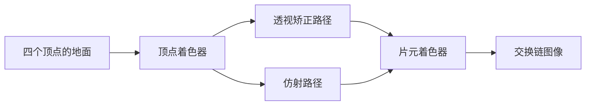

# perspective_interpolation：透视矫正插值

构建方式见仓库根目录的 README。

## 简介

一块只有四个顶点的大地面，从相机脚边一直铺到远处的近地平线位置，纹理坐标横跨整块地面。相机贴近地面、向下压一个不大的俯角，于是同一个图元在屏幕上的深度从不到一个单位一直跨到三百多个单位。

纹理图案由纹理坐标在片元着色器里程序生成，不引入贴图资源：

| 图案 | 说明 |
| --- | --- |
| 棋盘格 | 高频方格，便于看远处的压缩与弯折 |
| UV 网格 | 格线压暗，便于看格线随距离的间隔变化 |

插值方式有三种取值，界面上可以切换：

| 模式 | 说明 |
| --- | --- |
| 透视矫正 | 硬件默认路径，插值属性除以深度与深度倒数后在片元里相除 |
| 仿射 | 纹理坐标按屏幕坐标线性插值，不做透视除法还原 |
| 差值图 | 两种插值给出的纹理坐标之差的模长，放大成灰度热力图 |

## 渲染流程



## 实现要点

### 两条插值路径

顶点着色器把同一个纹理坐标写进两个输出：一个是普通的平滑输出，光栅化时按透视矫正插值；另一个带 `noperspective` 限定符，光栅化时在屏幕空间线性插值。

屏幕空间的线性插值等价于用屏幕坐标的重心权重对三个顶点的属性直接加权：`noperspective` 就是让光栅化阶段做这件事，不经过属性除以深度与深度倒数的还原步骤。两条路径在同一个着色器里按 uniform 里的开关选择，不需要两套管线。

### 为什么两种插值不同

透视投影之后，属性在屏幕上的变化率与它到相机的距离有关。屏幕空间的线性插值作用在已经被透视除法扭曲过的属性上，得到的是错误的分布：整块纹理被均匀摊在屏幕上，近处被拉伸、远处被压缩。

正确的做法是插值属性除以深度、以及深度倒数，再在片元里相除。两个端点处两种插值的取值相同，偏差在图形内部达到最大，并且随深度跨度增大而增大。

### 差值图

差值图输出两种插值得到的纹理坐标之差的模长，乘以 1.2 后作为灰度。纹理坐标采用棋盘与网格之外的第三条路径计算，与图案开关无关。

## 界面控件

| 控件 | 作用 |
| --- | --- |
| 移动速度 | 相机移动速度 |
| 插值方式 | 透视矫正、仿射、差值图 |
| 图案 | 棋盘格或 UV 网格 |
| 近平面距离 | 相机的近平面，取值 0.05 到 12 |
| GPU 锁频 | 与间接绘制 case 共用同一个面板 |

面板同时显示绘制命令条数与场景说明，另附操作指南；耗时面板按本 case 的阶段拆分逐项列出。

## 命令行参数

命令行参数与界面控制同一套状态，用于自动化测试：

| 参数 | 含义 | 默认值 |
| --- | --- | --- |
| `--interpolation 名字` | 启动时的插值方式，取 `perspective`、`affine` 或 `difference` | perspective |
| `--pattern 名字` | 启动时的图案，取 `checker` 或 `grid` | checker |
| `--near-plane F` | 相机的近平面距离，取值 0.05 到 12 | 0.1 |
| `--no-interface` | 不显示界面面板 | 显示 |
| `--auto-exit S` | 运行 S 秒后自动退出 | 关闭 |
| `--capture 文件名` | 退出前把画面写成 PNG 并打印像素统计 | 关闭 |
| `--report 文件名` | 退出前把本次运行的平均耗时以 CSV 形式追加到该文件 | 关闭 |
| `--control-port N` | 打开 TCP 控制服务并监听该端口 | 关闭 |
| `--core-clock N` | 启动时锁定的核心频率，单位 MHz，取最接近的可选档位 | 不锁频 |
| `--memory-clock N` | 启动时锁定的显存频率，单位 MHz，取最接近的可选档位 | 不锁频 |

键盘操作：`W` `A` `S` `D` 前后左右移动，`Q` `E` 下降与上升，方向键转动视角，左 Shift 加速，Esc 退出。

## 测试方法

两种插值的画面差异用抓帧对比：

```
build\meow_perspective_interpolation.exe --auto-exit 4 --no-interface --capture intermediate\pi_perspective.png --interpolation perspective
build\meow_perspective_interpolation.exe --auto-exit 4 --no-interface --capture intermediate\pi_affine.png --interpolation affine
build\meow_perspective_interpolation.exe --auto-exit 4 --no-interface --capture intermediate\pi_difference.png --interpolation difference
```

棋盘格下两张图的差别是每像素平均 90.4，44.3% 的像素不同；UV 网格下平均 30.5，24.3% 的像素不同。

差值图的亮度按横带统计，自上而下（远端在前）：

| 横带 | 平均亮度 |
| --- | --- |
| 0% 到 8% | 3.3（天空） |
| 8% 到 16% | 238.0 |
| 16% 到 25% | 255.0 |
| 33% 到 41% | 227.7 |
| 50% 到 58% | 165.1 |
| 66% 到 75% | 101.6 |
| 83% 到 91% | 37.8 |
| 91% 到 100% | 8.5 |

误差从地平线下方的最大值单调下降到屏幕下沿的近零值，与「两种插值在图形的端点上取值相同、在内部达到最大」一致。

光源之外的参数可以在同一次运行里改变：

```
adb -s <serial> forward tcp:21000 tcp:21000
```

桌面端用 `--control-port 21000` 启动后，连接并逐行发命令：`interpolation`/`pattern`/`near-plane` 改配置，`begin` 与 `end` 圈定一段测量（`end` 返回一行与 CSV 同格式的数据），`quit` 退出。

随时间变化的参数曲线与测量报告格式与间接绘制 case 一致，报告里的前三列是插值方式、图案与绘制命令条数。

## 源码结构

本 case 自己的文件都在 `cases/perspective_interpolation` 下：

| 文件 | 内容 |
| --- | --- |
| `src/main.cpp` | 桌面入口：命令行解析、主循环与界面状态 |
| `src/android_main.cpp` | 安卓入口：NativeActivity 生命周期、ANativeWindow 表面与交换链、主循环 |
| `src/renderer.cpp` | 渲染通道、管线、地面绘制、时间戳查询 |
| `src/scene_setup.cpp` | 那块四顶点地面的顶点数据 |
| `src/case_ui.cpp` | 本 case 的控制面板与全部界面文本 |
| `src/timing_items.cpp` | 本 case 的计时项定义 |
| `shaders/interp.vert` | 顶点变换，同一个纹理坐标写进两个插值路径 |
| `shaders/interp.frag` | 图案生成、插值方式选择与差值图 |

## 安卓端差异

- 实例与设备申请 Vulkan 1.1，着色器以 `--target-env=vulkan1.1` 编译，覆盖只支持 1.1 的设备；`minSdk` 24 是 Vulkan 1.0 的最低 API 等级。
- 设备时间只在设备支持时间戳时测量：驱动的 `timestampComputeAndGraphics` 能力与图形队列族的 `timestampValidBits` 都满足才创建查询池并记录时间戳，不支持的设备上"设备时间"恒为零，主机侧各项计时照常。
- GPU 锁频面板不显示：它依赖桌面的 `nvidia-smi`。
- 相机固定在初始化位置，没有键盘输入；触摸事件交给 ImGui 的安卓后端，面板上的滑块和按钮可以直接操作。
- 帧率上限 60 FPS，避免无界空转发热。

### 安卓测试方法

adb 的目标设备由设备序列号指定，序列号用 `adb devices` 查询。只连接一台设备时命令里的 `-s <serial>` 可以省略。构建出 APK 后按下面方式安装并查看日志：

```
adb -s <serial> install -r android\app\build\outputs\apk\debug\app-debug.apk
adb -s <serial> logcat -s MeowVulkanDemo
```

应用内置回环 TCP 控制服务（桌面与安卓一致，端口 21000），安卓端经 `adb forward tcp:21000 tcp:21000` 把设备上的控制端口映射到本机，命令与桌面端相同。
