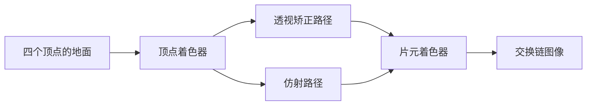
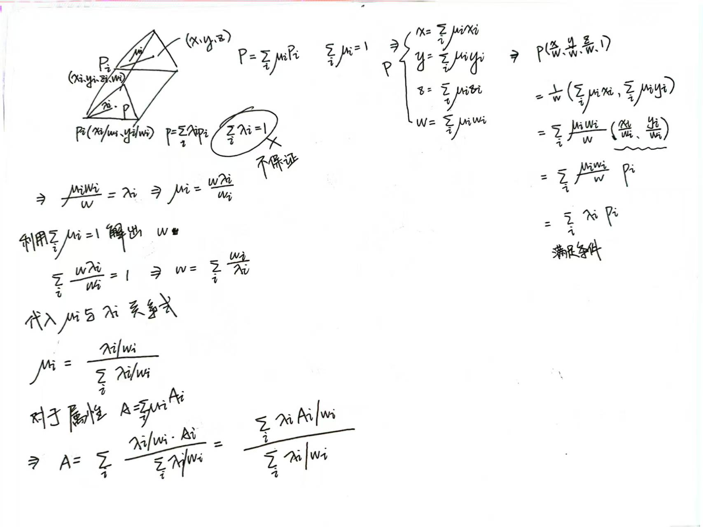

# perspective_interpolation：透视矫正插值

构建方式见仓库根目录的 README。

## 简介

一块只有四个顶点的大地面，从相机脚边一直铺到远处的近地平线位置，纹理坐标横跨整块地面
（[`src/scene_setup.cpp:6-12`](src/scene_setup.cpp#L6-L12)）。相机贴近地面、向下压一个不大的俯角，
于是同一个图元的近端与远端在屏幕上的深度相差悬殊（[`src/main.cpp:196-202`](src/main.cpp#L196-L202)）。

纹理图案由纹理坐标在片元着色器里程序生成，不引入贴图资源（[`shaders/interp.frag:15-27`](shaders/interp.frag#L15-L27)），
密度由 `PATTERN_FREQUENCY` 给出（[`src/main.cpp:28`](src/main.cpp#L28)），与插值模式、图案编号一起打包进
uniform 的 `options` 分量（[`src/main.cpp:76-77`](src/main.cpp#L76-L77)）：

| 图案 | 说明 |
| --- | --- |
| 棋盘格 | 高频方格，便于看远处的压缩与弯折 |
| UV 网格 | 格线压暗，便于看格线随距离的间隔变化 |

插值方式有三种取值，界面上可以切换：

| 模式 | 说明 |
| --- | --- |
| 透视矫正 | 硬件默认路径，插值属性除以深度与深度倒数后在片元里相除（[`shaders/interp.vert:6`](shaders/interp.vert#L6)） |
| 仿射 | 纹理坐标按屏幕坐标线性插值，不做透视除法还原（[`shaders/interp.vert:9`](shaders/interp.vert#L9)） |
| 差值图 | 两种插值给出的纹理坐标之差的模长，放大成灰度热力图（[`shaders/interp.frag:38-43`](shaders/interp.frag#L38-L43)） |

## 渲染流程



顶点着色器只做两件事：把视图投影矩阵乘上顶点位置交给裁剪空间（[`shaders/interp.vert:21`](shaders/interp.vert#L21)），
并把同一个纹理坐标写进两个输出（[`shaders/interp.vert:19-20`](shaders/interp.vert#L19-L20)）。两个输出的差别只有
插值限定符（[`shaders/interp.vert:6-9`](shaders/interp.vert#L6-L9)），光栅化阶段据此分两条路径插值。片元着色器按
`options` 的 x 分量选一路输出（[`shaders/interp.frag:31-33`](shaders/interp.frag#L31-L33)、
[`shaders/interp.frag:46`](shaders/interp.frag#L46)）。整帧只有一次索引绘制，四个顶点六个索引
（[`src/renderer.cpp:436-442`](src/renderer.cpp#L436-L442)），固定功能状态在创建管线时确定
（[`src/renderer.cpp:156-252`](src/renderer.cpp#L156-L252)）。

## 实现要点

### 两条插值路径

顶点着色器把同一个纹理坐标写进两个输出（[`shaders/interp.vert:19-20`](shaders/interp.vert#L19-L20)）：
一个是普通的平滑输出（[`shaders/interp.vert:6`](shaders/interp.vert#L6)），光栅化时按透视矫正插值；
另一个带 `noperspective` 限定符（[`shaders/interp.vert:9`](shaders/interp.vert#L9)、
[`shaders/interp.frag:4`](shaders/interp.frag#L4)），光栅化时在屏幕空间线性插值。

记片元在三角形屏幕投影上的重心权重为 $\lambda_i$，三个顶点的属性为 $A_i$、
裁剪坐标的第四分量为 $w_i$，两条路径给出的属性分别是

$$
A_{\text{仿射}} = \sum_i \lambda_i A_i
\qquad\qquad
A_{\text{透视}} = \frac{\sum_i \lambda_i A_i / w_i}{\sum_i \lambda_i / w_i}
$$

左边是屏幕重心权重直接加权顶点属性，`noperspective` 限定符让光栅化阶段做这件事；右边是硬件默认路径，
光栅化阶段插值的量是 $A_i / w_i$ 与 $1 / w_i$，片元里把两者相除
（[`shaders/interp.frag:35-36`](shaders/interp.frag#L35-L36)）。
两个式子的由来见下面的「透视矫正插值的推导」。

两条路径共用一套管线、一个着色器与一次绘制（管线在 [`src/renderer.cpp:156-252`](src/renderer.cpp#L156-L252)
创建，绘制在 [`src/renderer.cpp:436-442`](src/renderer.cpp#L436-L442)），切换只改 uniform 里的一位：模式、图案与
棋盘格密度打包在 `options` 里（[`src/renderer.h:24-28`](src/renderer.h#L24-L28)），桌面端每帧在
[`src/main.cpp:69-78`](src/main.cpp#L69-L78) 填充，安卓端在
[`src/android_main.cpp:100-109`](src/android_main.cpp#L100-L109) 填充，片元着色器按 `options.x` 选一路输出
（[`shaders/interp.frag:31-33`](shaders/interp.frag#L31-L33)、[`shaders/interp.frag:46`](shaders/interp.frag#L46)）。
模式取值来自界面（[`src/case_ui.cpp:101-105`](src/case_ui.cpp#L101-L105)）、命令行
（[`src/main.cpp:107-118`](src/main.cpp#L107-L118)）与 TCP 命令（[`src/main.cpp:244-254`](src/main.cpp#L244-L254)）
三处，写进同一份状态。

### 透视投影矩阵与透视除法

视图空间里相机在原点、朝 $-z$ 方向看，一点记作 $(x_v, y_v, z_v)$，它在视线方向上到相机的距离是

$$
d = -z_v
$$

投影矩阵由 `glm::perspective` 生成（[`../../common/src/scene.cpp:156-157`](../../common/src/scene.cpp#L156-L157)）。
仓库定义了 `GLM_FORCE_DEPTH_ZERO_TO_ONE`（[`../../CMakeLists.txt:111`](../../CMakeLists.txt#L111)），归一化深度的区间是
0 到 1；Vulkan 的裁剪空间 Y 轴朝下，矩阵的 $[1][1]$ 元素取反
（[`../../common/src/scene.cpp:158-159`](../../common/src/scene.cpp#L158-L159)）。垂直视场的半角切线记作
$t = \tan(\theta/2)$（[`src/main.cpp:199`](src/main.cpp#L199)），宽高比记作 $a$
（[`src/main.cpp:371-372`](src/main.cpp#L371-L372)），近平面与远平面记作 $n$ 与 $f$
（[`src/main.cpp:200-201`](src/main.cpp#L200-L201)）。

图形驱动接受的顶点位置是归一化设备坐标（Normalized Device Coordinates，NDC），
投影矩阵输出的是四个分量的齐次坐标。齐次坐标的第四个分量为 1 时前三个分量就是坐标本身，
所以把前三个分量除以第四个分量就落回归一化设备坐标。这一次相除叫透视除法。顶点着色器交给
`gl_Position` 的就是四个分量的裁剪坐标（[`shaders/interp.vert:21`](shaders/interp.vert#L21)），
相除以及随后的视口变换由光栅化阶段完成：

$$
x_{\text{ndc}} = \frac{x_{\text{clip}}}{w_{\text{clip}}}, \qquad
y_{\text{ndc}} = \frac{y_{\text{clip}}}{w_{\text{clip}}}, \qquad
z_{\text{ndc}} = \frac{z_{\text{clip}}}{w_{\text{clip}}}
$$

矩阵的四行由四个条件定出：视锥的左右两个侧面落在 $x_{\text{ndc}} = \pm 1$，
上下两个侧面落在 $y_{\text{ndc}} = \pm 1$，近平面与远平面落在 $z_{\text{ndc}} = 0$ 与 $z_{\text{ndc}} = 1$，
第四个分量留成视线方向上的距离：

$$
\begin{aligned}
x_{\text{clip}} &= \frac{x_v}{a\,t}, & y_{\text{clip}} &= -\frac{y_v}{t}, \\
z_{\text{clip}} &= A\,z_v + B, & w_{\text{clip}} &= -z_v = d
\end{aligned}
$$

前两行满足侧面条件：左右侧面是过相机的平面 $x_v = \pm a\,t\,d$，代进去得 $x_{\text{clip}} = \pm d$，
除以 $w_{\text{clip}} = d$ 恒等于 $\pm 1$，整个侧面都落在边界上，与点的远近无关；
上下侧面同理，Y 分量上的负号把屏幕纵轴翻成朝下。

第三行取成 $z_v$ 的一次函数，两个系数由深度的两个端点条件解出：

$$
\frac{-A\,n + B}{n} = 0, \qquad \frac{-A\,f + B}{f} = 1
\quad\Longrightarrow\quad
A = \frac{f}{n - f}, \qquad B = \frac{f\,n}{n - f}
$$

代回去，归一化深度是

$$
z_{\text{ndc}} = \frac{-A\,d + B}{d} = \frac{f}{n - f}\left(\frac{n}{d} - 1\right)
$$

它是 $1/d$ 的一次函数，反解出的这个形式后面要反复用到：

$$
\frac{1}{w_{\text{clip}}} = \frac{1}{d} = \frac{1}{n} + \frac{n - f}{f\,n}\,z_{\text{ndc}}
$$

透视除法带来两个结果。横向上 $x_{\text{ndc}} = \dfrac{x_v}{a\,t\,d}$，
同样大小的横向偏移在越远的地方占的屏幕宽度越小，这就是近大远小。
深度上归一化深度与倒数距离成一次关系，深度缓冲的档位因此按倒数距离分布，近处的深度分辨率高于远处；
这块地面只做深度测试与深度写入，深度比较函数取 `VK_COMPARE_OP_LESS`
（[`src/renderer.cpp:210-214`](src/renderer.cpp#L210-L214)）。

### 透视矫正插值的推导

#### 记号

| 记号 | 含义 |
| --- | --- |
| $P_i$ | 三角形第 $i$ 个顶点在视图空间里的坐标，三维 |
| $P$ | 三角形平面上一点在视图空间里的坐标，三维 |
| $\mathrm{clip}_i$、$\mathrm{clip}$ | 上面两者对应的裁剪坐标，四维；顶点的第一、二、四个分量记作 $x_i$、$y_i$、$w_i$，平面上一点的记作 $x$、$y$、$w$ |
| $\mathbf{p}_i$、$\mathbf{p}$ | 透视除法之后的屏幕位置，二维，$\mathbf{p}_i = (x_i / w_i,\ y_i / w_i)$ |
| $A_i$、$A$ | 顶点上的属性与平面上一点的属性 |
| $\mu_i$ | 把 $P$ 写成三个 $P_i$ 的仿射组合时的系数，下称平面权重 |
| $\lambda_i$ | 把 $\mathbf{p}$ 写成三个 $\mathbf{p}_i$ 的仿射组合时的系数，即屏幕重心权重 |

两组权重各自满足 $\sum_i \mu_i = 1$ 与 $\sum_i \lambda_i = 1$。

表里的量各自落在源码的哪一处：$P$ 与 $P_i$ 是顶点缓冲里的顶点位置
（[`src/scene_setup.cpp:6-11`](src/scene_setup.cpp#L6-L11)）；$\mathrm{clip}$ 是视图投影矩阵乘上顶点位置的结果
（[`shaders/interp.vert:21`](shaders/interp.vert#L21)），矩阵由
[`../../common/src/scene.cpp:156-159`](../../common/src/scene.cpp#L156-L159) 生成，它的第四行给出
$w_{\text{clip}} = d$；$\mathbf{p}$ 与 $\mathbf{p}_i$ 是透视除法之后的屏幕位置，由光栅化阶段算出；
$\lambda_i$ 是光栅化阶段按 `noperspective` 限定符直接给出的屏幕重心权重
（[`shaders/interp.vert:9`](shaders/interp.vert#L9)）；$A$ 与 $A_i$ 是纹理坐标
（[`shaders/interp.vert:19-20`](shaders/interp.vert#L19-L20)），在片元着色器里被消费
（[`shaders/interp.frag:35-36`](shaders/interp.frag#L35-L36)）。

#### 一、要算的量

纹理坐标这类属性在三角形上按顶点铺开，也就是它是平面位置的仿射函数。平面上的点写成顶点的仿射组合

$$
P = \sum_i \mu_i P_i, \qquad \sum_i \mu_i = 1
$$

仿射函数与仿射组合可以交换次序，于是

$$
A = \sum_i \mu_i A_i
$$

这就是要算的精确值。片元着色器拿到的是屏幕重心权重 $\lambda_i$
（[`shaders/interp.frag:4`](shaders/interp.frag#L4)），所以问题化成把 $\mu_i$ 用 $\lambda_i$ 表示。

#### 二、两组权重的换算

投影矩阵 $M$（[`../../common/src/scene.cpp:156-159`](../../common/src/scene.cpp#L156-L159)）
作用在齐次坐标 $(P, 1)$ 上是线性映射。由 $\sum_i \mu_i = 1$ 得
$(P, 1) = \sum_i \mu_i (P_i, 1)$，线性映射可以移进求和号：

$$
\mathrm{clip} = M \sum_i \mu_i (P_i, 1) = \sum_i \mu_i \, M (P_i, 1) = \sum_i \mu_i \, \mathrm{clip}_i
$$

裁剪坐标因此是顶点裁剪坐标的同一组仿射组合，逐分量都成立，第四个分量给出

$$
w = \sum_i \mu_i w_i
$$

屏幕位置是前两个分量除以第四个分量。把分子里的 $\mu_i x_i$ 写成 $\mu_i w_i \cdot \dfrac{x_i}{w_i}$，$y$ 分量同理：

$$
\mathbf{p} = \frac{1}{w}\left(\sum_i \mu_i x_i,\ \sum_i \mu_i y_i\right)
  = \sum_i \frac{\mu_i w_i}{w} \left(\frac{x_i}{w_i},\ \frac{y_i}{w_i}\right)
  = \sum_i \frac{\mu_i w_i}{w}\,\mathbf{p}_i
$$

这组系数之和是 $\dfrac{1}{w}\sum_i \mu_i w_i = 1$，所以它正是 $\mathbf{p}$ 在三个 $\mathbf{p}_i$ 上的重心权重：

$$
\lambda_i = \frac{\mu_i w_i}{w}
$$

反解得 $\mu_i = \dfrac{w\,\lambda_i}{w_i}$，两边求和并用 $\sum_i \mu_i = 1$ 定出 $w$：

$$
1 = w \sum_j \frac{\lambda_j}{w_j}
\quad\Longrightarrow\quad
w = \frac{1}{\sum_j \lambda_j / w_j}
$$

代回去得到平面权重，也就是屏幕权重除以自己的 $w_i$ 再归一化：

$$
\mu_i = \frac{\lambda_i / w_i}{\sum_j \lambda_j / w_j}
$$

再代进第一步的 $A = \sum_i \mu_i A_i$：

$$
A = \frac{\sum_i \lambda_i A_i / w_i}{\sum_i \lambda_i / w_i}
$$

上面顺带给出了片元的 $w$：把顶点上的 $1 / w_i$ 按屏幕重心权重加权，再取倒数。

笔记



#### 三、硬件插值的是哪两个量

光栅化阶段能做的只有一件事：把顶点上的值按屏幕重心权重加权。
透视矫正式子的分子是拿顶点值 $A_i / w_i$ 这样加权，分母是拿顶点值 $1 / w_i$ 这样加权，
两者都在光栅化阶段的能力之内。顶点着色器里对两个输出只改了限定符，`noperspective` 那一路正是这件事
（[`shaders/interp.vert:7-9`](shaders/interp.vert#L7-L9)）：

$$
\widetilde{A} = \sum_i \lambda_i \frac{A_i}{w_i},
\qquad
\widetilde{u} = \sum_i \lambda_i \frac{1}{w_i}
$$

片元里把两者相除就得到 $A = \widetilde{A} / \widetilde{u}$。

#### 四、被插值的两个量在屏幕上是一次函数

屏幕重心权重的加权与「按屏幕坐标的一次函数变化」是同一件事：$\lambda_i$ 本身是屏幕坐标的一次函数，
加权和于是也是一次函数，硬件因此可以按逐像素的固定增量推进。
剩下要确认的是 $1/w$ 与 $A/w$ 作为屏幕坐标的函数确实是一次的。

三角形所在的平面在视图空间里写成 $\mathbf{k} \cdot P = c$。屏幕上一点对应的视线取方向
$\mathbf{u} = (u_x, u_y, -1)$，第三个分量固定为 $-1$，视线上的点写成 $P = \tau\,\mathbf{u}$。
这样取定之后 $\tau$ 就等于 $-z_v$，也就是 $d$，也就是 $w$
（投影矩阵的第四行给出 $w_{\text{clip}} = -z_v$）。把 $P = \tau\,\mathbf{u}$ 代进平面方程：

$$
\tau\,(k_x u_x + k_y u_y - k_z) = c
\quad\Longrightarrow\quad
\frac{1}{w} = \frac{1}{\tau} = \frac{k_x u_x + k_y u_y - k_z}{c}
$$

$(u_x, u_y)$ 与屏幕坐标只差常数缩放：由 $x_{\text{ndc}} = \dfrac{x_v}{a\,t\,d}$ 与 $x_v = \tau\,u_x = d\,u_x$
得 $u_x = a\,t\,x_{\text{ndc}}$，同理 $u_y = -t\,y_{\text{ndc}}$。所以 $1/w$ 是屏幕坐标的一次函数。

属性（这块地面上就是纹理坐标，[`src/scene_setup.cpp:7-10`](src/scene_setup.cpp#L7-L10)）是平面位置的仿射函数
$A = \mathbf{a} \cdot P + b$，代入 $P = w\,\mathbf{u}$ 之后除以 $w$：

$$
\frac{A}{w} = \mathbf{a} \cdot \mathbf{u} + \frac{b}{w}
$$

右边第一项是 $(u_x, u_y)$ 的一次式（$\mathbf{u}$ 的第三个分量是常数），
第二项是常数乘上一步已经证明的一次函数，所以 $A/w$ 也是屏幕坐标的一次函数。
两个量都能由屏幕线性插值精确算出，相除得到的属性因此是该平面位置上的精确值。
纹理坐标在这块地面上是位置的仿射函数，透视矫正路径给出的纹理坐标就是精确值。

归一化深度也落在这条结论里：上一节给出 $z_{\text{ndc}}$ 与 $1/d$ 成一次关系，
$1/d$ 是屏幕坐标的一次函数，$z_{\text{ndc}}$ 因此也是，深度由屏幕线性插值直接得到，片元里不必再做相除。

### 两条路径之差

仿射路径把屏幕重心权重直接当作平面权重用：

$$
A_{\text{仿射}} = \sum_i \lambda_i A_i
$$

上一节的换算说明两组权重只在各顶点的 $w_i$ 全部相等时才重合，偏差因此由图元两端的深度比决定。
把这个偏差写成闭合形式：取图元上一条直线的两端，属性为 $A_0$ 与 $A_1$、
裁剪坐标的第四个分量为 $w_0$ 与 $w_1$，线上的点用平面权重 $\mu$ 或屏幕权重 $\lambda$ 描述，
两个权重都以 $A_1$ 那一端为 1。上一节的换算在两点情形下是

$$
\lambda = \frac{\mu\,w_1}{(1 - \mu)\,w_0 + \mu\,w_1},
\qquad
\mu = \frac{\lambda\,w_0}{(1 - \lambda)\,w_1 + \lambda\,w_0}
$$

记深度比 $\rho = w_1 / w_0$，第二个式子上下约掉 $w_0$：

$$
\mu = \frac{\lambda}{\lambda + (1 - \lambda)\,\rho}
$$

两条路径分别是 $A_{\text{透视}} = (1 - \mu)A_0 + \mu A_1$ 与
$A_{\text{仿射}} = (1 - \lambda)A_0 + \lambda A_1$，相减之后只剩权重之差：

$$
A_{\text{透视}} - A_{\text{仿射}} = (\mu - \lambda)(A_1 - A_0)
= \frac{\lambda\,(1 - \lambda)\,(1 - \rho)}{\lambda + (1 - \lambda)\,\rho}\,(A_1 - A_0)
$$

这个式子给出三条性质：

- $\lambda = 0$ 与 $\lambda = 1$ 时差为零，两条路径在图元的端点上取值相同，偏差全部落在内部。
- $\rho = 1$ 时差恒为零，图元与屏幕平行、两端深度相同时两条路径重合。
- $\rho$ 偏离 1 越远，系数越大，图元的深度跨度越大偏差越大。

系数对 $\lambda$ 求导，零点是

$$
\lambda^{\ast} = \frac{\sqrt{\rho}}{\sqrt{\rho} + 1}
$$

$\rho$ 远大于 1 时 $\lambda^{\ast}$ 靠近 1，偏差的峰值压在图元的远端一侧，在这块地面上就是贴近地平线的那条高度。

同一个 $\rho$ 还说明纵深在屏幕上的分布有多不均匀：屏幕位置取正中的 $\lambda = 1/2$ 时平面权重是
$\mu = 1 / (1 + \rho)$，$\rho$ 大时它接近 0，图元绝大部分的纵深挤在屏幕靠远端的一条窄带里。
仿射路径按屏幕权重铺纹理坐标，等于把这条窄带摊到整幅画面。

场景的配置把 $\rho$ 拉得很大：四边形从相机脚边一直铺到远处（[`src/main.cpp:25-28`](src/main.cpp#L25-L28) 定义常量，
[`src/scene_setup.cpp:6-12`](src/scene_setup.cpp#L6-L12) 生成顶点），相机贴近地面、向下压一个不大的俯角
（[`src/main.cpp:196-202`](src/main.cpp#L196-L202)），近端与远端顶点的 $w$ 因此相差悬殊。

### 差值图

差值图输出两种插值得到的纹理坐标之差的模长，乘以 1.2 后作为灰度
（[`shaders/interp.frag:38-43`](shaders/interp.frag#L38-L43)）：

$$
\text{灰度} = \mathrm{clamp}\big(\lVert uv_{\text{透视}} - uv_{\text{仿射}} \rVert \cdot 1.2,\ 0,\ 1\big)
$$

差值用的是纹理坐标本身，与图案开关无关，棋盘与网格之外的第三条路径。

## 界面控件

| 控件 | 作用 |
| --- | --- |
| 移动速度 | 相机移动速度 |
| 插值方式 | 透视矫正、仿射、差值图 |
| 图案 | 棋盘格或 UV 网格 |
| 近平面距离 | 相机的近平面，取值 0.05 到 12 |
| GPU 锁频 | 与间接绘制 case 共用同一个面板 |

面板同时显示绘制命令条数与场景说明，另附操作指南；耗时面板按本 case 的阶段拆分逐项列出。

## 命令行参数

命令行参数与界面控制同一套状态，用于自动化测试：

| 参数 | 含义 | 默认值 |
| --- | --- | --- |
| `--interpolation 名字` | 启动时的插值方式，取 `perspective`、`affine` 或 `difference` | perspective |
| `--pattern 名字` | 启动时的图案，取 `checker` 或 `grid` | checker |
| `--near-plane F` | 相机的近平面距离，取值 0.05 到 12 | 0.1 |
| `--no-interface` | 不显示界面面板 | 显示 |
| `--auto-exit S` | 运行 S 秒后自动退出 | 关闭 |
| `--capture 文件名` | 退出前把画面写成 PNG 并打印像素统计 | 关闭 |
| `--report 文件名` | 退出前把本次运行的平均耗时以 CSV 形式追加到该文件 | 关闭 |
| `--control-port N` | 打开 TCP 控制服务并监听该端口 | 关闭 |
| `--core-clock N` | 启动时锁定的核心频率，单位 MHz，取最接近的可选档位 | 不锁频 |
| `--memory-clock N` | 启动时锁定的显存频率，单位 MHz，取最接近的可选档位 | 不锁频 |

键盘操作：`W` `A` `S` `D` 前后左右移动，`Q` `E` 下降与上升，方向键转动视角，左 Shift 加速，Esc 退出。

## 测试方法

两种插值的画面差异用抓帧对比：

```
build\meow_perspective_interpolation.exe --auto-exit 4 --no-interface --capture intermediate\pi_perspective.png --interpolation perspective
build\meow_perspective_interpolation.exe --auto-exit 4 --no-interface --capture intermediate\pi_affine.png --interpolation affine
build\meow_perspective_interpolation.exe --auto-exit 4 --no-interface --capture intermediate\pi_difference.png --interpolation difference
```

棋盘格下两张图的差别是每像素平均 90.4，44.3% 的像素不同；UV 网格下平均 30.5，24.3% 的像素不同。

差值图的亮度按横带统计，自上而下（远端在前）：

| 横带 | 平均亮度 |
| --- | --- |
| 0% 到 8% | 3.3（天空） |
| 8% 到 16% | 238.0 |
| 16% 到 25% | 255.0 |
| 33% 到 41% | 227.7 |
| 50% 到 58% | 165.1 |
| 66% 到 75% | 101.6 |
| 83% 到 91% | 37.8 |
| 91% 到 100% | 8.5 |

误差从地平线下方的最大值单调下降到屏幕下沿的近零值，与「两种插值在图形的端点上取值相同、在内部达到最大」一致。

光源之外的参数可以在同一次运行里改变：

```
adb -s <serial> forward tcp:21000 tcp:21000
```

桌面端用 `--control-port 21000` 启动后，连接并逐行发命令：`interpolation`/`pattern`/`near-plane` 改配置，
`begin` 与 `end` 圈定一段测量（`end` 返回一行与 CSV 同格式的数据），`quit` 退出。

随时间变化的参数曲线与测量报告格式与间接绘制 case 一致，报告里的前三列是插值方式、图案与绘制命令条数。

## 源码结构

本 case 自己的文件都在 `cases/perspective_interpolation` 下：

| 文件 | 内容 |
| --- | --- |
| `src/main.cpp` | 桌面入口：命令行解析、主循环与界面状态 |
| `src/android_main.cpp` | 安卓入口：NativeActivity 生命周期、ANativeWindow 表面与交换链、主循环 |
| `src/renderer.cpp` | 渲染通道、管线、地面绘制、时间戳查询 |
| `src/scene_setup.cpp` | 那块四顶点地面的顶点数据 |
| `src/case_ui.cpp` | 本 case 的控制面板与全部界面文本 |
| `src/timing_items.cpp` | 本 case 的计时项定义 |
| `shaders/interp.vert` | 顶点变换，同一个纹理坐标写进两个插值路径 |
| `shaders/interp.frag` | 图案生成、插值方式选择与差值图 |

## 安卓端差异

- 实例与设备申请 Vulkan 1.1，着色器以 `--target-env=vulkan1.1` 编译，
  覆盖只支持 1.1 的设备；`minSdk` 24 是 Vulkan 1.0 的最低 API 等级。
- 设备时间只在设备支持时间戳时测量：驱动的 `timestampComputeAndGraphics` 能力与图形队列族的
  `timestampValidBits` 都满足才创建查询池并记录时间戳，不支持的设备上"设备时间"恒为零，主机侧各项计时照常。
- GPU 锁频面板不显示：它依赖桌面的 `nvidia-smi`。
- 相机固定在初始化位置，没有键盘输入；触摸事件交给 ImGui 的安卓后端，面板上的滑块和按钮可以直接操作。
- 帧率上限 60 FPS，避免无界空转发热。

### 安卓测试方法

adb 的目标设备由设备序列号指定，序列号用 `adb devices` 查询。只连接一台设备时命令里的
`-s <serial>` 可以省略。构建出 APK 后按下面方式安装并查看日志：

```
adb -s <serial> install -r android\app\build\outputs\apk\debug\app-debug.apk
adb -s <serial> logcat -s MeowVulkanDemo
```

应用内置回环 TCP 控制服务（桌面与安卓一致，端口 21000），
安卓端经 `adb forward tcp:21000 tcp:21000` 把设备上的控制端口映射到本机，命令与桌面端相同。
