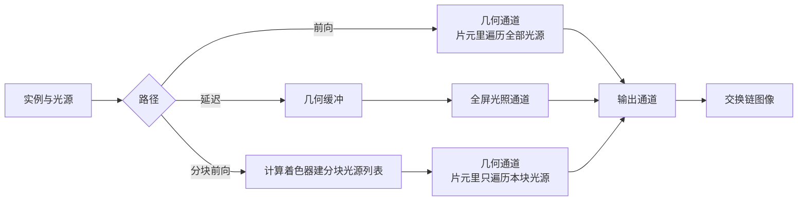

# render_paths：前向、延迟与分块前向

构建方式见仓库根目录的 README。

## 简介

同一份几何（[`src/renderer.cpp:38-58`](src/renderer.cpp#L38-L58)）与同一组点光源（
[`src/renderer.cpp:60-77`](src/renderer.cpp#L60-L77)），用三条路径提交与着色：

| 路径 | 做法 | 光照的遍历范围 |
| --- | --- | --- |
| 前向 | 几何通道里直接着色（[`shaders/forward.frag:50-57`](shaders/forward.frag#L50-L57)） | 每个片元过所有光源 |
| 延迟 | 几何缓冲加屏幕空间的全屏光照通道（[`shaders/deferred_lighting.frag:30-42`](shaders/deferred_lighting.frag#L30-L42)） | 每个屏幕像素过所有光源 |
| 分块前向 | 先用计算着色器按屏幕分块建光源列表（[`shaders/tile.comp:26-69`](shaders/tile.comp#L26-L69)），再前向着色（[`shaders/forward.frag:58-80`](shaders/forward.frag#L58-L80)） | 每个片元只过本块的光源 |

## 渲染流程



几何由同一个顶点着色器按实例展开，每块板绕竖直轴偏转后写出法线与世界坐标（[`shaders/scene.vert:20-42`](shaders/scene.vert#L20-L42)
）。前向路径把整批实例画进一张颜色附件加深度（[`src/renderer.cpp:832-854`](src/renderer.cpp#L832-L854)
）；延迟路径先写反照率、法线与世界坐标三张附件（[`src/renderer.cpp:809-831`](src/renderer.cpp#L809-L831)
、[`shaders/gbuffer.frag:13-18`](shaders/gbuffer.frag#L13-L18)），再用全屏三角形对屏幕上每个像素遍历光源（
[`src/renderer.cpp:857-877`](src/renderer.cpp#L857-L877)）；分块前向在建列表之前先清空两块缓冲并插入屏障，再按八乘八的线程组派发（
[`src/renderer.cpp:764-806`](src/renderer.cpp#L764-L806)）。输出通道从两张来源里选一张读出来（
[`src/renderer.cpp:891-899`](src/renderer.cpp#L891-L899)）。

## 实现要点

### 三条路径的画面

光源数量 64、分块尺寸 32、每块上限 32（[`src/main.cpp:92-94`](src/main.cpp#L92-L94)）：

| 对比 | 平均绝对差 | 最大差值 |
| --- | --- | --- |
| 延迟 与 前向 | 0.007 | 1 |
| 分块前向 与 前向 | 2.381 | 50 |

延迟与前向的差异只有 1，两条路径的光照公式完全相同（[`shaders/forward.frag:30-41`](shaders/forward.frag#L30-L41)
、[`shaders/deferred_lighting.frag:31-42`](shaders/deferred_lighting.frag#L31-L42)
），差别只在于在哪一级遍历光源。分块前向与前向相差 2.381：分块列表按屏幕包围盒粗筛（[`shaders/tile.comp:40-57`](shaders/tile.comp#L40-L57)
），超出每块上限的光源被丢掉（[`shaders/tile.comp:58-65`](shaders/tile.comp#L58-L65)），并且屏幕空间的半径估计比真实投影范围略小（
[`shaders/tile.comp:52-53`](shaders/tile.comp#L52-L53)），因此在光源密集处会少算一部分贡献。这是分块前向的固有近似。

### 设备时间随光源数量的斜率

锁频 2880/15001 之后按段测量：

| 路径 | 光源数 | 设备时间 |
| --- | --- | --- |
| 前向 | 64 | 0.065 ± 0.015 ms |
| 前向 | 256 | 0.221 ± 0.028 ms |
| 前向 | 1024 | 0.851 ± 0.056 ms |
| 延迟 | 64 | 0.128 ± 0.024 ms |
| 延迟 | 256 | 0.438 ± 0.053 ms |
| 延迟 | 1024 | 2.050 ± 0.190 ms |
| 分块前向 | 64 | 0.063 ± 0.014 ms |
| 分块前向 | 256 | 0.196 ± 0.025 ms |
| 分块前向 | 1024 | 0.716 ± 0.048 ms |

前向从 64 到 1024 个光源是 0.065 到 0.851 毫秒，斜率约每个光源 0.82 微秒；分块前向是 0.063 到 0.716
毫秒，斜率约 0.68 微秒，比前向低约百分之十七，因为每个片元只过本块列表里的光源
（[`shaders/forward.frag:58-80`](shaders/forward.frag#L58-L80)）。延迟的斜率最大，约
每个光源 2.0 微秒，反而比前向慢：它的光照通道对屏幕上的每一个像素都跑一遍光源循环
（[`shaders/deferred_lighting.frag:30-42`](shaders/deferred_lighting.frag#L30-L42)），而前向只对几何
覆盖到的片元跑（[`shaders/forward.frag:49-57`](shaders/forward.frag#L49-L57)）。这个场景里几何只占屏幕的一小部分，延迟因此在绝对时间上吃亏；几何铺满屏幕时结论会
反过来，这也正是延迟渲染的适用边界。延迟的代价与物体数量无关，光源越多、覆盖越满，它的优势才成立。

每块的光源上限与分块尺寸都可以调（[`src/renderer.cpp:745-753`](src/renderer.cpp#L745-L753)）：加大分块会让每块的光源数上升，分块列表的收益随之下降；上限调小
则会丢掉更多光源，画面与正确值的偏差变大。

## 界面控件

| 控件 | 作用 |
| --- | --- |
| 提交与着色 | 三条路径 |
| 光源数量 | 1 到 1024 |
| 分块尺寸 | 8 到 128 |
| 每块的光源上限 | 1 到 64 |
| GPU 锁频 | 与间接绘制 case 共用同一个面板 |

面板同时显示绘制命令条数与分块数量，另附操作指南；耗时面板按本 case 的阶段拆分逐项列出。

## 命令行参数

| 参数 | 含义 | 默认值 |
| --- | --- | --- |
| `--path 名字` | 路径，取 `forward`、`deferred` 或 `tiled` | forward |
| `--lights N` | 光源数量，1 到 1024 | 64 |
| `--tile-size N` | 分块尺寸，8 到 128 | 32 |
| `--max-per-tile N` | 每块的光源上限，1 到 64 | 32 |
| `--time F` / `--freeze` | 光源动画的时刻与冻结 | 0，关闭 |
| `--no-interface` / `--auto-exit S` / `--capture F` / `--report F` / `--control-port N` | 与其他 case 一致 | |

键盘操作：`Esc` 退出。

## 测试方法

```
build\meow_render_paths.exe --path forward --lights 256 --time 0 --freeze --auto-exit 3 --no-interface --capture intermediate\rp_forward.png
build\meow_render_paths.exe --path deferred --lights 256 --time 0 --freeze --auto-exit 3 --no-interface --capture intermediate\rp_deferred.png
build\meow_render_paths.exe --path tiled --lights 256 --time 0 --freeze --auto-exit 3 --no-interface --capture intermediate\rp_tiled.png
```

测量设备时间：启动一个进程锁频并打开控制服务，按段发送命令，程序把每段的结果追加到 CSV：

```
build\meow_render_paths.exe --no-interface --control-port 21000 --core-clock 2880 --memory-clock 15001 --time 0 --freeze --report intermediate\rp_measure.csv
```

连上 21000 端口后，`path`/`lights`/`tile-size`/`max-per-tile`/`time` 改配置，`begin` 与 `end` 圈定一段
测量，`quit` 退出。

## 源码结构

| 文件 | 内容 |
| --- | --- |
| `src/main.cpp` | 桌面入口：命令行解析、主循环与界面状态 |
| `src/android_main.cpp` | 安卓入口：NativeActivity 生命周期、表面与交换链、主循环 |
| `src/renderer.cpp` | 四个渲染通道、分块光源列表的清除与派发、光源缓冲的每帧更新 |
| `src/case_ui.cpp` | 本 case 的控制面板与全部界面文本 |
| `src/timing_items.cpp` | 本 case 的计时项定义 |
| `shaders/scene.vert` | 板的实例展开，输出法线与世界坐标 |
| `shaders/forward.frag` | 前向与分块前向的着色，两种光源遍历 |
| `shaders/gbuffer.frag` `shaders/deferred_lighting.frag` | 几何缓冲与屏幕空间光照 |
| `shaders/tile.comp` | 按屏幕分块建光源列表 |
| `shaders/fullscreen.vert` `shaders/present.frag` | 全屏三角形与最终输出 |

## 安卓端差异

- 实例与设备申请 Vulkan 1.1；`minSdk` 24 是 Vulkan 1.0 的最低 API 等级。
- 延迟路径的带宽开销在分块架构上更突出，需要在真机上用厂商工具读几何缓冲的写入与读取字节数。
- 设备时间只在设备支持时间戳时测量。
- GPU 锁频面板不显示：它依赖桌面的 `nvidia-smi`。
- 帧率上限 60 FPS，避免无界空转发热。

### 安卓测试方法

```
adb -s <serial> install -r android\app\build\outputs\apk\debug\app-debug.apk
adb -s <serial> logcat -s MeowVulkanDemo
```

应用内置回环 TCP 控制服务（端口 21000），安卓端经 `adb forward tcp:21000 tcp:21000` 映射到本机。
