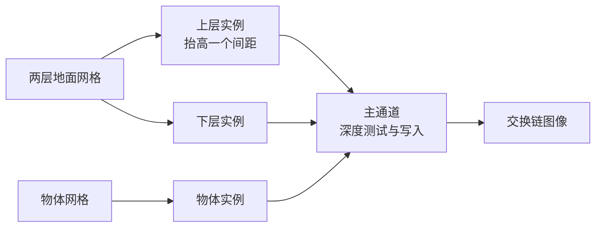

# reverse_z：共面地面的深度精度与 Reverse-Z

构建方式见仓库根目录的 README。

## 简介

一个朝远处看的地面场景。地面由形状完全相同的上下两层组成，上层整体抬高一个很小的间距，两层只有配色不同：下层偏冷，上层偏暖。相机贴在地面上方朝远处看，画面下方两层的高度差还在深度精度之内，上层稳定地盖住下层；越靠近地平线，透视投影把可用的深度值挤得越窄，两层在归一化深度上落进同一个浮点值，深度比较判定上层不更近，下层的配色成片透出来。

界面上的"启用 Reverse-Z"把这个现象去掉。开关切换的是投影矩阵与深度判定方向，其余内容完全不变，因此画面差异只来自深度比较的结果。

## Reverse-Z 为什么有效

透视投影把视空间深度映射到 `[0, 1]` 的归一化深度。标准映射是

```
d = far * (z - near) / (z * (far - near))
```

近平面映射到 0，远平面映射到 1。`z` 增大时 `d` 迅速贴近 1，远处的全部深度值都堆在 1 附近。浮点数的精度是相对精度，绝对值越大的区间相邻可表示值之间的间隔越大，`d` 接近 1 时相邻可表示值的间隔约为 `6e-8`。因此远处两个表面只要在归一化深度上的差小于这个间隔，就会落到同一个浮点值上，深度比较无法区分它们。

Reverse-Z 把映射反过来，近平面映射到 1，远平面映射到 0：

```
d = near * (far - z) / (z * (far - near))
```

`z` 增大时 `d` 趋近 0，远处的深度值落在浮点数的极小量级上，相邻可表示值的绝对间隔随之缩小，相对精度在整个深度范围上保持一致。同一对表面在标准映射下相差 0.02 个最低位，在 Reverse-Z 下可能相差几千个最低位。

这个做法要求深度附件是浮点格式，本 case 用 `D32_SFLOAT`。定点格式（`D24_UNORM` 等）的精度沿整个深度范围均匀分布，换不换映射方向都一样。

深度判定方向必须跟着换：标准映射下越近的值越小，用 `VK_COMPARE_OP_LESS`；Reverse-Z 下越近的值越大，用 `VK_COMPARE_OP_GREATER`。深度清除值同理，标准映射清成 1，Reverse-Z 清成 0。

## 场景搭建

两层地面共用同一张网格，网格是沿视线方向分段的水平条带，半宽随距离线性放大，保证任何距离上地面都盖满整个可见范围。上层只是把同一张网格沿 Y 轴抬高一个间距，顶点位置与投影完全一致，因此两层在画面上处处重合，唯一区别就是高度。

地面上按固定比例摆放若干模型实例，用来提供距离参照：物体从不与地面重合，因此它们在任何深度模式下都正常显示。

相机高度 66，俯角 20 度，近裁剪面 0.1，远裁剪面 20000，两层间距 0.01。这套参数下，画面下方约一半的范围内两层分得清，越往上错乱越重，地平线附近完全被下层占据。

## 渲染流程



地面与物体是两条管线，共用同一个渲染通道、同一套顶点属性描述与同一份相机常量。深度判定方向由界面开关决定，切换时重建两条管线。

## 实现要点

### 反向映射的构造

`glm::perspective` 的两个平面距离参数互换就得到反向映射：`perspective(fovy, aspect, far, near)` 把近平面映射到 1、远平面映射到 0。本 case 复用公共库的 `fillCameraMatrices`，开启 Reverse-Z 时复制一份相机并交换 `nearPlane` 与 `farPlane` 再传进去，视图矩阵、世界位置与裁剪空间的 Y 轴翻转都不受影响。

### 管线重建的边界

深度判定方向是管线状态，改动后必须重建管线；投影矩阵是 uniform，逐帧写入，不需要重建任何资源。重建前先等设备空闲，避免拆掉还在被上一帧使用的管线。深度清除值逐帧写入 `VkClearValue`，跟随当前模式。

### 棋盘格的格子尺寸

地面配色用棋盘格，格子尺寸按到原点的水平距离放大，远处格子保持在相近的屏幕尺寸。若格子尺寸固定，远处格子会缩到远小于一个像素，画面出现棋盘格自身的走样，与深度比较的结果混在一起，不便判读。

### 深度值精确到哪一位

两层之间的归一化深度差正比于 `sin(视线与水平面的夹角)`，越靠近地平线这个夹角越小，深度差也越小。标准映射下归一化深度接近 1，最低位约为 `6e-8`，深度差掉到这个值以下时两层打平，判定结果由哪一层先绘制决定。代码里下层先绘制，于是打平的像素全部显示下层，形成一层层横向的错乱带。近裁剪面调小会放大远处的最低位，错乱加重；调大则相反。

## 界面控件

| 控件 | 作用 |
| --- | --- |
| 物体数量 | 地面上的模型实例数量，两层地面始终绘制 |
| 移动速度 | 相机移动速度 |
| 启用 Reverse-Z | 切换投影映射与深度判定方向，改动后重建管线 |
| 近裁剪面 | 近平面距离，取值 0.01 到 1 |
| 远裁剪面 | 远平面距离，取值 500 到 200000 |
| 地面高度间距 | 上下两层地面的高度差，取值 0.001 到 0.2 |
| GPU 锁频 | 与间接绘制 case 共用同一个面板 |

面板同时显示绘制命令条数与当前深度模式，另附操作指南；耗时面板按本 case 的通道拆分逐项列出。

## 命令行参数

命令行参数与界面控制同一套状态，用于自动化测试：

| 参数 | 含义 | 默认值 |
| --- | --- | --- |
| `--objects N` | 启动时的物体数量 | 12 |
| `--reverse-z` | 启动时开启 Reverse-Z | 关闭 |
| `--no-reverse-z` | 启动时关闭 Reverse-Z | 关闭 |
| `--near F` | 近裁剪面距离 | 0.1 |
| `--far F` | 远裁剪面距离 | 20000 |
| `--ground-offset F` | 上下两层地面的高度间距 | 0.01 |
| `--no-interface` | 不显示界面面板 | 显示 |
| `--auto-exit S` | 运行 S 秒后自动退出 | 关闭 |
| `--capture 文件名` | 退出前把画面写成 PNG 并打印像素统计 | 关闭 |
| `--report 文件名` | 退出前把本次运行的平均耗时以 CSV 形式追加到该文件 | 关闭 |
| `--control-port N` | 打开 TCP 控制服务并监听该端口 | 关闭 |
| `--core-clock N` | 启动时锁定的核心频率，单位 MHz，取最接近的可选档位 | 不锁频 |
| `--memory-clock N` | 启动时锁定的显存频率，单位 MHz，取最接近的可选档位 | 不锁频 |

键盘操作：`W` `A` `S` `D` 前后左右移动，`Q` `E` 下降与上升，方向键转动视角，左 Shift 加速，Esc 退出。

## 测试方法

同一套配置分别关掉与开启 Reverse-Z 抓帧：

```
build\meow_reverse_z.exe --auto-exit 3 --no-interface --capture intermediate\reverse_z_standard.png
build\meow_reverse_z.exe --auto-exit 3 --no-interface --reverse-z --capture intermediate\reverse_z_reversed.png
```

判定方法：下层偏冷（蓝高于红）、上层偏暖（红明显高于蓝），两层形状完全一致，所以画面里出现下层的颜色就说明深度比较选错了表面。两次抓帧只有深度模式不同，逐像素比较两次的分类结果，分类不同的像素就是选错表面的地面像素。1600x900 分辨率下的实测结果：

| 模式 | 选错表面的地面像素 | 占地面的比例 |
| --- | --- | --- |
| 标准深度 | 193809 | 21.62% |
| Reverse-Z | 0 | 0.00% |

Reverse-Z 那张里唯一被判为下层的像素来自物体自身偏冷的贴图颜色，两张图在这些像素上完全一致。两张图的差异集中在 y = 169 到 696 之间，也就是地面从远到近的一大片区域。

近裁剪面对错乱范围的影响同样可以抓帧对比：

```
build\meow_reverse_z.exe --auto-exit 3 --no-interface --near 0.02 --capture intermediate\reverse_z_near002.png
build\meow_reverse_z.exe --auto-exit 3 --no-interface --near 0.5 --capture intermediate\reverse_z_near05.png
```

每一档再配一张开 Reverse-Z 的抓帧，按同样的方法统计，近裁剪面 0.02、0.1、0.5 三档下选错表面的地面像素比例分别是 51.31%、21.62%、3.56%，与"近裁剪面越小、远处精度越差"一致；三档下开启 Reverse-Z 之后都归零。

运行中切换模式与参数用 TCP 控制服务：

```
build\meow_reverse_z.exe --control-port 21000
```

连接后逐行发命令：`reverse-z 1`/`reverse-z 0` 切换深度模式，`near`/`far`/`ground-offset`/`objects` 改配置，`begin` 与 `end` 圈定一段测量（`end` 返回一行与 CSV 同格式的数据），`quit` 退出。

## 源码结构

本 case 自己的文件都在 `cases/reverse_z` 下：

| 文件 | 内容 |
| --- | --- |
| `src/main.cpp` | 桌面入口：命令行解析、主循环、相机矩阵与界面状态 |
| `src/android_main.cpp` | 安卓入口：NativeActivity 生命周期、ANativeWindow 表面与交换链、主循环 |
| `src/renderer.cpp` | 渲染通道、两条管线、深度模式切换时的管线重建、时间戳查询 |
| `src/scene_setup.cpp` | 地面条带网格、两层地面的实例变换、物体实例摆放 |
| `src/case_ui.cpp` | 本 case 的控制面板与全部界面文本 |
| `src/timing_items.cpp` | 本 case 的计时项定义 |
| `shaders/ground.vert` `shaders/ground.frag` | 两层地面：共用网格与顶点着色器，按分层编号选配色 |
| `shaders/object.vert` `shaders/object.frag` | 地面上的物体，使用仓库共用的背包贴图 |

## 安卓端差异

- 实例与设备申请 Vulkan 1.1，着色器以 `--target-env=vulkan1.1` 编译，覆盖只支持 1.1 的设备；`minSdk` 24 是 Vulkan 1.0 的最低 API 等级。
- 设备时间只在设备支持时间戳时测量：驱动的 `timestampComputeAndGraphics` 能力与图形队列族的 `timestampValidBits` 都满足才创建查询池并记录时间戳，不支持的设备上"设备时间"恒为零，主机侧各项计时照常。
- GPU 锁频面板不显示：它依赖桌面的 `nvidia-smi`。
- 相机固定在初始化位置，没有键盘输入；触摸事件交给 ImGui 的安卓后端，面板上的滑块和按钮可以直接操作。
- 帧率上限 60 FPS，避免无界空转发热。

### 安卓测试方法

adb 的目标设备由设备序列号指定，序列号用 `adb devices` 查询。只连接一台设备时命令里的 `-s <serial>` 可以省略。构建出 APK 后按下面方式安装并查看日志：

```
adb -s <serial> install -r android\app\build\outputs\apk\debug\app-debug.apk
adb -s <serial> logcat -s MeowVulkanDemo
```

应用内置回环 TCP 控制服务（桌面与安卓一致，端口 21000），安卓端经 `adb forward tcp:21000 tcp:21000` 把设备上的控制端口映射到本机，命令与桌面端相同。
