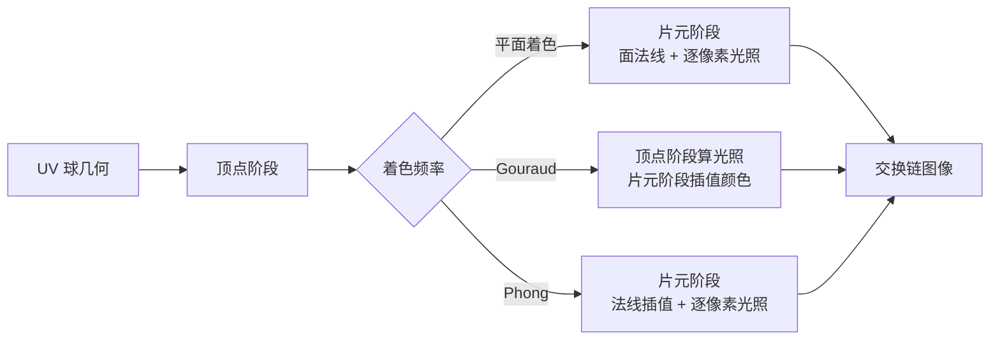

# shading_models：着色频率与镜面模型

构建方式见仓库根目录的 README。

## 简介

场景是一个解析生成的 UV 球，顶点位置与顶点法线都由球面参数直接算出
（[`src/scene_setup.cpp:16-27`](src/scene_setup.cpp#L16-L27)），几何本身永远是光滑的，只有轮廓随细分段数变化。
三种着色频率决定光照算在哪一级（[`src/renderer.h:13-17`](src/renderer.h#L13-L17)）：平面着色每个三角形算一次，
Gouraud 每个顶点算一次，Phong 每个像素算一次。

| 控件 | 取值 |
| --- | --- |
| 着色频率 | 平面着色、Gouraud、Phong |
| 镜面模型 | Blinn-Phong、Phong |
| 法线来源 | 几何法线、程序化凹凸（只在 Phong 下可选） |
| 细分段数 | 6 到 128 |
| 高光指数 | 4 到 512 |
| 平行光强度、环境项强度 | 场景的两项强度 |

细分段数同时改变几何密度与顶点密度：经线方向的段数直接等于一圈的顶点数，纬度方向的环数取段数的一半
（[`src/scene_setup.cpp:12-13`](src/scene_setup.cpp#L12-L13)），是观察三种着色频率差别的主要旋钮，段数越低，
一个三角形覆盖的像素越多，顶点越稀疏。

## 渲染流程



整帧在一个渲染通道里画完，颜色附件来自交换链，另外挂一份深度附件
（[`src/renderer.cpp:40-96`](src/renderer.cpp#L40-L96)）。三条管线在同一个循环里创建，差别只在着色器模块
与顶点输入（[`src/renderer.cpp:295-329`](src/renderer.cpp#L295-L329)）：平面着色与 Phong 共用把世界位置、
世界法线与纹理坐标透传的顶点着色器（[`shaders/shade.vert:14-20`](shaders/shade.vert#L14-L20)），
Gouraud 的顶点着色器自己输出颜色，顶点输入里去掉纹理坐标那一项
（[`src/renderer.cpp:242-246`](src/renderer.cpp#L242-L246)）。绘制时按当前频率挑一条管线
（[`src/renderer.cpp:515-520`](src/renderer.cpp#L515-L520)）。

细分段数变化时整块重建球的顶点与索引缓冲（[`src/renderer.cpp:439-444`](src/renderer.cpp#L439-L444)）。
重建先等设备空闲，再按新段数重新生成网格（[`src/renderer.cpp:182-197`](src/renderer.cpp#L182-L197)）。

## 实现要点

### 三种着色频率

**平面着色**每个三角形只用一个法线。法线在片元着色器里由世界位置的屏幕空间导数叉乘得到
（[`shaders/flat.frag:16-17`](shaders/flat.frag#L16-L17)）：

$$
\hat N_f = \operatorname{normalize}\left(\frac{\partial P}{\partial x} \times \frac{\partial P}{\partial y}\right)
$$

同一个三角形里的三个像素导数相同，因此法线相同。叉乘的方向由三角形的绕序与视口约定共同决定，用一个插值
法线点积一次就能把它翻到朝外的一侧（[`shaders/flat.frag:18-21`](shaders/flat.frag#L18-L21)），不需要额外的
顶点数据。默认 24 段时平面着色与 Phong 的画面平均绝对差 2.124，超过 8 个灰阶的像素占 9.684%，最大差 76；
球面中央 240 乘 240 的一块里只有 89 个不同的灰度级别，Phong 是 188。

**Gouraud** 把整个光照公式搬到顶点着色器（[`shaders/gouraud.vert:16-18`](shaders/gouraud.vert#L16-L18)），
三个顶点的颜色再线性插值到三角形内部（[`shaders/gouraud.frag:7-10`](shaders/gouraud.frag#L7-L10)）。
它的代价是插值在颜色空间进行，而光照在法线空间是非线性的：高光项的指数运算在插值之后无法恢复。

**Phong** 插值法线，每个像素重新算一次光照（[`shaders/phong.frag:14-18`](shaders/phong.frag#L14-L18)）。
它比 Gouraud 多出的代价是每个像素一次光照，换来的是高光的存在。

### Gouraud 丢高光

高光指数取 64 时，高光的角宽度只有几度，只要它比一个三角形小，三个顶点上就都没有高光，插值出来的整片
三角形自然也没有。Gouraud 的高光只在三个顶点上求值（[`shaders/gouraud.vert:17`](shaders/gouraud.vert#L17)），
默认参数下（高光指数 64，光源方向固定），统计亮度不低于 245 的像素占比：

| 细分段数 | 三角形数 | Gouraud 最亮 | Gouraud 高光面积 | Phong 最亮 | Phong 高光面积 |
| --- | --- | --- | --- | --- | --- |
| 6 | 24 | 174.6 | 0.0000% | 255.0 | 0.5381% |
| 12 | 120 | 174.6 | 0.0000% | 255.0 | 0.6547% |
| 24 | 528 | 255.0 | 0.7853% | 255.0 | 0.7288% |
| 48 | 2208 | 255.0 | 0.7025% | 255.0 | 0.7447% |
| 96 | 9024 | 255.0 | 0.7463% | 255.0 | 0.7478% |

六段与十二段时 Gouraud 的最亮值停在 174.6，高光完全不存在；Phong 在同一几何上有 0.5% 到 0.65% 的高光。
到 24 段，三角形的角尺寸降到与高光相当（三角形的角尺寸由经线与纬线的段数决定，
[`src/scene_setup.cpp:29-49`](src/scene_setup.cpp#L29-L49)），Gouraud 才把高光捡回来，两条曲线从此几乎重合。

整幅画面的差别随段数单调收敛：

| 细分段数 | 平均绝对差 | 超过 8 的像素占比 | 最大差值 |
| --- | --- | --- | --- |
| 6 | 3.759 | 13.255% | 138 |
| 12 | 2.226 | 4.776% | 114 |
| 24 | 0.647 | 1.963% | 67 |
| 48 | 0.235 | 0.743% | 31 |
| 96 | 0.061 | 0.006% | 11 |

收敛的速率由三角形的角尺寸决定，而角尺寸与段数成反比：段数翻一倍，差值大致降到四分之一。
到 96 段时两条路径的画面差别只剩 0.061 个灰阶，几何已经足够密，插值的非线性误差可以忽略。

### 法线插值必须先归一化

插值后的法线长度小于 1，两个法线夹角越大缩短越多。长度不足时点积也跟着变小，而高光项是指数运算，
这一项损失会被放大：$\hat N \cdot \hat H = 0.9$ 时 $0.9^{64} = 0.0012$，高光几乎归零。
因此着色之前必须重新归一化插值法线
（[`shaders/shading_common.glsl:56-57`](shaders/shading_common.glsl#L56-L57)），否则低段数下的 Phong
会退化成没有高光的 Gouraud。Gouraud 不存在这个问题，它在顶点上算光照
（[`shaders/gouraud.vert:16-17`](shaders/gouraud.vert#L16-L17)），顶点法线本来就是单位长度。

### 两种镜面模型

两个模型在同一条分支语句里求值（[`shaders/shading_common.glsl:62-69`](shaders/shading_common.glsl#L62-L69)），
共用同一个高光指数。

**Phong** 用反射方向与视线方向的夹角（[`shaders/shading_common.glsl:67-68`](shaders/shading_common.glsl#L67-L68)）：

$$
\hat R = 2(\hat N \cdot \hat L)\hat N - \hat L,
\qquad
I_s = \left(\max(\hat R \cdot \hat V, 0)\right)^p
$$

**Blinn-Phong** 用半程向量与法线的夹角（[`shaders/shading_common.glsl:64-65`](shaders/shading_common.glsl#L64-L65)）：

$$
\hat H = \operatorname{normalize}(\hat V + \hat L),
\qquad
I_s = \left(\max(\hat N \cdot \hat H, 0)\right)^p
$$

半程向量与法线的夹角只有反射方向与视线夹角的一半：
设视线与反射方向的夹角为 $\alpha$，则法线与半程向量的夹角是 $\alpha / 2$。
同样的指数 $p$ 下，$(\cos(\alpha/2))^p$ 比 $(\cos\alpha)^p$ 大，所以 Blinn-Phong 的高光更宽更亮。

24 段、高光指数 64、统计亮度不低于 200 的像素占比：

| 镜面模型 | 着色频率 | 高光面积 | 与 Phong 模型的平均绝对差 |
| --- | --- | --- | --- |
| Blinn-Phong | Phong | 1.2272% | — |
| Phong | Phong | 0.3596% | 0.953 |
| Blinn-Phong | Gouraud | 1.4195% | — |
| Phong | Gouraud | 1.0744% | 0.590 |

同一着色频率下，Blinn-Phong 的高光面积是 Phong 模型的三倍以上。两个模型的画面平均绝对差 0.953，
超过 8 个灰阶的像素 2.174%，最大差 97：差的全部集中在那圈高光上，球的其余部分完全相同。

### 程序化凹凸

程序化凹凸把高度定义成两组正弦波的乘积，解析地求偏导数当作切线空间法线
（[`shaders/shading_common.glsl:21-30`](shaders/shading_common.glsl#L21-L30)）：

$$
h(u,v) = A \sin(su)\cos(sv),
\qquad
\hat N_t = \operatorname{normalize}\left(-A s \cos(su)\cos(sv),\ A s \sin(su)\sin(sv),\ 1\right)
$$

$A = 0.035$、$s = 28$ 时斜率最大到 0.98，凹凸相当明显。切线空间由屏幕空间导数构造
（[`shaders/shading_common.glsl:41-49`](shaders/shading_common.glsl#L41-L49)）：

$$
\hat T = \operatorname{normalize}\left(\frac{\partial P}{\partial x} \frac{\partial v}{\partial y} - \frac{\partial P}{\partial y} \frac{\partial v}{\partial x}\right),
\qquad
\hat B = -\hat N \times \hat T
$$

24 段、其余参数不变时，凹凸与几何法线的画面平均绝对差 10.281，
超过 8 个灰阶的像素 18.662%，最大差 188，中央方块里的灰度级别从 188 涨到 248。

凹凸只在逐像素着色下有意义：平面着色用的是整个三角形共用的面法线，Gouraud 用的是顶点法线，
两者都没有逐像素的法线可以扰动，界面在这两种频率下把这一项关掉
（[`src/case_ui.cpp:112-119`](src/case_ui.cpp#L112-L119)）。

### 设备时间

锁定核心频率 2880 兆赫、显存频率 15001 兆赫，每段测量四秒以上，整帧设备时间：

| 细分段数 | 平面着色 | Gouraud | Phong |
| --- | --- | --- | --- |
| 6 | 0.007 | 0.007 | 0.007 |
| 96 | 0.008 | 0.008 | 0.008 |
| 128 | — | 0.009 | — |

球只覆盖画面约 22%，三种着色频率的设备时间都在 0.01 毫秒以内，差别落在测量精度以下。
24 段以下 Gouraud 省下的是每个像素一次光照计算，而那点计算量远小于一次全屏写出的带宽：
着色频率在这里改变的是画面正确性，耗时上的差别可以忽略。

## 界面控件

| 控件 | 作用 |
| --- | --- |
| 着色频率 | 平面着色、Gouraud、Phong |
| 镜面模型 | Blinn-Phong 或 Phong |
| 法线来源 | 几何法线或程序化凹凸，只在 Phong 下可选 |
| 细分段数 | 6 到 128，改变时重建球的顶点与索引缓冲 |
| 高光指数 | 4 到 512，控制高光的角宽度 |
| 平行光强度 / 环境项强度 | 场景的两项强度 |
| 移动速度 | 相机移动速度 |
| GPU 锁频 | 与间接绘制 case 共用同一个面板 |

面板同时显示绘制命令条数与三角形个数，另附操作指南；耗时面板按本 case 的阶段拆分逐项列出。

## 命令行参数

| 参数 | 含义 | 默认值 |
| --- | --- | --- |
| `--frequency 名字` | 着色频率，取 `flat`、`gouraud` 或 `phong` | phong |
| `--specular 名字` | 镜面模型，取 `blinn_phong` 或 `phong` | blinn_phong |
| `--normal-source 名字` | 法线来源，取 `geometric` 或 `bump` | geometric |
| `--segments N` | 细分段数，6 到 128 | 24 |
| `--shininess F` | 高光指数 | 64 |
| `--light F` | 平行光强度 | 1.0 |
| `--ambient F` | 环境项强度 | 0.05 |
| `--no-interface` | 不显示界面面板 | 显示 |
| `--auto-exit S` | 运行 S 秒后自动退出 | 关闭 |
| `--capture 文件名` | 退出前把画面写成 PNG 并打印像素统计 | 关闭 |
| `--report 文件名` | 退出前把本次运行的平均耗时以 CSV 形式追加到该文件 | 关闭 |
| `--control-port N` | 打开 TCP 控制服务并监听该端口 | 关闭 |
| `--core-clock N` | 启动时锁定的核心频率，单位 MHz，取最接近的可选档位 | 不锁频 |
| `--memory-clock N` | 启动时锁定的显存频率，单位 MHz，取最接近的可选档位 | 不锁频 |

键盘操作：`W` `A` `S` `D` 前后左右移动，`Q` `E` 下降与上升，方向键转动视角，左 Shift 加速，Esc 退出。

## 测试方法

三种着色频率在同一段数下各抓一帧：

```
build\meow_shading_models.exe --frequency flat --segments 24 --auto-exit 3 --no-interface --capture intermediate\sm_flat_24.png
build\meow_shading_models.exe --frequency gouraud --segments 24 --auto-exit 3 --no-interface --capture intermediate\sm_gouraud_24.png
build\meow_shading_models.exe --frequency phong --segments 24 --auto-exit 3 --no-interface --capture intermediate\sm_phong_24.png
```

Gouraud 与 Phong 的差随段数收敛，逐档抓帧：

```
build\meow_shading_models.exe --frequency gouraud --segments 6 --auto-exit 3 --no-interface --capture intermediate\sm_gouraud_6.png
build\meow_shading_models.exe --frequency gouraud --segments 12 --auto-exit 3 --no-interface --capture intermediate\sm_gouraud_12.png
build\meow_shading_models.exe --frequency gouraud --segments 96 --auto-exit 3 --no-interface --capture intermediate\sm_gouraud_96.png
build\meow_shading_models.exe --frequency phong --segments 6 --auto-exit 3 --no-interface --capture intermediate\sm_phong_6.png
build\meow_shading_models.exe --frequency phong --segments 96 --auto-exit 3 --no-interface --capture intermediate\sm_phong_96.png
```

镜面模型与凹凸：

```
build\meow_shading_models.exe --specular phong --segments 24 --auto-exit 3 --no-interface --capture intermediate\sm_phong_model.png
build\meow_shading_models.exe --normal-source bump --segments 24 --auto-exit 3 --no-interface --capture intermediate\sm_bump.png
```

测量设备时间：启动一个进程锁频并打开控制服务，按段发送命令，程序把每段的结果追加到 CSV：

```
build\meow_shading_models.exe --no-interface --control-port 21000 --core-clock 2880 --memory-clock 15001 --report intermediate\sm_measure.csv
```

连上 21000 端口后，`frequency`/`specular`/`normal-source`/`segments`/`shininess`/`light`/`ambient` 改配置，
`begin` 与 `end` 圈定一段测量，`quit` 退出。

## 源码结构

| 文件 | 内容 |
| --- | --- |
| `src/main.cpp` | 桌面入口：命令行解析、主循环与界面状态 |
| `src/android_main.cpp` | 安卓入口：NativeActivity 生命周期、表面与交换链、主循环 |
| `src/renderer.cpp` | 三条管线的创建、球几何的重建、渲染通道与时间戳查询 |
| `src/scene_setup.cpp` | 解析生成的 UV 球 |
| `src/case_ui.cpp` | 本 case 的控制面板与全部界面文本 |
| `src/timing_items.cpp` | 本 case 的计时项定义 |
| `shaders/shading_common.glsl` | 两种镜面模型、程序化凹凸与切线空间构造，顶点与片元共用 |
| `shaders/shade.vert` `shaders/flat.frag` `shaders/phong.frag` | 平面着色与 Phong 两条管线 |
| `shaders/gouraud.vert` `shaders/gouraud.frag` | 顶点着色管线 |

## 安卓端差异

- 实例与设备申请 Vulkan 1.1；`minSdk` 24 是 Vulkan 1.0 的最低 API 等级。
- 移动端的顶点着色器与片元着色器共用同一批算术单元，Gouraud 把计算搬到顶点阶段能省下的部分比桌面更少；
  分块架构下高光所在的那一小块像素密度高，逐像素着色的代价分布也不均匀。
- 设备时间只在设备支持时间戳时测量。
- GPU 锁频面板不显示：它依赖桌面的 `nvidia-smi`。
- 相机固定在初始化位置，没有键盘输入；触摸事件交给 ImGui 的安卓后端。
- 帧率上限 60 FPS，避免无界空转发热。

### 安卓测试方法

```
adb -s <serial> install -r android\app\build\outputs\apk\debug\app-debug.apk
adb -s <serial> logcat -s MeowVulkanDemo
```

应用内置回环 TCP 控制服务（端口 21000），安卓端经 `adb forward tcp:21000 tcp:21000` 映射到本机，命令与桌面端相同。
