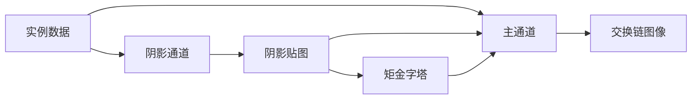
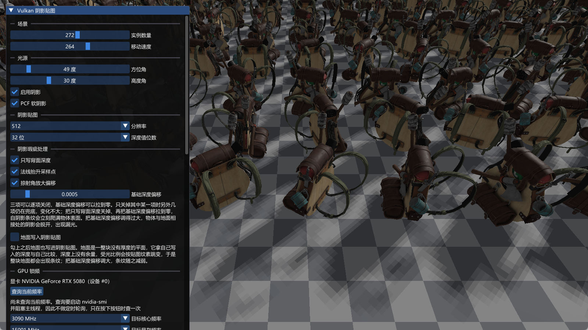
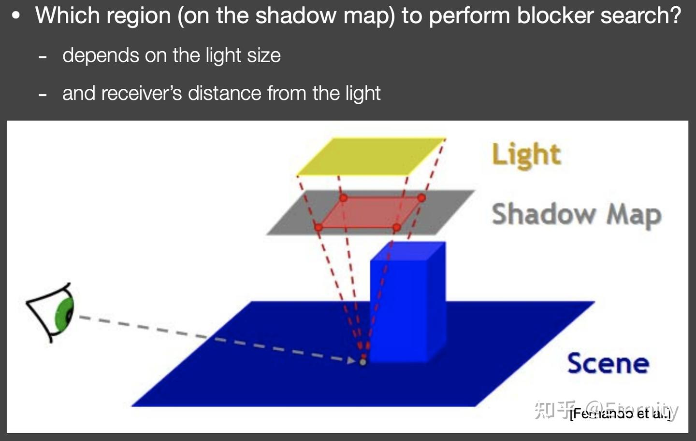
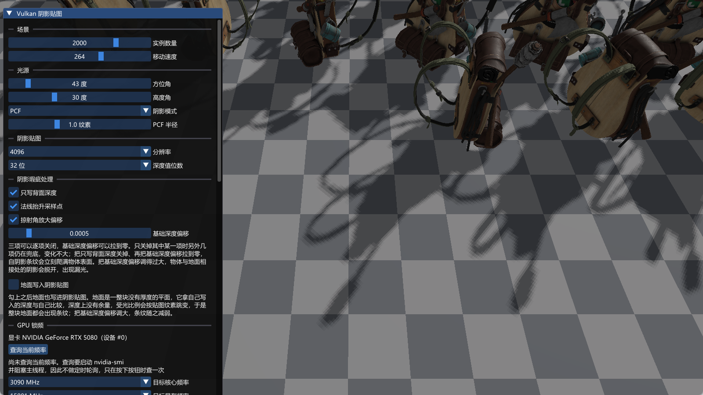
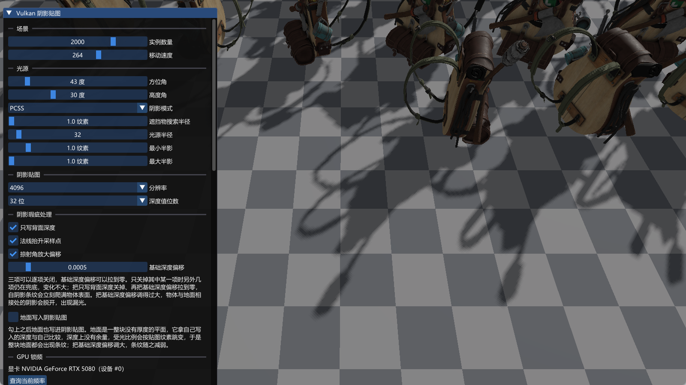

# shadow：方向光阴影贴图

构建方式见仓库根目录的 README。

## 简介

一个前向渲染场景：地面上按网格摆放若干实例，另有一块棋盘格地面用于承接阴影。场景里只有一盏方向光，它的方位角与高度角可以在界面上调整。

阴影用一张贴图实现，分两步：

- 阴影通道：从光源方向把实例背面的深度写进贴图。只写背面让受光表面在深度比较时稳定地处在已写入深度之前，从源头上避免自阴影条纹。贴图的分辨率与每纹素的位数都可以在界面上更改，位数决定贴图的格式，8 位用 `R8_UNORM`、16 位用 `R16_UNORM`、32 位用 `R32_SFLOAT`；方差软阴影存的是一阶与二阶矩，固定用 32 位浮点，位数那一项只作用于深度模式。
- 主通道：正常做前向光照，同时把像素的世界位置投影到光源的正交投影空间，用投影得到的深度与贴图里存的深度做比较，得到该点的受光比例，再乘进方向光的直接光照里。

深度值存在颜色附件里，比较在片元着色器里手动完成。

受光比例的取值方式有四种，界面上用一个下拉框切换：

| 模式 | 说明 |
| --- | --- |
| 关闭 | 受光比例恒为 1，只有方向光的直接光照；阴影通道整段不执行，绘制命令少一条 |
| PCF | 在固定半径上取纹素各比较一次再取平均。半径为零时退化成一次比较，也就是硬阴影 |
| PCSS | 先用遮挡物搜索估算遮挡物的平均深度，再按接收点到遮挡物的距离推算半影宽度，最后在半影范围上过滤 |
| VSSM | 阴影通道写出深度的一阶与二阶矩并逐级收缩成一条金字塔，遮挡物的平均深度与受光比例都由区域内的矩估算，一次区域查询只采一次 |

实例、相机与着色器里的数据结构与其他 case 共用 `common` 下的定义，本 case 只实现自己的渲染通道、管线与控制面板。

## 渲染流程



方差软阴影下阴影贴图存的是深度的一阶与二阶矩，阴影通道之后再由计算着色器把它的各个层级收缩出来，主通道按区域大小取用；其余模式的贴图只有第 0 级，没有这一步。

## 实现要点

### 阴影贴图的可见性

阴影贴图把「这个点能不能看到光源」化成一个深度比较。着色点投影到光源空间，得到贴图坐标 $\mathrm{uv}$ 与沿光线方向的深度 $d$，贴图在 $\mathrm{uv}$ 处存着沿同一条光线最近的遮挡物深度 $D$：

$$
V = \begin{cases}
1, & d \le D(\mathrm{uv}) \\
0, & d > D(\mathrm{uv})
\end{cases}
$$

直接光照的积分里，可见性就是这个 0 与 1 的因子：

$$
L_o(p, \omega_o) = \int_{\Omega} L_i(p, \omega_i)\, f_r(p, \omega_i, \omega_o)\, \cos\theta\, V(p, \omega_i)\, \mathrm{d}\omega_i
$$

把可见性从积分里提出来要用到下面的约等式：

$$
\int_{\Omega} f(x)\, g(x)\, \mathrm{d}x \approx \frac{\int_{\Omega} f(x)\, \mathrm{d}x}{\int_{\Omega} \mathrm{d}x} \cdot \int_{\Omega} g(x)\, \mathrm{d}x
$$

它成立的条件有两个：积分范围很小，或者 $g$ 足够光滑（最大值与最小值差别不大）。方向光的入射方向挤在极窄的范围里，积分范围极小，第一个条件满足，于是

$$
L_o(p, \omega_o) \approx \frac{\int_{\Omega} V(p, \omega_i)\, \mathrm{d}\omega_i}{\int_{\Omega} \mathrm{d}\omega_i} \cdot \int_{\Omega} L_i(p, \omega_i)\, f_r(p, \omega_i, \omega_o)\, \cos\theta\, \mathrm{d}\omega_i
$$

右侧第一个因子就是阴影项：可见的入射方向占全部入射方向的比例，取值落在 0 到 1 之间；第二个因子是与可见性无关的直接光照。这一步把阴影化简成一个标量，乘进直接光照即可，代价是光源要小或者材质要平滑。

单次比较只有 0 与 1 两个结果，阴影边界因此是硬的。贴图分辨率有限，一个纹素覆盖若干着色点，投影放大时边界还会出现台阶状的锯齿。要让边界出现过渡带，就需要在多次比较的结果上取平均。

### 光源使用正交投影

场景里只有一盏方向光，方向光的全部光线互相平行。光线平行带来一个结果：着色点沿光线方向投影到光源平面上时，投影位置与它到光源的距离无关，一整束平行光线在投影平面上收缩成同一点。正交投影描述的正是这种平行光线，投影矩阵里没有透视除法，世界位置在光源空间的深度沿光线方向线性变化。

透视投影描述的是从一个位置发散的光线，点光源与聚光灯属于这一类。用透视投影去投影方向光，光源被当作一个有限距离的点，同一个平面上的深度随到光源轴心的距离变化，阴影轮廓随物体到光源的距离缩放，深度比较随之出现偏差。光源一侧因此使用正交投影。

正交投影的清晰度只由视锥横截面决定，与光源距离无关：视锥开得越小，单个纹素覆盖的世界范围越小，阴影边缘越锐利。

同理，固定视锥不变，阴影贴图 size 越大，单个 texel 覆盖的世界范围越小，阴影质量越高。

512x512



1024x1024


### 正交视锥的拟合

视锥的半边长取当前实例网格的水平半边长与物体包围球半径之和，并以 10 为下限。实例数量增加时网格变宽，视锥随之变大，单个纹素的世界尺寸变大，阴影分辨率下降；界面上减少实例数量，或者调高贴图分辨率，都能换回清晰度。

光源的中心点抬高到半径的 0.1 倍，视线位置沿光源方向放在离中心 2.5 倍半径处，正交矩阵的近平面取 0.1、远平面取半径的 6 倍，把整个场景包在深度范围内。

正交矩阵创建后翻转第二行第二列，适配 Vulkan 裁剪空间 Y 轴朝下的约定。

### 自阴影的抑制

自阴影条纹来自写入的深度与受光表面自身的深度过于接近。代码里有三处措施，面板上可以逐项开关，另外基础深度偏移可以用滑块调节：

- 只写背面深度：阴影通道剔除正面，写入的深度取自物体背面，受光表面因此稳定处在它之前，深度余量就是物体在光线方向上的厚度。关闭后改写入正面深度，余量只剩浮点误差，自阴影条纹立刻出现。
- 法线抬升采样点：着色器把比较位置沿世界法线挪出去，距离取世界空间里一个阴影贴图纹素的宽度。
- 掠射角放大偏移：着色器按入射角放大基础深度偏移，掠射角下偏移量随之增大。
- 基础深度偏移：比较时从参考深度里减去的常数，默认 0.0005，单位是归一化后的深度。调到零可以单独观察前几项各自的作用，调得过大则会让物体与地面相接处的阴影脱开。

只关掉其中某一项时，其余几项仍在兜底，画面变化不大；把只写背面深度关掉、同时把基础深度偏移拉到零，条纹会明显爬满受光表面。

阴影贴图的深度值由片元着色器写进颜色附件，光栅化的多边形深度偏移只作用在深度测试上，影响不到写入的深度值，因此这里没有启用它。

只写背面深度决定阴影管线的剔除面，改动时重建管线；法线抬升、掠射角放大偏移与基础深度偏移只进 uniform，不触发重建。

> 对于平面这种单层物体，“只写背面深度”无效。原因显然，它的正面和背面的深度一致。

> 实际测试发现“掠射角放大偏移”似乎没有效果？例如，测试平面的自阴影时，调整“基础深度偏移”为恰好到再增大一点就可以消除自阴影的程度，然后再开启“掠射角放大偏移”，发现自阴影没有改善。

### 百分比渐近过滤（PCF）

把一次比较换成一片邻域内多次比较的平均，就得到 0 到 1 之间的受光比例。设着色点为 $x$，$p$ 是它在贴图上的位置，$N(p)$ 是 $p$ 的邻域，$D_{sm}(q)$ 是贴图在邻域纹素 $q$ 处存的深度，$D_{scene}(x)$ 是着色点自己的深度，$\chi^{+}$ 是示性函数（参数不小于零取 1，否则取 0），则

$$
V(x) = \sum_{q \in N(p)} w(p, q)\, \chi^{+}\!\left[ D_{sm}(q) - D_{scene}(x) \right]
$$

$w(p, q)$ 是权重，取平均值时 $w = 1 / |N(p)|$。平均的对象是每次比较得到的 0 与 1，贴图里的深度值保持原样：深度是沿光线方向的几何量，对深度本身取平均没有对应的几何含义。

邻域固定为几个纹素时，投影放大仍然能被平滑。贴图被放大意味着相邻纹素的深度很接近，采样块每滑动一格只换掉一行或一列纹素，受光比例的变化因此很小，过渡呈现为一条平滑的带。

本 case 的采样偏移取纹素宽度的整数倍，九个采样点落在固定的九个纹素中心上，同一纹素之内的受光比例保持不变，跨过纹素边界时整级变化，过渡带的取值只能是 0 与 1 之间九分之一的整数倍。要让它在纹素内部连续渐变，需要让一次读取同时取回 2 乘 2 个纹素并对比较结果做双线性插值，GPU Gems 第 1 版第 11 章用的是带硬件比较的采样器，硬件先做四次深度比较再按纹素坐标插值。本 case 的深度存在颜色附件里，比较在着色器里手动完成，线性插值会把相邻纹素的深度平均掉，采样器的滤波因此必须取最近邻，这个台阶也就保留下来。

本 case 的邻域取 3 乘 3 的格点，格点间距是 $\mathrm{radius}$ 个纹素，九次比较取平均。$\mathrm{radius}$ 由面板给出，取零时退化成一次比较，得到硬阴影。

### 百分比渐近软阴影（PCSS）

PCF 的过滤半径是常数，阴影边界的宽度不随遮挡物的远近变化；面光源在接收点被近处遮挡物挡住时
半影窄，被远处遮挡物挡住时半影宽。PCSS 用三步把这个关系补上：先在接收点周围一个搜索半径内统计落在
接收点之前的纹素，得到遮挡物的平均深度；接收点到遮挡物的距离与遮挡物到光源的距离之比决定半影宽度，
遮挡物离得越远半影越宽；最后在这个半影宽度上做过滤。搜索半径内一个遮挡物都没有时这一点按完全受光处理。

#### 半影的几何来源

设光源是一块半径为 $R$ 的圆盘，位于遮挡物后方 $d_2$ 处，接收面位于遮挡物前方 $d_1$ 处。从接收点看过去，遮挡物边缘把光源的圆盘投影在接收面上，放大倍数就是 $d_1 / d_2$，投影的半径是

$$
w = R \cdot \frac{d_1}{d_2}
$$

这个投影就是半影的宽度。接收面上落在投影之内的点，光源被遮挡物挡掉一部分，受光比例落在 0 与 1 之间；落在投影之外的点能看到整个光源，受光比例为 1。

把式子写成比值形式 $w / R = d_1 / d_2$，就能读出远近关系：遮挡物贴近接收面时 $d_1$ 趋近 0，半宽趋近 0，边界变硬；遮挡物贴近光源时 $d_2$ 变小，$d_1 / d_2$ 变大，半宽变大，边界变柔。

把 $R / d_2$ 记作光源在遮挡物处张开的半角的切线 $\tan\theta$，半影宽度就是

$$
w = \tan\theta \cdot d_1
$$

方向光的光源在无穷远处，$\theta$ 不随遮挡物的位置变化，$w$ 只与遮挡物到接收点的距离成正比。UE 的方向光 PCSS 用的正是这种固定角度的写法。

#### 遮挡物搜索的范围

搜索的目的是找出可能挡在接收点与光源之间的纹素。从接收点朝光源看，能射到这一点的全部光线落在以光源为底的一个锥体里，只有落在这个锥体内的遮挡物才可能挡掉光源的一部分；锥体之外的遮挡物不影响这一点。

设这个锥体的半角是 $\varphi$，光源圆盘到接收点的距离是 $D$，则 $\tan\varphi = R / D$。在距接收点 $t$ 处，锥体的横向半径是 $t \tan\varphi$；遮挡物位于接收点与光源之间，$t$ 最大取 $D$，因此横向偏移的上界是

$$
t \tan\varphi \le D \tan\varphi = R
$$

也就是光源自身的半径。搜索半径取到 $R$，就能覆盖所有可能起作用的遮挡物。

本 case 的光源放在 2.5 倍场景半径处，$D$ 就是这段距离。UE 的方向光 PCSS 用 $\mathrm{SceneDepth} \cdot \tan\theta$ 作为搜索半径，那里的角度含着光源半角与阴影投影空间的比例，$\mathrm{SceneDepth}$ 是接收点在阴影投影空间里的深度，作用与这里的 $D$ 相同。本 case 把搜索半径做成面板参数，单位是纹素，默认 4，可在 1 到 8 之间调整。

> 我就想问这个把光源视为一个圆锥算出来的搜索半径有什么用呢？先不说我用的是平行光。哪怕我用的是聚光灯，那么我如果距离一个物体为 D，但是这个物体很小，远小于 R，那这个 R 岂不是完全没有参考意义？
>
> 而且哪怕是真的用来决定 block 搜索范围，也应该是从 shading point 连线到光源的边界，而不是从一个点光源出发一个锥体啊？这光源锥体的说法，是 AI 的幻觉吧？



#### 半影宽度与过滤半径的换算

几何关系给出的是世界单位的半影，代码里要换成纹素。光源用正交投影，深度沿光线方向线性变化，归一化深度乘上远近平面间距再加上近平面就是光源到表面的距离，距离之比于是只需要一个常数项就能算出来。换算出的半影再除以一个纹素的世界尺寸，得到以纹素为单位的过滤半径，最后被上下限钳住。逐步的公式与源码位置见下一节的「PCSS 的半影宽度」。

PCF



PCSS



光源半径的单位是世界单位。场景的光源放在 2.5 倍场景半径处，实例数量两千时场景半径约 264，光源在 660
个世界单位之外；半径小的光源角直径微乎其微，半影会小到一个纹素以下，看起来与 PCF 没有区别，所以默认
半径取 400，可调范围是 25 到 2000。

以无阴影的画面为完全受光的基准，把比值落在 0.15 到 0.85 之间的像素算作半影，实测：

| 模式 | 半影像素 | 占比 |
| --- | --- | --- |
| PCF（半径 1 纹素） | 62111 | 4.313% |
| PCSS（光源半径 100） | 70597 | 4.903% |
| PCSS（光源半径 400） | 79402 | 5.514% |
| PCSS（光源半径 1200） | 80706 | 5.605% |

PCSS 的半影面积比 PCF 大，并且随光源半径增长；增长到 1200 之后趋于平缓，那是半影上界把过滤半径钳住
了。锁定核心频率 2880 兆赫、显存频率 15001 兆赫，实例两千、贴图 2048 见方时的设备时间：

| 模式 | 设备时间 | 绘制命令 |
| --- | --- | --- |
| 关闭 | 6.452 | 2 |
| PCF | 12.854 | 3 |
| PCSS | 12.899 | 3 |

PCSS 每次受光比例计算要读五十个纹素，PCF 只要九个，但主通道的这点增量在这套装满两千个实例的
2048 见方阴影通道面前只有 0.045 毫秒，整帧的时间几乎都被阴影通道本身占着。

### 方差软阴影（VSSM）

PCSS 的第一步与第三步都要把区域里的纹素逐个读出来比较，区域越大要读的纹素越多。VSSM 换一个做法：把区域内深度的分布用一阶矩与二阶矩概括，遮挡物的平均深度与受光比例都从这两个量算出来，一次区域查询只采一次，代价与区域大小无关。

#### 矩的存储与金字塔

VSSM 下阴影通道把每个纹素的深度与深度的平方写进两通道颜色附件（[`shadow_moments.frag:9`](shaders/shadow_moments.frag#L9)），格式是 `R32G32_SFLOAT`（`renderer.cpp:19`）。深度的平方用来算方差：

$$
\mu = E[z], \qquad \sigma^2 = E[z^2] - \mu^2
$$

区域上的这两个量都是平均值，把四块拼成一块时四块的均值再取平均就是合并后的均值，因此金字塔收缩时直接对二乘二小块取平均（[`shadow_moments_reduce.comp:26-30`](shaders\shadow_moments_reduce.comp#L26-30)）。第 0 级由阴影通道写出，其余各级由计算着色器逐级收缩（`renderer.cpp:919`），贴图因此带一条从分辨率边长一直折半到 1 的层级链（`renderer.cpp:204`）。

矩需要 32 位浮点保存：深度的平方在贴图分辨率下的量化档距远大于区域内深度的方差，位数降到 16 位时方差会整片塌成零，估不出半影宽度。位数那一项因此只作用于深度模式，VSSM 的矩固定用 32 位浮点，面板上这一项在 VSSM 下置灰。

#### 区域查询

一片区域是边长 $2r$ 纹素的方块，取金字塔里纹素覆盖边长最接近的那一级（`shadow_sampling.glsl:83-90`）：

$$
\mathrm{lod} = \mathrm{clamp}\big(\log_2 (2r) - 1,\ 0,\ \log_2 \mathrm{mapSize}\big)
$$

取低一级是因为采样时还在四个相邻纹素之间做线性插值，插值把核又摊宽一倍，低一级正好抵消，查询覆盖的范围因此是 $\pm r$ 个纹素，与 PCSS 的格点跨度一致。

区域矩要求贴图里每个纹素都有深度。贴图里若混进没有几何的纹素，它们的最远深度会把区域均值抬到接收点之前，切比雪夫不等式的前提不再成立，因此 VSSM 下地面固定写进阴影贴图（`main.cpp:663`），面板上那一项在 VSSM 下置灰。地面写进去之后，接收面自身的深度与遮挡物的深度一起进入一阶与二阶矩，接收面上不存在按纹素跳变的深度余量，因此看不到条纹。

#### 遮挡物的平均深度

设接收点深度为 $t$，区域里深度小于 $t$ 的纹素是遮挡物，其余是没有被遮住的部分。区域的平均深度按这两部分写开：

$$
\mu = P_{\mathrm{lit}}\, z_{\mathrm{unocc}} + (1 - P_{\mathrm{lit}})\, z_{\mathrm{occ}}
$$

$P_{\mathrm{lit}}$ 是区域里深度不小于 $t$ 的比例，切比雪夫不等式给出它的上界（`shadow_sampling.glsl:107`）：

$$
P_{\mathrm{lit}} \le \frac{\sigma^2}{\sigma^2 + (t - \mu)^2}
$$

这个单边形式要求 $t > \mu$：$t$ 不大于 $\mu$ 时区域的平均深度落在接收点之后，按没有遮挡物处理。没有遮住的那部分深度取接收点自己的深度，也就是令 $z_{\mathrm{unocc}} = t$，代入上面的混合关系反解出遮挡物的平均深度（`shadow_sampling.glsl:115`）：

$$
z_{\mathrm{occ}} = \frac{\mu - P_{\mathrm{lit}}\, t}{1 - P_{\mathrm{lit}}}
$$

区域里只有一层遮挡平面与接收面时，这个混合关系是精确的：两部分的深度各自固定，均值与方差只由两者的比例决定，切比雪夫不等式在这个分布上取到等号，反解出的 $z_{\mathrm{occ}}$ 就是遮挡平面的深度。得到遮挡物的平均深度之后，半影宽度与过滤半径的换算与 PCSS 完全相同（`shadow_sampling.glsl:120-123`）。

#### 受光比例与漏光

第二步在半影范围上再取一次区域矩，受光比例就是同一个不等式的右边（`shadow_sampling.glsl:126-133`）：

$$
V = \begin{cases}
1, & t \le \mu \\
\dfrac{\sigma^2}{\sigma^2 + (t - \mu)^2}, & t > \mu
\end{cases}
$$

切比雪夫不等式给出的是上界，只有在区域里恰好只有两个深度、也就是只有一层遮挡平面与接收面时才取到等号。区域里的深度分布更复杂时这个上界高于真正的受光比例，阴影因此比真实结果亮，这就是漏光。另外接收面与光线夹角大时，区域里接收面自身的深度也随位置变化，这部分变化被算进方差，估计进一步偏亮；本 case 的地面近乎水平、光线的高度角默认 30 度，属于这一种情形。

把区域矩换成金字塔上的取值之后，区域越大偏差越明显：区域里的遮挡物占比越小，上界与真值的差距越宽。实测（口径与上面 PCSS 的表格相同，都是与无阴影画面逐像素比，比值落在 0.15 到 0.85 之间的算半影）：

| 模式 | 半影像素 | 占比 |
| --- | --- | --- |
| PCSS（光源半径 100） | 70900 | 4.924% |
| VSSM（光源半径 100） | 44100 | 3.062% |
| PCSS（光源半径 400） | 79682 | 5.533% |
| VSSM（光源半径 400） | 27089 | 1.881% |
| PCSS（光源半径 1200） | 81025 | 5.627% |
| VSSM（光源半径 1200） | 26112 | 1.813% |

VSSM 的半影像素占比随光源半径变大反而下降：区域变大之后切比雪夫上界与真值的差距变宽，阴影里偏亮的那部分升到 0.85 以上，被算进受光。光源半径 100 时两者接近，半径 400 以上时 VSSM 明显更淡。

VSSM 的过滤核把区域里每个纹素的深度都算进去，PCSS 只在 25 个格点上比较，格点间距是半影的一半。半影宽度被上界钳到 16 个纹素时，格点间距是 8 个纹素，与阴影本身的宽度相当，PCSS 的取样因此漏掉大部分区域，边界比真实的半影更窄更暗。VSSM 给出的是整片区域的平均，过渡带更平滑、也更宽。

锁定核心频率 2880 兆赫、显存频率 15001 兆赫，实例两千、贴图 2048 见方时的设备时间：

| 模式 | 设备时间 | 绘制命令 |
| --- | --- | --- |
| 关闭 | 6.315 | 2 |
| PCF | 12.576 | 3 |
| PCSS | 12.594 | 3 |
| VSSM | 12.623 | 4 |

VSSM 多一条绘制命令，是因为地面要写进阴影贴图；矩金字塔的收缩用计算调度完成，不计入绘制命令条数。主通道里的采样从五十个纹素减到两次区域查询，但这一部分本来就只占零点几毫秒，整帧的时间被阴影通道本身占着，设备时间与 PCSS 持平。

### 四种模式的公式与源码对应

三种模式共用同一套投影与深度比较，区别只在受光比例的计算方式。

#### 投影与深度写入

阴影通道的顶点着色器把世界位置变换到光源裁剪空间（`shadow.vert:15`），主通道在片元着色器里对同一个世界位置再做一次投影（`scene_common.glsl:41-46`）：

```glsl
vec4 clip = scene.lightViewProj * vec4(worldPosition, 1.0);
vec3 projected = clip.xyz / clip.w;
vec2 uv = projected.xy * 0.5 + 0.5;
```

写成公式：

$$
\begin{aligned}
\mathrm{uv} &= \frac{\mathrm{clip}.xy}{\mathrm{clip}.w} \cdot 0.5 + 0.5 \\
\mathrm{depth} &= \frac{\mathrm{clip}.z}{\mathrm{clip}.w}
\end{aligned}
$$

裁剪坐标的 x、y 从 -1 到 1 映射到纹理坐标的 0 到 1。光源用正交投影，$\mathrm{clip}.w$ 恒为 1，$\mathrm{depth}$ 就是世界位置在光源空间的线性深度。

阴影通道把窗口深度写进颜色附件的第 0 个通道（`shadow.frag:9`）：

```glsl
outDepth = gl_FragCoord.z;
```

光栅化得到的 `gl_FragCoord.z` 与主通道的 $\mathrm{depth}$ 来自同一个矩阵，两者可以直接比较。

#### 深度比较

`shadow_sampling.glsl:7-10`：

```glsl
return referenceDepth <= texture(shadowMap, uv).r ? 1.0 : 0.0;
```

$$
\mathrm{lit}(d_{ref}, \mathrm{uv}) = \begin{cases}
1, & d_{ref} \le d_{map}(\mathrm{uv}) \\
0, & d_{ref} > d_{map}(\mathrm{uv})
\end{cases}
$$

#### 参考深度的偏移

比较之前先压低参考深度，可选地沿法线抬起采样位置（`shadow_sampling.glsl:90-103`）：

```glsl
vec3 liftedPosition = worldPosition + normal * (scene.shadowOptions.z * scene.shadowOptions.x);
float bias = scene.shadowParams.x;
if (scene.shadowOptions.y > 0.5) {
    bias = max(bias * (1.0 - nDotL), bias);
}
float referenceDepth = projected.z - bias;
```

$$
d_{ref} = \mathrm{depth} - \mathrm{bias}
$$

参考深度的修正由三部分组成。抬升距离是 `shadowOptions.z` 与开关 `shadowOptions.x` 的乘积，其中 `shadowOptions.z` 是一个纹素对应的世界宽度 $2 \cdot \mathrm{radius} / \mathrm{mapSize}$，$\mathrm{radius}$ 取正交视锥半边长（`main.cpp:118`）。基础项 `shadowParams.x` 是界面上的基础深度偏移，记作 $\mathrm{bias}$（`main.cpp:115`）。掠射角项由 `shadowOptions.y` 开关，表达式是

$$
\mathrm{bias}' = \max\big(\mathrm{bias} \cdot (1 - \mathrm{nDotL}),\ \mathrm{bias}\big)
$$

$\mathrm{nDotL}$ 落在 0 到 1 之间，$\mathrm{bias} \cdot (1 - \mathrm{nDotL})$ 随之落在 0 到 $\mathrm{bias}$ 之间，$\max$ 取回 $\mathrm{bias}$，所以偏移量在各种入射角下都等于基础偏移。

#### 硬阴影

`filterShadow` 在半径为零时直接返回一次比较（`shadow_sampling.glsl:14-18`）：

```glsl
if (radius <= 0.0) {
    return litFromDepth(referenceDepth, uv);
}
```

#### PCF

三乘三的格点，间距是 PCF 半径个纹素（`shadow_sampling.glsl:20-27`）：

$$
\begin{aligned}
\mathrm{offset}(x, y) &= (x, y) \cdot \mathrm{texel} \cdot \mathrm{radius}, & x, y &\in \{-1, 0, 1\} \\
\mathrm{visibility} &= \frac{1}{9} \sum_{x=-1}^{1} \sum_{y=-1}^{1} \mathrm{lit}\big(d_{ref},\ \mathrm{uv} + \mathrm{offset}(x, y)\big)
\end{aligned}
$$

```glsl
const vec2 offset = vec2(float(x), float(y)) * scene.shadowParams.y * radius;
```

`shadowParams.y` 是一个纹素在纹理坐标下的长度，记作 $\mathrm{texel} = 1 / \mathrm{mapSize}$（`main.cpp:115`）；`shadowParams.z` 是界面上的 PCF 半径，记作 $\mathrm{radius}$。过滤核固定为九个采样点，$\mathrm{radius}$ 只改变采样间距，过滤核沿单轴覆盖 $\pm \mathrm{radius}$ 个纹素。

#### PCSS 的遮挡物搜索

五乘五的格点，间距是半个搜索半径（`shadow_sampling.glsl:45-60`）：

$$
\begin{aligned}
\mathrm{offset}(x, y) &= (x, y) \cdot \mathrm{texel} \cdot R \cdot 0.5, & x, y &\in \{-2, -1, 0, 1, 2\} \\
\mathrm{blockerDepth} &= \frac{1}{|S|} \sum_{q \in S} d_{map}(q), & S &= \{\, q : d_{ref} > d_{map}(q) \,\}
\end{aligned}
$$

`shadowPcss.x` 是搜索半径，记作 $R$（纹素）；$S$ 为空时取 $-1$，表示这一点完全受光。沿单轴的最大偏移是 $\mathrm{texel} \cdot R$，搜索范围覆盖 $\pm R$ 个纹素。

#### PCSS 的半影宽度

先把归一化深度还原成光源到表面的距离。正交投影下深度沿光线方向线性变化（`main.cpp:120-122`）：

$$
t = z \cdot (\mathrm{far} - \mathrm{near}) + \mathrm{near}
$$

其中 $\mathrm{near} = 0.1$，$\mathrm{far} = 6 \cdot \mathrm{radius}$。接收点到遮挡物的距离与遮挡物到光源的距离分别是 $t_{ref} - t_{blocker}$ 与 $t_{blocker}$，两者的比值（`shadow_sampling.glsl:73-74`）：

$$
\mathrm{ratio} = \frac{t_{ref} - t_{blocker}}{t_{blocker}} = \frac{z_{ref} - z_{blocker}}{z_{blocker} + \dfrac{\mathrm{near}}{\mathrm{far} - \mathrm{near}}}
$$

分母里的 $\mathrm{near} / (\mathrm{far} - \mathrm{near})$ 就是 `shadowOptions.w`，分子是 `referenceDepth - blockerDepth`，距离之比因此只靠一个常数项就能算出来。光源半径按纹素换算后存进 `shadowPcss.y`（`main.cpp:127-128`）：

$$
\texttt{shadowPcss}.y = \frac{\mathrm{lightRadius} \cdot \mathrm{mapSize}}{2 \cdot \mathrm{radius}}
$$

$2 \cdot \mathrm{radius}$ 是正交视锥的世界宽度，$\mathrm{mapSize}$ 是贴图边长，两者之比把世界单位换成纹素。半影宽度是比值与 `shadowPcss.y` 的乘积，再夹在 `shadowPcss.z` 与 `shadowPcss.w` 之间（`shadow_sampling.glsl:75-76`）：

$$
\mathrm{penumbra} = \mathrm{clamp}\big(\mathrm{ratio} \cdot \texttt{shadowPcss}.y,\ \texttt{shadowPcss}.z,\ \texttt{shadowPcss}.w\big)
$$

`shadowPcss.z` 与 `shadowPcss.w` 是界面上的最小半影与最大半影，单位是纹素（`main.cpp:128-129`）。把纹素单位换回世界单位：一个纹素的世界宽度是 $\dfrac{2 \cdot \mathrm{radius}}{\mathrm{mapSize}}$，于是

$$
\mathrm{penumbra} \cdot \frac{2 \cdot \mathrm{radius}}{\mathrm{mapSize}} = \mathrm{ratio} \cdot \mathrm{lightRadius} = \frac{d_1}{d_2} \cdot R
$$

也就是接收点到遮挡物的距离与遮挡物到光源的距离之比乘上光源半径。完整半影宽度是这个值的两倍，等于光源直径乘以 $d_1 / d_2$，与相似三角形得到的结论一致。

#### PCSS 的半影过滤

五乘五的格点，间距是半个半影宽度（`shadow_sampling.glsl:31-41`）：

$$
\begin{aligned}
\mathrm{offset}(x, y) &= (x, y) \cdot \mathrm{texel} \cdot \mathrm{penumbra} \cdot 0.5, & x, y &\in \{-2, -1, 0, 1, 2\} \\
\mathrm{visibility} &= \frac{1}{25} \sum_{x=-2}^{2} \sum_{y=-2}^{2} \mathrm{lit}\big(d_{ref},\ \mathrm{uv} + \mathrm{offset}(x, y)\big)
\end{aligned}
$$

沿单轴的最大偏移是 $\mathrm{texel} \cdot \mathrm{penumbra}$，过滤核覆盖 $\pm \mathrm{penumbra}$ 个纹素，正好等于上一步算出的半影半宽。

#### VSSM 的矩与金字塔

阴影通道写入的是一阶与二阶矩（`shadow_moments.frag:7-9`）：

$$
\begin{aligned}
M_0(\mathrm{uv}) &= z \\
M_1(\mathrm{uv}) &= z^2
\end{aligned}
$$

金字塔收缩时对二乘二小块取平均，两个通道都是区域上的平均值（`shadow_moments_reduce.comp:24-30`）：

$$
\begin{aligned}
M_i^{L+1}(p) &= \frac{1}{4} \sum_{x=0}^{1} \sum_{y=0}^{1} M_i^{L}(2p + (x, y)), & i &\in \{0, 1\}
\end{aligned}
$$

区域查询按区域半径 $r$ 取层级并在两级之间插值（`shadow_sampling.glsl:83-90`）：

$$
\mathrm{lod} = \mathrm{clamp}\big(\log_2 (2r) - 1,\ 0,\ \log_2 \mathrm{mapSize}\big)
$$

从取回的矩算出区域均值与方差，$M_0$ 是一阶矩 $E[z]$，$M_1$ 是二阶矩 $E[z^2]$：

$$
\mu = M_0, \qquad \sigma^2 = \max\big(M_1 - M_0^2,\ 10^{-8}\big)
$$

#### VSSM 的遮挡物深度

搜索半径 $R$ 取 `shadowPcss.x`，区域是边长 $2R$ 的方块。切比雪夫不等式给出区域里深度不小于接收点深度的比例的上界，再按混合关系反解遮挡物的平均深度（`shadow_sampling.glsl:98-115`）：

$$
\begin{aligned}
\delta &= t - \mu \\
P_{\mathrm{lit}} &= \frac{\sigma^2}{\sigma^2 + \delta^2} \\
z_{\mathrm{occ}} &= \frac{\mu - P_{\mathrm{lit}}\, t}{1 - P_{\mathrm{lit}}}
\end{aligned}
$$

$\delta \le 0$ 或被遮挡比例 $1 - P_{\mathrm{lit}}$ 小于 $10^{-3}$ 时按没有遮挡物处理，返回完全受光；反解出非正深度时同样如此。半影宽度与过滤半径（`shadow_sampling.glsl:120-123`）：

$$
\begin{aligned}
\mathrm{ratio} &= \frac{t - z_{\mathrm{occ}}}{z_{\mathrm{occ}} + \texttt{shadowOptions}.w} \\
\mathrm{penumbra} &= \mathrm{clamp}\big(\mathrm{ratio} \cdot \texttt{shadowPcss}.y,\ \texttt{shadowPcss}.z,\ \texttt{shadowPcss}.w\big)
\end{aligned}
$$

与 PCSS 的式子相同，区别只在 $z_{\mathrm{occ}}$ 的来源：PCSS 从 25 次逐纹素比较里数出来，VSSM 从区域矩里反解。

#### VSSM 的受光比例

半影区域是边长 $2\,\mathrm{penumbra}$ 的方块，受光比例在它的区域矩上算（`shadow_sampling.glsl:126-133`）：

$$
V = \begin{cases}
1, & t \le \mu' \\
\dfrac{\sigma'^2}{\sigma'^2 + (t - \mu')^2}, & t > \mu'
\end{cases}
$$

其中 $\mu'$ 与 $\sigma'^2$ 是半影区域的均值与方差。一次受光比例计算一共读两个纹素（两次区域查询），与半影宽度无关。

#### 模式分派

`sampleShadow` 先处理两个退化情形：模式为零时返回 1（`shadow_sampling.glsl:140-143`），投影落在贴图范围之外时返回 1（`shadow_sampling.glsl:149-152`）。其余情形按模式分派（`shadow_sampling.glsl:161-167`）：

```glsl
if (mode >= 3) {
    return sampleVssm(referenceDepth, projected.xy);
}
if (mode >= 2) {
    return samplePcss(referenceDepth, projected.xy);
}
return filterShadow(referenceDepth, projected.xy, scene.shadowParams.z);
```

### UE 5.8 的 PCF 与 PCSS

UE 的阴影过滤在 `Engine/Shaders/Private/ShadowFilteringCommon.ush` 与 `Engine/Shaders/Private/ShadowPercentageCloserFiltering.ush`，两者都由 `Engine/Shaders/Private/ShadowProjectionPixelShader.usf` 的 `Main` 调用，走哪条路在编译期由 `USE_PCSS` 宏决定（`ShadowProjectionPixelShader.usf:225-264`）。

#### UE 的 PCF

入口是 `ManualPCF`（`ShadowFilteringCommon.ush:353-365`），按 `SHADOW_QUALITY` 分四档：

| 档位 | 函数 | 采样方式 |
| --- | --- | --- |
| 1 | `ManualNoFiltering` | 一次采样，单纹素判定 |
| 2 | `Manual1x1PCF` | 一次 `Gather` 取回 2 乘 2 个纹素，双线性重采样 |
| 3 | `Manual3x3PCF` | 四次 `Gather` 覆盖 4 乘 4 个纹素，重采样成 3 乘 3 |
| 4 | `Manual5x5PCF` | 九次 `Gather` 覆盖 6 乘 6 个纹素，重采样成 5 乘 5 |

`Gather` 一次返回 2 乘 2 个纹素的深度，3 乘 3 档用四次调用覆盖 4 乘 4，5 乘 5 档用九次调用覆盖 6 乘 6。重采样由 `PCF3x3gather`（`ShadowFilteringCommon.ush:97-119`）与 `HorizontalPCF5x2`（`ShadowFilteringCommon.ush:122-141`）里的双线性权重完成，5 乘 5 档的归一化系数是 $1 / 25$（`ShadowFilteringCommon.ush:294`）。

深度比较是一段软过渡，`CalculateShadowVisibilityTransmittanceFactor`（`ShadowFilteringCommon.ush:151-180`）：

$$
\mathrm{ShadowFactor} = \mathrm{saturate}\big((\mathrm{ShadowmapDepth} - \mathrm{SceneDepth}) \cdot \mathrm{TransitionScale} + 1\big)
$$

深度差为正时结果饱和到 1，深度差小于 $-\dfrac{1}{\mathrm{TransitionScale}}$ 时饱和到 0，中间是一条线性斜坡。$\mathrm{TransitionScale}$ 取自 `SoftTransitionScale.z`，延迟管线里还要乘 $\mathrm{lerp}(\texttt{ProjectionDepthBiasParameters}.z,\ 1.0,\ \mathrm{NoL})$ 当作接收者偏移（`ShadowProjectionPixelShader.usf:249-251`）；接近 1 的深度可以按未写入处理，由 `bTreatMaxDepthUnshadowed` 开关决定。过滤之后有两步修正：`ApplyPCFOverBlurCorrection` 把受光比例取平方（`ShadowProjectionPixelShader.usf:90-93`），`ShadowSharpen` 做对比度拉伸（`ShadowProjectionPixelShader.usf:397`）：

$$
\mathrm{Shadow} = \mathrm{saturate}\big((\mathrm{Shadow} - 0.5) \cdot \mathrm{ShadowSharpen} + 0.5\big)
$$

本 case 的 PCF 用 3 乘 3 的整数格点逐纹素取值，每次比较只有 0 与 1 两个结果，半径由滑块给出；UE 的比较是一条随深度差变化的斜坡，采样由 `Gather` 加双线性重采样完成，另外还有平方与锐化两步修正。

#### UE 的 PCSS

入口是 `DirectionalPCSS`（`ShadowPercentageCloserFiltering.ush:122`），只用于方向光与聚光灯，由 `TDirectionalPercentageCloserShadowProjectionPS` 与 `TSpotPercentageCloserShadowProjectionPS` 两个着色器类编译出带 `USE_PCSS` 与 `SPOT_LIGHT_PCSS` 宏的变体（`Engine/Source/Runtime/Renderer/Private/ShadowRendering.h:1657-1759`）。

采样数在头文件里固定：遮挡物搜索 16 个（`PCSS_SEARCH_BITS = 4`），过滤 32 个（`PCSS_SAMPLE_BITS = 5`）（`ShadowPercentageCloserFiltering.ush:42-47`）。两组采样位置都来自 Sobol 序列，再用 `UniformSampleDiskConcentricApprox` 映射到单位圆盘（`ShadowPercentageCloserFiltering.ush:197-198`）。

遮挡物搜索的半径（`ShadowPercentageCloserFiltering.ush:149-154`）：方向光取 $\mathrm{SceneDepth} \cdot \mathrm{TanLightSourceAngle}$，聚光灯取投影后的光源半径 $\mathrm{ProjectedSourceRadius}$，随后受 $\mathrm{MaxKernelSize}$（`r.Shadow.MaxSoftKernelSize`）钳制。

```glsl
SearchRadius = clamp(PCSSMinFilterSize, Settings.MaxKernelSize, SearchRadius);
```

这一行按 $\mathrm{clamp}(x, \mathrm{minVal}, \mathrm{maxVal}) = \min(\max(x, \mathrm{minVal}), \mathrm{maxVal})$ 展开，在 $\mathrm{MaxKernelSize}$ 不小于 $\mathrm{MinFilterSize}$ 时等于 $\min(\mathrm{MaxKernelSize}, \mathrm{SearchRadius})$，也就是搜索半径被 `MaxKernelSize` 钳在上界。

搜索循环统计落在接收点之前的纹素，累加它们的深度、深度平方与个数，另外累加采样偏移的一阶矩与二阶矩（`ShadowPercentageCloserFiltering.ush:195-222`）。两种提前返回：一个遮挡物都没有时返回 1，所有采样都命中遮挡物时返回 0（`ShadowPercentageCloserFiltering.ush:241-250`）。

半影宽度（`ShadowPercentageCloserFiltering.ush:267-276`）。接收点到遮挡物的距离是

$$
\mathrm{AverageOccluderDistance} = \mathrm{SceneDepth} - \mathrm{DepthAvg}
$$

方向光与聚光灯的半影分别是

$$
\mathrm{Penumbra}_{\mathrm{dir}} = \mathrm{TanLightSourceAngle} \cdot \mathrm{AverageOccluderDistance}
$$

$$
\mathrm{Penumbra}_{\mathrm{spot}} = \frac{\mathrm{ProjectedSourceRadius} \cdot \mathrm{AverageOccluderDistance}}{\mathrm{DepthAvg}}
$$

两者都再取上界

$$
\mathrm{Penumbra} = \min(\mathrm{Penumbra},\ \mathrm{MaxKernelSize})
$$

`SceneDepth` 是接收点在光源空间的深度，`DepthAvg` 是遮挡物的平均深度，两者之差是接收点到遮挡物的距离，`DepthAvg` 本身是光源到遮挡物的距离。聚光灯的式子与本 case 的 $\mathrm{ratio}$ 是同一个比值；方向光用光源半角的切线代替有限距离的光源半径，写成 $w = \tan\theta \cdot d_1$，而本 case 的 $\mathrm{lightRadius} / d_2$ 就是 $\tan\theta$，两个式子在这里重合。`TanLightSourceAngle` 在主机侧预先乘上阴影投影空间的纵横向比例 $\mathrm{SZ} / \mathrm{SW}$，`MaxKernelSize` 除以贴图边长，一起写进 `PCSSParameters`（`ShadowRendering.h:1693-1703`）。

过滤半径（`ShadowPercentageCloserFiltering.ush:278-280`）：

$$
\begin{aligned}
\mathrm{RawFilterRadius} &= \mathrm{RandomFilterScale} \cdot \mathrm{Penumbra}, & \mathrm{RandomFilterScale} &= 0.75 \\
\mathrm{FilterRadius} &= \max(\mathrm{PCFMinFilterSize},\ \mathrm{RawFilterRadius})
\end{aligned}
$$

过滤循环取 32 个圆盘采样，采样偏移是

$$
\mathrm{SampleUVOffset} = \mathrm{PCFUVMatrix} \cdot e \cdot \mathrm{FilterRadius}
$$

$e$ 是单位圆盘上的采样点；比较同样用软过渡 $\mathrm{saturate}\big((\mathrm{SampleDepth} - \mathrm{SceneDepth} + \mathrm{SampleDepthBias}) \cdot \mathrm{TransitionScale} + 1\big)$，最后取平均（`ShadowPercentageCloserFiltering.ush:418-433`）。

UE 在过滤上另做了三件事。按遮挡物偏移的协方差矩阵求特征向量与特征值，把圆盘核拉成椭圆（`PCSS_ANTI_ALIASING_METHOD == 2`，`ShadowPercentageCloserFiltering.ush:291-386`）；对结果做一次锐化（`ShadowPercentageCloserFiltering.ush:437-459`）：

$$
\mathrm{Visibility} = \mathrm{saturate}\big(\mathrm{FinalSharpenessFactor} \cdot (\mathrm{Visibility} - 0.5) + 0.5\big)
$$

相邻四个像素共享遮挡物搜索与过滤结果，共享程度随采样偏移的屏幕导数减小而提高（`ShadowPercentageCloserFiltering.ush:224-239` 与 `461-463`）：

$$
\mathrm{DoPerQuad} = 0.8 \cdot \max\left(1 - \frac{\mathrm{maxDerivative}}{\mathrm{MinFilterSize} \cdot \mathrm{MaxTexelShare}},\ 0\right)
$$

本 case 的搜索与过滤都用 5 乘 5 的方格，采样数为 25 与 25；UE 用 16 与 32 个圆盘采样，并按遮挡物分布把核拉成椭圆。本 case 没有锐化与像素四边形共享这两步。

### 地面是否参与投影

阴影通道默认只画物体实例，地面那一份实例变换放在实例缓冲末尾，绘制范围取不到它，因此地面只在主通道里当接收者。面板上的「地面写入阴影贴图」把地面也画进阴影通道，它在阴影通道里不剔除，用单独一条管线。

自阴影条纹要求同一个表面既写入贴图又参与比较。地面是一整块没有厚度的平面，写进去之后它拿自己刚写入的深度与自己比较，深度上不留余量，受光比例按贴图纹素跳变，整块地面都会出现条纹。这正好说明条纹只在写入贴图的表面上产生：地面不写进去时，无论关掉多少项处理，它都不会有条纹。

地面参与投影之后，基础深度偏移与位数的作用也变得直观：偏移调零时条纹最重，偏移调大后条纹被推回去；位数降到 8 位时，量化档距本身就超过了填补余量所需的偏移，默认偏移下条纹也会大量出现。

VSSM 下地面固定写进阴影通道，面板上这一项置灰。区域矩要求贴图里每个纹素都有深度：缺少几何的纹素会把区域均值抬到接收点之前，切比雪夫不等式的前提不再成立，整幅画面都会变亮。矩把接收面自身的深度与遮挡物的深度一起算进分布，接收面上不存在按纹素跳变的深度余量，因此地面上看不到条纹。

### 深度值的存储与比较

深度值写进一张颜色附件，采样器不做硬件比较，主通道逐纹素取出深度后在着色器里手动比较：参考深度不大于贴图里存的深度就算受光。采样器的滤波必须是最近邻，否则会把相邻纹素的深度值平均掉。

采样器的寻址方式为边界钳制，边界色为不透明白色。参考深度落在贴图范围之外时比较结果为受光，避免贴图边缘出现整片黑。

贴图范围的判定在着色器里再做一次，投影落到范围之外的着色点按完全受光处理。

位数决定深度值能分辨多少档：32 位的浮点格式几乎不丢精度，16 位把深度分成 65536 档，8 位只有 256 档。档位变少时阴影边界会出现台阶状的位移，因为受光与背光的判定在深度轴上被量化了。

### 阴影贴图的布局与同步

阴影通道有颜色与深度两个附件。颜色附件保存深度值，通道结束时转到只读布局；深度附件只用于深度测试，挑出沿光线离光源最近的背面，它的内容不需要保留。关闭阴影时阴影通道不执行，主通道仍然绑定颜色附件，它的布局必须与描述符里声明的只读布局一致，因此创建时就转到只读。

阴影通道的渲染通道有两条子通道依赖：一条等上一帧主通道读完贴图再开始写，一条等写完之后再交给片元着色器采样。

### 交换链重建的边界

主通道的深度附件与呈现帧缓冲跟随交换链尺寸，窗口尺寸变化时只重建这两项。阴影贴图与交换链尺寸无关，窗口尺寸变化不影响它，只有界面上的分辨率或深度值位数改动才会重建它。

### 阴影贴图的重建

界面上的分辨率与深度值位数改动后，渲染器在下一帧开头重建阴影贴图的全部资源。采样器与贴图无关，保持不变；渲染通道与阴影管线跟随位数，因为附件格式变了；帧缓冲与两张纹理跟随分辨率；重建完成后把新的贴图视图重新写进材质描述符的绑定 5，矩金字塔每一级的描述符指向新的层级。切换进或切出方差软阴影同样重建：附件格式在两通道的矩与单通道的深度之间变化，层级链的长度也跟着分辨率变化。重建前先等设备空闲，避免拆掉还在被上一帧使用的贴图与管线，因此改动是低频操作。

### 参考

上面几节的推导与做法来自下列资料：

- GPU Gems 第 1 版第 11 章《Shadow Map Antialiasing》：PCF 使用固定大小的采样邻域；带硬件比较的采样器在一次读取里做四次深度比较，再按纹素坐标对比较结果做双线性插值，采样点落在半个纹素处的偏移由此而来。
- GPU Gems 第 2 版第 17 章《Efficient Soft-Edged Shadows Using Pixel Shader Branching》：可平均的量是每次比较的结果，深度值本身不能模糊；采样位置抖动与分层采样；半影区域自适应增加采样数。
- GAMES202 第 3 讲《Real-Time Shadows 1》：把可见性从渲染方程中提出来所需的约等式与成立条件；PCSS 的遮挡物搜索、半影估计、按半影过滤三步；用相似三角形估计遮挡物搜索范围。
- GAMES202 第 4 讲《Real-Time Shadows 2》：PCF 的定义式，即对示性函数加权求和；平均施加在每次比较的结果上；用区域的一阶与二阶矩描述深度分布，再用切比雪夫不等式估算受光比例。
- Yang、Dong、Yuan、Huang、Wang《Variance Soft Shadow Mapping》（Pacific Graphics 2010）：把遮挡物搜索与半影过滤都换成区域矩上的一次估算；遮挡物的平均深度由混合关系反解，未遮挡部分的深度取接收点自己的深度；矩用和区域表或多级渐近纹理预计算；切比雪夫不等式的前提不成立时把区域继续细分，本 case 的区域只取一片。

## 界面控件

| 控件 | 作用 |
| --- | --- |
| 实例数量 | 参与绘制的实例数量，实例按到网格中心的距离排序 |
| 移动速度 | 相机移动速度 |
| 方位角 | 光源绕 Y 轴的方向 |
| 高度角 | 光源与水平面的夹角，越大越接近正上方 |
| 阴影模式 | 关闭、PCF、PCSS、VSSM 四档；关闭时阴影通道整段不执行 |
| PCF 半径 | 过滤半径，以纹素为单位；零表示一次比较，得到硬阴影 |
| 遮挡物搜索半径 | PCSS 与 VSSM 第一步搜索遮挡物的半径，以纹素为单位 |
| 光源半径 | PCSS 与 VSSM 推算半影用的光源半径，单位是世界单位 |
| 最小半影、最大半影 | 过滤半径的上下限，以纹素为单位 |
| 分辨率 | 阴影贴图的边长，可选 512、1024、2048、4096，改动后重建贴图 |
| 深度值位数 | 每纹素存深度值的位数，可选 8、16、32，改动后重建渲染通道与管线；VSSM 的矩固定用 32 位浮点，这一项在 VSSM 下置灰 |
| 只写背面深度 | 阴影通道的剔除面，关闭后写入正面深度，可以观察自阴影条纹 |
| 法线抬升采样点 | 采样位置沿世界法线抬起，关闭后条纹变多 |
| 掠射角放大偏移 | 按入射角放大深度偏移，关闭后掠射角处的条纹变多 |
| 基础深度偏移 | 比较时的常数偏移，拉到零可以单独观察上面几项的作用 |
| 地面写入阴影贴图 | 把地面也画进阴影通道，地面因此与自己比较而出现条纹；VSSM 下固定勾选且不可改 |
| GPU 锁频 | 与间接绘制 case 共用同一个面板 |

面板同时显示绘制命令条数与阴影贴图说明，另附操作指南；耗时面板按本 case 的通道拆分逐项列出。

## 命令行参数

命令行参数与界面控制同一套状态，用于自动化测试：

| 参数 | 含义 | 默认值 |
| --- | --- | --- |
| `--instances N` | 启动时的实例数量 | 2000 |
| `--light-yaw D` | 光源方位角，单位度 | 135 |
| `--light-pitch D` | 光源高度角，单位度 | 30 |
| `--shadow-mode off\|pcf\|pcss\|vssm` | 启动时的阴影模式 | pcf |
| `--no-shadows` / `--shadows` | 等价于 `--shadow-mode off` 与 `--shadow-mode pcf` | 开启 |
| `--pcss` | 等价于 `--shadow-mode pcss` | 关闭 |
| `--vssm` | 等价于 `--shadow-mode vssm` | 关闭 |
| `--no-pcf` / `--pcf` | 在 PCF 模式里把半径切到 0 与默认值，零就是硬阴影 | 半径 1 |
| `--pcf-radius F` | PCF 的过滤半径，取值 0 到 3 | 1 |
| `--pcss-search F` | 遮挡物搜索半径，取值 1 到 8，PCSS 与 VSSM 共用 | 4 |
| `--pcss-light-size F` | 光源半径，取值 25 到 2000，PCSS 与 VSSM 共用 | 400 |
| `--pcss-min-penumbra F` | 最小半影，取值 0 到 8，PCSS 与 VSSM 共用 | 1 |
| `--pcss-max-penumbra F` | 最大半影，取值 1 到 64，PCSS 与 VSSM 共用 | 16 |
| `--shadow-size N` | 阴影贴图的边长，取值 256 到 4096 | 2048 |
| `--shadow-bits N` | 每纹素存深度值的位数，取 8、16 或 32；VSSM 的矩固定 32 位浮点 | 32 |
| `--no-back-face-depth` | 启动时改写入正面深度 | 只写背面 |
| `--no-normal-lift` | 启动时关闭法线抬升 | 开启 |
| `--no-slope-bias` | 启动时关闭掠射角放大偏移 | 开启 |
| `--depth-offset F` | 基础深度偏移，取值 0 到 0.004 | 0.0005 |
| `--ground-caster` | 启动时把地面也画进阴影通道 | 只画物体 |
| `--no-interface` | 不显示界面面板 | 显示 |
| `--auto-exit S` | 运行 S 秒后自动退出 | 关闭 |
| `--capture 文件名` | 退出前把画面写成 PNG 并打印像素统计 | 关闭 |
| `--report 文件名` | 退出前把本次运行的平均耗时以 CSV 形式追加到该文件 | 关闭 |
| `--control-port N` | 打开 TCP 控制服务并监听该端口 | 关闭 |
| `--core-clock N` | 启动时锁定的核心频率，单位 MHz，取最接近的可选档位 | 不锁频 |
| `--memory-clock N` | 启动时锁定的显存频率，单位 MHz，取最接近的可选档位 | 不锁频 |

键盘操作：`W` `A` `S` `D` 前后左右移动，`Q` `E` 下降与上升，方向键转动视角，左 Shift 加速，Esc 退出。

## 测试方法

四种模式的画面差异可以用抓帧对比：

```
build\meow_shadow.exe --instances 2000 --auto-exit 4 --no-interface --capture intermediate\shadow_off.png --shadow-mode off
build\meow_shadow.exe --instances 2000 --auto-exit 4 --no-interface --capture intermediate\shadow_hard.png --shadow-mode pcf --pcf-radius 0
build\meow_shadow.exe --instances 2000 --auto-exit 4 --no-interface --capture intermediate\shadow_pcf.png --shadow-mode pcf
build\meow_shadow.exe --instances 2000 --auto-exit 4 --no-interface --capture intermediate\shadow_pcss.png --shadow-mode pcss
build\meow_shadow.exe --instances 2000 --auto-exit 4 --no-interface --capture intermediate\shadow_vssm.png --shadow-mode vssm
```

关闭阴影的那张应当完全没有被遮挡关系影响的明暗；硬阴影与 PCF 两张的差别集中在阴影边界附近，PCF 的边界更宽、过渡带里有中间灰；PCSS 那张的过渡带比 PCF 更宽，并且宽出来的部分集中在遮挡物离接收点较远的地方；VSSM 那张的过渡带同样是软的，但整体比 PCSS 淡，光源半径调到 1200 时更明显。

做像素统计时以关闭阴影的那张为完全受光的基准，逐像素比亮度，比值落在 0.15 到 0.85 之间的算半影。光源半径 100 时 PCSS 与 VSSM 的半影面积接近，半径 400 与 1200 时 VSSM 明显更小，原因是切比雪夫上界随区域变大偏离真值。

PCSS 与 VSSM 的半影宽度都随光源半径变化，PCF 的边界宽度与光源无关：

```
build\meow_shadow.exe --instances 2000 --auto-exit 4 --no-interface --capture intermediate\shadow_pcss_small.png --shadow-mode pcss --pcss-light-size 100
build\meow_shadow.exe --instances 2000 --auto-exit 4 --no-interface --capture intermediate\shadow_pcss_large.png --shadow-mode pcss --pcss-light-size 1200
build\meow_shadow.exe --instances 2000 --auto-exit 4 --no-interface --capture intermediate\shadow_vssm_small.png --shadow-mode vssm --pcss-light-size 100
build\meow_shadow.exe --instances 2000 --auto-exit 4 --no-interface --capture intermediate\shadow_vssm_large.png --shadow-mode vssm --pcss-light-size 1200
```

把 `--pcss-max-penumbra` 压到 1，PCSS 与半径 1 的 PCF 会非常接近，因为两者的过滤半径被钳到同一个值。

贴图分辨率与深度值位数也可以指定，用来看量化带来的差别：

```
build\meow_shadow.exe --instances 2000 --auto-exit 4 --no-interface --capture intermediate\shadow_b8.png --shadow-bits 8 --shadow-size 512
build\meow_shadow.exe --instances 2000 --auto-exit 4 --no-interface --capture intermediate\shadow_b16.png --shadow-bits 16 --shadow-size 2048
build\meow_shadow.exe --instances 2000 --auto-exit 4 --no-interface --capture intermediate\shadow_b32.png --shadow-bits 32 --shadow-size 2048
```

分辨率降到 512 时单个纹素覆盖的世界范围变粗，阴影边界随之变钝；位数降到 8 位时深度只剩 256 档，阴影边界出现台阶并整体偏移。

三项瑕疵处理与基础深度偏移也可以逐项关掉，关得越多，画面上的条纹与漏光越明显：

```
build\meow_shadow.exe --instances 2000 --auto-exit 4 --no-interface --capture intermediate\shadow_plain.png --no-back-face-depth --no-normal-lift --no-slope-bias --depth-offset 0
build\meow_shadow.exe --instances 2000 --auto-exit 4 --no-interface --capture intermediate\shadow_front.png --no-back-face-depth
build\meow_shadow.exe --instances 2000 --auto-exit 4 --no-interface --capture intermediate\shadow_leak.png --depth-offset 0.004
```

第一张把保护全部撤掉，条纹最重；第二张只关掉只写背面深度，用来单独看这一项的作用；第三张把基础深度偏移拉到上限，可以看到物体与地面相接处的阴影脱开。

地面参与投影的开关单独抓帧：

```
build\meow_shadow.exe --instances 2000 --auto-exit 4 --no-interface --capture intermediate\shadow_ground.png --ground-caster --depth-offset 0
build\meow_shadow.exe --instances 2000 --auto-exit 4 --no-interface --capture intermediate\shadow_ground8.png --ground-caster --shadow-bits 8
```

第一张是地面写进贴图、基础深度偏移调零，整块地面出现条纹；第二张保留默认偏移但把位数降到 8 位，量化档距超过填补余量所需的偏移，条纹同样大量出现。

光源角度可以在同一次运行里改变，用来看阴影随光源移动的方向：

```
adb -s <serial> forward tcp:21000 tcp:21000
```

桌面端用 `--control-port 21000` 启动后，连接并逐行发命令：`instances`/`yaw`/`pitch` 改配置，`shadow-mode off|pcf|pcss|vssm` 切换阴影模式，`pcf-radius` 改 PCF 的过滤半径，`pcss-search`/`pcss-light-size`/`pcss-min-penumbra`/`pcss-max-penumbra` 改 PCSS 与 VSSM 共用的四项参数，`shadows 1`/`shadows 0` 与 `pcf 1`/`pcf 0` 是模式切换的简写，`shadow-size` 与 `shadow-bits` 改贴图配置并触发重建，`back-face-depth`/`normal-lift`/`slope-bias` 取 0 或 1 逐项开关瑕疵处理，`depth-offset` 改基础深度偏移，`ground-caster 0|1` 开关地面参与投影，`begin` 与 `end` 圈定一段测量（`end` 返回一行与 CSV 同格式的数据），`quit` 退出。

随时间变化的参数曲线与测量报告格式与间接绘制 case 一致，报告里的前两列是实例数量与绘制命令条数。

## 源码结构

本 case 自己的文件都在 `cases/shadow` 下：

| 文件 | 内容 |
| --- | --- |
| `src/main.cpp` | 桌面入口：命令行解析、主循环与界面状态 |
| `src/android_main.cpp` | 安卓入口：NativeActivity 生命周期、ANativeWindow 表面与交换链、主循环 |
| `src/renderer.cpp` | 阴影与主通道两个渲染通道、四条管线、阴影贴图的创建与重建、矩金字塔的收缩、时间戳查询 |
| `src/scene_setup.cpp` | 地面网格、实例网格摆放、光源正交投影需要的网格范围 |
| `src/case_ui.cpp` | 本 case 的控制面板与全部界面文本 |
| `src/timing_items.cpp` | 本 case 的计时项定义 |
| `shaders/shadow.vert` | 阴影通道的顶点变换 |
| `shaders/shadow.frag` | 阴影通道，把窗口深度写进颜色附件 |
| `shaders/shadow_moments.frag` | 阴影通道，方差软阴影下把深度的一阶与二阶矩写进颜色附件 |
| `shaders/shadow_moments_reduce.comp` | 矩金字塔的每一级，取上一级二乘二小块的平均值 |
| `shaders/scene.vert` `shaders/scene.frag` | 主通道的物体 |
| `shaders/ground.frag` | 主通道的地面，棋盘格图案 |
| `shaders/shadow_sampling.glsl` | 手动深度比较、百分比渐近过滤、遮挡物搜索与半影估计、区域矩与切比雪夫不等式 |
| `shaders/lighting_common.glsl` | 方向光的直接光照 |

## 安卓端差异

- 实例与设备申请 Vulkan 1.1，着色器以 `--target-env=vulkan1.1` 编译，覆盖只支持 1.1 的设备；`minSdk` 24 是 Vulkan 1.0 的最低 API 等级。
- 设备时间只在设备支持时间戳时测量：驱动的 `timestampComputeAndGraphics` 能力与图形队列族的 `timestampValidBits` 都满足才创建查询池并记录时间戳，不支持的设备上"设备时间"恒为零，主机侧各项计时照常。
- GPU 锁频面板不显示：它依赖桌面的 `nvidia-smi`。
- 相机固定在初始化位置，没有键盘输入；触摸事件交给 ImGui 的安卓后端，面板上的滑块和按钮可以直接操作。
- 帧率上限 60 FPS，避免无界空转发热。

### 安卓测试方法

adb 的目标设备由设备序列号指定，序列号用 `adb devices` 查询。只连接一台设备时命令里的 `-s <serial>` 可以省略。构建出 APK 后按下面方式安装并查看日志：

```
adb -s <serial> install -r android\app\build\outputs\apk\debug\app-debug.apk
adb -s <serial> logcat -s MeowVulkanDemo
```

应用内置回环 TCP 控制服务（桌面与安卓一致，端口 21000），安卓端经 `adb forward tcp:21000 tcp:21000` 把设备上的控制端口映射到本机，命令与桌面端相同。
