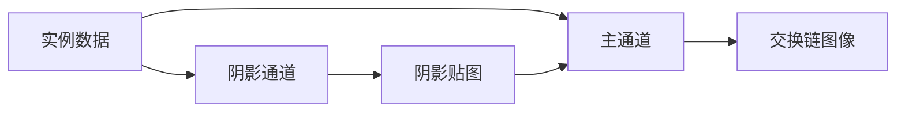

# shadow：方向光阴影贴图

构建方式见仓库根目录的 README。

## 简介

一个前向渲染场景：地面上按网格摆放若干实例，另有一块棋盘格地面用于承接阴影。场景里只有一盏方向光，它的方位角与高度角可以在界面上调整。

阴影用一张贴图实现，分两步：

- 阴影通道：从光源方向把实例背面的深度写进贴图。只写背面让受光表面在深度比较时稳定地处在已写入深度之前，从源头上避免自阴影条纹。贴图的分辨率与每纹素的位数都可以在界面上更改，位数决定贴图的格式，8 位用 `R8_UNORM`、16 位用 `R16_UNORM`、32 位用 `R32_SFLOAT`。
- 主通道：正常做前向光照，同时把像素的世界位置投影到光源的正交投影空间，用投影得到的深度与贴图里存的深度做比较，得到该点的受光比例，再乘进方向光的直接光照里。

深度值存在颜色附件里，比较在片元着色器里手动完成。

受光比例有三种取值方式，界面上可以切换：

| 模式 | 开关 | 说明 |
| --- | --- | --- |
| 无阴影 | 关闭"启用阴影" | 受光比例恒为 1，只有方向光的直接光照 |
| 硬阴影 | 开启阴影、关闭 PCF | 贴图上取一次比较结果，边界是硬边 |
| 软阴影 | 开启阴影与 PCF | 在 3 × 3 个纹素上各取一次比较再取平均，边界变宽并带渐变 |

实例、相机与着色器里的数据结构与其他 case 共用 `common` 下的定义，本 case 只实现自己的渲染通道、管线与控制面板。

## 渲染流程



## 实现要点

### 光源使用正交投影

场景里只有一盏方向光，方向光的全部光线互相平行。光线平行带来一个结果：着色点沿光线方向投影到光源平面上时，投影位置与它到光源的距离无关，一整束平行光线在投影平面上收缩成同一点。正交投影描述的正是这种平行光线，投影矩阵里没有透视除法，世界位置在光源空间的深度沿光线方向线性变化。

透视投影描述的是从一个位置发散的光线，点光源与聚光灯属于这一类。用透视投影去投影方向光，光源被当作一个有限距离的点，同一个平面上的深度随到光源轴心的距离变化，阴影轮廓随物体到光源的距离缩放，深度比较随之出现偏差。光源一侧因此使用正交投影。

正交投影的清晰度只由视锥横截面决定，与光源距离无关：视锥开得越小，单个纹素覆盖的世界范围越小，阴影边缘越锐利。

同理，固定视锥不变，阴影贴图 size 越大，单个 texel 覆盖的世界范围越小，阴影质量越高。

512x512


1024x1024


### 正交视锥的拟合

视锥的半边长取当前实例网格的水平半边长与物体包围球半径之和，并以 10 为下限。实例数量增加时网格变宽，视锥随之变大，单个纹素的世界尺寸变大，阴影分辨率下降；界面上减少实例数量，或者调高贴图分辨率，都能换回清晰度。

光源的中心点抬高到半径的 0.1 倍，视线位置沿光源方向放在离中心 2.5 倍半径处，正交矩阵的近平面取 0.1、远平面取半径的 6 倍，把整个场景包在深度范围内。

正交矩阵创建后翻转第二行第二列，适配 Vulkan 裁剪空间 Y 轴朝下的约定。

### 自阴影的抑制

自阴影条纹来自写入的深度与受光表面自身的深度过于接近。代码里有三处措施，面板上可以逐项开关，另外基础深度偏移可以用滑块调节：

- 只写背面深度：阴影通道剔除正面，写入的深度取自物体背面，受光表面因此稳定处在它之前，深度余量就是物体在光线方向上的厚度。关闭后改写入正面深度，余量只剩浮点误差，自阴影条纹立刻出现。
- 法线抬升采样点：着色器把比较位置沿世界法线挪出去，距离取世界空间里一个阴影贴图纹素的宽度。
- 掠射角放大偏移：着色器按入射角放大基础深度偏移，掠射角下偏移量随之增大。
- 基础深度偏移：比较时从参考深度里减去的常数，默认 0.0005，单位是归一化后的深度。调到零可以单独观察前几项各自的作用，调得过大则会让物体与地面相接处的阴影脱开。

只关掉其中某一项时，其余几项仍在兜底，画面变化不大；把只写背面深度关掉、同时把基础深度偏移拉到零，条纹会明显爬满受光表面。

阴影贴图的深度值由片元着色器写进颜色附件，光栅化的多边形深度偏移只作用在深度测试上，影响不到写入的深度值，因此这里没有启用它。

只写背面深度决定阴影管线的剔除面，改动时重建管线；法线抬升、掠射角放大偏移与基础深度偏移只进 uniform，不触发重建。

### 地面是否参与投影

阴影通道默认只画物体实例，地面那一份实例变换放在实例缓冲末尾，绘制范围取不到它，因此地面只在主通道里当接收者。面板上的「地面写入阴影贴图」把地面也画进阴影通道，它在阴影通道里不剔除，用单独一条管线。

自阴影条纹要求同一个表面既写入贴图又参与比较。地面是一整块没有厚度的平面，写进去之后它拿自己刚写入的深度与自己比较，深度上不留余量，受光比例按贴图纹素跳变，整块地面都会出现条纹。这正好说明条纹只在写入贴图的表面上产生：地面不写进去时，无论关掉多少项处理，它都不会有条纹。

地面参与投影之后，基础深度偏移与位数的作用也变得直观：偏移调零时条纹最重，偏移调大后条纹被推回去；位数降到 8 位时，量化档距本身就超过了填补余量所需的偏移，默认偏移下条纹也会大量出现。

### 深度值的存储与比较

深度值写进一张颜色附件，采样器不做硬件比较，主通道逐纹素取出深度后在着色器里手动比较：参考深度不大于贴图里存的深度就算受光。采样器的滤波必须是最近邻，否则会把相邻纹素的深度值平均掉。

采样器的寻址方式为边界钳制，边界色为不透明白色。参考深度落在贴图范围之外时比较结果为受光，避免贴图边缘出现整片黑。

贴图范围的判定在着色器里再做一次，投影落到范围之外的着色点按完全受光处理。

位数决定深度值能分辨多少档：32 位的浮点格式几乎不丢精度，16 位把深度分成 65536 档，8 位只有 256 档。档位变少时阴影边界会出现台阶状的位移，因为受光与背光的判定在深度轴上被量化了。

### 阴影贴图的布局与同步

阴影通道有颜色与深度两个附件。颜色附件保存深度值，通道结束时转到只读布局；深度附件只用于深度测试，挑出沿光线离光源最近的背面，它的内容不需要保留。关闭阴影时阴影通道不执行，主通道仍然绑定颜色附件，它的布局必须与描述符里声明的只读布局一致，因此创建时就转到只读。

阴影通道的渲染通道有两条子通道依赖：一条等上一帧主通道读完贴图再开始写，一条等写完之后再交给片元着色器采样。

### 交换链重建的边界

主通道的深度附件与呈现帧缓冲跟随交换链尺寸，窗口尺寸变化时只重建这两项。阴影贴图与交换链尺寸无关，窗口尺寸变化不影响它，只有界面上的分辨率或深度值位数改动才会重建它。

### 阴影贴图的重建

界面上的分辨率与深度值位数改动后，渲染器在下一帧开头重建阴影贴图的全部资源。采样器与贴图无关，保持不变；渲染通道与阴影管线跟随位数，因为附件格式变了；帧缓冲与两张纹理跟随分辨率；重建完成后把新的贴图视图重新写进材质描述符的绑定 5。重建前先等设备空闲，避免拆掉还在被上一帧使用的贴图与管线，因此改动是低频操作。

## 界面控件

| 控件 | 作用 |
| --- | --- |
| 实例数量 | 参与绘制的实例数量，实例按到网格中心的距离排序 |
| 移动速度 | 相机移动速度 |
| 方位角 | 光源绕 Y 轴的方向 |
| 高度角 | 光源与水平面的夹角，越大越接近正上方 |
| 启用阴影 | 关闭后完全不做深度比较，用作对照 |
| PCF 软阴影 | 关闭后只做一次深度比较，得到硬阴影 |
| 分辨率 | 阴影贴图的边长，可选 512、1024、2048、4096，改动后重建贴图 |
| 深度值位数 | 每纹素存深度值的位数，可选 8、16、32，改动后重建渲染通道与管线 |
| 只写背面深度 | 阴影通道的剔除面，关闭后写入正面深度，可以观察自阴影条纹 |
| 法线抬升采样点 | 采样位置沿世界法线抬起，关闭后条纹变多 |
| 掠射角放大偏移 | 按入射角放大深度偏移，关闭后掠射角处的条纹变多 |
| 基础深度偏移 | 比较时的常数偏移，拉到零可以单独观察上面几项的作用 |
| 地面写入阴影贴图 | 把地面也画进阴影通道，地面因此与自己比较而出现条纹 |
| GPU 锁频 | 与间接绘制 case 共用同一个面板 |

面板同时显示绘制命令条数与阴影贴图说明，另附操作指南；耗时面板按本 case 的通道拆分逐项列出。

## 命令行参数

命令行参数与界面控制同一套状态，用于自动化测试：

| 参数 | 含义 | 默认值 |
| --- | --- | --- |
| `--instances N` | 启动时的实例数量 | 2000 |
| `--light-yaw D` | 光源方位角，单位度 | 135 |
| `--light-pitch D` | 光源高度角，单位度 | 30 |
| `--no-shadows` | 启动时关闭阴影 | 开启 |
| `--no-pcf` | 启动时关闭 PCF，得到硬阴影 | 开启 |
| `--shadow-size N` | 阴影贴图的边长，取值 256 到 4096 | 2048 |
| `--shadow-bits N` | 每纹素存深度值的位数，取 8、16 或 32 | 32 |
| `--no-back-face-depth` | 启动时改写入正面深度 | 只写背面 |
| `--no-normal-lift` | 启动时关闭法线抬升 | 开启 |
| `--no-slope-bias` | 启动时关闭掠射角放大偏移 | 开启 |
| `--depth-offset F` | 基础深度偏移，取值 0 到 0.004 | 0.0005 |
| `--ground-caster` | 启动时把地面也画进阴影通道 | 只画物体 |
| `--no-interface` | 不显示界面面板 | 显示 |
| `--auto-exit S` | 运行 S 秒后自动退出 | 关闭 |
| `--capture 文件名` | 退出前把画面写成 PNG 并打印像素统计 | 关闭 |
| `--report 文件名` | 退出前把本次运行的平均耗时以 CSV 形式追加到该文件 | 关闭 |
| `--control-port N` | 打开 TCP 控制服务并监听该端口 | 关闭 |
| `--core-clock N` | 启动时锁定的核心频率，单位 MHz，取最接近的可选档位 | 不锁频 |
| `--memory-clock N` | 启动时锁定的显存频率，单位 MHz，取最接近的可选档位 | 不锁频 |

键盘操作：`W` `A` `S` `D` 前后左右移动，`Q` `E` 下降与上升，方向键转动视角，左 Shift 加速，Esc 退出。

## 测试方法

三种模式的画面差异可以用抓帧对比：

```
build\meow_shadow.exe --instances 2000 --auto-exit 4 --no-interface --capture intermediate\shadow_off.png --no-shadows
build\meow_shadow.exe --instances 2000 --auto-exit 4 --no-interface --capture intermediate\shadow_hard.png --no-pcf
build\meow_shadow.exe --instances 2000 --auto-exit 4 --no-interface --capture intermediate\shadow_pcf.png
```

关闭阴影的那张应当完全没有被遮挡关系影响的明暗；硬阴影与软阴影两张的差别集中在阴影边界附近，软阴影的边界更宽、过渡带里有中间灰。

贴图分辨率与深度值位数也可以指定，用来看量化带来的差别：

```
build\meow_shadow.exe --instances 2000 --auto-exit 4 --no-interface --capture intermediate\shadow_b8.png --shadow-bits 8 --shadow-size 512
build\meow_shadow.exe --instances 2000 --auto-exit 4 --no-interface --capture intermediate\shadow_b16.png --shadow-bits 16 --shadow-size 2048
build\meow_shadow.exe --instances 2000 --auto-exit 4 --no-interface --capture intermediate\shadow_b32.png --shadow-bits 32 --shadow-size 2048
```

分辨率降到 512 时单个纹素覆盖的世界范围变粗，阴影边界随之变钝；位数降到 8 位时深度只剩 256 档，阴影边界出现台阶并整体偏移。

三项瑕疵处理与基础深度偏移也可以逐项关掉，关得越多，画面上的条纹与漏光越明显：

```
build\meow_shadow.exe --instances 2000 --auto-exit 4 --no-interface --capture intermediate\shadow_plain.png --no-back-face-depth --no-normal-lift --no-slope-bias --depth-offset 0
build\meow_shadow.exe --instances 2000 --auto-exit 4 --no-interface --capture intermediate\shadow_front.png --no-back-face-depth
build\meow_shadow.exe --instances 2000 --auto-exit 4 --no-interface --capture intermediate\shadow_leak.png --depth-offset 0.004
```

第一张把保护全部撤掉，条纹最重；第二张只关掉只写背面深度，用来单独看这一项的作用；第三张把基础深度偏移拉到上限，可以看到物体与地面相接处的阴影脱开。

地面参与投影的开关单独抓帧：

```
build\meow_shadow.exe --instances 2000 --auto-exit 4 --no-interface --capture intermediate\shadow_ground.png --ground-caster --depth-offset 0
build\meow_shadow.exe --instances 2000 --auto-exit 4 --no-interface --capture intermediate\shadow_ground8.png --ground-caster --shadow-bits 8
```

第一张是地面写进贴图、基础深度偏移调零，整块地面出现条纹；第二张保留默认偏移但把位数降到 8 位，量化档距超过填补余量所需的偏移，条纹同样大量出现。

光源角度可以在同一次运行里改变，用来看阴影随光源移动的方向：

```
adb -s <serial> forward tcp:21000 tcp:21000
```

桌面端用 `--control-port 21000` 启动后，连接并逐行发命令：`instances`/`yaw`/`pitch` 改配置，`shadows 1`/`shadows 0` 开关阴影，`pcf 1`/`pcf 0` 开关软阴影，`shadow-size` 与 `shadow-bits` 改贴图配置并触发重建，`back-face-depth`/`normal-lift`/`slope-bias` 取 0 或 1 逐项开关瑕疵处理，`depth-offset` 改基础深度偏移，`ground-caster 0|1` 开关地面参与投影，`begin` 与 `end` 圈定一段测量（`end` 返回一行与 CSV 同格式的数据），`quit` 退出。

随时间变化的参数曲线与测量报告格式与间接绘制 case 一致，报告里的前两列是实例数量与绘制命令条数。

## 源码结构

本 case 自己的文件都在 `cases/shadow` 下：

| 文件 | 内容 |
| --- | --- |
| `src/main.cpp` | 桌面入口：命令行解析、主循环与界面状态 |
| `src/android_main.cpp` | 安卓入口：NativeActivity 生命周期、ANativeWindow 表面与交换链、主循环 |
| `src/renderer.cpp` | 阴影与主通道两个渲染通道、四条管线、阴影贴图的创建与重建、时间戳查询 |
| `src/scene_setup.cpp` | 地面网格、实例网格摆放、光源正交投影需要的网格范围 |
| `src/case_ui.cpp` | 本 case 的控制面板与全部界面文本 |
| `src/timing_items.cpp` | 本 case 的计时项定义 |
| `shaders/shadow.vert` | 阴影通道的顶点变换 |
| `shaders/shadow.frag` | 阴影通道，把窗口深度写进颜色附件 |
| `shaders/scene.vert` `shaders/scene.frag` | 主通道的物体 |
| `shaders/ground.frag` | 主通道的地面，棋盘格图案 |
| `shaders/shadow_sampling.glsl` | 手动深度比较与 PCF |
| `shaders/lighting_common.glsl` | 方向光的直接光照 |

## 安卓端差异

- 实例与设备申请 Vulkan 1.1，着色器以 `--target-env=vulkan1.1` 编译，覆盖只支持 1.1 的设备；`minSdk` 24 是 Vulkan 1.0 的最低 API 等级。
- 设备时间只在设备支持时间戳时测量：驱动的 `timestampComputeAndGraphics` 能力与图形队列族的 `timestampValidBits` 都满足才创建查询池并记录时间戳，不支持的设备上"设备时间"恒为零，主机侧各项计时照常。
- GPU 锁频面板不显示：它依赖桌面的 `nvidia-smi`。
- 相机固定在初始化位置，没有键盘输入；触摸事件交给 ImGui 的安卓后端，面板上的滑块和按钮可以直接操作。
- 帧率上限 60 FPS，避免无界空转发热。

### 安卓测试方法

adb 的目标设备由设备序列号指定，序列号用 `adb devices` 查询。只连接一台设备时命令里的 `-s <serial>` 可以省略。构建出 APK 后按下面方式安装并查看日志：

```
adb -s <serial> install -r android\app\build\outputs\apk\debug\app-debug.apk
adb -s <serial> logcat -s MeowVulkanDemo
```

应用内置回环 TCP 控制服务（桌面与安卓一致，端口 21000），安卓端经 `adb forward tcp:21000 tcp:21000` 把设备上的控制端口映射到本机，命令与桌面端相同。
