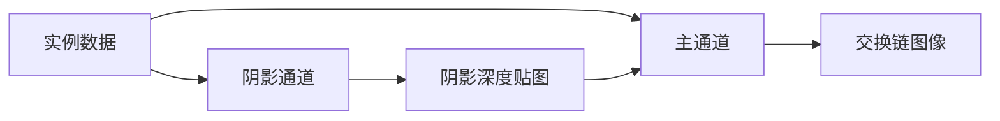

# shadow：方向光阴影贴图

构建方式见仓库根目录的 README。

## 简介

一个前向渲染场景：地面上按网格摆放若干实例，另有一块棋盘格地面用于承接阴影。场景里只有一盏方向光，它的方位角与高度角可以在界面上调整。

阴影用一张深度贴图实现，分两步：

- 阴影通道：从光源方向把实例的背面深度写进一张 2048 × 2048 的深度贴图。只写背面而不是正面，让受光表面在深度比较时稳定地处在已写入深度之前，从源头上避免自阴影条纹。
- 主通道：正常做前向光照，同时把像素的世界位置投影到光源的正交投影空间，用投影得到的深度与深度贴图做比较，得到该点的受光比例，再乘进方向光的直接光照里。

受光比例有三种取值方式，界面上可以切换：

| 模式 | 开关 | 说明 |
| --- | --- | --- |
| 无阴影 | 关闭"启用阴影" | 受光比例恒为 1，只有方向光的直接光照 |
| 硬阴影 | 开启阴影、关闭 PCF | 深度贴图上取一次比较结果，边界是硬边 |
| 软阴影 | 开启阴影与 PCF | 在 3 × 3 个纹素上各取一次比较再取平均，边界变宽并带渐变 |

实例、相机与着色器里的数据结构与其他 case 共用 `common` 下的定义，本 case 只实现自己的渲染通道、管线与控制面板。

## 渲染流程



## 界面控件

| 控件 | 作用 |
| --- | --- |
| 实例数量 | 参与绘制的实例数量，实例按到网格中心的距离排序 |
| 移动速度 | 相机移动速度 |
| 方位角 | 光源绕 Y 轴的方向 |
| 高度角 | 光源与水平面的夹角，越大越接近正上方 |
| 启用阴影 | 关闭后完全不做深度比较，用作对照 |
| PCF 软阴影 | 关闭后只做一次深度比较，得到硬阴影 |
| GPU 锁频 | 与间接绘制 case 共用同一个面板 |

面板同时显示绘制命令条数与阴影贴图说明，另附操作指南；耗时面板按本 case 的通道拆分逐项列出。

## 命令行参数

命令行参数与界面控制同一套状态，用于自动化测试：

| 参数 | 含义 | 默认值 |
| --- | --- | --- |
| `--instances N` | 启动时的实例数量 | 2000 |
| `--light-yaw D` | 光源方位角，单位度 | 135 |
| `--light-pitch D` | 光源高度角，单位度 | 30 |
| `--no-shadows` | 启动时关闭阴影 | 开启 |
| `--no-pcf` | 启动时关闭 PCF，得到硬阴影 | 开启 |
| `--no-interface` | 不显示界面面板 | 显示 |
| `--auto-exit S` | 运行 S 秒后自动退出 | 关闭 |
| `--capture 文件名` | 退出前把画面写成 PNG 并打印像素统计 | 关闭 |
| `--report 文件名` | 退出前把本次运行的平均耗时以 CSV 形式追加到该文件 | 关闭 |
| `--control-port N` | 打开 TCP 控制服务并监听该端口 | 关闭 |
| `--core-clock N` | 启动时锁定的核心频率，单位 MHz，取最接近的可选档位 | 不锁频 |
| `--memory-clock N` | 启动时锁定的显存频率，单位 MHz，取最接近的可选档位 | 不锁频 |

键盘操作：`W` `A` `S` `D` 前后左右移动，`Q` `E` 下降与上升，方向键转动视角，左 Shift 加速，Esc 退出。

## 测试方法

三种模式的画面差异可以用抓帧对比：

```
build\meow_shadow.exe --instances 2000 --auto-exit 4 --no-interface --capture intermediate\shadow_off.png --no-shadows
build\meow_shadow.exe --instances 2000 --auto-exit 4 --no-interface --capture intermediate\shadow_hard.png --no-pcf
build\meow_shadow.exe --instances 2000 --auto-exit 4 --no-interface --capture intermediate\shadow_pcf.png
```

关闭阴影的那张应当完全没有被遮挡关系影响的明暗；硬阴影与软阴影两张的差别集中在阴影边界附近，软阴影的边界更宽、过渡带里有中间灰。

光源角度可以在同一次运行里改变，用来看阴影随光源移动的方向：

```
adb -s <serial> forward tcp:21000 tcp:21000
```

桌面端用 `--control-port 21000` 启动后，连接并逐行发命令：`instances`/`yaw`/`pitch` 改配置，`shadows 1`/`shadows 0` 开关阴影，`pcf 1`/`pcf 0` 开关软阴影，`begin` 与 `end` 圈定一段测量（`end` 返回一行与 CSV 同格式的数据），`quit` 退出。

随时间变化的参数曲线与测量报告格式与间接绘制 case 一致，报告里的前两列是实例数量与绘制命令条数。

## 源码结构

本 case 自己的文件都在 `cases/shadow` 下：

| 文件 | 内容 |
| --- | --- |
| `src/main.cpp` | 桌面入口：命令行解析、主循环与界面状态 |
| `src/android_main.cpp` | 安卓入口：NativeActivity 生命周期、ANativeWindow 表面与交换链、主循环 |
| `src/renderer.cpp` | 阴影与主通道两个渲染通道、三条管线、深度贴图与比较采样器、时间戳查询 |
| `src/scene_setup.cpp` | 地面网格、实例网格摆放、光源正交投影需要的网格范围 |
| `src/case_ui.cpp` | 本 case 的控制面板与全部界面文本 |
| `src/timing_items.cpp` | 本 case 的计时项定义 |
| `shaders/shadow.vert` | 阴影通道，只输出深度 |
| `shaders/scene.vert` `shaders/scene.frag` | 主通道的物体 |
| `shaders/ground.frag` | 主通道的地面，棋盘格图案 |
| `shaders/shadow_sampling.glsl` | 深度比较与 PCF |
| `shaders/lighting_common.glsl` | 方向光的直接光照 |

## 安卓端差异

- 实例与设备申请 Vulkan 1.1，着色器以 `--target-env=vulkan1.1` 编译，覆盖只支持 1.1 的设备；`minSdk` 24 是 Vulkan 1.0 的最低 API 等级。
- 设备时间只在设备支持时间戳时测量：驱动的 `timestampComputeAndGraphics` 能力与图形队列族的 `timestampValidBits` 都满足才创建查询池并记录时间戳，不支持的设备上"设备时间"恒为零，主机侧各项计时照常。
- GPU 锁频面板不显示：它依赖桌面的 `nvidia-smi`。
- 相机固定在初始化位置，没有键盘输入；触摸事件交给 ImGui 的安卓后端，面板上的滑块和按钮可以直接操作。
- 帧率上限 60 FPS，避免无界空转发热。

### 安卓测试方法

adb 的目标设备由设备序列号指定，序列号用 `adb devices` 查询。只连接一台设备时命令里的 `-s <serial>` 可以省略。构建出 APK 后按下面方式安装并查看日志：

```
adb -s <serial> install -r android\app\build\outputs\apk\debug\app-debug.apk
adb -s <serial> logcat -s MeowVulkanDemo
```

应用内置回环 TCP 控制服务（桌面与安卓一致，端口 21000），安卓端经 `adb forward tcp:21000 tcp:21000` 把设备上的控制端口映射到本机，命令与桌面端相同。
