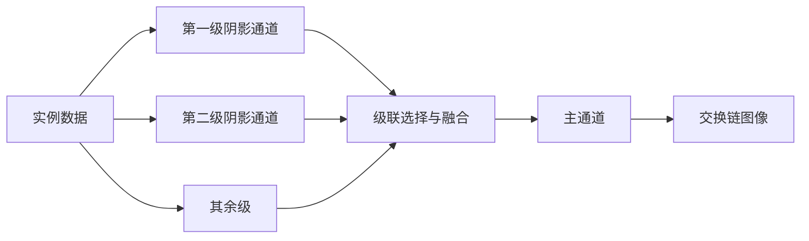

# shadow_extended：级联阴影、PCSS 与矩阴影

构建方式见仓库根目录的 README。

## 简介

在方向光阴影贴图的基础上扩展四项内容：级联、级间融合、遮挡物搜索（PCSS）与矩阴影（VSM），另外把阴影坐标的计算位置做成开关。场景与 shadow case 一致：地面上按网格摆放实例，另有一块棋盘格地面，相机的远平面拉到网格的十二倍，级联才有分段的必要。

| 控件 | 说明 |
| --- | --- |
| 级联级数 | 1、2、4 级，每级一张同分辨率的阴影贴图 |
| 级间融合 | 在分界附近同时取相邻两级并插值 |
| 搜索半径 | 遮挡物搜索的范围，大于零时启用 PCSS |
| 半影系数 | 半影大小相对遮挡深度的比例 |
| 分辨率 | 每一级阴影贴图的边长，512 到 4096 |
| 取值方式 | 深度比较，或者存一阶与二阶矩并用切比雪夫不等式估算 |
| 坐标计算位置 | 片元里算，或者顶点里算完插值给片元 |
| 视图 | 正常、级联着色、受光比例 |

阴影贴图以颜色附件保存深度或矩，主通道手动比较。四级贴图作为一组写进绑定 5 的数组。

## 渲染流程



阴影通道按级数逐级绘制，每级一个渲染通道实例与一次绘制命令，因此绘制命令条数随级数线性增长。

## 实现要点

### 级联的划分与拟合

视锥按距离切成若干段，划分采用对数划分与均匀划分各占一半的做法，近处分段密、远处分段疏。每一级用包围球拟合：取这一段视锥沿视线方向的中点作为球心，球半径覆盖这一段视锥的横截面，正交视锥按球半径开，这样拟合结果与光源方向无关，光源转动时级联范围不会跳动。

### 级间融合

相邻两级的纹素密度不同，分界处会出现宽度突变。融合在分界附近同时取相邻两级，按落点在分界区间内的位置插值，接缝随之消失。

### 遮挡物搜索

PCSS 先在较大范围内找出被遮挡的纹素，按平均遮挡深度估计半影大小，再用这个半径做 PCF。物体与地面接触处遮挡物很近，半影小、边界硬；遮挡物离接收面远时半影大、边界柔和，两者之间的过渡由搜索半径与半影系数控制。

### 矩与切比雪夫

矩模式把深度的平均值与平方的平均值存进两通道贴图，采样时用切比雪夫不等式估算参考深度被遮挡的概率。估算式在遮挡物与接收面很接近时会给出偏小的概率，表现为漏光。

### 坐标的计算位置

坐标在片元里算时，每个片元用世界位置与光源矩阵直接投影；放在顶点里算则会先算出顶点的光源空间位置，再按屏幕重心插值给片元。透视除法之后的位置沿三角形是线性的，小三角形上两种做法几乎没有差别，大三角形或跨越级联边界时插值结果会偏离。

## 界面控件

| 控件 | 作用 |
| --- | --- |
| 实例数量 | 参与绘制的实例数量 |
| 移动速度 | 相机移动速度 |
| 方位角 / 高度角 | 光源方向 |
| 启用阴影 / PCF 软阴影 | 与 shadow case 一致 |
| 级联级数 / 级间融合 | 本节内容 |
| 搜索半径 / 半影系数 | 遮挡物搜索的参数 |
| 分辨率 / 取值方式 / 坐标计算位置 / 视图 | 阴影贴图与可视化 |
| 法线抬升 / 掠射角放大偏移 / 基础深度偏移 / 地面写入阴影贴图 | 瑕疵处理 |
| GPU 锁频 | 与间接绘制 case 共用同一个面板 |

## 命令行参数

命令行参数与界面控制同一套状态，用于自动化测试：

| 参数 | 含义 | 默认值 |
| --- | --- | --- |
| `--instances N` | 启动时的实例数量 | 2000 |
| `--cascades N` | 级联级数，取 1、2 或 4 | 1 |
| `--no-cascade-blend` | 启动时关闭级间融合 | 开启 |
| `--vsm` | 启动时用矩与切比雪夫 | 深度比较 |
| `--vertex-coords` | 启动时在顶点里算阴影坐标 | 片元里算 |
| `--view 名字` | 视图，取 `final`、`cascades` 或 `visibility` | final |
| `--blocker-radius F` | 遮挡物搜索半径，取值 0 到 8 | 0 |
| `--penumbra F` | 半影系数 | 1 |
| `--shadow-size N` | 每一级的阴影贴图边长，256 到 4096 | 2048 |
| `--no-shadows` / `--no-pcf` | 关闭阴影或关闭 PCF | 开启 |
| `--no-normal-lift` / `--no-slope-bias` / `--depth-offset F` / `--ground-caster` | 瑕疵处理 | 见 shadow case |
| `--light-yaw D` / `--light-pitch D` | 光源方向 | 135 / 30 |
| `--no-interface` / `--auto-exit S` / `--capture F` / `--report F` / `--control-port N` | 与其他 case 一致 | |

键盘操作：`W` `A` `S` `D` 前后左右移动，`Q` `E` 下降与上升，方向键转动视角，左 Shift 加速，Esc 退出。

## 测试方法

逐项抓帧对比：

```
build\meow_shadow_extended.exe --auto-exit 4 --no-interface --instances 1500 --capture intermediate\se_c1.png
build\meow_shadow_extended.exe --auto-exit 4 --no-interface --instances 1500 --cascades 4 --capture intermediate\se_c4.png
build\meow_shadow_extended.exe --auto-exit 4 --no-interface --instances 1500 --cascades 4 --view cascades --capture intermediate\se_casc.png
build\meow_shadow_extended.exe --auto-exit 4 --no-interface --instances 1500 --vsm --capture intermediate\se_vsm.png
build\meow_shadow_extended.exe --auto-exit 4 --no-interface --instances 1500 --blocker-radius 4 --capture intermediate\se_pcss.png
build\meow_shadow_extended.exe --auto-exit 4 --no-interface --instances 1500 --vertex-coords --capture intermediate\se_vertex.png
```

以单级为基准的逐像素差异：

| 配置 | 差异像素占比 |
| --- | --- |
| 四级级联 | 4.86% |
| 矩与切比雪夫 | 4.35% |
| 遮挡物搜索半径 4 | 2.38% |
| 坐标在顶点计算 | 0.00% |

绘制命令条数随级数增长：

| 级数 | 绘制命令条数 |
| --- | --- |
| 1 | 3 |
| 2 | 4 |
| 4 | 6 |

条数是每一级的两次阴影绘制加主通道的两次。坐标计算位置这一项在本场景里看不出差别：这里的三角形都很小，透视除法之后的位置沿三角形接近线性，插值结果与逐片元计算一致；网格换成大三角形或跨越级联边界时才会出现偏离。

参数可以在同一次运行里改变：

```
adb -s <serial> forward tcp:21000 tcp:21000
```

桌面端用 `--control-port 21000` 启动后，连接并逐行发命令：`cascades`/`shadow-size`/`value-mode`/`coord-mode`/`view`/`blocker-radius`/`penumbra`/`shadows`/`pcf`/`cascade-blend` 等改配置，`begin` 与 `end` 圈定一段测量，`quit` 退出。

## 源码结构

本 case 自己的文件都在 `cases/shadow_extended` 下：

| 文件 | 内容 |
| --- | --- |
| `src/main.cpp` | 桌面入口：命令行解析、级联划分与逐级正交投影、主循环 |
| `src/android_main.cpp` | 安卓入口：NativeActivity 生命周期、表面与交换链、主循环 |
| `src/renderer.cpp` | 阴影与主通道两个渲染通道、四条管线、四级贴图与描述符数组、重建路径 |
| `src/scene_setup.cpp` | 地面网格、实例网格摆放、光源正交投影需要的网格范围 |
| `src/case_ui.cpp` | 本 case 的控制面板与全部界面文本 |
| `src/timing_items.cpp` | 本 case 的计时项定义 |
| `shaders/shadow.vert` | 阴影通道，级数由推送常量给出 |
| `shaders/shadow_depth.frag` | 深度模式，把窗口深度写进颜色附件 |
| `shaders/shadow_moments.frag` | 矩模式，写一阶与二阶矩 |
| `shaders/scene.vert` `shaders/scene.frag` | 主通道的物体 |
| `shaders/ground.frag` | 主通道的地面 |
| `shaders/shadow_sampling.glsl` | 级联选择与融合、深度比较、切比雪夫、PCF 与 PCSS |
| `shaders/lighting_common.glsl` | 方向光的直接光照 |

## 安卓端差异

- 实例与设备申请 Vulkan 1.1，着色器以 `--target-env=vulkan1.1` 编译；`minSdk` 24 是 Vulkan 1.0 的最低 API 等级。
- 设备时间只在设备支持时间戳时测量，不支持的设备上"设备时间"恒为零。
- GPU 锁频面板不显示：它依赖桌面的 `nvidia-smi`。
- 相机固定在初始化位置，没有键盘输入；触摸事件交给 ImGui 的安卓后端。
- 帧率上限 60 FPS，避免无界空转发热。

### 安卓测试方法

```
adb -s <serial> install -r android\app\build\outputs\apk\debug\app-debug.apk
adb -s <serial> logcat -s MeowVulkanDemo
```

应用内置回环 TCP 控制服务（端口 21000），安卓端经 `adb forward tcp:21000 tcp:21000` 映射到本机，命令与桌面端相同。
