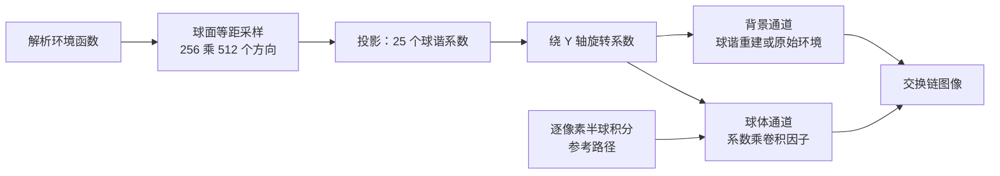

# spherical_harmonics：球谐环境光照与漫反射辐照度

构建方式见仓库根目录的 README。

## 简介

环境是一段解析函数：天顶到地平线的渐变、经过一段平滑过渡落到暗地面，再加上一个余弦幂次的光晕（
[`shaders/environment_common.glsl:120-136`](shaders/environment_common.glsl#L120-L136)
，处理器上对应的实现见 [`src/scene_setup.cpp:20-40`](src/scene_setup.cpp#L20-L40)）。它在球面上等距采样
256 乘 512 个方向做数值积分（[`src/scene_setup.cpp:82-111`](src/scene_setup.cpp#L82-L111)），投影成 1 到
5 阶的球谐系数（[`src/main.cpp:408-420`](src/main.cpp#L408-L420)），也就是 2 到 25 个三元组（
[`src/scene_setup.h:10-11`](src/scene_setup.h#L10-L11)
）。

球体的漫反射辐照度有两条路径：用系数乘上卷积因子（
[`shaders/environment_common.glsl:110-117`](shaders/environment_common.glsl#L110-L117)
），或者在片元里逐像素对半球做数值积分（
[`shaders/environment_common.glsl:139-163`](shaders/environment_common.glsl#L139-L163)
）。后者是参考，两者的画面差就是球谐近似的误差。背景也可以直接在原始环境与球谐重建之间切换（
[`shaders/background.frag:16-21`](shaders/background.frag#L16-L21)
），用来观察重建的细节。

| 控件 | 取值 |
| --- | --- |
| 阶数 | 1 到 5，对应 2、4、9、16、25 个系数（[`src/case_ui.cpp:104-107`](src/case_ui.cpp#L104-L107)、[`src/scene_setup.h:11`](src/scene_setup.h#L11)） |
| 背景 | 球谐重建、原始环境（[`src/renderer.h:14-17`](src/renderer.h#L14-L17)） |
| 球的辐照度 | 球谐系数、逐像素积分（[`src/renderer.h:20-23`](src/renderer.h#L20-L23)） |
| 参考积分采样数 | 16 到 4096，每边开平方个（[`src/case_ui.cpp:117`](src/case_ui.cpp#L117)、[`shaders/environment_common.glsl:146-147`](shaders/environment_common.glsl#L146-L147)） |
| 环境旋转角度 | 0 到 360 度，只旋转系数（[`src/scene_setup.cpp:121-138`](src/scene_setup.cpp#L121-L138)） |
| 天空亮度 / 光晕亮度 / 光晕锐度 | 环境的三项参数（[`src/scene_setup.cpp:29-37`](src/scene_setup.cpp#L29-L37)） |
| 曝光倍数 | 显示用的曝光（[`shaders/environment_common.glsl:26-38`](shaders/environment_common.glsl#L26-L38)） |

## 渲染流程



投影在处理器上做一次（[`src/main.cpp:408-420`](src/main.cpp#L408-L420)
），只有天空亮度、光晕亮度或光晕锐度变化时才重算，上一次的用时显示在面板里（
[`src/case_ui.cpp:126`](src/case_ui.cpp#L126)）。旋转每帧都从原始系数复制一份再转，避免误差累积（
[`src/main.cpp:422-424`](src/main.cpp#L422-L424)）。系数按通道打包成七个 `vec4` 一组填入 uniform（
[`src/main.cpp:78-85`](src/main.cpp#L78-L85)），着色器按同样的排布取出单个分量（
[`shaders/environment_common.glsl:89-97`](shaders/environment_common.glsl#L89-L97)
）。

整个场景只有一个渲染通道，颜色附件就是交换链图像（[`src/renderer.cpp:27-83`](src/renderer.cpp#L27-L83)
），两条管线共用同一个管线布局（[`src/renderer.cpp:179-294`](src/renderer.cpp#L179-L294)
）。背景用全屏三角形铺满画面、不写深度（[`src/renderer.cpp:474-476`](src/renderer.cpp#L474-L476)
），球随后覆盖在它上面、开启深度测试与深度写入（[`src/renderer.cpp:478-481`](src/renderer.cpp#L478-L481)
）。

## 实现要点

### 球谐基与投影

实球谐基 $Y_l^m$ 在球面上正交归一：

$$
\int_{S^2} Y_l^m(\omega) Y_{l'}^{m'}(\omega) \, d\omega = \delta_{ll'} \delta_{mm'}
$$

把环境投影到基上就是逐个基函数做内积：

$$
c_l^m = \int_{S^2} L(\omega) \, Y_l^m(\omega) \, d\omega
$$

重建是系数乘基函数再求和（[`shaders/environment_common.glsl:100-107`](shaders/environment_common.glsl#L100-L107)）：

$$
L(\omega) \approx \sum_{l=0}^{N-1} \sum_{m=-l}^{l} c_l^m Y_l^m(\omega)
$$

25 个基函数按 $l$ 从 0 到 4、每个 $l$ 内 $m$ 从 $-l$ 到 $l$ 排列，索引 0 到 24
各写成一条表达式，处理器侧（[`src/scene_setup.cpp:45-76`](src/scene_setup.cpp#L45-L76)）与着色器侧（
[`shaders/environment_common.glsl:55-86`](shaders/environment_common.glsl#L55-L86)
）各有一份实现，常数一致。

数值上把球面按极角与方位角各分成 256 与 512 份（
[`src/scene_setup.cpp:82-89`](src/scene_setup.cpp#L82-L89)），用格子中心取值（
[`src/scene_setup.cpp:92-93`](src/scene_setup.cpp#L92-L93)），立体角元 $d\omega = \sin\theta \, d\theta
\, d\phi$（[`src/scene_setup.cpp:96`](src/scene_setup.cpp#L96)），每个方向上都把 25 个基函数各累加一次（
[`src/scene_setup.cpp:104-109`](src/scene_setup.cpp#L104-L109)），一次投影是 131072 次采样，用时 7.5
毫秒（[`src/scene_setup.cpp:116`](src/scene_setup.cpp#L116)
）。采样数远高于系数个数，所以投影本身的误差可以忽略，剩下的差别全部来自截断。

常用的球谐表格把 $z$ 当作极轴，这里把 $y$ 与 $z$ 对调，让极轴与场景的上方向一致（
[`src/scene_setup.cpp:42-44`](src/scene_setup.cpp#L42-L44)）。基函数本身仍然是正交归一的，好处是绕 $Y$
轴旋转时每一阶内部的 $\pm m$
两个分量自成一组，旋转公式因此是闭合形式。

### 重建的细节随阶数增长

一阶只有四个分量：常数项给出整体亮度，三个一次项给出沿三个轴的一阶矩（
[`shaders/environment_common.glsl:61-64`](shaders/environment_common.glsl#L61-L64)
），画面只能表达「上方亮下方暗」这样的大致趋势。默认参数下，用重建环境当背景与原始环境比较（
[`shaders/background.frag:17-18`](shaders/background.frag#L17-L18)
）：

| 阶数 | 系数个数 | 平均绝对差 | 超过 8 的像素占比 | 最大差值 |
| --- | --- | --- | --- | --- |
| 1 | 2 | 41.36 | 90.899% | 150 |
| 2 | 4 | 27.85 | 74.772% | 159 |
| 3 | 9 | 19.13 | 41.857% | 118 |
| 4 | 16 | 6.75 | 25.296% | 76 |
| 5 | 25 | 2.60 | 10.470% | 31 |

一阶时九成以上的像素差在 8 个灰阶以上，画面只剩一个粗略的明暗分布；到五阶平均绝对差降到 2.60，光晕的形状与天空的渐变都能看出来。

### 漫反射辐照度与卷积因子

球面上一个法线方向 $n$ 收到的辐照度是上半球入射辐亮度的余弦加权积分：

$$
E(n) = \int_{\Omega(n)} L(\omega) \max(n \cdot \omega, 0) \, d\omega
$$

把 $L$ 换成球谐展开并交换求和与积分，余弦核的积分只跟阶数有关：

$$
E(n) = \sum_{l=0}^{N-1} \hat{A}_l \sum_{m=-l}^{l} c_l^m Y_l^m(n)
$$

这一层求和写成一个循环，逐项把系数、基函数与所属阶数的因子相乘再累加（
[`shaders/environment_common.glsl:110-117`](shaders/environment_common.glsl#L110-L117)
），处理器侧的写法相同（[`src/scene_setup.cpp:162-179`](src/scene_setup.cpp#L162-L179)）。$\hat{A}_l$ 是
Ramamoorthi
给出的卷积因子：

| $l$ | 0 | 1 | 2 | 3 | 4 |
| --- | --- | --- | --- | --- | --- |
| $\hat{A}_l$ | $\pi$ | $2\pi/3$ | $\pi/4$ | $0$ | $-\pi/24$ |

因子取五个常数（[`src/scene_setup.cpp:140-151`](src/scene_setup.cpp#L140-L151)、
[`shaders/environment_common.glsl:40`](shaders/environment_common.glsl#L40)
），每个系数的阶数由一张索引表查出（
[`shaders/environment_common.glsl:41-42`](shaders/environment_common.glsl#L41-L42)
）。三阶的因子恰好是零，四阶是负的。辐照度是球面上很平滑的函数，卷积因子随阶数迅速衰减，
所以低阶系数就够用了。

球的出射辐射亮度再乘上漫反射项（[`shaders/sphere.frag:10-11`](shaders/sphere.frag#L10-L11)、
[`shaders/sphere.frag:24`](shaders/sphere.frag#L24)
）：

$$
L_o = \frac{\rho}{\pi} E(n)
$$

逐像素参考路径用的是余弦加权的分层采样（
[`shaders/environment_common.glsl:139-163`](shaders/environment_common.glsl#L139-L163)
），方向在半球上按下式的概率密度取：

$$
p(\omega) = \frac{\cos\theta}{\pi},
\qquad
E(n) \approx \frac{1}{M} \sum_{i=1}^{M} \frac{L(\omega_i) \cos\theta_i}{p(\omega_i)}
= \pi \cdot \frac{1}{M} \sum_{i=1}^{M} L(\omega_i)
$$

也就是 π 乘采样辐射亮度的平均值：采样点按平方根分布取半径、角度按方位角均匀取值（
[`shaders/environment_common.glsl:150-157`](shaders/environment_common.glsl#L150-L157)
），累加后除以采样个数再乘 π（
[`shaders/environment_common.glsl:162`](shaders/environment_common.glsl#L162)
）。

### 球谐辐照度与参考积分的对照

球的两种着色方式由同一个分支按 uniform 里的取值选择（
[`shaders/sphere.frag:17-22`](shaders/sphere.frag#L17-L22)）。球面区域（画面正中 460 乘 460
的一块）内，系数路径与逐像素积分路径的画面差：

| 阶数 | 平均绝对差 | 超过 8 的像素占比 | 最大差值 |
| --- | --- | --- | --- |
| 1 | 62.82 | 86.758% | 129 |
| 2 | 32.15 | 76.006% | 106 |
| 3 | 2.0124 | 1.497% | 9 |
| 4 | 2.0124 | 1.497% | 9 |
| 5 | 0.0583 | 0.000% | 1 |

三阶与四阶两行完全相同，原因在卷积因子：四阶多出来的那九个系数属于 $l = 3$，而 $\hat{A}_3 = 0$（
[`src/scene_setup.cpp:147`](src/scene_setup.cpp#L147)
），它们对辐照度的贡献严格为零。把阶数从三阶提到四阶，背景会更接近原环境（平均绝对差从 19.13 降到
6.75），球的画面却一模一样。要再进一步必须跳到五阶。

三阶已经足够：平均绝对差 2.01，超过 8 个灰阶的像素只占 1.5%。这与阶数无关的直觉不同——辐照度本身就是低频的，环境里的高频细节经过余弦核积分之后被抹掉了。

球面亮度的分布也能说明问题：一阶时球面亮度在 191.5 到 251.1 之间（球面均值 197.0），整个球几乎一样亮；五阶时扩展到 62.2 到 251.1（球面均值 134.3），暗面与亮面差出三倍多。

### 绕 Y 轴旋转

绕 $Y$ 轴把环境转 $\alpha$ 角，每一阶内部只有 $\pm m$ 两个分量成对混合，$m = 0$ 的分量不动：

$$
c'^{m}_{l} = c^{m}_{l} \cos(m\alpha) - c^{-m}_{l} \sin(m\alpha),
\qquad
c'^{-m}_{l} = c^{-m}_{l} \cos(m\alpha) + c^{m}_{l} \sin(m\alpha)
$$

每一阶里 $m$ 从 1 数到 $l$，一共 1 + 2 + 3 + 4 = 10 对系数，每对两次乘加（
[`src/scene_setup.cpp:124-134`](src/scene_setup.cpp#L124-L134)
），几十条指令，与投影的七毫秒不在一个量级。所以界面上的角度滑块每一帧都可以直接重算，不需要重新做积分（
[`src/main.cpp:422-424`](src/main.cpp#L422-L424)
）。

这条公式可以和另一条路径对照验证：着色器里把采样方向反向旋转 $\alpha$
角之后再查原始环境（背景的「原始环境」模式就是这么做的，
[`shaders/background.frag:20`](shaders/background.frag#L20)；逐像素积分里同样先转回未旋转的坐标系，
[`shaders/environment_common.glsl:158`](shaders/environment_common.glsl#L158)
），逐像素积分得到的结果与旋转系数完全独立。旋转 25 度时两条路径的球面平均绝对差是 0.061，最大差 1
个灰阶，与不旋转时的 0.058
相同，说明旋转本身没有引入误差。

### 锐利光晕重建不出来，辐照度照样准

把光晕锐度从 4 提到 32，光晕收成一个十几度的亮斑，它的球谐展开需要很高的阶数。五阶重建与原环境的差从
2.60 涨到 32.52，画面上能看到明显的过冲与暗环；同一时刻球的辐照度误差却只从 0.0583 涨到 0.5923，最大差 3
个灰阶。

原因还是卷积因子：$\hat{A}_4 = -\pi/24$（[`src/scene_setup.cpp:148`](src/scene_setup.cpp#L148)
），五阶之后的高阶项衰减更快，环境里那些重建不出来的高频分量对余弦加权积分的贡献本来就可以忽略。
背景直接显示环境，误差全暴露；球只关心辐照度，误差被积分抹平。这也是实时渲染里常见的分工：
环境贴图负责高频的反射，球谐负责低频的漫反射。

### 投影与求值的代价

| 配置 | 设备时间 | 每像素的球谐求值次数 |
| --- | --- | --- |
| 一阶系数 | 0.022 | 1 |
| 二阶系数 | 0.023 | 4 |
| 三阶系数 | 0.025 | 9 |
| 四阶系数 | 0.027 | 16 |
| 五阶系数 | 0.031 | 25 |
| 逐像素积分，1024 个采样 | 0.750 | — |

设备时间是整帧的时间戳跨度（[`src/renderer.cpp:438-441`](src/renderer.cpp#L438-L441)、
[`src/renderer.cpp:532-534`](src/renderer.cpp#L532-L534)、
[`src/renderer.cpp:409-410`](src/renderer.cpp#L409-L410)），锁定核心频率 2880 兆赫、显存频率 15001
兆赫，每段测量七秒。球谐求值次数是阶数的平方（
[`shaders/environment_common.glsl:100-107`](shaders/environment_common.glsl#L100-L107)
），但即使五阶也只要二十五次乘加，整帧 0.031 毫秒；逐像素积分每个像素要采样 1024 次（
[`shaders/environment_common.glsl:150-160`](shaders/environment_common.glsl#L150-L160)
），贵出二十四倍。投影那 7.5 毫秒是一次性的，环境参数不变就不需要重算（
[`src/main.cpp:408-420`](src/main.cpp#L408-L420)
）。

## 界面控件

| 控件 | 作用 |
| --- | --- |
| 阶数 | 1 到 5，同时作用于背景重建与球的辐照度 |
| 背景 | 球谐重建或原始环境，切换后立刻能看出重建误差 |
| 球的辐照度 | 球谐系数或逐像素积分 |
| 参考积分采样数 | 每边开平方个，16 到 4096 |
| 环境旋转角度 | 只旋转系数，不重新投影 |
| 天空亮度 / 光晕亮度 / 光晕锐度 | 改变环境后自动重做投影，面板显示上一次投影的用时 |
| 曝光倍数 | 显示用的曝光 |
| 移动速度 | 相机移动速度 |
| GPU 锁频 | 与间接绘制 case 共用同一个面板 |

## 命令行参数

| 参数 | 含义 | 默认值 |
| --- | --- | --- |
| `--bands N` | 阶数，1 到 5 | 5 |
| `--background 名字` | 背景，取 `reconstructed` 或 `original` | original |
| `--shading 名字` | 球的辐照度，取 `coefficients` 或 `reference` | coefficients |
| `--samples N` | 参考积分采样数，16 到 4096 | 1024 |
| `--rotation F` | 环境旋转角度，单位度 | 0 |
| `--exposure F` | 曝光倍数 | 1.0 |
| `--sky F` | 天空亮度 | 1.0 |
| `--glow F` | 光晕亮度 | 4.0 |
| `--exponent F` | 光晕锐度，余弦的幂次 | 4.0 |
| `--no-interface` | 不显示界面面板 | 显示 |
| `--auto-exit S` | 运行 S 秒后自动退出 | 关闭 |
| `--capture 文件名` | 退出前把画面写成 PNG 并打印像素统计 | 关闭 |
| `--report 文件名` | 退出前把本次运行的平均耗时以 CSV 形式追加到该文件 | 关闭 |
| `--control-port N` | 打开 TCP 控制服务并监听该端口 | 关闭 |
| `--core-clock N` | 启动时锁定的核心频率，单位 MHz，取最接近的可选档位 | 不锁频 |
| `--memory-clock N` | 启动时锁定的显存频率，单位 MHz，取最接近的可选档位 | 不锁频 |

键盘操作：`W` `A` `S` `D` 前后左右移动，`Q` `E` 下降与上升，方向键转动视角，左 Shift 加速，Esc 退出。

## 测试方法

球的辐照度逐档对照参考积分：

```
build\meow_spherical_harmonics.exe --background original --shading reference --samples 1024 --auto-exit 3 --no-interface --capture intermediate\sh_ref.png
build\meow_spherical_harmonics.exe --background original --shading coefficients --bands 1 --auto-exit 3 --no-interface --capture intermediate\sh_coef_b1.png
build\meow_spherical_harmonics.exe --background original --shading coefficients --bands 2 --auto-exit 3 --no-interface --capture intermediate\sh_coef_b2.png
build\meow_spherical_harmonics.exe --background original --shading coefficients --bands 3 --auto-exit 3 --no-interface --capture intermediate\sh_coef_b3.png
build\meow_spherical_harmonics.exe --background original --shading coefficients --bands 4 --auto-exit 3 --no-interface --capture intermediate\sh_coef_b4.png
build\meow_spherical_harmonics.exe --background original --shading coefficients --bands 5 --auto-exit 3 --no-interface --capture intermediate\sh_coef_b5.png
```

背景重建逐档对照原始环境：

```
build\meow_spherical_harmonics.exe --background original --bands 5 --auto-exit 3 --no-interface --capture intermediate\sh_orig.png
build\meow_spherical_harmonics.exe --background reconstructed --bands 1 --auto-exit 3 --no-interface --capture intermediate\sh_bg_1.png
build\meow_spherical_harmonics.exe --background reconstructed --bands 5 --auto-exit 3 --no-interface --capture intermediate\sh_bg_5.png
```

旋转与锐度：

```
build\meow_spherical_harmonics.exe --background original --shading reference --samples 1024 --rotation 25 --auto-exit 3 --no-interface --capture intermediate\sh_ref_rot25.png
build\meow_spherical_harmonics.exe --background original --shading coefficients --bands 5 --rotation 25 --auto-exit 3 --no-interface --capture intermediate\sh_coef_rot25.png
build\meow_spherical_harmonics.exe --background original --shading reference --samples 1024 --exponent 32 --auto-exit 3 --no-interface --capture intermediate\sh_ref_sharp.png
build\meow_spherical_harmonics.exe --background original --shading coefficients --bands 5 --exponent 32 --auto-exit 3 --no-interface --capture intermediate\sh_coef_sharp_b5.png
```

测量设备时间：启动一个进程锁频并打开控制服务，按段发送命令，程序把每段的结果追加到 CSV：

```
build\meow_spherical_harmonics.exe --no-interface --control-port 21000 --core-clock 2880 --memory-clock 15001 --report intermediate\sh_measure.csv
```

连上 21000 端口后，`bands`/`background`/`shading`/`samples`/`rotation`/`exposure`/`sky`/`glow`/
`exponent` 改配置，`begin` 与 `end` 圈定一段测量，`quit`
退出。

## 源码结构

| 文件 | 内容 |
| --- | --- |
| `src/main.cpp` | 桌面入口：命令行解析、球谐投影、主循环与界面状态 |
| `src/android_main.cpp` | 安卓入口：NativeActivity 生命周期、表面与交换链、主循环 |
| `src/renderer.cpp` | 背景与球两条管线、渲染通道与时间戳查询 |
| `src/scene_setup.cpp` | 解析环境函数、球谐基与投影、绕 Y 轴的系数旋转、辐照度求值、UV 球 |
| `src/case_ui.cpp` | 本 case 的控制面板与全部界面文本 |
| `src/timing_items.cpp` | 本 case 的计时项定义 |
| `shaders/environment_common.glsl` | 球谐基、重建、辐照度、解析环境与逐像素参考积分，三个着色器共用 |
| `shaders/background.frag` `shaders/fullscreen.vert` | 背景的全屏三角形与两种显示方式 |
| `shaders/sphere.vert` `shaders/sphere.frag` | 球的辐照度，两种来源 |

## 安卓端差异

- 实例与设备申请 Vulkan 1.1；`minSdk` 24 是 Vulkan 1.0 的最低 API 等级。
- 投影在 CPU 上做，131072 次采样在移动端的处理器上比桌面慢一个量级；实际引擎里这一步是离线做的，运行期只读系数。
- 逐像素参考积分那条路径在移动端的分块架构下代价会明显更高，球谐路径的优势更突出。
- 设备时间只在设备支持时间戳时测量。
- GPU 锁频面板不显示：它依赖桌面的 `nvidia-smi`。
- 相机固定在初始化位置，没有键盘输入；触摸事件交给 ImGui 的安卓后端。
- 帧率上限 60 FPS，避免无界空转发热。

### 安卓测试方法

```
adb -s <serial> install -r android\app\build\outputs\apk\debug\app-debug.apk
adb -s <serial> logcat -s MeowVulkanDemo
```

应用内置回环 TCP 控制服务（端口 21000），安卓端经 `adb forward tcp:21000 tcp:21000` 映射到本机，命令与桌面端相同。
