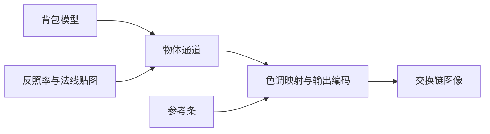

# srgb_linear：sRGB 与线性空间

构建方式见仓库根目录的 README。

## 简介

背包模型加一盏方向光（[`src/main.cpp:70`](src/main.cpp#L70)），屏幕左上角另有一条参考条：四个方块分别按线性值 0.5、0.35、0.18、0.05 绘制（
[`src/scene_setup.cpp:5-10`](src/scene_setup.cpp#L5-L10)），只经过与画面相同的色调映射与输出编码（
[`shaders/bar.frag:14-32`](shaders/bar.frag#L14-L32)），用来把抓帧得到的像素值与理论值直接对照。

颜色空间相关的开关：

| 控件 | 说明 |
| --- | --- |
| 反照率按 sRGB 解释 | 切换反照率贴图绑定的视图（[`src/renderer.cpp:301`](src/renderer.cpp#L301)）：打开时按 sRGB 解码，关闭时按线性使用 |
| 法线按 sRGB 解释 | 切换法线贴图绑定的视图（[`src/renderer.cpp:302`](src/renderer.cpp#L302)），打开时会引入光照方向错误 |
| 输出做伽马编码 | 打开时把线性结果编码回 sRGB，关闭时线性直写（[`shaders/object.frag:40-47`](shaders/object.frag#L40-L47)） |
| 色调映射 | 无、Reinhard、ACES 三种（[`shaders/object.frag:22-38`](shaders/object.frag#L22-L38)） |

两张贴图的图像是同一份数据，线性与 sRGB 属于同一个格式兼容类，因此图像以可换格式创建（[`src/renderer.cpp:327-331`](src/renderer.cpp#L327-L331)），
附加视图把同一张图像按另一种格式解释（[`../../common/src/vk_resources.cpp:248-252`](../../common/src/vk_resources.cpp#L248-L252)
），切换的只是绑上来的视图，不需要重新上传贴图。

## 渲染流程



物体与参考条共用同一个渲染通道、同一份顶点输入与管线布局，两条管线由同一个循环按种类分支创建，差别只在着色器与深度测试（
[`src/renderer.cpp:229-275`](src/renderer.cpp#L229-L275)）。物体通道绑定物体管线与索引缓冲（
[`src/renderer.cpp:521-526`](src/renderer.cpp#L521-L526)），参考条随后绑定另一条管线与另一套顶点缓冲（
[`src/renderer.cpp:528-531`](src/renderer.cpp#L528-L531)）。物体的色调映射与输出编码在同一个片元调用的末尾完成（
[`shaders/object.frag:83-84`](shaders/object.frag#L83-L84)），参考条在片元着色器里独立复现这两个步骤（
[`shaders/bar.frag:18-30`](shaders/bar.frag#L18-L30)）。

## 实现要点

### 贴图的解释方式

颜色类贴图按 sRGB 解码，数据类贴图按线性使用。反照率是颜色，按 sRGB 解码后参与光照（[`shaders/object.frag:69`](shaders/object.frag#L69)
）；法线是数据，必须按线性使用（[`shaders/object.frag:52`](shaders/object.frag#L52)
）。绑定哪一个视图由配置决定（[`src/renderer.cpp:299-308`](src/renderer.cpp#L299-L308)
），反照率的主视图按 sRGB、附加视图按线性，法线相反（[`src/renderer.cpp:327-331`](src/renderer.cpp#L327-L331)
）。把反照率按线性解释，画面整体变亮，因为 sRGB 编码把暗部的数值抬高了；
把法线按 sRGB 解释，法线的分量被重新分布，光照方向随之出错，明暗交界的位置会跑偏。

### 光照与输出

光照与混合全程在线性空间进行（[`shaders/object.frag:76-81`](shaders/object.frag#L76-L81)），最后先做色调映射，再编码回 sRGB 写入一张线性格式的交换链图像（
[`shaders/object.frag:83-84`](shaders/object.frag#L83-L84)）。交换链选用 `B8G8R8A8_UNORM`（
[`../../common/src/vk_context.cpp:339-346`](../../common/src/vk_context.cpp#L339-L346)），颜色附件直接取交换链格式（
[`src/renderer.cpp:16-24`](src/renderer.cpp#L16-L24)），硬件不会再做一次编码，所以输出编码由着色器负责。

色调映射把高动态范围压回 [0,1]（[`shaders/object.frag:22-38`](shaders/object.frag#L22-L38)），输出编码把线性值映射到显示器的传递函数上（
[`shaders/object.frag:40-47`](shaders/object.frag#L40-L47)）。两者的顺序不能颠倒：先编码再色调映射会让高光区域被提前截断。

### 参考条

参考条的顶点直接给出裁剪空间坐标，值放在纹理坐标里（[`shaders/bar.vert:9-13`](shaders/bar.vert#L9-L13)
、[`src/scene_setup.cpp:29-33`](src/scene_setup.cpp#L29-L33)），不参与光照，只经过与画面相同的色调映射与输出编码（
[`shaders/bar.frag:14-32`](shaders/bar.frag#L14-L32)）。它不测试也不写深度（
[`src/renderer.cpp:251-254`](src/renderer.cpp#L251-L254)），顶点输入里去掉法线那一项（
[`src/renderer.cpp:196-199`](src/renderer.cpp#L196-L199)）。因此它的像素值可以与理论值逐项对照。

## 界面控件

| 控件 | 作用 |
| --- | --- |
| 移动速度 | 相机移动速度 |
| 反照率按 sRGB 解释 | 切换反照率贴图的视图 |
| 法线按 sRGB 解释 | 切换法线贴图的视图 |
| 输出做伽马编码 | 切换输出编码 |
| 色调映射 | 无、Reinhard、ACES |
| GPU 锁频 | 与间接绘制 case 共用同一个面板 |

面板同时显示绘制命令条数与场景说明，另附操作指南；耗时面板按本 case 的阶段拆分逐项列出。

## 命令行参数

命令行参数与界面控制同一套状态，用于自动化测试：

| 参数 | 含义 | 默认值 |
| --- | --- | --- |
| `--albedo-linear` | 启动时把反照率按线性解释 | 按 sRGB |
| `--normal-srgb` | 启动时把法线按 sRGB 解释 | 按线性 |
| `--linear-output` | 启动时不做伽马编码 | 做伽马编码 |
| `--tonemap 名字` | 色调映射，取 `none`、`reinhard` 或 `aces` | none |
| `--no-interface` | 不显示界面面板 | 显示 |
| `--auto-exit S` | 运行 S 秒后自动退出 | 关闭 |
| `--capture 文件名` | 退出前把画面写成 PNG 并打印像素统计 | 关闭 |
| `--report 文件名` | 退出前把本次运行的平均耗时以 CSV 形式追加到该文件 | 关闭 |
| `--control-port N` | 打开 TCP 控制服务并监听该端口 | 关闭 |
| `--core-clock N` | 启动时锁定的核心频率，单位 MHz，取最接近的可选档位 | 不锁频 |
| `--memory-clock N` | 启动时锁定的显存频率，单位 MHz，取最接近的可选档位 | 不锁频 |

键盘操作：`W` `A` `S` `D` 前后左右移动，`Q` `E` 下降与上升，方向键转动视角，左 Shift 加速，Esc 退出。抓帧时要加 `--no-interface`，否则界面面板会盖住参考条。

## 测试方法

三种解释方式各抓一帧：

```
build\meow_srgb_linear.exe --auto-exit 4 --no-interface --capture intermediate\sl_gamma.png
build\meow_srgb_linear.exe --auto-exit 4 --no-interface --capture intermediate\sl_linear.png --linear-output
build\meow_srgb_linear.exe --auto-exit 4 --no-interface --capture intermediate\sl_albedo_linear.png --albedo-linear
build\meow_srgb_linear.exe --auto-exit 4 --no-interface --capture intermediate\sl_normal_srgb.png --normal-srgb
```

参考条四个方块的像素值与理论值对照：

| 线性参考值 | 伽马编码实测 | 伽马编码理论 | 线性直写实测 |
| --- | --- | --- | --- |
| 0.50 | 186 | 186.1 | 127 |
| 0.35 | 158 | 158.2 | 89 |
| 0.18 | 117 | 117.0 | 46 |
| 0.05 | 65 | 65.3 | 13 |

伽马编码一列与理论值完全吻合；线性直写一列的 0.50 落在 127，正是 0.5 乘 255 的结果。

整幅画面的差别：反照率改为线性解释后几何平均亮度从 64.9 升到 103.6，因为 sRGB 编码抬高了暗部；法线改为 sRGB 解释后几何平均亮度从 64.9 降到 55.4，光照方向出错。

参数可以在同一次运行里改变：

```
adb -s <serial> forward tcp:21000 tcp:21000
```

桌面端用 `--control-port 21000` 启动后，连接并逐行发命令：`albedo-srgb`/`normal-srgb`/`gamma-output` 取 0 或 1，
`tonemap` 取名字，`begin` 与 `end` 圈定一段测量（`end` 返回一行与 CSV 同格式的数据），`quit` 退出。

随时间变化的参数曲线与测量报告格式与间接绘制 case 一致，报告里的前几列是三项开关、色调映射与绘制命令条数。

## 源码结构

本 case 自己的文件都在 `cases/srgb_linear` 下：

| 文件 | 内容 |
| --- | --- |
| `src/main.cpp` | 桌面入口：命令行解析、主循环与界面状态 |
| `src/android_main.cpp` | 安卓入口：NativeActivity 生命周期、ANativeWindow 表面与交换链、主循环 |
| `src/renderer.cpp` | 渲染通道、两条管线、两张贴图的双格式视图、描述符改写、时间戳查询 |
| `src/scene_setup.cpp` | 参考条的顶点数据与线性参考值 |
| `src/case_ui.cpp` | 本 case 的控制面板与全部界面文本 |
| `src/timing_items.cpp` | 本 case 的计时项定义 |
| `shaders/object.vert` `shaders/object.frag` | 背包的光照、色调映射与输出编码 |
| `shaders/bar.vert` `shaders/bar.frag` | 参考条，只经过色调映射与输出编码 |

## 安卓端差异

- 实例与设备申请 Vulkan 1.1，着色器以 `--target-env=vulkan1.1` 编译，覆盖只支持 1.1 的设备；`minSdk` 24 是 Vulkan 1.0 的最低 API 等级。
- 设备时间只在设备支持时间戳时测量：驱动的 `timestampComputeAndGraphics` 能力与图形队列族的 `timestampValidBits` 都满足才创建查询池并记录时间戳，
  不支持的设备上"设备时间"恒为零，主机侧各项计时照常。
- GPU 锁频面板不显示：它依赖桌面的 `nvidia-smi`。
- 相机固定在初始化位置，没有键盘输入；触摸事件交给 ImGui 的安卓后端，面板上的滑块和按钮可以直接操作。
- 帧率上限 60 FPS，避免无界空转发热。

### 安卓测试方法

adb 的目标设备由设备序列号指定，序列号用 `adb devices` 查询。只连接一台设备时命令里的 `-s <serial>` 可以省略。构建出 APK 后按下面方式安装并查看日志：

```
adb -s <serial> install -r android\app\build\outputs\apk\debug\app-debug.apk
adb -s <serial> logcat -s MeowVulkanDemo
```

应用内置回环 TCP 控制服务（桌面与安卓一致，端口 21000），安卓端经 `adb forward tcp:21000 tcp:21000` 把设备上的控制端口映射到本机，命令与桌面端相同。
