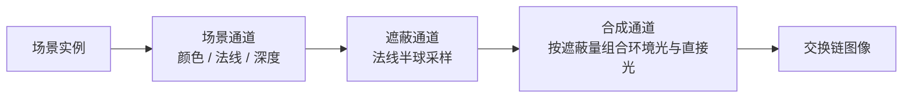

# ssao：屏幕空间环境光遮蔽

构建方式见仓库根目录的 README。

## 简介

三排相互遮挡、绕竖直轴偏转的板，法线与深度都有明显的台阶。遮蔽通道只用当前帧的深度与法线，在法线
半球上取一圈采样点，把每个采样点投影回屏幕再与深度缓冲比较。

| 控件 | 取值 |
| --- | --- |
| 乘到哪一档光照 | 无遮蔽、只乘环境光与间接光、乘到全部光照 |
| 遮蔽强度 | 0 到 4 |
| 采样半径与核大小 | 决定采样点离表面的距离与分布范围 |
| 采样数 | 1 到 64 |
| 法线加权 | 用两侧法线的夹角给采样点降权 |

## 渲染流程



场景通道输出漫反射颜色、法线与深度；遮蔽通道还原每个像素的视空间位置，在法线半球上取采样点并与深度
缓冲比较，输出一张遮蔽量；合成通道按选定的档位把遮蔽量乘上去，再做色调映射。

## 实现要点

### 遮蔽量与乘到哪一档

半径 0.5、核大小 1.0、强度 1.5、十六次采样，与无遮蔽的结果逐像素比较：

| 配置 | 平均绝对差 | 差值超过 8 的像素占比 | 最大差值 |
| --- | --- | --- | --- |
| 只乘环境光 | 0.215 | 0.197% | 18 |
| 乘到全部光照 | 0.439 | 1.217% | 116 |
| 只乘环境光，关掉法线加权 | 0.855 | 4.316% | 37 |

只乘环境光时变化的像素不到百分之零点二，最大差值十八；乘到全部光照时直接把光照整体压暗，变化像素
超过百分之一，最大差值一百一十六。这也是屏幕空间遮蔽的用法差别：它表达的是环境光被挡住的程度，乘到
直接光上会把本该被照亮的面也压暗。

关掉法线加权之后，同一配置下变化的像素从百分之零点二涨到百分之四点三，最大差值反而更小。原因是两侧
法线差别很大的采样点没有被降权，自遮蔽在平坦区域上留下一层噪点，整幅画面对比度下降。

### 设备时间随采样数

锁频 2880/15001 之后按段测量：

| 配置 | 采样数 | 设备时间 |
| --- | --- | --- |
| 无遮蔽 | 16 | 0.075 ± 0.018 ms |
| 只乘环境光 | 4 | 0.039 ± 0.014 ms |
| 只乘环境光 | 16 | 0.075 ± 0.017 ms |
| 只乘环境光 | 64 | 0.220 ± 0.029 ms |
| 只乘环境光，关掉法线加权 | 16 | 0.068 ± 0.017 ms |

无遮蔽一档仍然会跑遮蔽通道，只是合成时不乘上去，因此它的设备时间与十六次采样的遮蔽档相同。采样数从
四次到六十四次，设备时间从 0.039 涨到 0.220 毫秒，斜率约为每次采样 0.003 毫秒，扣掉固定部分之后基本
线性。关掉法线加权省掉一次法线采样与一次幂运算，从 0.075 降到 0.068 毫秒。

## 界面控件

| 控件 | 作用 |
| --- | --- |
| 乘到哪一档光照 | 遮蔽量的作用范围，也是无遮蔽对照 |
| 遮蔽强度 | 遮蔽量的整体强度 |
| 采样半径 | 采样点离表面的距离 |
| 核大小 | 采样点在半球上的分布范围 |
| 采样数 | 每个像素的采样点数 |
| 法线加权 | 两侧法线差别大的采样点降权 |
| GPU 锁频 | 与间接绘制 case 共用同一个面板 |

面板同时显示绘制命令条数与采样参数的说明，另附操作指南；耗时面板按本 case 的三个通道拆分逐项列出。

## 命令行参数

| 参数 | 含义 | 默认值 |
| --- | --- | --- |
| `--mode 名字` | 遮蔽档位，取 `off`、`ambient` 或 `all` | ambient |
| `--samples N` | 采样数，1 到 64 | 16 |
| `--radius F` | 采样半径 | 0.5 |
| `--kernel F` | 核大小 | 1.0 |
| `--strength F` | 遮蔽强度 | 1.5 |
| `--no-normal-weight` | 关掉法线加权 | 开启 |
| `--no-interface` / `--auto-exit S` / `--capture F` / `--report F` / `--control-port N` | 与其他 case 一致 | |

键盘操作：`Esc` 退出。

## 测试方法

```
build\meow_ssao.exe --mode off --auto-exit 3 --no-interface --capture intermediate\ss_off.png
build\meow_ssao.exe --mode ambient --auto-exit 3 --no-interface --capture intermediate\ss_ambient.png
build\meow_ssao.exe --mode all --auto-exit 3 --no-interface --capture intermediate\ss_all.png
build\meow_ssao.exe --mode ambient --no-normal-weight --auto-exit 3 --no-interface --capture intermediate\ss_no_normal.png
```

测量设备时间：启动一个进程锁频并打开控制服务，按段发送命令，程序把每段的结果追加到 CSV：

```
build\meow_ssao.exe --no-interface --control-port 21000 --core-clock 2880 --memory-clock 15001 --report intermediate\ss_measure.csv
```

连上 21000 端口后，`mode`/`samples`/`radius`/`kernel`/`strength`/`normal-weight` 改配置，`begin` 与
`end` 圈定一段测量，`quit` 退出。

## 源码结构

| 文件 | 内容 |
| --- | --- |
| `src/main.cpp` | 桌面入口：命令行解析、主循环与界面状态 |
| `src/android_main.cpp` | 安卓入口：NativeActivity 生命周期、表面与交换链、主循环 |
| `src/renderer.cpp` | 场景、遮蔽与合成三个通道，三套描述符集与三张离屏附件 |
| `src/case_ui.cpp` | 本 case 的控制面板与全部界面文本 |
| `src/timing_items.cpp` | 本 case 的计时项定义 |
| `shaders/scene.vert` `shaders/scene.frag` | 板的实例展开，写出漫反射颜色与法线 |
| `shaders/ssao.frag` | 视空间位置还原、半球采样、深度比较与法线加权 |
| `shaders/fullscreen.vert` `shaders/composite.frag` | 全屏三角形与按档位的合成 |

## 安卓端差异

- 实例与设备申请 Vulkan 1.1；`minSdk` 24 是 Vulkan 1.0 的最低 API 等级。
- 分块架构上遮蔽通道读取深度缓冲会触发额外搬运，带宽代价需要在真机上测量。
- 设备时间只在设备支持时间戳时测量。
- GPU 锁频面板不显示：它依赖桌面的 `nvidia-smi`。
- 帧率上限 60 FPS，避免无界空转发热。

### 安卓测试方法

```
adb -s <serial> install -r android\app\build\outputs\apk\debug\app-debug.apk
adb -s <serial> logcat -s MeowVulkanDemo
```

应用内置回环 TCP 控制服务（端口 21000），安卓端经 `adb forward tcp:21000 tcp:21000` 映射到本机。
