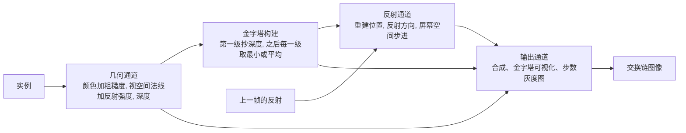

# ssr_hiz：屏幕空间反射与层次遍历

构建方式见仓库根目录的 README。

## 简介

场景是一块大镜面墙加一批悬浮的方块。反射通道从深度重建视空间位置，视空间法线给出反射方向，沿方向在屏幕
空间步进，命中后采样场景颜色。步进方式有三种，步数上限、步长、厚度阈值、二分细化、抖动、时域累积、屏幕
边缘淡出都可以分别开关。

两种金字塔同时生成：每一级取最小值的金字塔与每一级取平均值的金字塔。层次遍历默认用前者，可以切到后者
对比，还可以把选定层级并排铺开显示。

| 选项 | 取值 |
| --- | --- |
| 启用反射 | 打开、关闭 |
| 步进方式 | 视空间等距、屏幕像素、层次遍历 |
| 步数上限 | 8 到 256 |
| 视空间步长 | 0.02 到 0.50 |
| 屏幕像素步长 | 2 到 64 |
| 厚度阈值 | 0.05 到 2.0 |
| 推进距离 | 2 到 40，三种方式共用 |
| 二分细化、时域累积、抖动 | 分别开关 |
| 边缘淡出、金字塔可视化、水平角度 | |

## 渲染流程



## 实现要点

### 屏幕空间只有一层信息

反射的全部输入是当前帧的颜色、视空间法线与深度，也就是相机看到的那一层。射线走出画面或者走到相机后面
就没有深度可用，命中点只能在屏幕上已经可见的表面里找。画面边缘缺失的反射、物体背后的断裂、以及被遮挡
表面反射不出东西，都是这一条的结果。屏幕边缘淡出只是把这类缺失画得柔和一些。

### 深度在屏幕空间是线性的

按像素步进时，射线的起点与终点先投影到屏幕，在屏幕直线上按固定像素数推进，深度在投影后的归一化设备
坐标的 z 上线性插值。这一步是精确的：投影后的 z 等于 z 视空间距离的线性函数，而后者在屏幕空间是线性的，
所以插出来的深度与真实射线完全一致。

### 步长、细化、抖动

步长决定两件事：步长越大，越容易从两个采样点之间跨过细物体；步长越小，同样距离越容易耗尽步数预算。
推进距离固定为 24 个单位、步数上限 256 时，把屏幕像素步长从 1 调到 24，画面有 0.248% 的像素差值超过 8，
最大差值 107，差的就是被跨过去的细节。

二分细化只在命中区间两端反复取中点，把命中点收敛到亚像素，它不改变是否命中：层次遍历开与关二分细化，
只有 0.025% 的像素有区别。

抖动按材质粗糙度把反射方向在锥内扰动，单帧结果是带噪声的；时域累积把多帧平均起来。全部像素上统计高频
噪声，单帧是 78.3，累积之后是 74.3。粗糙度高的表面才有抖动，镜面墙的粗糙度接近零，所以它的反射在两种
情况下都是清楚的。

### 两种金字塔

每一级取最小值的那条金字塔可以支撑这样一个断言：射线整段都在这一块的最前面时，这一块里不可能有交点，
跳过是安全的。取平均的那条没有这个性质，平均之后的深度比最小值大，跳过会把交点一起跳掉。同一段射线用
两条金字塔跑，画面有 0.151% 的像素差值超过 8，最大差值 107。步数上也能看出来：用平均金字塔时命中被跳
过，射线继续往前跑，平均步数从 68.5 涨到 84.6。

两级金字塔本身的差别随着层级变粗而变大：并排显示时，2 级（4 乘 4 像素一块）两半的差值是 0.437，5 级
（32 乘 32 像素一块）涨到 3.480，差值超过 4 的像素从 0.98% 升到 7.92%。

### 层次遍历的步数

同一段射线（推进距离 24 个单位、步数上限 256），三种方式的平均纹理读取次数：

| 步进方式 | 平均步数 | 中位数 | 90 分位 |
| --- | --- | --- | --- |
| 视空间等距（步长 0.09，约合每步 4 像素） | 22.0 | 20.1 | 20.1 |
| 屏幕像素（每步 4 像素） | 36.0 | 28.1 | 68.3 |
| 层次遍历 | 68.5 | 61.2 | 98.4 |

这个场景里层次遍历的读取次数反而最多。原因在最小值这条断言本身是保守的：只要一块里存在比射线更近的
几何，整块就不能跳过，必须降级。镜面墙铺满背景，射线又紧贴着墙面出发，块内最小值与射线深度相差很小，
再加上方块会让附近整片区域都不能跳过，遍历大部分时间停在细层级上。在解析计数的那次测量里，73% 的读取
花在降级上，真正跳过的只有 27%，跳过的那些也大多停在 4 像素一级。射线穿过大片空白时结论会反过来：那
时块内最小值就是远平面，整块判定无条件通过，一次跳过就是几十个像素。这条层次结构的价值是把读取次数从
与射线长度成正比改成与跨过的块数成正比，代价是块内只要有一点近处几何就要降到细层级重来，所以它在射线
贴着一层连续表面走的时候并不划算。

### 设备时间

锁定核心频率 2880 兆赫、显存频率 15001 兆赫，每段测量四秒：

| 配置 | 设备时间 | 几何通道 | 金字塔构建 | 反射通道 | 输出通道 |
| --- | --- | --- | --- | --- | --- |
| 关闭反射 | 0.072 | 0.008 | 0.040 | 0.018 | 0.007 |
| 视空间等距 | 0.201 | 0.008 | 0.040 | 0.145 | 0.009 |
| 屏幕像素 | 0.120 | 0.008 | 0.040 | 0.065 | 0.007 |
| 层次遍历 | 0.169 | 0.008 | 0.040 | 0.113 | 0.008 |

关闭反射时反射通道仍然要整屏跑一遍，只是每个像素在第一步判断后就退出，耗时 0.018 毫秒，三种步进方式的
差值都建立在这个底数之上。

视空间等距的读取次数最少（22），反射通道却最慢（0.145 毫秒）：它每一步都要把视空间位置重新投影一次，代价
比在屏幕直线上插值高得多。屏幕像素方式读取 36 次只花 0.065 毫秒，层次遍历读取 68 次花 0.113 毫秒，两者
的每次读取代价接近。金字塔构建是两条链、十二条派发，固定 0.040 毫秒。

## 界面控件

| 控件 | 作用 |
| --- | --- |
| 启用反射 | 关闭时输出通道只画场景颜色，作为对照基准 |
| 步进方式 | 三种步进方式，各对应一条特化过的管线 |
| 步数上限 / 视空间步长 / 屏幕像素步长 / 厚度阈值 / 推进距离 | 步进参数 |
| 命中后二分细化 | 在命中区间两端二分收敛 |
| 时域累积 | 与上一帧结果按固定比例混合，配置变化时自动重置 |
| 粗糙度抖动 / 抖动强度 | 按材质粗糙度扰动反射方向 |
| 屏幕边缘淡出 | 命中点靠近画面边缘时淡出 |
| 层次遍历用平均金字塔 | 换成取平均的金字塔做整块判定 |
| 可视化 | 并排显示两种金字塔、步进次数灰度图 |
| 水平角度 | 相机水平旋转 |
| GPU 锁频 | 与间接绘制 case 共用同一个面板 |

## 命令行参数

| 参数 | 含义 | 默认值 |
| --- | --- | --- |
| `--no-reflection` | 关闭反射，只画场景颜色 | 开启 |
| `--mode view_space\|screen_pixel\|hiz` | 步进方式 | hiz |
| `--steps N` | 步数上限，8 到 256 | 64 |
| `--step-length F` | 视空间步长，0.005 到 1.0 | 0.10 |
| `--step-pixels F` | 屏幕像素步长，1 到 128 | 4 |
| `--thickness F` | 厚度阈值，0.01 到 4.0 | 0.35 |
| `--max-distance F` | 推进距离，2 到 40 | 24 |
| `--refine` / `--no-refine` | 二分细化的开关 | 开启 |
| `--temporal` / `--jitter` / `--jitter-strength F` | 时域累积与抖动 | 关闭 |
| `--edge-fade F` | 边缘淡出宽度，0.0 到 0.5 | 0.0 |
| `--average-pyramid` | 层次遍历改用平均金字塔 | 关闭 |
| `--visualize off\|pyramids\|step_count` | 可视化 | off |
| `--visualize-level N` | 可视化层级，0 到 5 | 2 |
| `--yaw F` | 相机水平角度 | 0 |
| `--no-interface` / `--auto-exit S` / `--capture F` / `--report F` / `--control-port N` | 与其他 case 一致 | |

键盘操作：`Esc` 退出。

## 测试方法

抓帧比较：

```
build\meow_ssr_hiz.exe --no-reflection --auto-exit 3 --no-interface --capture intermediate\ssr_off.png
build\meow_ssr_hiz.exe --mode view_space --steps 256 --step-length 0.09 --auto-exit 3 --no-interface --capture intermediate\ssr_view.png
build\meow_ssr_hiz.exe --mode screen_pixel --steps 256 --step-pixels 4 --auto-exit 3 --no-interface --capture intermediate\ssr_screen.png
build\meow_ssr_hiz.exe --mode hiz --steps 256 --auto-exit 3 --no-interface --capture intermediate\ssr_hiz.png
build\meow_ssr_hiz.exe --mode hiz --steps 256 --average-pyramid --auto-exit 3 --no-interface --capture intermediate\ssr_hiz_avg.png
```

步进次数灰度图与金字塔并排显示：

```
build\meow_ssr_hiz.exe --mode hiz --steps 256 --visualize step_count --auto-exit 3 --no-interface --capture intermediate\ssr_heat.png
build\meow_ssr_hiz.exe --visualize pyramids --visualize-level 5 --auto-exit 3 --no-interface --capture intermediate\ssr_pyramid.png
```

测量设备时间：启动一个进程锁频并打开控制服务，按段发送命令，程序把每段的结果追加到 CSV：

```
build\meow_ssr_hiz.exe --no-interface --control-port 21000 --core-clock 2880 --memory-clock 15001 --report intermediate\ssr_measure.csv
```

连上 21000 端口后，`reflection`/`mode`/`steps`/`step-length`/`step-pixels`/`thickness`/`max-distance`/`refine`/
`temporal`/`jitter`/`jitter-strength`/`edge-fade`/`average-pyramid`/`visualize`/`visualize-level`/`yaw` 改配置，
`begin` 与 `end` 圈定一段测量，`quit` 退出。

## 源码结构

| 文件 | 内容 |
| --- | --- |
| `src/main.cpp` | 桌面入口：命令行解析、主循环与界面状态 |
| `src/android_main.cpp` | 安卓入口：NativeActivity 生命周期、表面与交换链、主循环 |
| `src/renderer.cpp` | 几何、金字塔、反射、输出四个通道的记录，反射纹理的乒乓与描述符更新 |
| `src/case_ui.cpp` | 本 case 的控制面板与全部界面文本 |
| `src/timing_items.cpp` | 本 case 的计时项定义 |
| `shaders/scene.vert` | 立方体展开，输出颜色、反射强度、粗糙度与视空间法线 |
| `shaders/gbuffer.frag` | 几何缓冲：着色后的颜色与粗糙度、视空间法线与反射强度 |
| `shaders/reflect.frag` | 三种步进、二分细化、抖动、累积与边缘淡出 |
| `shaders/pyramid.comp` | 金字塔构建，按参数取最小值或平均值 |
| `shaders/fullscreen.vert` `shaders/present.frag` | 全屏三角形、合成与两种可视化 |

## 安卓端差异

- 实例与设备申请 Vulkan 1.1；`minSdk` 24 是 Vulkan 1.0 的最低 API 等级。
- 层次遍历是逐像素的随机访存，移动端分块架构下的代价需要在真机上另测：桌面上这条路径不划算，移动端的
  纹理缓存更小，跨层级取值的开销会更突出。
- 设备时间只在设备支持时间戳时测量。
- GPU 锁频面板不显示：它依赖桌面的 `nvidia-smi`。
- 帧率上限 60 FPS，避免无界空转发热。

### 安卓测试方法

```
adb -s <serial> install -r android\app\build\outputs\apk\debug\app-debug.apk
adb -s <serial> logcat -s MeowVulkanDemo
```

应用内置回环 TCP 控制服务（端口 21000），安卓端经 `adb forward tcp:21000 tcp:21000` 映射到本机。
