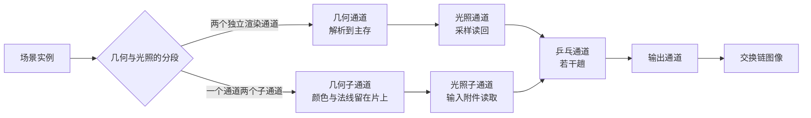

# subpass_tile：延迟渲染的子通道与片上存储

构建方式见仓库根目录的 README。

## 简介

同一个延迟管线做两条实现，几何与光照的分段不同：

| 路径 | 做法 | 渲染通道数 |
| --- | --- | --- |
| 两个独立渲染通道 | 几何通道把颜色与法线解析到主存，光照通道再采样读回 | 三（几何、光照、输出） |
| 一个通道两个子通道 | 几何缓冲作为输入附件留在片上，光照子通道直接读 | 两（几何加光照、输出） |

界面还可以把几何附件设为暂时附件（存储操作改为不关心），以及插入若干趟乒乓，把中间结果反复作为下一
道栅格通道的采样输入与渲染目标。

## 渲染流程



## 实现要点

### 两条路径的画面一致

同一个场景、同一组相机参数下抓帧比较：

| 对比 | 平均绝对差 | 差值超过 8 的像素占比 | 最大差值 |
| --- | --- | --- | --- |
| 一个通道两个子通道 与 两个独立渲染通道 | 0.000 | 0.000% | 0 |

两条路径的计算完全相同，差别只在于几何缓冲有没有经过主存，因此画面逐像素一致。乒乓四趟之后，画面
比不乒乓时整体亮 0.04（每趟 0.01），两条路径的乒乓结果也完全一致，说明中间结果确实在两种路径下都
按同样的顺序被反复采样与写出。

### 设备时间与渲染通道数

锁频 2880/15001 之后按段测量：

| 路径 | 暂时附件 | 乒乓次数 | 渲染通道数 | 设备时间 |
| --- | --- | --- | --- | --- |
| 一个通道两个子通道 | 是 | 0 | 2 | 0.027 ± 0.010 ms |
| 一个通道两个子通道 | 否 | 0 | 2 | 0.026 ± 0.011 ms |
| 两个独立渲染通道 | | 0 | 3 | 0.027 ± 0.012 ms |
| 两个独立渲染通道 | | 4 | 7 | 0.070 ± 0.017 ms |
| 一个通道两个子通道 | | 4 | 6 | 0.069 ± 0.016 ms |

桌面上两条路径的设备时间是 0.027 与 0.027 毫秒，差值远小于标准差。这一条不能从桌面得出结论：桌面
显卡的几何缓冲本来就留在二级缓存里，解析与采样读回的额外搬运代价看不出来，要看到片上存储的收益需要
分块架构的安卓设备与厂商工具读带宽计数器。乒乓每加一趟就多一个渲染通道边界与一次采样，四趟从 0.027
涨到 0.070 毫秒，平均每趟 0.011 毫秒，这部分在桌面上是可测的。

暂时附件开关在桌面上的差别也落在噪声里（0.027 与 0.026），它改变的是几何附件的存储操作，只在分块
架构上影响片上内容是否被写回主存。

## 界面控件

| 控件 | 作用 |
| --- | --- |
| 几何与光照的分段 | 两条路径 |
| 几何附件作为暂时附件 | 几何附件的存储操作取不关心还是保留 |
| 乒乓次数 | 0 到 8 |
| 乒乓亮度步长 | 每趟叠加的亮度 |
| GPU 锁频 | 与间接绘制 case 共用同一个面板 |

面板同时显示绘制命令条数与渲染通道数，另附操作指南；耗时面板按本 case 的通道拆分逐项列出。

## 命令行参数

| 参数 | 含义 | 默认值 |
| --- | --- | --- |
| `--path 名字` | 路径，取 `two_passes` 或 `subpass` | subpass |
| `--stored-geometry` | 几何附件保留到主存，不作暂时附件 | 暂时附件 |
| `--pingpong N` | 乒乓次数，0 到 8 | 0 |
| `--pingpong-step F` | 乒乓每趟的亮度步长 | 0.01 |
| `--no-interface` / `--auto-exit S` / `--capture F` / `--report F` / `--control-port N` | 与其他 case 一致 | |

键盘操作：`Esc` 退出。

## 测试方法

```
build\meow_subpass_tile.exe --path subpass --auto-exit 3 --no-interface --capture intermediate\st_subpass.png
build\meow_subpass_tile.exe --path two_passes --auto-exit 3 --no-interface --capture intermediate\st_two.png
build\meow_subpass_tile.exe --path subpass --pingpong 4 --auto-exit 3 --no-interface --capture intermediate\st_ping.png
```

测量设备时间：启动一个进程锁频并打开控制服务，按段发送命令，程序把每段的结果追加到 CSV：

```
build\meow_subpass_tile.exe --no-interface --control-port 21000 --core-clock 2880 --memory-clock 15001 --report intermediate\st_measure.csv
```

连上 21000 端口后，`path`/`transient`/`pingpong`/`pingpong-step` 改配置，`begin` 与 `end` 圈定一段
测量，`quit` 退出。

## 源码结构

| 文件 | 内容 |
| --- | --- |
| `src/main.cpp` | 桌面入口：命令行解析、主循环与界面状态 |
| `src/android_main.cpp` | 安卓入口：NativeActivity 生命周期、表面与交换链、主循环 |
| `src/renderer.cpp` | 五个渲染通道、输入附件的描述符集、八条管线 |
| `src/case_ui.cpp` | 本 case 的控制面板与全部界面文本 |
| `src/timing_items.cpp` | 本 case 的计时项定义 |
| `shaders/gbuffer.vert` `shaders/gbuffer.frag` | 板的实例展开与几何缓冲输出 |
| `shaders/deferred_lighting.frag` | 两个独立渲染通道路径的光照，采样读回几何缓冲 |
| `shaders/subpass_lighting.frag` | 子通道路径的光照，用输入附件读几何缓冲 |
| `shaders/pingpong.frag` `shaders/present.frag` | 乒乓通道与最终输出 |

## 安卓端差异

- 实例与设备申请 Vulkan 1.1；`minSdk` 24 是 Vulkan 1.0 的最低 API 等级。
- 片上存储的收益只在分块架构上看得到，需要在真机上用厂商工具读片上加载与写出的字节数、缓存逐出计数。
- 设备时间只在设备支持时间戳时测量。
- GPU 锁频面板不显示：它依赖桌面的 `nvidia-smi`。
- 帧率上限 60 FPS，避免无界空转发热。

### 安卓测试方法

```
adb -s <serial> install -r android\app\build\outputs\apk\debug\app-debug.apk
adb -s <serial> logcat -s MeowVulkanDemo
```

应用内置回环 TCP 控制服务（端口 21000），安卓端经 `adb forward tcp:21000 tcp:21000` 映射到本机。
