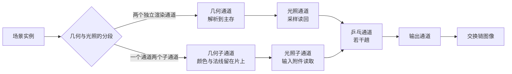

# subpass_tile：延迟渲染的子通道与片上存储

构建方式见仓库根目录的 README。

## 简介

同一个延迟管线做两条实现，几何与光照的分段不同（[`src/renderer.h:12-15`](src/renderer.h#L12-L15)）：

| 路径 | 做法 | 渲染通道数 |
| --- | --- | --- |
| 两个独立渲染通道 | 几何通道把颜色与法线解析到主存（[`src/renderer.cpp:69-113`](src/renderer.cpp#L69-L113)），光照通道再采样读回（[`shaders/deferred_lighting.frag:13-14`](shaders/deferred_lighting.frag#L13-L14)） | 三（几何、光照、输出） |
| 一个通道两个子通道 | 几何缓冲作为输入附件留在片上（[`src/renderer.cpp:172-192`](src/renderer.cpp#L172-L192)），光照子通道直接读（[`shaders/subpass_lighting.frag:13-14`](shaders/subpass_lighting.frag#L13-L14)） | 两（几何加光照、输出） |

界面还可以把几何附件设为暂时附件（存储操作改为不关心，
[`src/renderer.cpp:152-158`](src/renderer.cpp#L152-L158)），以及插入若干趟乒乓，把中间结果反复作为下一
道栅格通道的采样输入与渲染目标（[`src/renderer.cpp:847-867`](src/renderer.cpp#L847-L867)、
[`shaders/pingpong.frag:19-20`](shaders/pingpong.frag#L19-L20)）。

## 渲染流程



两个独立渲染通道的路径在几何通道里把颜色与法线写进两张贴图，附件以着色器只读布局收尾
（[`src/renderer.cpp:72-77`](src/renderer.cpp#L72-L77)），光照通道再把它们绑成采样贴图读入
（[`src/renderer.cpp:394-396`](src/renderer.cpp#L394-L396)）。子通道路径只有一个渲染通道，几何子通道写
附件、光照子通道用 `vkCmdNextSubpass` 接上（[`src/renderer.cpp:809-819`](src/renderer.cpp#L809-L819)），
两个子通道之间用一条按区域同步的依赖隔开
（[`src/renderer.cpp:204-210`](src/renderer.cpp#L204-L210)）。乒乓通道每趟把上一张结果采样回来再加一个
亮度步长写出（[`shaders/pingpong.frag:17-21`](shaders/pingpong.frag#L17-L21)），输出通道按乒乓次数的奇偶
选最终贴图（[`src/renderer.cpp:881-886`](src/renderer.cpp#L881-L886)）。

## 实现要点

### 两条路径的画面一致

同一个场景、同一组相机参数下抓帧比较：

| 对比 | 平均绝对差 | 差值超过 8 的像素占比 | 最大差值 |
| --- | --- | --- | --- |
| 一个通道两个子通道 与 两个独立渲染通道 | 0.000 | 0.000% | 0 |

两条路径的计算完全相同，差别只在于几何缓冲有没有经过主存，因此画面逐像素一致。两条路径共用同一份
几何附件与光照算式：几何子通道把颜色与法线写成两张附件
（[`shaders/gbuffer.frag:10-14`](shaders/gbuffer.frag#L10-L14)），光照的取值算式在两个着色器里逐字相同
（[`shaders/deferred_lighting.frag:16-21`](shaders/deferred_lighting.frag#L16-L21)、
[`shaders/subpass_lighting.frag:16-21`](shaders/subpass_lighting.frag#L16-L21)），只有读几何缓冲的手段
不同。乒乓四趟之后，画面比不乒乓时整体亮 0.04（每趟 0.01），每趟叠加的亮度由界面参数写进 uniform 的
第一个分量（[`src/main.cpp:63-74`](src/main.cpp#L63-L74)），着色器把它加到采样结果上
（[`shaders/pingpong.frag:19-20`](shaders/pingpong.frag#L19-L20)）；两条路径的乒乓结果也完全一致，说明
中间结果确实在两种路径下都按同样的顺序被反复采样与写出。

### 设备时间与渲染通道数

锁频 2880/15001 之后按段测量。渲染通道数按绘制帧里数过的计数器填写：子通道路径的几何与光照合在一个
渲染通道里只加一（[`src/renderer.cpp:820-821`](src/renderer.cpp#L820-L821)），两个独立渲染通道的路径
多加一个光照通道（[`src/renderer.cpp:841-842`](src/renderer.cpp#L841-L842)），乒乓每趟再加一个
（[`src/renderer.cpp:865-866`](src/renderer.cpp#L865-L866)）：

| 路径 | 暂时附件 | 乒乓次数 | 渲染通道数 | 设备时间 |
| --- | --- | --- | --- | --- |
| 一个通道两个子通道 | 是 | 0 | 2 | 0.027 ± 0.010 ms |
| 一个通道两个子通道 | 否 | 0 | 2 | 0.026 ± 0.011 ms |
| 两个独立渲染通道 | | 0 | 3 | 0.027 ± 0.012 ms |
| 两个独立渲染通道 | | 4 | 7 | 0.070 ± 0.017 ms |
| 一个通道两个子通道 | | 4 | 6 | 0.069 ± 0.016 ms |

桌面上两条路径的设备时间是 0.027 与 0.027 毫秒，差值远小于标准差。这一条不能从桌面得出结论：桌面
显卡的几何缓冲本来就留在二级缓存里，解析与采样读回的额外搬运代价看不出来，要看到片上存储的收益需要
分块架构的安卓设备与厂商工具读带宽计数器。乒乓每加一趟就多一个渲染通道边界与一次采样，四趟从 0.027
涨到 0.070 毫秒，平均每趟 0.011 毫秒，这部分在桌面上是可测的。乒乓次数在绘制帧里限制到八
（[`src/renderer.cpp:774`](src/renderer.cpp#L774)），每一趟走一个独立的渲染通道，把上一趟的结果当作
采样输入重新写出（[`src/renderer.cpp:848-867`](src/renderer.cpp#L848-L867)）。

暂时附件开关在桌面上的差别也落在噪声里（0.027 与 0.026），它改变的是几何附件的存储操作，只在分块
架构上影响片上内容是否被写回主存。这个开关挑的是两条几何子通道渲染通道，一条把三个几何附件的存储
操作设为不关心（[`src/renderer.cpp:566`](src/renderer.cpp#L566)），另一条设为保留
（[`src/renderer.cpp:567`](src/renderer.cpp#L567)），几何管线也随之分成两条
（[`src/renderer.cpp:801-804`](src/renderer.cpp#L801-L804)）。

## 界面控件

| 控件 | 作用 |
| --- | --- |
| 几何与光照的分段 | 两条路径 |
| 几何附件作为暂时附件 | 几何附件的存储操作取不关心还是保留 |
| 乒乓次数 | 0 到 8 |
| 乒乓亮度步长 | 每趟叠加的亮度 |
| GPU 锁频 | 与间接绘制 case 共用同一个面板 |

面板同时显示绘制命令条数与渲染通道数，另附操作指南；耗时面板按本 case 的通道拆分逐项列出。

## 命令行参数

| 参数 | 含义 | 默认值 |
| --- | --- | --- |
| `--path 名字` | 路径，取 `two_passes` 或 `subpass` | subpass |
| `--stored-geometry` | 几何附件保留到主存，不作暂时附件 | 暂时附件 |
| `--pingpong N` | 乒乓次数，0 到 8 | 0 |
| `--pingpong-step F` | 乒乓每趟的亮度步长 | 0.01 |
| `--no-interface` / `--auto-exit S` / `--capture F` / `--report F` / `--control-port N` | 与其他 case 一致 | |

键盘操作：`Esc` 退出。

## 测试方法

```
build\meow_subpass_tile.exe --path subpass --auto-exit 3 --no-interface --capture intermediate\st_subpass.png
build\meow_subpass_tile.exe --path two_passes --auto-exit 3 --no-interface --capture intermediate\st_two.png
build\meow_subpass_tile.exe --path subpass --pingpong 4 --auto-exit 3 --no-interface --capture intermediate\st_ping.png
```

测量设备时间：启动一个进程锁频并打开控制服务，按段发送命令，程序把每段的结果追加到 CSV：

```
build\meow_subpass_tile.exe --no-interface --control-port 21000 --core-clock 2880 --memory-clock 15001 --report intermediate\st_measure.csv
```

连上 21000 端口后，`path`/`transient`/`pingpong`/`pingpong-step` 改配置，`begin` 与 `end` 圈定一段
测量，`quit` 退出。

## 源码结构

| 文件 | 内容 |
| --- | --- |
| `src/main.cpp` | 桌面入口：命令行解析、主循环与界面状态 |
| `src/android_main.cpp` | 安卓入口：NativeActivity 生命周期、表面与交换链、主循环 |
| `src/renderer.cpp` | 五个渲染通道、输入附件的描述符集、八条管线 |
| `src/case_ui.cpp` | 本 case 的控制面板与全部界面文本 |
| `src/timing_items.cpp` | 本 case 的计时项定义 |
| `shaders/gbuffer.vert` `shaders/gbuffer.frag` | 板的实例展开与几何缓冲输出 |
| `shaders/deferred_lighting.frag` | 两个独立渲染通道路径的光照，采样读回几何缓冲 |
| `shaders/subpass_lighting.frag` | 子通道路径的光照，用输入附件读几何缓冲 |
| `shaders/pingpong.frag` `shaders/present.frag` | 乒乓通道与最终输出 |

## 安卓端差异

- 实例与设备申请 Vulkan 1.1；`minSdk` 24 是 Vulkan 1.0 的最低 API 等级。
- 片上存储的收益只在分块架构上看得到，需要在真机上用厂商工具读片上加载与写出的字节数、缓存逐出计数。
- 设备时间只在设备支持时间戳时测量。
- GPU 锁频面板不显示：它依赖桌面的 `nvidia-smi`。
- 帧率上限 60 FPS，避免无界空转发热。

### 安卓测试方法

```
adb -s <serial> install -r android\app\build\outputs\apk\debug\app-debug.apk
adb -s <serial> logcat -s MeowVulkanDemo
```

应用内置回环 TCP 控制服务（端口 21000），安卓端经 `adb forward tcp:21000 tcp:21000` 映射到本机。
