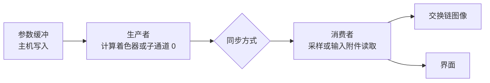

# synchronization：八种同步方式完成同一个依赖

构建方式见仓库根目录的 README。

## 简介

画面是一整屏的程序化图案，图案函数 `patternTexel` 按像素中心坐标直接算出字节值
（[`shaders/pattern_common.glsl:11-41`](shaders/pattern_common.glsl#L11-L41)）。图案由生产者写进一张图案纹理，
这张纹理同时声明了存储图像、颜色附件、采样纹理与输入附件四种用途
（[`src/renderer.cpp:310-316`](src/renderer.cpp#L310-L316)）；消费者读取它、加上暗角与色调曲线之后写进交换链图像
（[`shaders/consume_common.glsl:4-12`](shaders/consume_common.glsl#L4-L12)）。生产者与消费者之间必须有一次依赖，
界面上的「同步方式」决定这次依赖用哪种原语表达：

| 同步方式 | 提交次数 | 依赖由什么承载 | 主机是否阻塞 |
| --- | --- | --- | --- |
| 管线屏障 | 1 | 命令缓冲里的 `vkCmdPipelineBarrier` | 否 |
| 事件 | 1 | `vkCmdSetEvent` 与 `vkCmdWaitEvents` | 否 |
| 二进制信号量 | 2 | 两次提交之间的二进制信号量 | 否 |
| 时间线信号量 | 2 | 两次提交之间的时间线信号量 | 否 |
| 围栏 | 2 | 主机等待生产者完成，再提交消费者 | 是 |
| 队列空闲等待 | 2 | 主机等待整条队列空闲 | 是 |
| 设备空闲等待 | 2 | 主机等待整个设备空闲 | 是 |
| 子通道依赖 | 1 | 渲染通道的子通道依赖 | 否 |

八种方式下画面必须逐像素相同：依赖写错时读到的图案会落后一帧，图案每帧随相位推进
（[`src/main.cpp:287-291`](src/main.cpp#L287-L291)，步长见 [`src/main.cpp:21`](src/main.cpp#L21)），
落后一帧的画面与正确的画面立刻不同；消费结果依赖图案的具体数值
（[`shaders/consume_common.glsl:1-4`](shaders/consume_common.glsl#L1-L4)）。差别因此落在命令、掩码、主机是否阻塞与耗时上。

## 渲染流程



生产者与消费者的实现各有两条：

- 生产者可以用计算着色器（绑定存储图像，[`src/renderer.cpp:909-912`](src/renderer.cpp#L909-L912) 派发，
  `imageStore` 写在 [`shaders/pattern.comp:19-21`](shaders/pattern.comp#L19-L21)），也可以用子通道 0 的光栅化
  （把 `outTexel` 写进颜色附件，[`shaders/pattern.frag:6-13`](shaders/pattern.frag#L6-L13)，
  绘制在 [`src/renderer.cpp:969-976`](src/renderer.cpp#L969-L976)）。
- 消费者可以用组合图像采样器读图案（[`shaders/consume.frag:12-15`](shaders/consume.frag#L12-L15)），也可以用输入附件
  读图案（[`shaders/consume_input.frag:12-15`](shaders/consume_input.frag#L12-L15)）。

管线屏障、事件、二进制信号量、时间线信号量、围栏、队列空闲等待与设备空闲等待这七种方式用计算着色器做生产者
（单条命令缓冲里的管线屏障与事件在 [`src/renderer.cpp:1068-1075`](src/renderer.cpp#L1068-L1075)，两次提交的在
[`src/renderer.cpp:1141-1144`](src/renderer.cpp#L1141-L1144)），图案纹理在这七种方式之间是同一张存储图像
（[`src/renderer.cpp:621-623`](src/renderer.cpp#L621-L623)）；子通道依赖用光栅化做生产者（
[`src/renderer.cpp:1103-1107`](src/renderer.cpp#L1103-L1107)
），
图案纹理在渲染通道里先做颜色附件、再做输入附件（[`src/renderer.cpp:248-269`](src/renderer.cpp#L248-L269)）。两条生产者路径调用同一个
`patternTexel` 函数（[`shaders/pattern.comp:18-21`](shaders/pattern.comp#L18-L21)、
[`shaders/pattern.frag:10-12`](shaders/pattern.frag#L10-L12)），写出的图案逐字节相同：纹理格式取整数类型
（[`src/renderer.cpp:11-15`](src/renderer.cpp#L11-L15)），计算全部带 `precise` 修饰
（[`shaders/pattern_common.glsl:3-6`](shaders/pattern_common.glsl#L3-L6)）。

## 规范里的五种同步原语

Vulkan 规范把同步机制列成五种，作用范围各不相同：

| 原语 | 作用范围 | 规范原文的说法 |
| --- | --- | --- |
| 围栏 fence | 主机与设备之间 | 用来告诉主机设备上的某个任务已经完成 |
| 信号量 semaphore | 多条队列之间 | 用来控制跨队列的资源访问 |
| 事件 event | 单条队列之内 | 可以由命令缓冲或主机置位，可以由命令缓冲等待或在主机上查询 |
| 管线屏障 pipeline barrier | 单条队列之内，一个点上 | 同时提供置位与等待，两条职责落在一条命令里 |
| 渲染通道对象 render pass object | 单条队列之内 | 给绘制任务提供一套同步框架，很多场景用它比其它原语更省 |

本 case 另外用到的两种主机侧手段：

- **空闲等待**：`vkQueueWaitIdle` 与 `vkDeviceWaitIdle`（
  [`src/renderer.cpp:1196-1201`](src/renderer.cpp#L1196-L1201)
  ）。规范说前者等价于给之前每一次接受围栏的提交都挂上一个围栏，再以无限超时全部等待；后者等价于对设备上
  全部队列调用前者。它同时给出了执行依赖与内存可用性，代价是主机阻塞在整条队列或整个设备上。
- **内存域操作**：`vkFlushMappedMemoryRanges` 与 `vkInvalidateMappedMemoryRanges`
  。主机可见但非一致的内存类型上，主机的写入要先冲洗才对设备可用，设备的写入要先失效才能被主机读到。
  参数缓冲按只需主机可见的方式创建，随后查询它实际落在哪种内存类型上（
  [`src/renderer.cpp:586-598`](src/renderer.cpp#L586-L598)）；落在这类内存上时 `writeParameterBuffer`
  在写入之后调用 `vkFlushMappedMemoryRanges`（[`src/renderer.cpp:600-612`](src/renderer.cpp#L600-L612)
  ）。

## 执行依赖与内存依赖

同步命令在两个操作集合之间建立依赖，两个集合由命令的两个同步范围给出。只有落在同步范围里的操作才参与依赖，范围可以用阶段掩码收窄到具体的管线阶段。

**执行依赖**保证第一组操作 happen-before 第二组操作：

$$
\text{ExeDep}(\text{ScopedOps}_1, \text{ScopedOps}_2) \iff \text{ScopedOps}_1
\xrightarrow{\text{happens-before}}
\text{ScopedOps}_2
$$

只有执行依赖不足以让写入的值被读到，还要有内存那半边。规范把内存那半边拆成三种操作：可用性操作让指定写入
对某个内存域变为可用，内存域操作让对源内存域可用的写入对目标内存域可用，可见性操作让对某个内存域可用的值
对指定的内存访问可见。**内存依赖**就是带上可用性与可见性的执行依赖：

$$
\text{MemDep} \implies \text{ScopedMemOps}_1 \text{ 里的写入被置为可用，且包括这些写入在内的可用写入对 } \text{ScopedMemOps}_2 \text{ 可见}
$$

写后读与写后写必须带访问掩码，只有读后写可以只靠执行依赖：

| 冒险 | 需要的依赖 |
| --- | --- |
| 写后读 RAW | 执行依赖加访问掩码 |
| 写后写 WAW | 执行依赖加访问掩码 |
| 读后写 WAR | 执行依赖 |

阶段掩码决定依赖落在哪些阶段上。规范的定义是：同步命令的第一个同步范围限定在源阶段掩码指出的阶段，
第二个同步范围限定在目标阶段掩码指出的阶段。挡得比需要的多会拖慢并行，挡得比需要的少就是不正确的依赖。本
case
里每一次用到阶段掩码的地方都落在真正产生与消费数据的阶段上：

- 产生图案的写入落在 `VK_PIPELINE_STAGE_COMPUTE_SHADER_BIT`（
  [`src/renderer.cpp:918-926`](src/renderer.cpp#L918-L926)）或
  `VK_PIPELINE_STAGE_COLOR_ATTACHMENT_OUTPUT_BIT`（
  [`src/renderer.cpp:281-286`](src/renderer.cpp#L281-L286)
  ）；
- 读取图案的访问落在 `VK_PIPELINE_STAGE_FRAGMENT_SHADER_BIT`（
  [`src/renderer.cpp:1080-1081`](src/renderer.cpp#L1080-L1081)、
  [`src/renderer.cpp:1085-1091`](src/renderer.cpp#L1085-L1091)
  ）；
- 提交之间的一次性收尾屏障用 `VK_PIPELINE_STAGE_ALL_COMMANDS_BIT`
  加空的访问掩码，只负责把写入置为可用（[`src/renderer.cpp:1143-1144`](src/renderer.cpp#L1143-L1144)
  ）。

等待信号量时给出的 `pWaitDstStageMask`
限制的是等待操作的第二个同步范围：同一批里的命令以及提交顺序上更晚的命令里，只有落在这些阶段上的操作要等
到信号量被置位。消费者提交用的两个阶段是 `VK_PIPELINE_STAGE_COLOR_ATTACHMENT_OUTPUT_BIT` 与
`VK_PIPELINE_STAGE_FRAGMENT_SHADER_BIT`（[`src/renderer.cpp:1053-1054`](src/renderer.cpp#L1053-L1054)
），写进 `VkSubmitInfo` 的 `pWaitDstStageMask`（
[`src/renderer.cpp:1229-1230`](src/renderer.cpp#L1229-L1230)
）：

```c
VkPipelineStageFlags waitStages[2] = { VK_PIPELINE_STAGE_COLOR_ATTACHMENT_OUTPUT_BIT,
                                      VK_PIPELINE_STAGE_FRAGMENT_SHADER_BIT };
```

交换链图像要等到颜色附件写入时才用，所以等 `COLOR_ATTACHMENT_OUTPUT`；图案由片元着色器读取，所以等
`FRAGMENT_SHADER`。两个掩码都不能写成等待一切，也不能包含 `VK_PIPELINE_STAGE_HOST_BIT`
（那是无效用法），写成 `TOP_OF_PIPE`
会让等待从流水线最开始处挡住全部工作。

## 图像布局转换

布局转换只能由管线屏障里的图像内存屏障、或者渲染通道的附件描述完成。规范对它的定位是：转换发生在内存依赖
的可用性操作之后、可见性操作之前，它本身可能对绑定的内存做读写，因此必须在它执行之前把之前的写入置为可用
。信号量、围栏、事件与空闲等待都改不了布局。

本 case 的图案纹理在帧与帧之间停留在 `VK_IMAGE_LAYOUT_SHADER_READ_ONLY_OPTIMAL`，每帧开始时转到
`VK_IMAGE_LAYOUT_GENERAL` 供计算着色器写入（[`src/renderer.cpp:118-127`](src/renderer.cpp#L118-L127)
），写完之后再转回只读布局（[`src/renderer.cpp:915-926`](src/renderer.cpp#L915-L926)
）。子通道方式不需要任何图像内存屏障：渲染通道在附件描述里给出每个子通道需要的布局（
[`src/renderer.cpp:236-237`](src/renderer.cpp#L236-L237)、
[`src/renderer.cpp:248-258`](src/renderer.cpp#L248-L258)
），转换由实现插入。

用 `vkCmdPipelineBarrier` 在渲染通道内部记屏障时，旧布局必须等于新布局，因此本 case
里所有转布局的屏障都记在渲染通道之外（[`src/renderer.cpp:120-127`](src/renderer.cpp#L120-L127)、
[`src/renderer.cpp:918-926`](src/renderer.cpp#L918-L926)、抓帧拷贝用的两条在
[`src/renderer.cpp:148-182`](src/renderer.cpp#L148-L182)
）。

## 逐种方式对照源码

生产者与消费者的记录函数是 `recordComputeProducer`（
[`src/renderer.cpp:903-913`](src/renderer.cpp#L903-L913)）、`recordPatternRelease`（
[`src/renderer.cpp:915-926`](src/renderer.cpp#L915-L926)）、`recordSampledConsumer`（
[`src/renderer.cpp:928-954`](src/renderer.cpp#L928-L954)）与 `recordSubpassConsumer`（
[`src/renderer.cpp:956-1000`](src/renderer.cpp#L956-L1000)），依赖的组装在 `drawFrame`
里按同步方式分开（[`src/renderer.cpp:1010-1290`](src/renderer.cpp#L1010-L1290)
）。

### 管线屏障

一次提交，一条命令缓冲。图案转布局、派发、收尾屏障、渲染通道都在同一条命令缓冲里（[`src/renderer.cpp:1060-1132`](src/renderer.cpp#L1060-L1132)）。

收尾屏障由 `recordPatternRelease` 记录（[`src/renderer.cpp:918-926`](src/renderer.cpp#L918-L926)
），两个同步范围都限定在源阶段与目标阶段上，两个访问掩码写在同一个图像内存屏障里（
[`src/renderer.cpp:92-109`](src/renderer.cpp#L92-L109) 组装这个结构，
[`src/renderer.cpp:1080-1081`](src/renderer.cpp#L1080-L1081) 给出
`VK_PIPELINE_STAGE_FRAGMENT_SHADER_BIT` 与 `VK_ACCESS_SHADER_READ_BIT`
）。这是表达单条队列内依赖最直接的方式，也是唯一能顺带完成布局转换的方式。

```c
// recordPatternRelease，dstStage 与 dstAccess 由调用方给出
vkCmdPipelineBarrier(commandBuffer,
                     VK_PIPELINE_STAGE_COMPUTE_SHADER_BIT,      // 源阶段：计算着色器
                     VK_PIPELINE_STAGE_FRAGMENT_SHADER_BIT,     // 目标阶段：片元着色器
                     0, 0, nullptr, 0, nullptr, 1, &barrier);   // barrier 里带上 SHADER_WRITE -> SHADER_READ
```

注意事项：

- 屏障只在同一条队列内、按提交顺序生效，跨队列要用信号量。
- 源阶段掩码写小了会挡不住该挡的工作，写大了会把可以并行的阶段一并挡住。
- 屏障是一个点上的同步，两侧工作之间无法重叠；事件把置位与等待拆开（[`src/renderer.cpp:1085-1091`](src/renderer.cpp#L1085-L1091)），正是为了让中间的工作不被挡住。

### 事件

一次提交，一条命令缓冲，置位与等待分成两条命令，中间的工作不受影响。命令缓冲开头先复位（
[`src/renderer.cpp:1073`](src/renderer.cpp#L1073)），派发之后置位（
[`src/renderer.cpp:1085`](src/renderer.cpp#L1085)），渲染通道之前等待（
[`src/renderer.cpp:1090-1091`](src/renderer.cpp#L1090-L1091)
）。

置位命令只给出阶段掩码，不定义访问范围；等待命令的两个阶段是 `VK_PIPELINE_STAGE_COMPUTE_SHADER_BIT` 与
`VK_PIPELINE_STAGE_FRAGMENT_SHADER_BIT`，两个访问掩码写在等待命令自己的图像内存屏障里（
[`src/renderer.cpp:1086-1089`](src/renderer.cpp#L1086-L1089)）。规范对 `vkCmdSetEvent`
的说明是：它只定义执行依赖，不定义访问范围，第一个访问范围由后续的等待命令补上。因此源访问掩码必须写在
`vkCmdWaitEvents`
的屏障里。

```c
// 命令缓冲开头先复位，事件对象在帧之间复用
vkCmdResetEvent(commandBuffer, frame.patternEvent, VK_PIPELINE_STAGE_TOP_OF_PIPE_BIT);
// 派发之后置位，只给出阶段掩码，不定义访问范围
vkCmdSetEvent(commandBuffer, frame.patternEvent, VK_PIPELINE_STAGE_COMPUTE_SHADER_BIT);
// 渲染通道之前等待，第一个与第二个访问范围都写在等待命令的屏障里
vkCmdWaitEvents(commandBuffer, 1, &frame.patternEvent,
                VK_PIPELINE_STAGE_COMPUTE_SHADER_BIT,       // 源阶段
                VK_PIPELINE_STAGE_FRAGMENT_SHADER_BIT,      // 目标阶段
                0, nullptr, 0, nullptr, 1, &barrier);       // SHADER_WRITE -> SHADER_READ
```

注意事项：

- 事件不能跨队列使用，等待事件所在队列必须是置位它的那条队列。
- 置位与复位之间、复位与等待之间都没有隐式顺序，规范明确提醒要另加一条执行依赖来避免竞争。本 case
  的事件对象按帧槽分开（[`src/renderer.h:40`](src/renderer.h#L40)，创建在
  [`src/renderer.cpp:785-787`](src/renderer.cpp#L785-L787)
  ），同一帧槽的下一次使用在此之前已经等到过帧资源围栏（
  [`src/renderer.cpp:1017`](src/renderer.cpp#L1017)
  ），这条围栏加提交顺序构成了所需的执行依赖。
- 事件已经处于置位状态时，`vkCmdSetEvent` 不产生任何效果，也不再生成依赖，所以复用的第一件事是复位。

### 二进制信号量

两次提交，生产者一次、消费者一次，中间靠信号量接上。生产者提交置位 `frame.patternReadyBinary`（
[`src/renderer.cpp:1159-1162`](src/renderer.cpp#L1159-L1162)），消费者提交等交换链图像与图案两个信号量（
[`src/renderer.cpp:1229-1230`](src/renderer.cpp#L1229-L1230)、
[`src/renderer.cpp:1235-1240`](src/renderer.cpp#L1235-L1240)
）。

```c
// 生产者提交：不等任何信号量，信号 patternReadyBinary
producerSubmit.signalSemaphoreCount = 1;
producerSubmit.pSignalSemaphores = &frame.patternReadyBinary;
// 消费者提交：等交换链图像与图案信号量
consumerSubmit.waitSemaphoreCount = 2;
consumerSubmit.pWaitSemaphores = waitSemaphores;      // imageAvailable, patternReadyBinary
consumerSubmit.pWaitDstStageMask = waitStages;        // COLOR_ATTACHMENT_OUTPUT, FRAGMENT_SHADER
```

信号量两边的访问范围合起来覆盖设备执行的全部内存访问：置位操作的第一个访问范围是设备执行的全部内存访问，
等待操作的第二个访问范围同样是全部，因此跨提交的内存依赖由信号量自己给出。布局转换不归信号量管，
生产者命令缓冲末尾仍要单独记一条收尾屏障（[`src/renderer.cpp:1143-1144`](src/renderer.cpp#L1143-L1144)
），它负责把写入置为可用并完成 `GENERAL`
到只读布局的转换。

注意事项：

- 二进制信号量在等待完成时会被复位，信号与等待必须严格一一配对，不能两次等待同一个信号。本 case 因此按帧槽各建一个二进制信号量（[`src/renderer.cpp:775`](src/renderer.cpp#L775)）。
- 同一时刻不允许两条队列等待同一个二进制信号量。
- 交换链图像的采集信号量由 `vkAcquireNextImageKHR` 置位（
  [`src/renderer.cpp:1034-1036`](src/renderer.cpp#L1034-L1036)），等待阶段取 `COLOR_ATTACHMENT_OUTPUT`（
  [`src/renderer.cpp:1053`](src/renderer.cpp#L1053)）；呈现信号量由消费者提交置位（
  [`src/renderer.cpp:1259-1260`](src/renderer.cpp#L1259-L1260)），由 `vkQueuePresentKHR` 等待（
  [`src/renderer.cpp:1274-1281`](src/renderer.cpp#L1274-L1281)
  ）。这一对信号量保证呈现引擎读完图像之前不会有下一次渲染写它，本 case 另外还按交换链图像各存一个围栏（
  [`src/renderer.h:70`](src/renderer.h#L70)、
  [`src/renderer.cpp:1044-1047`](src/renderer.cpp#L1044-L1047)
  ）来兜住图像数量与帧槽数量不等的情况。

### 时间线信号量

两次提交，用一个带 64 位计数值的信号量，计数值逐帧递增。生产者提交置位 `frameCounter + 1`（
[`src/renderer.cpp:1163-1169`](src/renderer.cpp#L1163-L1169)），消费者提交等待同一个计数值（
[`src/renderer.cpp:1241-1247`](src/renderer.cpp#L1241-L1247)）。信号量本身在创建时带上
`VK_SEMAPHORE_TYPE_TIMELINE` 类型与初值 0（[`src/renderer.cpp:740-749`](src/renderer.cpp#L740-L749)
），全部帧共用一条（[`src/renderer.h:59-60`](src/renderer.h#L59-L60)
）。

```c
// 生产者提交：置位计数值 frameCounter + 1
producerTimeline.signalSemaphoreValueCount = 1;
producerTimeline.pSignalSemaphoreValues = &signalTimelineValue;
producerSubmit.pNext = &producerTimeline;
producerSubmit.pSignalSemaphores = &renderer.patternReadyTimeline;
// 消费者提交：等待同一个计数值
consumerTimeline.waitSemaphoreValueCount = 2;
consumerTimeline.pWaitSemaphoreValues = waitTimelineValues;  // 0, frameCounter + 1
consumerSubmit.pNext = &consumerTimeline;
```

本 case 在主机上查询计数值并显示在界面上（[`src/renderer.cpp:1184-1191`](src/renderer.cpp#L1184-L1191)）：

```c
VK_CHECK(renderer.getSemaphoreCounterValue(ctx.device, renderer.patternReadyTimeline, &counterValue));
```

主机查询不阻塞，因此这一方式的主机等待耗时为 0，界面上能看到计数值一直往前推进。设备创建时链上
`VkPhysicalDeviceTimelineSemaphoreFeatures`（
[`../../common/src/vk_context.cpp:230-253`](../../common/src/vk_context.cpp#L230-L253)），安卓的 1.1
上还要打开 `VK_KHR_timeline_semaphore` 扩展（
[`../../common/src/vk_context.cpp:218-228`](../../common/src/vk_context.cpp#L218-L228)），
`createRenderer` 在设备不支持它时直接终止（[`src/renderer.cpp:701-703`](src/renderer.cpp#L701-L703)
）。

注意事项：

- 计数值必须严格递增。同一批提交里不允许对同一个时间线信号量做两次置位操作，因为规范不保证同一批内置位操作的先后顺序。
- 主机侧调用 `vkSignalSemaphore` 时，只有在同一信号量上没有任何未完成的队列置位操作的前提下才是合法的。
- 等待的计数值小于等于当前值时立即满足，因此计数值的选取要自己保证不会出现"等待一个已经被越过的值"这种失去意义的情况。
- 入口点 `vkGetSemaphoreCounterValue` 是 1.2 的核心入口点，安卓的 API 24 到 32
  运行库桩里没有导出它，代码用 `vkGetDeviceProcAddr` 取，取不到再试扩展名，两条都没有就终止（
  [`src/renderer.cpp:751-759`](src/renderer.cpp#L751-L759)
  ）。

### 围栏

两次提交，主机在中间等生产者完成。生产者提交带上 `frame.patternSync`（
[`src/renderer.cpp:1177-1178`](src/renderer.cpp#L1177-L1178)），随后主机等待并复位它（
[`src/renderer.cpp:1192-1195`](src/renderer.cpp#L1192-L1195)
）。

```c
VK_CHECK(vkQueueSubmit(ctx.queue, 1, &producerSubmit, frame.patternSync));  // 生产者带围栏
VK_CHECK(vkWaitForFences(ctx.device, 1, &frame.patternSync, VK_TRUE, UINT64_MAX));
VK_CHECK(vkResetFences(ctx.device, 1, &frame.patternSync));
```

围栏的输出方向是设备到主机：它的信号操作的第一个同步范围包含提交顺序上更早的全部命令，第一个访问范围是设
备执行的全部内存访问；围栏等待给出的是执行依赖，第二个访问范围是空的，规范还专门注明"置位围栏并在主机上
等待并不保证内存访问的结果对主机可见"。本 case
里数据是由设备读的，所以这条限制不影响正确性：生产者的收尾屏障已经把图案写入置为可用（
[`src/renderer.cpp:1143-1144`](src/renderer.cpp#L1143-L1144)
），消费者那一次提交自身带的主机写顺序保证里，第二个访问范围是设备执行的全部内存访问（
[`src/renderer.cpp:1264`](src/renderer.cpp#L1264)
），内存依赖的定义让包括生产者在内的全部可用写入对第二个访问范围可见。围栏在这里起的作用是把两次提交在时
间上分开，并保证生产者确实已经结束。

注意事项：

- 一个围栏同时只能挂一次未完成的置位操作，不能把同一个围栏同时交给两次提交。
- 等待之后必须复位才能再次使用，否则下一次 `vkQueueSubmit` 会违反"围栏必须处于未置位状态"的要求。
- 围栏是主机与设备之间的原语，不能用来让两条队列互相等待。
- 主机等待期间设备上没有新的工作，这一段空闲正是下面耗时数据里 `host_wait_sync_ms` 的来源（计时在
  [`src/renderer.cpp:1182-1205`](src/renderer.cpp#L1182-L1205)
  圈定）。

### 队列空闲等待

生产者提交不带围栏（[`src/renderer.cpp:1177`](src/renderer.cpp#L1177)），随后整条队列等待空闲（
[`src/renderer.cpp:1196-1198`](src/renderer.cpp#L1196-L1198)
）。

```c
producerSubmit 不带围栏;
VK_CHECK(vkQueueWaitIdle(ctx.queue));
```

规范给出的等价说法是：给之前每一次接受围栏的提交都挂上一个围栏，再全部等待。它的粒度是整条队列，会把这条队列上别的提交也一起等到。

### 设备空闲等待

整个设备等待空闲（[`src/renderer.cpp:1199-1201`](src/renderer.cpp#L1199-L1201)）。

```c
VK_CHECK(vkDeviceWaitIdle(ctx.device));
```

等价于对设备上全部队列调用 `vkQueueWaitIdle`。本 case
只有一条队列，两者实测差别很小；在一台设备上有多条队列、队列之间还有别的工作时，这个调用会把那些无关的工
作一起等掉。队列重建、销毁资源之前用的都是它（[`src/main.cpp:279-284`](src/main.cpp#L279-L284)、
[`src/main.cpp:400`](src/main.cpp#L400)
）。

### 子通道依赖

一次提交，一个渲染通道两个子通道：子通道 0 用光栅化把图案写进颜色附件（
[`src/renderer.cpp:969-976`](src/renderer.cpp#L969-L976)），子通道 1
把同一个附件当输入附件读，再把结果写进交换链图像（
[`src/renderer.cpp:985-990`](src/renderer.cpp#L985-L990)）。子通道 0 到子通道 1 的依赖是
`VkSubpassDependency` 里的一条（[`src/renderer.cpp:280-286`](src/renderer.cpp#L280-L286)
）。

```c
// 子通道 0 写完图案，子通道 1 才能读
dependencies[1].srcSubpass = 0;
dependencies[1].dstSubpass = 1;
dependencies[1].srcStageMask = VK_PIPELINE_STAGE_COLOR_ATTACHMENT_OUTPUT_BIT;
dependencies[1].srcAccessMask = VK_ACCESS_COLOR_ATTACHMENT_WRITE_BIT;
dependencies[1].dstStageMask = VK_PIPELINE_STAGE_FRAGMENT_SHADER_BIT;
dependencies[1].dstAccessMask = VK_ACCESS_INPUT_ATTACHMENT_READ_BIT;
```

这一方式里没有任何图像内存屏障：附件描述给出子通道 0 的布局是颜色附件、子通道 1 的布局是只读（
[`src/renderer.cpp:248-258`](src/renderer.cpp#L248-L258)），两者之间的转换由实现插入。规范只对
`VK_SUBPASS_EXTERNAL` 与第一个、最后一个用到附件的子通道之间给出隐式依赖，并且只在这两者之间存在从
`initialLayout` 出发或进入 `finalLayout` 的自动转换时才存在。子通道之间的依赖必须在
`VkSubpassDependency` 里显式写出，本 case 一共写了三条（
[`src/renderer.cpp:271-295`](src/renderer.cpp#L271-L295)）：外部到子通道
0（挡上一帧对图案的读取与写入）、子通道 0 到子通道 1（挡图案的写后读）、子通道 1
到外部（收尾）。

注意事项：

- 子通道依赖不能跨渲染通道，也不能跨队列。
- 用输入附件读的时候，读取落点的布局必须是 `VK_IMAGE_LAYOUT_SHADER_READ_ONLY_OPTIMAL`
  ，子通道里声明的布局（[`src/renderer.cpp:252-254`](src/renderer.cpp#L252-L254)）与实际绑定一致（
  [`src/renderer.cpp:630-632`](src/renderer.cpp#L630-L632)
  ）。
- 本方式的画面上有 87
  个像素与另外七种方式相差不超过两个色阶。原因是两条生产者路径由计算着色器与片元着色器两个不同的着色器完
  成，同一段浮点表达式在两个管线上不保证逐位相同，实测图案字节在 131 个像素上相差
  1，经过消费着色之后剩下 87 个像素相差不超过 2。为了把差异压到这个量级，图案计算加了 `precise`
  修饰（禁止编译器把乘加融合成一条指令，
  [`shaders/pattern_common.glsl:3-6`](shaders/pattern_common.glsl#L3-L6)），相位也限制在一个圆周之内（
  [`shaders/pattern_common.glsl:20-27`](shaders/pattern_common.glsl#L20-L27)
  ）；要做到完全逐位一致只能把图案限制在整数运算上，也就是说牺牲图案本身。这一项与同步无关：
  如果子通道依赖写错，读到的会是上一帧的图案，差异会覆盖大片像素并且远超一个色阶。

## 掩码汇总

| 同步方式 | 第一个同步范围的阶段 | 第一个访问范围 | 第二个同步范围的阶段 | 第二个访问范围 |
| --- | --- | --- | --- | --- |
| 管线屏障 | `COMPUTE_SHADER` | `SHADER_WRITE` | `FRAGMENT_SHADER` | `SHADER_READ` |
| 事件 | `COMPUTE_SHADER` | `SHADER_WRITE`（写在等待命令里） | `FRAGMENT_SHADER` | `SHADER_READ` |
| 二进制信号量 | 提交顺序上更早的全部命令 | 设备执行的全部内存访问 | `FRAGMENT_SHADER` | 设备执行的全部内存访问 |
| 时间线信号量 | 提交顺序上更早的全部命令 | 设备执行的全部内存访问 | `FRAGMENT_SHADER` | 设备执行的全部内存访问 |
| 围栏 | 提交顺序上更早的全部命令 | 设备执行的全部内存访问 | 主机上的等待本身 | 空 |
| 队列空闲等待 | 之前每一次提交 | 设备执行的全部内存访问 | 主机上的等待本身 | 空 |
| 设备空闲等待 | 设备上全部队列的提交 | 设备执行的全部内存访问 | 主机上的等待本身 | 空 |
| 子通道依赖 | `COLOR_ATTACHMENT_OUTPUT` | `COLOR_ATTACHMENT_WRITE` | `FRAGMENT_SHADER` | `INPUT_ATTACHMENT_READ` |

界面上的「同步方式」下拉框下方会显示当前方式实际写进命令缓冲的掩码两行（
[`src/renderer.cpp:58-90`](src/renderer.cpp#L58-L90) 给出文本，
[`src/case_ui.cpp:130-135`](src/case_ui.cpp#L130-L135)
画在面板上），与上表一一对应。

## 界面控件

| 控件 | 作用 |
| --- | --- |
| 生产者与消费者之间 | 八种同步方式 |
| 叠加层数 | 图案里循环的层数，1 到 256，放大生产者的工作量 |
| 相位随帧推进 | 相位是否每帧前进，关掉之后由滑块固定 |
| 相位 | 图案相位，0 到 1 |
| GPU 锁频 | 与间接绘制 case 共用同一个面板 |

面板同时显示本帧的绘制命令条数、提交的命令缓冲条数、时间线信号量计数值，以及参数缓冲所在内存类型是否为一致内存。

## 命令行参数

命令行参数与界面控制同一套状态，用于自动化测试：

| 参数 | 含义 | 默认值 |
| --- | --- | --- |
| `--sync 名字` | 同步方式，取 `barrier`、`event`、`semaphore_binary`、`semaphore_timeline`、`fence`、`queue_idle`、`device_idle` 或 `subpass` | barrier |
| `--layers N` | 图案叠加层数，1 到 256 | 16 |
| `--phase P` | 固定相位，取值 0 到 1，给了它就不再随帧推进 | 随帧推进 |
| `--no-interface` | 不显示界面面板 | 显示 |
| `--auto-exit S` | 运行 S 秒后自动退出 | 关闭 |
| `--capture 文件名` | 退出前把画面写成 PNG 并打印像素统计 | 关闭 |
| `--report 文件名` | 退出前把本次运行的平均耗时以 CSV 形式追加到该文件 | 关闭 |
| `--control-port N` | 打开 TCP 控制服务并监听该端口 | 关闭 |
| `--core-clock N` | 启动时锁定的核心频率，单位 MHz，取最接近的可选档位 | 不锁频 |
| `--memory-clock N` | 启动时锁定的显存频率，单位 MHz，取最接近的可选档位 | 不锁频 |

键盘操作：`Esc` 退出。

## 测试方法

### 画面一致性

八种方式各抓两张图，一张与别的同步方式比对，另一张与同一种方式的上一次运行比对：

```
bash intermediate/sync_captures.sh
```

脚本用 `--phase 0.37 --layers 16` 固定相位与工作量，图存进 `intermediate/sync_captures`。本机 NVIDIA RTX 5080 上的结果：

| 方式 | 与管线屏障方式逐像素差异 |
| --- | --- |
| 管线屏障 | 参照 |
| 事件 | 0 个像素不同 |
| 二进制信号量 | 0 个像素不同 |
| 时间线信号量 | 0 个像素不同 |
| 围栏 | 0 个像素不同 |
| 队列空闲等待 | 0 个像素不同 |
| 设备空闲等待 | 0 个像素不同 |
| 子通道依赖 | 87 个像素相差不超过 2 个色阶（占 0.006%） |

七种方式之间逐字节相同；子通道依赖的差异来自两条生产者路径的浮点精度，原因见上一节。八种方式各自重复运行一次都逐字节相同，说明画面只由同步方式与参数决定，没有随帧变化的竞争。

### 耗时

```
bash intermediate/sync_measure.sh 64 6
```

脚本把每个方式跑 6 秒，全部锁在核心 2880 MHz、显存 15001 MHz 上，跳过前 1.5 秒预热。本机实测（毫秒，1600x900，叠加层数 64）：

| 同步方式 | 帧时间 | 记录生产者 | 记录同步命令 | 记录消费者 | 记录提交 | 主机等待 | 设备时间生产者 | 设备时间消费者 |
| --- | --- | --- | --- | --- | --- | --- | --- | --- |
| 管线屏障 | 0.243 | 0.018 | 0.003 | 0.019 | 0.032 | 0.000 | 0.062 | 0.008 |
| 事件 | 0.263 | 0.019 | 0.006 | 0.019 | 0.035 | 0.000 | 0.064 | 0.007 |
| 二进制信号量 | 0.276 | 0.021 | 0.027 | 0.020 | 0.019 | 0.000 | 0.061 | 0.008 |
| 时间线信号量 | 0.280 | 0.022 | 0.029 | 0.021 | 0.020 | 0.001 | 0.061 | 0.008 |
| 围栏 | 0.386 | 0.019 | 0.026 | 0.022 | 0.029 | 0.117 | 0.061 | 0.008 |
| 队列空闲等待 | 0.393 | 0.019 | 0.022 | 0.022 | 0.028 | 0.130 | 0.061 | 0.008 |
| 设备空闲等待 | 0.397 | 0.019 | 0.022 | 0.022 | 0.029 | 0.131 | 0.061 | 0.008 |
| 子通道依赖 | 0.240 | 0.012 | 0.000 | 0.032 | 0.032 | 0.000 | 0.064 | 0.006 |

三条结论：

- 设备时间在生产与消费两侧都基本一致（生产者 0.061 到 0.064 毫秒，消费者 0.006 到 0.008 毫秒），同步方式不改变工作量，只改变依赖怎么表达。
- 主机等待那一列只有围栏、队列空闲等待与设备空闲等待三行不为零，每帧 0.117 到 0.131 毫秒，帧时间随之从 0.24 毫秒升到 0.39 毫秒。信号量方式一行都不等，靠设备侧排队把生产者与消费者接起来。
- 两次提交的方式在「记录同步命令」与「记录提交」两列上比一次提交的方式多出约 0.02 毫秒，这是第二次 `vkQueueSubmit` 的代价。子通道依赖把两段工作放进同一个渲染通道，连第二次提交都不需要。

### 运行中改参数

```
adb -s <serial> forward tcp:21000 tcp:21000
```

桌面端用 `--control-port 21000` 启动后，连接并逐行发命令：`sync`/`layers`/`phase`/`advance` 改配置，
`begin` 与 `end` 圈定一段测量（`end` 返回一行与 CSV 同格式的数据），`quit`
退出。报告里的前几列是同步方式、叠加层数、相位、相位是否固定、绘制命令条数与提交的命令缓冲条数。

## 源码结构

本 case 自己的文件都在 `cases/synchronization` 下：

| 文件 | 内容 |
| --- | --- |
| `src/main.cpp` | 桌面入口：命令行解析、主循环与界面状态 |
| `src/android_main.cpp` | 安卓入口：NativeActivity 生命周期、ANativeWindow 表面与交换链、主循环 |
| `src/renderer.cpp` | 图案纹理、两个渲染通道、四条管线、八种同步方式的记录与提交、时间戳查询 |
| `src/renderer.h` | 同步方式枚举、帧资源、渲染器与每帧统计量的定义 |
| `src/case_ui.cpp` | 本 case 的控制面板与全部界面文本 |
| `src/timing_items.cpp` | 本 case 的计时项定义 |
| `shaders/fullscreen.vert` | 全屏三角形，不需要顶点缓冲 |
| `shaders/pattern_common.glsl` | 图案函数，计算与光栅两条生产者路径共用 |
| `shaders/pattern_uniform.glsl` | 生产者与消费者共用的参数块 |
| `shaders/pattern.comp` | 计算生产者，写入存储图像 |
| `shaders/pattern.frag` | 光栅化生产者，写入颜色附件 |
| `shaders/consume_common.glsl` | 两个消费者共用的着色 |
| `shaders/consume.frag` | 消费者，用组合图像采样器读图案 |
| `shaders/consume_input.frag` | 消费者，用输入附件读图案 |

公共层为这个 case 增加了两处：

- [`../../common/src/vk_context.cpp:230-253`](../../common/src/vk_context.cpp#L230-L253)
  按可用性打开时间线信号量特性，安卓的 1.1 上同时打开 `VK_KHR_timeline_semaphore` 扩展（
  [`../../common/src/vk_context.cpp:218-228`](../../common/src/vk_context.cpp#L218-L228)），并在
  `VulkanContext` 里暴露 `timelineSemaphoreSupported`。特性查询与计数值查询都从 `vkGetInstanceProcAddr`/
  `vkGetDeviceProcAddr` 取入口点，因为安卓的 API 24 到 32
  运行库桩里没有导出这两个核心入口点。
- [`../../common/include/user_interface.h:19-21`](../../common/include/user_interface.h#L19-L21) 的
  `createUserInterface` 增加一个子通道号参数，默认值
  0。子通道依赖方式的界面画在第二个子通道里，那里才有交换链图像；同步方式在两条渲染通道之间切换时，
  界面按对应的渲染通道与子通道号重建。

## 安卓端差异

- 实例与设备申请 Vulkan 1.1，着色器以 `--target-env=vulkan1.1` 编译，覆盖只支持 1.1 的设备。时间线信号量在 1.1 上要打开扩展，设备不支持时本 case 直接终止。
- 设备时间只在设备支持时间戳时测量：驱动的 `timestampComputeAndGraphics` 能力与图形队列族的
  `timestampValidBits`
  都满足才创建查询池，不支持的设备上两项设备时间恒为零，主机侧各项计时照常。
- GPU 锁频面板不显示：它依赖桌面的 `nvidia-smi`。
- 相机不需要，触摸事件交给 ImGui 的安卓后端，面板上的滑块和下拉框可以直接操作。
- 帧率上限 60 FPS，避免无界空转发热。

### 安卓测试方法

adb 的目标设备由设备序列号指定，序列号用 `adb devices` 查询。只连接一台设备时命令里的 `-s <serial>` 可以省略。构建出 APK 后按下面方式安装并查看日志：

```
adb -s <serial> install -r android\app\build\outputs\apk\debug\app-debug.apk
adb -s <serial> logcat -s MeowVulkanDemo
```

应用内置回环 TCP 控制服务（桌面与安卓一致，端口 21000），安卓端经 `adb forward tcp:21000 tcp:21000` 把设备上的控制端口映射到本机，命令与桌面端相同。
