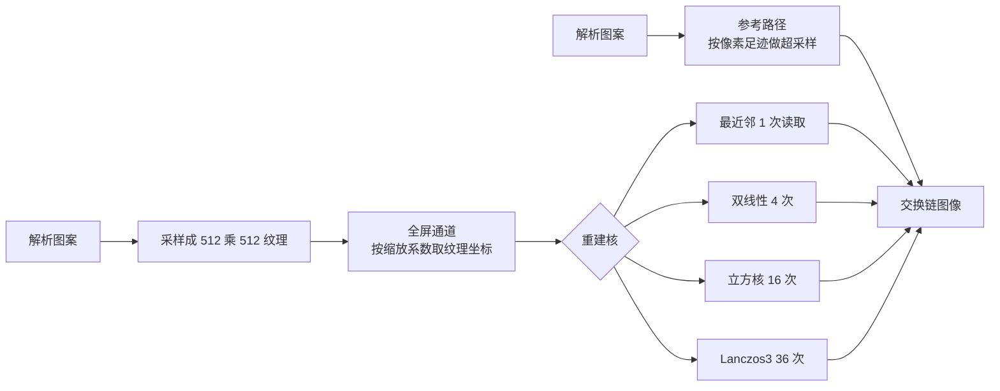

# texture_filtering：高阶纹理过滤

构建方式见仓库根目录的 README。

## 简介

纹理是一段频率沿半径线性增长的图案（两个错开的频率渐变叠加，三个通道用不同相位，
[`src/scene_setup.cpp:10-20`](src/scene_setup.cpp#L10-L20)），整张图 512 乘 512
（[`src/scene_setup.h:8-9`](src/scene_setup.h#L8-L9)、[`src/scene_setup.cpp:28-48`](src/scene_setup.cpp#L28-L48)）。
全屏通道把它按缩放系数采样一遍（[`shaders/sample.frag:152-154`](shaders/sample.frag#L152-L154)）：缩放
小于 1 时纹理被放大，能看到重建核的形状；大于 1 时纹理被缩小，单个像素盖住多个纹素。参考一档不走纹理，
直接按解析公式算图案（[`shaders/sample.frag:134-148`](shaders/sample.frag#L134-L148)），放大时取像素中心，
缩小时按像素覆盖的区域做超采样，相当于理想的重建。

| 控件 | 取值 |
| --- | --- |
| 重建核 | 最近邻、双线性、三阶 B 样条、Catmull-Rom、Lanczos2、Lanczos3、解析参考 |
| 缩放 | 0.02 到 24，小于 1 是放大 |
| 参考超采样数 | 1 到 16，每边的平方根 |
| 显示缩放 | 0.2 到 4 |

## 渲染流程



图案纹理在创建时按解析公式采样一遍（[`src/renderer.cpp:266-268`](src/renderer.cpp#L266-L268)），
采样器只负责寻址，取纹素值全部由着色器里的 `texelFetch` 手工完成
（[`src/renderer.cpp:270-280`](src/renderer.cpp#L270-L280)、[`shaders/sample.frag:37-43`](shaders/sample.frag#L37-L43)），
重复寻址在纹素下标上取模实现（[`shaders/sample.frag:39-42`](shaders/sample.frag#L39-L42)）。片元着色器
按当前的核分派（[`shaders/sample.frag:156-171`](shaders/sample.frag#L156-L171)），每个像素的读取次数在
主机侧按核统计（[`src/renderer.cpp:34-52`](src/renderer.cpp#L34-L52)）。

## 实现要点

### 重建是一次卷积

纹理存的是离散样本，屏幕像素落在样本之间，取值要靠一个核把邻域样本加权求和
（[`shaders/sample.frag:112-130`](shaders/sample.frag#L112-L130)）：

$$
f(x) \approx \sum_{i} f_i \, k(x - x_i)
$$

$f_i$ 是纹素值，$k$ 是重建核，$x$ 是采样位置。采样位置先由纹理坐标换算成纹素坐标，整数部分是纹素下标，小数部分是纹素内部的位置
（[`shaders/sample.frag:46-49`](shaders/sample.frag#L46-L49)）。核的性质决定画面的样子：支撑越宽、越接近理想的 sinc，细节保留得越多，代价是过冲与读取次数。

五种核的权重由同一个函数按核的种类分支给出（[`shaders/sample.frag:73-110`](shaders/sample.frag#L73-L110)，$t$ 是采样点到纹素中心的距离）：

| 核 | 权重 | 支撑 | 是否过冲 |
| --- | --- | --- | --- |
| 最近邻 | 只取最近的一个纹素 | 1 | 否 |
| 双线性 | 三角形，两个方向各两个样本 | 2 | 否 |
| 三阶 B 样条 | $\dfrac{2}{3} - t^2 + \dfrac{1}{2}\lvert t\rvert^3$，$\lvert t\rvert < 1$；$\dfrac{(2-\lvert t\rvert)^3}{6}$，$1 \le \lvert t\rvert < 2$ | 4 | 否，权重全为正 |
| Catmull-Rom | $\dfrac{3}{2}\lvert t\rvert^3 - \dfrac{5}{2}t^2 + 1$，$\lvert t\rvert < 1$；$-\dfrac{1}{2}\lvert t\rvert^3 + \dfrac{5}{2}t^2 - 4\lvert t\rvert + 2$，$1 \le \lvert t\rvert < 2$ | 4 | 是 |
| Lanczos$a$ | $\operatorname{sinc}(t) \operatorname{sinc}(t/a)$ | $2a$ | 是，带负旁瓣 |

两个方向的核是同一套权重相乘，因此一次采样要读 $4$、$16$ 或 $36$ 个纹素（[`src/renderer.cpp:34-52`](src/renderer.cpp#L34-L52)），
循环范围由核的支撑决定（[`shaders/sample.frag:114-128`](shaders/sample.frag#L114-L128)）。Lanczos 的核在零点要单独处理，
否则 $\sin(0)/0$ 会算出非数（[`shaders/sample.frag:105-108`](shaders/sample.frag#L105-L108)）。

### 放大八倍：与理想重建的误差

缩放 0.125 时，一个纹素在屏幕上占 25 个像素，重建核的形状直接决定画面：

| 重建核 | 每个像素的读取次数 | 平均绝对差 | 超过 8 的像素占比 | 最大差值 |
| --- | --- | --- | --- | --- |
| 最近邻 | 1 | 2.6167 | 3.90% | 16 |
| 双线性 | 4 | 0.2482 | 0.00% | 2 |
| 三阶 B 样条 | 16 | 0.3873 | 0.00% | 2 |
| Catmull-Rom | 16 | 0.1781 | 0.00% | 1 |
| Lanczos2 | 16 | 0.2946 | 0.00% | 2 |
| Lanczos3 | 36 | 0.2436 | 0.00% | 2 |

按误差排序是 Catmull-Rom 最好，Lanczos3 与双线性其次，三阶 B 样条最差。两个插值核（Catmull-Rom 与 Lanczos）在整数纹素位置上的权重正好是 $\delta$ 函数，
重建能精确通过原来的样本；三阶 B 样条是拟合核，它在整数位置上的权重是 $\frac{1}{6}, \frac{4}{6}, \frac{1}{6}$
（[`shaders/sample.frag:82-85`](shaders/sample.frag#L82-L85)），等于自己又做了一次平滑，所以偏软。最近邻的误差比其余所有核大一个数量级，画面是一块块方格。

图案在放大八倍之后频率已经很低（每个周期三百多个像素），核之间的差别被压小了。把缩放推到 1（相当于放大 3.1 倍，纹素更密集）再看同一组误差：

| 重建核 | 平均绝对差 | 超过 8 的像素占比 | 最大差值 |
| --- | --- | --- | --- |
| 最近邻 | 6.3830 | 27.57% | 60 |
| 双线性 | 1.3304 | 0.31% | 78 |
| 三阶 B 样条 | 2.5053 | 5.27% | 84 |
| Catmull-Rom | 0.3121 | 0.40% | 69 |
| Lanczos2 | 0.5924 | 0.41% | 69 |
| Lanczos3 | 0.4533 | 0.50% | 70 |

频率一高，核之间的差距立刻拉开：Catmull-Rom 与三阶 B 样条差八倍（0.3121 对 2.5053）。
超过 8 的像素占比那一列反而要小心看：Catmull-Rom 是 0.40%、三阶 B 样条是 5.27%，但两者的最大差值都是几十个灰阶——那是插值核在少数位置上的过冲，画面上一圈很窄的亮边或暗边。

### 缩小八倍：换核解决不了

缩放 8 时纹理在画面里平铺八份，每个屏幕像素盖住 64 个纹素。此时正确的做法是对像素覆盖的面积做积分，而上面那些核都只读 1 到 36 个纹素
（[`src/renderer.cpp:34-52`](src/renderer.cpp#L34-L52)），离一次平均还差得远：

| 重建核 | 平均绝对差 | 超过 8 的像素占比 | 平均拉普拉斯响应 |
| --- | --- | --- | --- |
| 最近邻 | 27.50 | 77.28% | 136.82 |
| 双线性 | 25.82 | 75.14% | 132.20 |
| 三阶 B 样条 | 24.66 | 74.33% | 128.24 |
| Catmull-Rom | 27.01 | 75.83% | — |
| Lanczos3 | 27.13 | 75.94% | 136.72 |
| 参考（8 乘 8 超采样） | — | — | 50.00 |

六种核的平均绝对差都在 25 到 27 之间，彼此差不到 10%。参考图的平均拉普拉斯响应只有 50.00，而这些核给出的画面在 128 到 137 之间，是正确值的两倍半以上：多出来的全部是摩尔纹。
三阶 B 样条略微最好（24.66），因为它的 16 个权重全为正，最接近一次平均；Lanczos3 反而最差，它的负旁瓣把中心样本的权重抬得更高，等于在放大高频，高频没有被压掉。

结论是缩小时换更贵的核没有用：缺的是把 64 个纹素先平均掉这一步，只能靠多级渐远纹理或其它预过滤手段。各向异性过滤沿长轴取多个样本再合并，补的正是这一步。

### 参考本身也要收敛

参考路径按超采样近似像素覆盖面积上的积分（[`shaders/sample.frag:134-148`](shaders/sample.frag#L134-L148)）。以 16 乘 16 为基准，其余档位与它的差：

| 每边的采样数 | 平均绝对差 | 超过 8 的像素占比 | 最大差值 |
| --- | --- | --- | --- |
| 1（只取中心） | 27.1462 | 76.04% | 130 |
| 2 | 3.8056 | 7.02% | 37 |
| 4 | 0.9512 | 0.86% | 23 |
| 8 | 0.2755 | 0.35% | 12 |

只取中心就是点采样，与真正的面积平均差 27 个灰阶——这正是上面那张表里各核的误差量级，说明那些误差几乎全部来自欠采样，核的形状只占很小的一部分。四乘四（每像素 16 个采样）之后误差降到 0.95，八乘八降到 0.28。

### 设备时间

锁定核心频率 2880 兆赫、显存频率 15001 兆赫，每段测量六秒，缩放取 1：

| 重建核 | 每个像素的读取次数 | 设备时间 |
| --- | --- | --- |
| 最近邻 | 1 | 0.008 |
| 双线性 | 4 | 0.009 |
| Catmull-Rom | 16 | 0.035 |
| 三阶 B 样条 | 16 | 0.041 |
| Lanczos2 | 16 | 0.071 |
| Lanczos3 | 36 | 0.146 |
| 参考，8 乘 8 | 64 | 0.128 |
| 参考，16 乘 16 | 256 | 0.485 |

读取次数相同的两个立方核代价不同：Catmull-Rom 与三阶 B 样条都是十六次读取，前者 0.035、后者 0.041，差在权重公式里的运算量。
Lanczos2 同样是十六次读取却要 0.071，因为它每个权重都要算两次正弦；Lanczos3 的三十六次读取加上正弦，代价是双线性的十六倍。
参考的十六乘十六要算 256 次图案函数，0.485 毫秒，比 Lanczos3 贵三倍多——用它来衡量别的核只适合离线跑。

## 界面控件

| 控件 | 作用 |
| --- | --- |
| 重建核 | 五种核加参考路径 |
| 缩放 | 小于 1 放大纹理，大于 1 缩小并平铺 |
| 参考超采样数 | 参考路径的质量 |
| 显示缩放 | 亮度缩放，便于观察过冲区域 |
| GPU 锁频 | 与间接绘制 case 共用同一个面板 |

面板同时显示绘制命令条数、渲染通道数与本帧每个像素的纹理读取次数。

## 命令行参数

| 参数 | 含义 | 默认值 |
| --- | --- | --- |
| `--filter 名字` | 重建核，取 `nearest`、`bilinear`、`bspline`、`catmull_rom`、`lanczos2`、`lanczos3` 或 `analytic` | bilinear |
| `--scale F` | 缩放，小于 1 放大 | 1.0 |
| `--reference N` | 参考超采样数，每边的采样数 | 8 |
| `--display F` | 显示缩放 | 1.0 |
| `--no-interface` | 不显示界面面板 | 显示 |
| `--auto-exit S` | 运行 S 秒后自动退出 | 关闭 |
| `--capture 文件名` | 退出前把画面写成 PNG 并打印像素统计 | 关闭 |
| `--report 文件名` | 退出前把本次运行的平均耗时以 CSV 形式追加到该文件 | 关闭 |
| `--control-port N` | 打开 TCP 控制服务并监听该端口 | 关闭 |
| `--core-clock N` | 启动时锁定的核心频率，单位 MHz，取最接近的可选档位 | 不锁频 |
| `--memory-clock N` | 启动时锁定的显存频率，单位 MHz，取最接近的可选档位 | 不锁频 |

键盘操作：`Esc` 退出。

## 测试方法

放大八倍逐核抓帧：

```
build\meow_texture_filtering.exe --filter analytic --scale 0.125 --reference 1 --auto-exit 3 --no-interface --capture intermediate\tf_mag_analytic.png
build\meow_texture_filtering.exe --filter nearest --scale 0.125 --reference 1 --auto-exit 3 --no-interface --capture intermediate\tf_mag_nearest.png
build\meow_texture_filtering.exe --filter bilinear --scale 0.125 --reference 1 --auto-exit 3 --no-interface --capture intermediate\tf_mag_bilinear.png
build\meow_texture_filtering.exe --filter bspline --scale 0.125 --reference 1 --auto-exit 3 --no-interface --capture intermediate\tf_mag_bspline.png
build\meow_texture_filtering.exe --filter catmull_rom --scale 0.125 --reference 1 --auto-exit 3 --no-interface --capture intermediate\tf_mag_catmull_rom.png
build\meow_texture_filtering.exe --filter lanczos2 --scale 0.125 --reference 1 --auto-exit 3 --no-interface --capture intermediate\tf_mag_lanczos2.png
build\meow_texture_filtering.exe --filter lanczos3 --scale 0.125 --reference 1 --auto-exit 3 --no-interface --capture intermediate\tf_mag_lanczos3.png
```

缩小八倍，参考取每像素 8 乘 8 的超采样：

```
build\meow_texture_filtering.exe --filter analytic --scale 8 --reference 8 --auto-exit 3 --no-interface --capture intermediate\tf_min_analytic.png
build\meow_texture_filtering.exe --filter nearest --scale 8 --reference 8 --auto-exit 3 --no-interface --capture intermediate\tf_min_nearest.png
build\meow_texture_filtering.exe --filter lanczos3 --scale 8 --reference 8 --auto-exit 3 --no-interface --capture intermediate\tf_min_lanczos3.png
```

参考路径自身的收敛：

```
build\meow_texture_filtering.exe --filter analytic --scale 8 --reference 1 --auto-exit 3 --no-interface --capture intermediate\tf_ref_1.png
build\meow_texture_filtering.exe --filter analytic --scale 8 --reference 16 --auto-exit 3 --no-interface --capture intermediate\tf_ref_16.png
```

测量设备时间：启动一个进程锁频并打开控制服务，按段发送命令，程序把每段的结果追加到 CSV：

```
build\meow_texture_filtering.exe --no-interface --control-port 21000 --core-clock 2880 --memory-clock 15001 --report intermediate\tf_measure.csv
```

连上 21000 端口后，`filter`/`scale`/`reference`/`display` 改配置，`begin` 与 `end` 圈定一段测量，`quit` 退出。

## 源码结构

| 文件 | 内容 |
| --- | --- |
| `src/main.cpp` | 桌面入口：命令行解析、主循环与界面状态 |
| `src/android_main.cpp` | 安卓入口：NativeActivity 生命周期、表面与交换链、主循环 |
| `src/renderer.cpp` | 全屏通道、图案纹理的创建、五种核的读取次数统计 |
| `src/scene_setup.cpp` | 解析图案与它的纹理采样 |
| `src/case_ui.cpp` | 本 case 的控制面板与全部界面文本 |
| `src/timing_items.cpp` | 本 case 的计时项定义 |
| `shaders/sample.frag` | 五种重建核、解析参考与结果输出 |
| `shaders/fullscreen.vert` | 全屏三角形 |

## 安卓端差异

- 实例与设备申请 Vulkan 1.1；`minSdk` 24 是 Vulkan 1.0 的最低 API 等级。
- 移动端纹理缓存更小，Lanczos3 那三十六次跨纹素读取的代价会比桌面更突出；这也是移动端常用双线性加多级渐远纹理的原因。
- 设备时间只在设备支持时间戳时测量。
- GPU 锁频面板不显示：它依赖桌面的 `nvidia-smi`。
- 帧率上限 60 FPS，避免无界空转发热。

### 安卓测试方法

```
adb -s <serial> install -r android\app\build\outputs\apk\debug\app-debug.apk
adb -s <serial> logcat -s MeowVulkanDemo
```

应用内置回环 TCP 控制服务（端口 21000），安卓端经 `adb forward tcp:21000 tcp:21000` 映射到本机，命令与桌面端相同。
