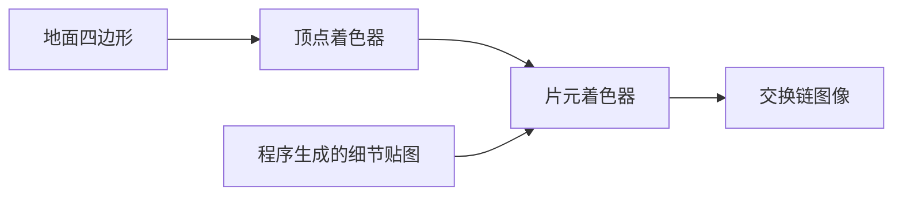

# texture_lod：多级纹理、LOD 与各向异性

构建方式见仓库根目录的 README。

## 简介

一块水平地面，贴一张程序生成的高频细节贴图（棋盘格叠加细噪声），贴图带有完整的多级渐远纹理。相机停在地面上方，视野俯角可以在界面上调整：俯角越大越接近俯视，越小越接近掠射。

采样行为由三项配置决定：

| 控件 | 取值 | 说明 |
| --- | --- | --- |
| 多级纹理 | 开 / 关 | 关闭时把采样器的最大层级钳到 0，无论导数多大都只取最粗的一级 |
| 各向异性 | 1x / 2x / 4x / 8x / 16x | 按采样足迹的长短轴比例在长轴方向多取几次 |
| LOD 偏置 | -2 到 2 | 加到硬件算出的层级上 |

另有三个视图：

| 视图 | 说明 |
| --- | --- |
| 正常 | 直接输出采样结果 |
| 层级对比 | 左半屏是着色器按导数算出的层级，右半屏是硬件 `textureQueryLod` 给出的层级 |
| 采样足迹 | 绿通道输出两个方向导数的长短轴比值，红通道输出按导数算出的层级 |

## 渲染流程



## 实现要点

### 层级的来源

层级由纹理坐标对屏幕坐标的导数决定：把两个方向的导数换算成纹素长度，`rho` 取两者模长的较大值，层级取 `log2(rho)`。这就是片元着色器里手算层级的方式，也是图形处理器决定采样哪一级的依据。

缩小方向靠预滤波（多级纹理的各级），放大方向靠重构滤波（线性插值）。不控制层级时，远处一个像素覆盖很多纹素，硬件只能取其中一次采样，摩尔纹与闪烁随之出现。

### 各向异性

斜视时纹理坐标在一个方向上的屏幕导数是另一个方向的很多倍，采样足迹从方形被拉成细长的椭圆。各向同性过滤按长轴取层级，短轴方向的信息被过度模糊；各向异性过滤在长轴方向多取若干次，把模糊收窄到短轴对应的层级。

### 层级对比视图

着色器按导数算出的层级与硬件 `textureQueryLod` 给出的层级在同一个片元里都能取到，左右并排输出即可对照。`textureQueryLod` 的结果按规范不含 LOD 偏置，也不含各向异性修正，因此两者的差别只在各向异性带来的那一项上。

### 采样足迹视图

绿通道输出 `major / minor`，也就是两个方向导数长短轴的比值，比值大说明采样足迹越斜；红通道输出按导数算出的层级，归一化到层级总数上。

## 界面控件

| 控件 | 作用 |
| --- | --- |
| 移动速度 | 相机移动速度 |
| 视野俯角 | 相机向下的俯角，越大越接近俯视，越小越接近掠射 |
| 多级纹理 | 关闭后把最大层级钳到 0 |
| 各向异性 | 1x 到 16x |
| LOD 偏置 | 加到硬件层级上的偏置 |
| 视图 | 正常、层级对比、采样足迹 |
| GPU 锁频 | 与间接绘制 case 共用同一个面板 |

面板同时显示绘制命令条数与场景说明，另附操作指南；耗时面板按本 case 的阶段拆分逐项列出。

## 命令行参数

命令行参数与界面控制同一套状态，用于自动化测试：

| 参数 | 含义 | 默认值 |
| --- | --- | --- |
| `--view 名字` | 启动时的视图，取 `normal`、`lod` 或 `footprint` | normal |
| `--no-mipmap` | 启动时关闭多级纹理 | 开启 |
| `--anisotropy N` | 各向异性倍数，取值 1 到 16 | 1 |
| `--lod-bias F` | LOD 偏置，取值 -2 到 2 | 0 |
| `--pitch D` | 视野俯角，单位度，取值 8 到 75 | 26 |
| `--no-interface` | 不显示界面面板 | 显示 |
| `--auto-exit S` | 运行 S 秒后自动退出 | 关闭 |
| `--capture 文件名` | 退出前把画面写成 PNG 并打印像素统计 | 关闭 |
| `--report 文件名` | 退出前把本次运行的平均耗时以 CSV 形式追加到该文件 | 关闭 |
| `--control-port N` | 打开 TCP 控制服务并监听该端口 | 关闭 |
| `--core-clock N` | 启动时锁定的核心频率，单位 MHz，取最接近的可选档位 | 不锁频 |
| `--memory-clock N` | 启动时锁定的显存频率，单位 MHz，取最接近的可选档位 | 不锁频 |

键盘操作：`W` `A` `S` `D` 前后左右移动，`Q` `E` 下降与上升，方向键转动视角，左 Shift 加速，Esc 退出。

## 测试方法

多级纹理开关与各向异性的画面差异用抓帧对比：

```
build\meow_texture_lod.exe --auto-exit 4 --no-interface --capture intermediate\tl_mipmap.png
build\meow_texture_lod.exe --auto-exit 4 --no-interface --capture intermediate\tl_nomip.png --no-mipmap
build\meow_texture_lod.exe --auto-exit 4 --no-interface --capture intermediate\tl_aniso16.png --anisotropy 16
```

关掉多级纹理的那张与开启的一张相差每像素平均 3.5，12.5% 的像素不同，差别集中在远处的高频区域；各向异性开到 16x 的一张与 1x 的一张相差平均 1.8，7.3% 的像素不同，差别集中在掠射方向。

层级对比视图把两种层级并排输出：

```
build\meow_texture_lod.exe --auto-exit 4 --no-interface --capture intermediate\tl_lodview.png --view lod
```

把右半屏左右翻转后与左半屏相减，逐像素平均差 1.7，超过 8 的像素占 7.7%，两者在关掉各向异性时基本一致，剩下的差异来自归一化与取整。

参数可以在同一次运行里改变：

```
adb -s <serial> forward tcp:21000 tcp:21000
```

桌面端用 `--control-port 21000` 启动后，连接并逐行发命令：`view`/`mipmap`/`anisotropy`/`lod-bias`/`pitch` 改配置，`begin` 与 `end` 圈定一段测量（`end` 返回一行与 CSV 同格式的数据），`quit` 退出。

随时间变化的参数曲线与测量报告格式与间接绘制 case 一致，报告里的前几列是视图、多级纹理开关、各向异性倍数、LOD 偏置与绘制命令条数。

## 源码结构

本 case 自己的文件都在 `cases/texture_lod` 下：

| 文件 | 内容 |
| --- | --- |
| `src/main.cpp` | 桌面入口：命令行解析、主循环与界面状态 |
| `src/android_main.cpp` | 安卓入口：NativeActivity 生命周期、ANativeWindow 表面与交换链、主循环 |
| `src/renderer.cpp` | 渲染通道、管线、贴图与采样器、采样器重建、时间戳查询 |
| `src/scene_setup.cpp` | 地面顶点数据与程序生成的细节贴图像素 |
| `src/case_ui.cpp` | 本 case 的控制面板与全部界面文本 |
| `src/timing_items.cpp` | 本 case 的计时项定义 |
| `shaders/lod.vert` | 地面顶点变换 |
| `shaders/lod.frag` | 层级计算、层级对比、采样足迹与正常采样 |

## 安卓端差异

- 实例与设备申请 Vulkan 1.1，着色器以 `--target-env=vulkan1.1` 编译，覆盖只支持 1.1 的设备；`minSdk` 24 是 Vulkan 1.0 的最低 API 等级。
- 设备时间只在设备支持时间戳时测量：驱动的 `timestampComputeAndGraphics` 能力与图形队列族的 `timestampValidBits` 都满足才创建查询池并记录时间戳，不支持的设备上"设备时间"恒为零，主机侧各项计时照常。
- GPU 锁频面板不显示：它依赖桌面的 `nvidia-smi`。
- 相机固定在初始化位置，没有键盘输入；触摸事件交给 ImGui 的安卓后端，面板上的滑块和按钮可以直接操作。
- 帧率上限 60 FPS，避免无界空转发热。

### 安卓测试方法

adb 的目标设备由设备序列号指定，序列号用 `adb devices` 查询。只连接一台设备时命令里的 `-s <serial>` 可以省略。构建出 APK 后按下面方式安装并查看日志：

```
adb -s <serial> install -r android\app\build\outputs\apk\debug\app-debug.apk
adb -s <serial> logcat -s MeowVulkanDemo
```

应用内置回环 TCP 控制服务（桌面与安卓一致，端口 21000），安卓端经 `adb forward tcp:21000 tcp:21000` 把设备上的控制端口映射到本机，命令与桌面端相同。
