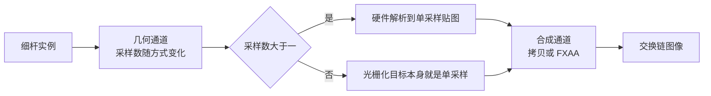

# thin_geometry：亚像素细物体、多重采样与后处理抗锯齿

构建方式见仓库根目录的 README。

## 简介

一排竖直细杆与细丝，宽度在零点二到六像素之间连续可调，背景是高对比的暗色，细杆以可调速度横向平移，
让它们的次像素位置不断变化。每根细杆是缓冲里的一条 `vec4`（[`shaders/rod.vert:12-14`](shaders/rod.vert#L12-L14)），
位置带一点哈希抖动，每隔三根是一根更细的细丝（[`src/renderer.cpp:414-425`](src/renderer.cpp#L414-L425)），宽度
按像素换算到裁剪空间之后在顶点着色器里展开成一根竖直细杆
（[`shaders/rod.vert:18-27`](shaders/rod.vert#L18-L27)）。

| 抗锯齿方式 | 做法 | 覆盖信息的来源 |
| --- | --- | --- |
| 无抗锯齿 | 单采样光栅化（[`src/renderer.cpp:16-28`](src/renderer.cpp#L16-L28)） | 只有像素中心是否落在图元内 |
| 多重采样 4x | 采样点参与覆盖判定（[`src/renderer.cpp:30-69`](src/renderer.cpp#L30-L69)），解析后得到灰度（[`src/renderer.cpp:685-727`](src/renderer.cpp#L685-L727)） | 每个像素四个采样点 |
| FXAA 后处理 | 单采样光栅化之后按亮度差找边缘再平滑（[`shaders/fxaa.frag:24-67`](shaders/fxaa.frag#L24-L67)） | 只有已经光栅化完的最终图像 |

## 渲染流程



几何通道的目标采样数随方式变化（[`src/renderer.cpp:30-69`](src/renderer.cpp#L30-L69)），多重采样时先解析到单采样
贴图（[`src/renderer.cpp:685-727`](src/renderer.cpp#L685-L727)）；合成通道用同一个全屏三角形
（[`shaders/fullscreen.vert:6-11`](shaders/fullscreen.vert#L6-L11)），按方式选择拷贝着色器
（[`shaders/copy.frag:9-12`](shaders/copy.frag#L9-L12)）或 FXAA 着色器
（[`src/renderer.cpp:762-771`](src/renderer.cpp#L762-L771)），FXAA 的边缘阈值与搜索步数用推送常量传给着色器
（[`shaders/fxaa.frag:8-10`](shaders/fxaa.frag#L8-L10)），界面也记录在这个通道里
（[`src/renderer.cpp:775-781`](src/renderer.cpp#L775-L781)）。采样数改动之后，渲染通道、附件与几何管线一起重建
（[`src/renderer.cpp:556-585`](src/renderer.cpp#L556-L585)）。

## 实现要点

### 细杆宽度小于一个像素时的可见性

细杆宽度取 0.4 像素，平移偏移取零（[`src/main.cpp:70-71`](src/main.cpp#L70-L71)），抓帧后取第 400 行第 160 到
259 列，亮度明显高于背景的位置如下（背景亮度 13，细杆亮度 255）：

| 方式 | 这一行上出现的细杆 |
| --- | --- |
| 无抗锯齿 | 204 列 = 255 |
| 多重采样 4x | 204 列 = 73，227 列 = 73，246 列 = 73 |
| FXAA 后处理 | 204 列 = 192 |

无抗锯齿时一根 0.4 像素宽的细杆只有在刚好盖住某个像素中心时才会出现
（[`shaders/rod.vert:22-23`](shaders/rod.vert#L22-L23)），因此这一段里 64 根细杆只看得见一根，而且一亮就是满亮
255。多重采样 4x 按采样点判定覆盖（[`src/renderer.cpp:16-28`](src/renderer.cpp#L16-L28)），同样这一段里看得见
三根，亮度是 73，也就是四分之一的覆盖。FXAA 拿到的图像与无抗锯齿完全相同
（[`src/renderer.cpp:469-474`](src/renderer.cpp#L469-L474)），它只能把已经出现的那一根从 255 压到 192，没有
办法让另外两根出现。

细杆宽度取一像素时，同样的位置差别小一些，但性质一样：

| 方式 | 这一行上出现的细杆 |
| --- | --- |
| 无抗锯齿 | 204 列 = 255，224 列 = 255 |
| 多重采样 4x | 204 列 = 255，223 列 = 73，224 列 = 194 |
| FXAA 后处理 | 204 列 = 192，224 列 = 192 |

### 平移时的闪烁

细杆宽度 0.4 像素、数量 64，把平移偏移从 0 推到 0.8 像素，取五个位置各抓一帧：

| 方式 | 五个位置的画面平均亮度 | 相对标准差 | 看得见的细杆像素数 |
| --- | --- | --- | --- |
| 无抗锯齿 | 15.586 16.812 15.178 15.586 15.722 | 3.48% | 15390 22680 12960 15390 16200 |
| 多重采样 4x | 15.747 15.677 15.677 15.674 15.677 | 0.18% | 46170 48600 48600 53460 48600 |
| FXAA 后处理 | 14.915 15.822 14.612 14.915 15.016 | 2.70% | 15390 22680 12960 15390 16200 |

无抗锯齿的整幅亮度在五个次像素位置之间摆动百分之三点五，看得见的细杆像素数在一万三千到两万三千之间
跳变。多重采样 4x 的相对标准差是百分之零点一八，且看得见的细杆像素数约为无抗锯齿的三倍。FXAA 的可见
细杆像素数与无抗锯齿逐帧完全相同，相对标准差只从百分之三点五降到百分之二点七，它改变的只是已经可见
像素的亮度（[`shaders/fxaa.frag:64-67`](shaders/fxaa.frag#L64-L67)），不改变哪些细杆能被看见。每根细杆的位置
抖动在生成缓冲时固定下来（[`src/renderer.cpp:419-421`](src/renderer.cpp#L419-L421)），平移时各根细杆才会各自
进出像素。

### 设备时间

锁频 2880/15001 之后按段测量，细杆宽度 0.4 像素。各配置的绘制命令条数都是 2：几何通道一次实例化绘制
（[`src/renderer.cpp:676-678`](src/renderer.cpp#L676-L678)），合成通道一次全屏绘制
（[`src/renderer.cpp:772-773`](src/renderer.cpp#L772-L773)）。

| 方式 | 细杆数量 | 设备时间 |
| --- | --- | --- |
| 无抗锯齿 | 64 | 0.011 ± 0.008 ms |
| 多重采样 4x | 16 | 0.020 ± 0.006 ms |
| 多重采样 4x | 64 | 0.021 ± 0.006 ms |
| 多重采样 4x | 256 | 0.030 ± 0.009 ms |
| FXAA 后处理 | 16 | 0.017 ± 0.004 ms |
| FXAA 后处理 | 64 | 0.018 ± 0.005 ms |
| FXAA 后处理 | 256 | 0.021 ± 0.006 ms |

多重采样 4x 比无抗锯齿多出解析与四倍采样的覆盖测试（[`src/renderer.cpp:685-727`](src/renderer.cpp#L685-L727)），
从 16 根到 256 根时设备时间从 0.020 涨到 0.030 毫秒，随细杆数量上升。FXAA 的后处理本身开销与细杆数量
无关（[`shaders/fxaa.frag:53-62`](shaders/fxaa.frag#L53-L62)），从 16 根到 256 根时涨到 0.021 毫秒的那部分来自
几何通道本身。本 case 的画面很轻，绝对时间只有几十微秒，标准差与差值同量级，只有多重采样相对无抗锯齿
的那一档差别稳定可辨。

## 界面控件

| 控件 | 作用 |
| --- | --- |
| 方式 | 无抗锯齿、多重采样 4x 或 FXAA 后处理 |
| 细杆数量 | 4 到 256，每隔三根是一根更细的细丝 |
| 细杆宽度 | 0.2 到 6 像素 |
| 平移速度 | 细杆每秒平移的像素数，设为零可以固定次像素位置抓帧 |
| 背景亮度 | 清除色的亮度，细杆恒为白色 |
| 搜索步数 | FXAA 沿边缘搜索的步数 |
| 边缘阈值 | FXAA 判定边缘的亮度差阈值 |
| GPU 锁频 | 与间接绘制 case 共用同一个面板 |

面板同时显示绘制命令条数，另附操作指南；耗时面板按本 case 的通道拆分逐项列出。

## 命令行参数

| 参数 | 含义 | 默认值 |
| --- | --- | --- |
| `--mode 名字` | 抗锯齿方式，取 `none`、`msaa` 或 `fxaa` | msaa |
| `--rod-count N` | 细杆数量，1 到 512 | 64 |
| `--rod-width F` | 细杆基准宽度，单位像素 | 1.5 |
| `--pan-speed F` | 细杆每秒平移的像素数 | 40 |
| `--pan F` | 启动时的平移偏移，单位像素 | 0 |
| `--background F` | 背景亮度，0 到 1 | 0.05 |
| `--fxaa-steps N` | FXAA 的搜索步数，1 到 16 | 8 |
| `--fxaa-threshold F` | FXAA 的边缘阈值 | 0.125 |
| `--no-interface` / `--auto-exit S` / `--capture F` / `--report F` / `--control-port N` | 与其他 case 一致 | |

键盘操作：`Esc` 退出。

## 测试方法

固定次像素位置，先抓三种方式在同一位置下的画面：

```
build\meow_thin_geometry.exe --mode none --rod-width 0.4 --rod-count 64 --pan-speed 0 --pan 0 --auto-exit 3 --no-interface --capture intermediate\tg_none.png
build\meow_thin_geometry.exe --mode msaa --rod-width 0.4 --rod-count 64 --pan-speed 0 --pan 0 --auto-exit 3 --no-interface --capture intermediate\tg_msaa.png
build\meow_thin_geometry.exe --mode fxaa --rod-width 0.4 --rod-count 64 --pan-speed 0 --pan 0 --auto-exit 3 --no-interface --capture intermediate\tg_fxaa.png
```

再把平移偏移依次推到 0.2、0.4、0.6、0.8 像素，每种方式各抓五帧，比较五帧之间的整幅亮度与可见细杆
像素数。

测量设备时间：启动一个进程锁频并打开控制服务，按段发送命令，程序把每段的结果追加到 CSV：

```
build\meow_thin_geometry.exe --no-interface --control-port 21000 --core-clock 2880 --memory-clock 15001 --report intermediate\tg_measure.csv
```

连上 21000 端口后，`mode`/`rod-count`/`rod-width`/`pan-speed`/`pan`/`background`/`fxaa-steps`/
`fxaa-threshold` 改配置，`begin` 与 `end` 圈定一段测量，`quit` 退出。

## 源码结构

| 文件 | 内容 |
| --- | --- |
| `src/main.cpp` | 桌面入口：命令行解析、主循环与界面状态 |
| `src/android_main.cpp` | 安卓入口：NativeActivity 生命周期、表面与交换链、主循环 |
| `src/renderer.cpp` | 几何通道、多重采样解析、拷贝与 FXAA 合成，细杆缓冲的生成 |
| `src/case_ui.cpp` | 本 case 的控制面板与全部界面文本 |
| `src/timing_items.cpp` | 本 case 的计时项定义 |
| `shaders/rod.vert` `shaders/rod.frag` | 细杆的顶点展开与纯色输出 |
| `shaders/fullscreen.vert` `shaders/copy.frag` | 全屏三角形与不带后处理的合成 |
| `shaders/fxaa.frag` | 按亮度差找边缘、沿边缘搜索后平滑的后处理 |

## 安卓端差异

- 实例与设备申请 Vulkan 1.1；`minSdk` 24 是 Vulkan 1.0 的最低 API 等级。
- 多重采样 4x 需要设备的 `framebufferColorSampleCounts` 支持，不支持时自动降到相邻档位。
- 分块架构下多重采样的片上存储与桌面不同，带宽差别需要在真机上测量。
- 设备时间只在设备支持时间戳时测量。
- GPU 锁频面板不显示：它依赖桌面的 `nvidia-smi`。
- 帧率上限 60 FPS，避免无界空转发热。

### 安卓测试方法

```
adb -s <serial> install -r android\app\build\outputs\apk\debug\app-debug.apk
adb -s <serial> logcat -s MeowVulkanDemo
```

应用内置回环 TCP 控制服务（端口 21000），安卓端经 `adb forward tcp:21000 tcp:21000` 映射到本机。
