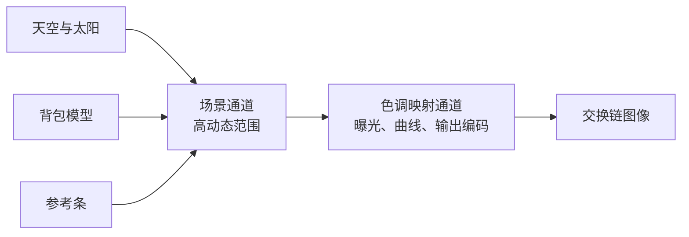

# tone_mapping：色调映射算子

构建方式见仓库根目录的 README。

## 简介

场景由三层内容叠成：一层解析计算的天空，天顶偏蓝、地平线偏亮，两者之间是一段指数过渡，再加一个圆盘状的太阳
（[`shaders/sky.frag:24-33`](shaders/sky.frag#L24-L33)）；一盏平行光照亮的背包模型，漫反射与镜面反射都乘上光源强度（
[`shaders/object.frag:41-58`](shaders/object.frag#L41-L58)）；以及屏幕左上角一条已知线性值的参考条（
[`shaders/bar.frag:9-10`](shaders/bar.frag#L9-L10)）。三层都先画进一张半精度浮点的高动态范围图像（
[`src/renderer.cpp:12`](src/renderer.cpp#L12)），之后整幅画面一起经过同一条色调映射与输出编码（
[`shaders/tonemap.frag:99-105`](shaders/tonemap.frag#L99-L105)）。

太阳圆盘的辐射亮度默认取 900（[`src/main.cpp:140`](src/main.cpp#L140)），天空地平线在 0.42 上下
（[`shaders/sky.frag:26`](shaders/sky.frag#L26)），背包的背光面接近 0.01，同一帧里的跨度接近五个数量级。色调映射要做的就是把这个跨度压进 [0,1]。

| 控件 | 取值 |
| --- | --- |
| 算子 | 不做映射、Reinhard、扩展 Reinhard、ACES、Hable filmic（[`src/renderer.h:13-19`](src/renderer.h#L13-L19)） |
| 作用分量 | 逐通道、按亮度（[`src/renderer.h:22-25`](src/renderer.h#L22-L25)） |
| 输出编码 | 线性直写、伽马 2.2、sRGB 传递函数（[`src/renderer.h:28-32`](src/renderer.h#L28-L32)） |
| 曝光 | -6 到 6 EV（[`src/case_ui.cpp:114`](src/case_ui.cpp#L114)） |
| 白点 W | 1 到 16，只有扩展 Reinhard 用到（[`src/case_ui.cpp:115`](src/case_ui.cpp#L115)） |
| 平行光强度、天空亮度、太阳辐射亮度 | 场景的三项强度（[`src/case_ui.cpp:97-99`](src/case_ui.cpp#L97-L99)） |

## 渲染流程



场景通道挂两个附件：一张高动态范围颜色图与一张深度图（[`src/renderer.cpp:57-113`](src/renderer.cpp#L57-L113)），
颜色附件离开通道时停在只读布局，交给色调映射通道采样（[`src/renderer.cpp:67`](src/renderer.cpp#L67)）。天空、物体与参考条三条管线由同一个函数创建
（[`src/renderer.cpp:345-491`](src/renderer.cpp#L345-L491)），共用一份顶点布局与管线布局，天空与参考条不参与深度比较
（[`src/renderer.cpp:433-435`](src/renderer.cpp#L433-L435)），物体开启深度测试与深度写入
（[`src/renderer.cpp:437-441`](src/renderer.cpp#L437-L441)）。每帧在同一个通道里按天空
（[`src/renderer.cpp:716-719`](src/renderer.cpp#L716-L719)）、物体
（[`src/renderer.cpp:721-725`](src/renderer.cpp#L721-L725)）、参考条
（[`src/renderer.cpp:727-732`](src/renderer.cpp#L727-L732)）的顺序提交三次绘制，参考条最后画，覆盖掉它后面的一切。

色调映射通道写交换链图像（[`src/renderer.cpp:116-155`](src/renderer.cpp#L116-L155)），一次全屏三角形绘制把高动态范围颜色读进来
（[`src/renderer.cpp:750-757`](src/renderer.cpp#L750-L757)），界面画在同一趟里
（[`src/renderer.cpp:759-763`](src/renderer.cpp#L759-L763)），设备时间因此分成场景与色调映射两段。

## 实现要点

### 动态范围与截断

不做映射时只有一条规则：超过 1 的截断到 1，低于 0 的截断到 0（[`shaders/tonemap.frag:70-72`](shaders/tonemap.frag#L70-L72)）。
默认场景下已经有 3.683% 的像素被截断，把曝光推高两级（也就是亮度乘四）之后，截断的像素涨到 46.461%：

| 配置 | 平均亮度 | 标准差 | 截断像素占比 | 可用像素占比 |
| --- | --- | --- | --- | --- |
| 不做映射，曝光 0 | 123.25 | 65.23 | 3.683% | 94.656% |
| 不做映射，曝光 +2 | 187.55 | 70.39 | 46.461% | 51.546% |

可用像素指亮度落在 8 到 247 之间的像素。截断丢掉的不只是亮度，还有整片区域的细节：太阳附近与天空的高光全部压成同一个值，把曝光调回去也没法恢复，因为写进交换链图像的是已经压平的结果。

### 四种算子

一个算子就是把线性亮度映射到 [0,1] 的函数 $f$。四个算子在实现里都写成单分量的曲线（[`shaders/tonemap.frag:44-66`](shaders/tonemap.frag#L44-L66)），
逐通道调用三次（[`shaders/tonemap.frag:73-77`](shaders/tonemap.frag#L73-L77)），或者按亮度调用一次
（[`shaders/tonemap.frag:78-81`](shaders/tonemap.frag#L78-L81)）。曝光作用在曲线之前：

$$
L' = 2^{EV} \cdot L
$$

界面上的曝光以 EV 为单位，填入 uniform 时取 2 的幂（[`src/main.cpp:115`](src/main.cpp#L115)），片元着色器把它乘到采样到的线性辐射亮度上
（[`shaders/tonemap.frag:102`](shaders/tonemap.frag#L102)）。

**Reinhard** 是最简单的有理式（[`shaders/tonemap.frag:46-48`](shaders/tonemap.frag#L46-L48)）：

$$
L_d = \frac{L'}{1 + L'}
$$

它在 $L' \to \infty$ 时趋近 1 但永远到不了，所以理论上不会出现截断。默认场景下它的截断像素只有 0.143%，代价是中低亮度被整体压暗，平均亮度从 123.25 掉到 108.18。

**扩展 Reinhard** 加一个白点 $L_{white}$，让 $L' = L_{white}$ 正好映射到 1
（[`shaders/tonemap.frag:49-51`](shaders/tonemap.frag#L49-L51)）：

$$
L_d = \frac{L'\left(1 + \dfrac{L'}{L_{white}^2}\right)}{1 + L'}
$$

白点取 4 时，超过 4 的亮度仍然会截断，默认场景下截断 2.215%。它与不扩展的那条的差别集中在 1 到 4 之间：两条曲线的平均绝对差是 1.797，超过 8 个灰阶的像素占 1.880%，最大差 24。

**ACES** 用 Narkowicz 给出的解析拟合（[`shaders/tonemap.frag:52-60`](shaders/tonemap.frag#L52-L60)），是几个分段拟合里最常用的一个：

$$
L_d = \mathrm{clamp}\!\left(\frac{L'(2.51 L' + 0.03)}{L'(2.43 L' + 0.59) + 0.14},\ 0,\ 1\right)
$$

按平均亮度排序，它位于不做映射与 Reinhard 之间：默认场景 130.89。截断 1.750%。

**Hable filmic** 用一条经验曲线先做成 S 形（[`shaders/tonemap.frag:32-41`](shaders/tonemap.frag#L32-L41)），再按白点归一
（[`shaders/tonemap.frag:61-64`](shaders/tonemap.frag#L61-L64)）：

$$
f(x) = \frac{x(Ax + CB) + DE}{x(Ax + B) + DF} - \frac{E}{F},
\qquad
L_d = \frac{f(L')}{f(W)}
$$

常数取 $A = 0.15$，$B = 0.50$，$C = 0.10$，$D = 0.20$，$E = 0.02$，$F = 0.30$
（[`shaders/tonemap.frag:34-39`](shaders/tonemap.frag#L34-L39)），$W = 11.2$
（[`shaders/tonemap.frag:62`](shaders/tonemap.frag#L62)）。它的中低亮度压得最狠：默认场景平均亮度只有 77.36，
同一块天空在别的算子下是 120 到 190，这里只有一半左右。

五个算子的画面统计：

| 算子 | 平均亮度 | 标准差 | 截断像素占比 | 近黑像素占比 |
| --- | --- | --- | --- | --- |
| 不做映射 | 123.25 | 65.23 | 3.683% | 1.504% |
| Reinhard | 108.18 | 52.36 | 0.143% | 1.505% |
| 扩展 Reinhard（W = 4） | 109.50 | 54.02 | 2.215% | 1.505% |
| ACES | 130.89 | 74.16 | 1.750% | 2.955% |
| Hable filmic | 77.36 | 47.11 | 1.284% | 2.701% |

近黑像素指亮度低于 8 的像素。截断像素为零的只有 Reinhard 一条，而它的标准差也是最低的，画面最平：这就是压缩高光必然付出的代价，四条曲线的区别只是把代价付在哪个亮度区间。

### 逐通道与按亮度

逐通道是把三个分量各自送进曲线（[`shaders/tonemap.frag:73-77`](shaders/tonemap.frag#L73-L77)）：

$$
(R_d, G_d, B_d) = \left(f(R'), f(G'), f(B')\right)
$$

按亮度是先算亮度，只压缩亮度，再按比例还原三个分量（[`shaders/tonemap.frag:78-81`](shaders/tonemap.frag#L78-L81)）：

$$
Y = 0.2126 R' + 0.7152 G' + 0.0722 B', \qquad
(R_d, G_d, B_d) = (R', G', B') \cdot \frac{f(Y)}{Y}
$$

亮度权重取 Rec. 709 的三个系数，在片元着色器里写成一次点积（[`shaders/tonemap.frag:79`](shaders/tonemap.frag#L79)）。

两条路的区别只在色彩上。逐通道时，亮度高且彩度大的像素三个分量被压到不同的程度，亮部会向白色靠；
按亮度时三个分量的比例原样保留，代价是结果仍然可能超过 1，需要额外截断。默认场景下统计亮度不低于 150 的像素的平均彩度（最大分量减最小分量）：

| 作用分量 | 平均彩度 | 彩度 95 分位 |
| --- | --- | --- |
| 逐通道 | 23.53 | 50.0 |
| 按亮度 | 43.60 | 87.0 |
| 不做映射（对照） | 40.36 | 83.0 |

逐通道把亮部的平均彩度从 40.36 压到 23.53，压掉四成，这就是高光去饱和；按亮度保持在 43.60，与不做映射的对照接近。整幅画面的平均绝对差是 9.318，超过 8 个灰阶的像素占 50.904%。

### 输出编码

曲线把线性值压进 [0,1] 之后还要编码到显示器的传递函数上，三种编码由同一个函数按 uniform 里的取值分支
（[`shaders/tonemap.frag:84-97`](shaders/tonemap.frag#L84-L97)）：

$$
\text{伽马 2.2}: \quad y = x^{1/2.2}
$$

$$
\text{sRGB}: \quad y =
\begin{cases}
12.92x, & x \le 0.0031308 \\
1.055 x^{1/2.4} - 0.055, & x > 0.0031308
\end{cases}
$$

伽马 2.2 是一次幂运算（[`shaders/tonemap.frag:93-95`](shaders/tonemap.frag#L93-L95)），sRGB 的两段由 `mix` 与 `step` 组合出分段结果（
[`shaders/tonemap.frag:87-92`](shaders/tonemap.frag#L87-L92)），线性直写原样返回
（[`shaders/tonemap.frag:96`](shaders/tonemap.frag#L96)）。

两种编码在暗部的差别最明显：同一帧里亮度低于 8 的像素，伽马 2.2 是 1.378%，sRGB 是 2.955%。
sRGB 的线性段比伽马曲线更暗，暗部被保留在更低的位置，这也正是它的用途：让线性段的斜率是常数，暗部的分层不会因为曲线的一阶导数接近零而丢失。
两条曲线的画面平均绝对差是 2.276，超过 8 个灰阶的像素 0.975%，最大差 9。

线性直写则完全不做编码，画面平均亮度从 130.89 掉到 83.45，近黑像素从 2.955% 涨到 8.792%：
把线性值直接交给一张线性格式的交换链图像，显示出来就是整体偏暗，因为显示器自己会按它的传递函数解释这些数值。与 sRGB 编码的画面平均绝对差 53.482，几乎全图（94.627%）都在 8 个灰阶以上。

### 参考条与理论值对照

参考条上的十四格是线性辐射亮度 $2^{-6}$ 到 $2^{6}$，每格是前一格的两倍，另加一格全黑
（[`src/scene_setup.cpp:5-13`](src/scene_setup.cpp#L5-L13)），十四块四边形由这份数值循环生成
（[`src/scene_setup.cpp:15-52`](src/scene_setup.cpp#L15-L52)），线性值放在纹理坐标的 x 分量里传给片元着色器
（[`shaders/bar.vert:11`](shaders/bar.vert#L11)）。它只写线性值，之后与画面走同一条曲线与编码
（[`shaders/bar.frag:9-10`](shaders/bar.frag#L9-L10)），所以每格的像素值可以逐项与公式算出来的理论值对照。ACES、曝光 0、sRGB 编码：

| 线性值 | 实测 | 理论 | 差值 |
| --- | --- | --- | --- |
| 0.00000 | 0.00 | 0.00 | 0.00 |
| 0.01562 | 20.00 | 20.45 | -0.45 |
| 0.03125 | 40.00 | 39.84 | +0.16 |
| 0.06250 | 71.00 | 70.81 | +0.19 |
| 0.12500 | 115.00 | 114.77 | +0.23 |
| 0.25000 | 165.00 | 164.57 | +0.43 |
| 0.50000 | 206.00 | 205.87 | +0.13 |
| 1.00000 | 232.00 | 231.60 | +0.40 |
| 2.00000 | 245.00 | 245.21 | -0.21 |
| 4.00000 | 252.00 | 252.00 | 0.00 |
| 8.00000 | 255.00 | 255.00 | 0.00 |
| 16.00000 | 255.00 | 255.00 | 0.00 |
| 32.00000 | 255.00 | 255.00 | 0.00 |
| 64.00000 | 255.00 | 255.00 | 0.00 |

最大误差 0.45 个灰阶，均值 0.16，剩下的偏差来自八位整数的量化。换成伽马编码、线性直写、换曝光、按亮度，误差都在 0.5 个灰阶以内。

五个算子在同样的十四格上的理论值，可以用来直接读曲线的形状：

| 线性值 | 不做映射 | Reinhard | 扩展 Reinhard | ACES | Hable filmic |
| --- | --- | --- | --- | --- | --- |
| 0.01562 | 33.53 | 33.23 | 33.25 | 20.45 | 17.86 |
| 0.03125 | 49.46 | 48.65 | 48.70 | 39.84 | 28.53 |
| 0.06250 | 70.71 | 68.60 | 68.73 | 70.81 | 42.70 |
| 0.12500 | 99.09 | 93.67 | 94.02 | 114.77 | 61.34 |
| 0.25000 | 136.96 | 123.55 | 124.45 | 164.57 | 85.36 |
| 0.50000 | 187.52 | 156.19 | 158.38 | 205.87 | 115.17 |
| 1.00000 | 255.00 | 187.52 | 192.67 | 231.60 | 149.85 |
| 2.00000 | 255.00 | 213.18 | 224.61 | 245.21 | 186.32 |
| 4.00000 | 255.00 | 231.11 | 255.00 | 252.00 | 219.67 |
| 8.00000 | 255.00 | 242.12 | 255.00 | 255.00 | 245.58 |
| 16.00000 | 255.00 | 248.29 | 255.00 | 255.00 | 255.00 |

ACES 在 0.125 附近就超过了不做映射的编码值（114.77 对 99.09），它的曲线在中段有一段比恒等映射还高，
这是拟合里为了保住中灰对比度做的取舍；Hable filmic 则全程最低，1.0 的线性值只编码到 149.85，这就是它画面最暗的原因。

### 设备时间

锁定核心频率 2880 兆赫、显存频率 15001 兆赫，每段测量四秒以上：

| 算子 | 整帧 | 场景通道 | 色调映射通道 |
| --- | --- | --- | --- |
| 不做映射 | 0.030 | 0.024 | 0.007 |
| Reinhard | 0.031 | 0.024 | 0.007 |
| 扩展 Reinhard | 0.032 | 0.024 | 0.008 |
| ACES | 0.031 | 0.024 | 0.008 |
| Hable filmic | 0.031 | 0.024 | 0.008 |

三个时间戳分别写在场景通道开始（[`src/renderer.cpp:675-677`](src/renderer.cpp#L675-L677)）、场景通道结束
（[`src/renderer.cpp:736-739`](src/renderer.cpp#L736-L739)）与整帧结束（
[`src/renderer.cpp:809-812`](src/renderer.cpp#L809-L812)）三处，相邻两个之差就是两段设备时间
（[`src/renderer.cpp:635-647`](src/renderer.cpp#L635-L647)）。

五个算子的设备时间在测量精度内相同：色调映射是一趟全屏通道，每个像素上多做几次乘加除，比起读写一张半精度浮点的全屏图像可以忽略。这个 case 的差别全部在画面里，不在耗时里。

## 界面控件

| 控件 | 作用 |
| --- | --- |
| 算子 | 四条曲线加一条不做映射的对照 |
| 作用分量 | 逐通道或按亮度 |
| 输出编码 | 线性直写、伽马 2.2、sRGB |
| 曝光 | 曲线之前乘在线性值上的倍数，单位 EV |
| 白点 W | 扩展 Reinhard 的归一化亮度 |
| 平行光强度 / 天空亮度 / 太阳辐射亮度 | 把场景推到不同的动态范围 |
| 移动速度 | 相机移动速度 |
| GPU 锁频 | 与间接绘制 case 共用同一个面板 |

面板同时显示绘制命令条数、渲染通道数与场景说明，另附操作指南；耗时面板按本 case 的通道拆分逐项列出，设备时间分成场景与色调映射两段。

## 命令行参数

| 参数 | 含义 | 默认值 |
| --- | --- | --- |
| `--op 名字` | 算子，取 `none`、`reinhard`、`reinhard_extended`、`aces` 或 `filmic` | aces |
| `--channel 名字` | 作用分量，取 `per_channel` 或 `luminance` | per_channel |
| `--encoding 名字` | 输出编码，取 `linear`、`gamma` 或 `srgb` | srgb |
| `--exposure F` | 曝光，单位 EV | 0 |
| `--white-point F` | 扩展 Reinhard 的白点 | 4 |
| `--light F` | 平行光强度 | 5 |
| `--sky F` | 天空亮度 | 1.2 |
| `--sun F` | 太阳辐射亮度 | 900 |
| `--no-interface` | 不显示界面面板 | 显示 |
| `--auto-exit S` | 运行 S 秒后自动退出 | 关闭 |
| `--capture 文件名` | 退出前把画面写成 PNG 并打印像素统计 | 关闭 |
| `--report 文件名` | 退出前把本次运行的平均耗时以 CSV 形式追加到该文件 | 关闭 |
| `--control-port N` | 打开 TCP 控制服务并监听该端口 | 关闭 |
| `--core-clock N` | 启动时锁定的核心频率，单位 MHz，取最接近的可选档位 | 不锁频 |
| `--memory-clock N` | 启动时锁定的显存频率，单位 MHz，取最接近的可选档位 | 不锁频 |

键盘操作：`W` `A` `S` `D` 前后左右移动，`Q` `E` 下降与上升，方向键转动视角，左 Shift 加速，Esc 退出。抓帧时要加 `--no-interface`，否则界面面板会盖住参考条。

## 测试方法

五个算子各抓一帧：

```
build\meow_tone_mapping.exe --op none --auto-exit 3 --no-interface --capture intermediate\tm_none.png
build\meow_tone_mapping.exe --op reinhard --auto-exit 3 --no-interface --capture intermediate\tm_reinhard.png
build\meow_tone_mapping.exe --op reinhard_extended --auto-exit 3 --no-interface --capture intermediate\tm_extended.png
build\meow_tone_mapping.exe --op aces --auto-exit 3 --no-interface --capture intermediate\tm_aces.png
build\meow_tone_mapping.exe --op filmic --auto-exit 3 --no-interface --capture intermediate\tm_filmic.png
```

作用分量、输出编码与曝光各抓一帧做对照：

```
build\meow_tone_mapping.exe --op aces --channel luminance --auto-exit 3 --no-interface --capture intermediate\tm_lum.png
build\meow_tone_mapping.exe --op aces --encoding gamma --auto-exit 3 --no-interface --capture intermediate\tm_gamma.png
build\meow_tone_mapping.exe --op aces --encoding linear --auto-exit 3 --no-interface --capture intermediate\tm_linear.png
build\meow_tone_mapping.exe --op none --exposure 2 --auto-exit 3 --no-interface --capture intermediate\tm_none_plus2.png
```

参考条的像素值可以用任何图像工具按格读出，也可以按以下方式自动核对：十四格的线性值依次是 0、$2^{-6}$ 到 $2^{6}$，
每格的中心在归一化设备坐标的 $x = -0.91 + 0.13i$（$i$ 从 0 开始）与 $y = -0.92$ 上，换算到像素坐标时 $x$ 向右、$y$ 向下。

测量设备时间：启动一个进程锁频并打开控制服务，按段发送命令，程序把每段的结果追加到 CSV：

```
build\meow_tone_mapping.exe --no-interface --control-port 21000 --core-clock 2880 --memory-clock 15001 --report intermediate\tm_measure.csv
```

连上 21000 端口后，`op`/`channel`/`encoding`/`exposure`/`white-point`/`light`/`sky`/`sun` 改配置，
`begin` 与 `end` 圈定一段测量，`quit` 退出。

## 源码结构

| 文件 | 内容 |
| --- | --- |
| `src/main.cpp` | 桌面入口：命令行解析、主循环与界面状态 |
| `src/android_main.cpp` | 安卓入口：NativeActivity 生命周期、表面与交换链、主循环 |
| `src/renderer.cpp` | 场景通道、色调映射通道、两条渲染通道与四条管线 |
| `src/scene_setup.cpp` | 参考条的顶点数据与十四格线性参考值 |
| `src/case_ui.cpp` | 本 case 的控制面板与全部界面文本 |
| `src/timing_items.cpp` | 本 case 的计时项定义 |
| `shaders/sky.frag` | 解析计算的天空渐变与太阳圆盘 |
| `shaders/object.vert` `shaders/object.frag` | 背包的光照，直接写线性辐射亮度 |
| `shaders/bar.vert` `shaders/bar.frag` | 参考条，把已知线性值写进高动态范围缓冲 |
| `shaders/tonemap.frag` `shaders/fullscreen.vert` | 四条曲线、两种作用方式、三种输出编码 |

## 安卓端差异

- 实例与设备申请 Vulkan 1.1；`minSdk` 24 是 Vulkan 1.0 的最低 API 等级。
- 移动端的分块架构下，色调映射通道读写整张全屏图像，带宽代价比桌面更突出；半精度浮点的格式在部分移动设备上会走不同的存储路径。
- 设备时间只在设备支持时间戳时测量。
- GPU 锁频面板不显示：它依赖桌面的 `nvidia-smi`。
- 相机固定在初始化位置，没有键盘输入；触摸事件交给 ImGui 的安卓后端。
- 帧率上限 60 FPS，避免无界空转发热。

### 安卓测试方法

```
adb -s <serial> install -r android\app\build\outputs\apk\debug\app-debug.apk
adb -s <serial> logcat -s MeowVulkanDemo
```

应用内置回环 TCP 控制服务（端口 21000），安卓端经 `adb forward tcp:21000 tcp:21000` 映射到本机，命令与桌面端相同。
