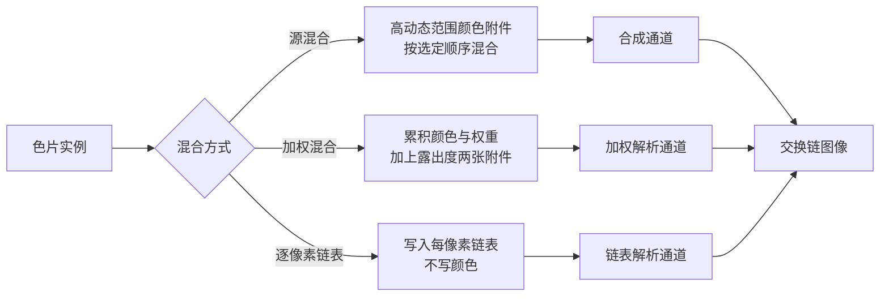

# transparency：半透明排序与顺序无关透明

构建方式见仓库根目录的 README。

## 简介

一叠相互交叠的半透明色片，层数可调，每层颜色不同、透明度相同、深度各不相同。四种混合方式对同一叠
色片给出不同结果：

| 混合方式 | 做法 | 需要排序 |
| --- | --- | --- |
| 源混合：由远到近 | 由远到近提交，固定功能按源 alpha 混合 | 是 |
| 源混合：由近到远 | 由近到远提交，同样的混合状态 | 是（方向错） |
| 源混合：乱序 | 按深度位打散后的顺序提交 | 是（顺序错） |
| 加权混合 | 一遍累积颜色与权重、一遍累积露出度，再合成到背景 | 否 |
| 逐像素链表 | 片元用原子操作插入每像素链表，解析通道按深度排序后混合 | 否 |

## 渲染流程



逐像素链表方式在几何通道之前先把每像素的链表头填成空、把节点计数器清零；解析通道从链表头出发收集
本像素的片元，用插入排序按深度由远到近排好，再依次混合到背景上。

## 实现要点

### 顺序错误与正确顺序的差别

八层色片、透明度零点三五，四种方式抓帧后与正确顺序逐像素比较：

| 对比 | 差异像素占比 | 平均绝对差 | 最大差值 |
| --- | --- | --- | --- |
| 由远到近 与 逐像素链表 | 0.000% | 0.083 | 0 |
| 由远到近 与 由近到远 | 37.999% | 24.087 | 96 |
| 由远到近 与 乱序 | 33.153% | 14.625 | 55 |
| 由远到近 与 加权混合 | 41.015% | 8.729 | 60 |

逐像素链表与由远到近的结果逐像素完全一致，最大差值为零。由近到远与乱序的颜色明显不同，最大差值接近
一百。加权混合没有排序却把偏差控制在一个较小的范围里，平均绝对差不到九，但仍有四成以上的像素与正确
结果相差超过八。

### 叠加次数热力图

热力图把每像素的叠加次数映射到一条从深蓝、经过绿到黄的调色板，归一化用当前的层数。八层时画面中心
测得 (255,217,51)，正是调色板在次数等于层数时的颜色；如果次数是七，颜色应当约为 (198,210,61)。画面
四角测得 (13,20,76)，落在调色板的起点，也就是次数为零。每层的色片边长固定、中心带一点抖动，层数在
中心处达到最大，向外逐层递减。

### 显存占用与设备时间

节点池一次分配四百万个节点，每个节点一个 `vec4` 颜色加一个 `uvec2`（深度与下一个节点），共二十四
字节，合计 96.0 兆字节，与层数无关；另有每像素的链表头与叠加次数各 5.5 兆字节。八层时写入的节点数
是 3484800，十二层时达到池上限 4194304，多出 1032896 个片元被丢弃。

锁频 2880/15001 之后按段测量，各配置的绘制命令条数都是 2：

| 混合方式 | 层数 | 设备时间 | 写入的节点数 |
| --- | --- | --- | --- |
| 源混合：由远到近 | 1 | 0.014 ± 0.007 ms | 0 |
| 源混合：由远到近 | 4 | 0.022 ± 0.008 ms | 0 |
| 源混合：由远到近 | 8 | 0.034 ± 0.011 ms | 0 |
| 源混合：由远到近 | 12 | 0.045 ± 0.014 ms | 0 |
| 加权混合 | 8 | 0.048 ± 0.014 ms | 0 |
| 加权混合 | 12 | 0.065 ± 0.015 ms | 0 |
| 逐像素链表 | 1 | 0.649 ± 0.107 ms | 435600 |
| 逐像素链表 | 4 | 2.667 ± 0.271 ms | 1742400 |
| 逐像素链表 | 8 | 5.336 ± 0.384 ms | 3484800 |
| 逐像素链表 | 12 | 8.197 ± 0.579 ms | 4194304（丢弃 1032896） |
| 逐像素链表，打开热力图 | 8 | 5.508 ± 0.519 ms | 3484800 |

源混合与加权混合的时间随层数缓慢上升，八层到十二层只从 0.034 涨到 0.045 毫秒，这部分是填充率。
逐像素链表的时间与层数近似线性，一层 0.649 毫秒，八层 5.336 毫秒，是同样层数下源混合的一百五十倍：
每个片元要多写一次节点与一次原子交换，解析通道还要对每个像素随机访问链表并按深度排序。

## 界面控件

| 控件 | 作用 |
| --- | --- |
| 方式 | 五种混合方式 |
| 层数 | 1 到 12 |
| 叠加次数热力图 | 打开后输出每像素的叠加次数而不是颜色 |
| GPU 锁频 | 与间接绘制 case 共用同一个面板 |

面板同时显示绘制命令条数、链表节点数、节点池溢出数与链表缓冲大小，另附操作指南；耗时面板按本 case
的通道拆分逐项列出。

## 命令行参数

| 参数 | 含义 | 默认值 |
| --- | --- | --- |
| `--mode 名字` | 混合方式，取 `far_to_near`、`near_to_far`、`unsorted`、`weighted` 或 `linked_list` | far_to_near |
| `--layers N` | 层数，1 到 12 | 8 |
| `--heatmap` | 输出叠加次数热力图 | 关闭 |
| `--no-interface` / `--auto-exit S` / `--capture F` / `--report F` / `--control-port N` | 与其他 case 一致 | |

键盘操作：`Esc` 退出。

## 测试方法

四种方式在同一层数下各抓一帧，互相比较：

```
build\meow_transparency.exe --mode far_to_near --layers 8 --auto-exit 3 --no-interface --capture intermediate\tp_far.png
build\meow_transparency.exe --mode near_to_far --layers 8 --auto-exit 3 --no-interface --capture intermediate\tp_near.png
build\meow_transparency.exe --mode unsorted --layers 8 --auto-exit 3 --no-interface --capture intermediate\tp_unsorted.png
build\meow_transparency.exe --mode weighted --layers 8 --auto-exit 3 --no-interface --capture intermediate\tp_weighted.png
build\meow_transparency.exe --mode linked_list --layers 8 --auto-exit 3 --no-interface --capture intermediate\tp_list.png
build\meow_transparency.exe --mode far_to_near --layers 8 --heatmap --auto-exit 3 --no-interface --capture intermediate\tp_heatmap.png
```

测量设备时间：启动一个进程锁频并打开控制服务，按段发送命令，程序把每段的结果追加到 CSV：

```
build\meow_transparency.exe --no-interface --control-port 21000 --core-clock 2880 --memory-clock 15001 --report intermediate\tp_measure.csv
```

连上 21000 端口后，`mode`/`layers`/`heatmap` 改配置，`begin` 与 `end` 圈定一段测量，`quit` 退出。

## 源码结构

| 文件 | 内容 |
| --- | --- |
| `src/main.cpp` | 桌面入口：命令行解析、主循环与界面状态 |
| `src/android_main.cpp` | 安卓入口：NativeActivity 生命周期、表面与交换链、主循环 |
| `src/renderer.cpp` | 三个渲染通道、三条几何管线与三条合成管线、层与链表的缓冲 |
| `src/case_ui.cpp` | 本 case 的控制面板与全部界面文本 |
| `src/timing_items.cpp` | 本 case 的计时项定义 |
| `shaders/quad.vert` `shaders/quad.frag` | 色片展开与源混合输出 |
| `shaders/weighted.frag` | 加权混合的权重、累积颜色与露出度 |
| `shaders/list.frag` | 原子分配节点并插入链表 |
| `shaders/fullscreen.vert` `shaders/composite.frag` | 全屏三角形与源混合结果的输出 |
| `shaders/weighted_resolve.frag` | 加权混合的解析与背景合成 |
| `shaders/list_resolve.frag` | 链表解析、按深度插入排序与混合 |

## 安卓端差异

- 实例与设备申请 Vulkan 1.1；`minSdk` 24 是 Vulkan 1.0 的最低 API 等级。
- 片元着色器里的原子操作需要 `fragmentStoresAndAtomics` 特性，各平台都由设备创建时统一开启。
- 加权混合的两张附件使用不同的混合状态，需要 `independentBlend` 特性。
- 节点池一次分配 96 兆字节，显存较小的设备需要相应减小层数上限或节点池容量。
- 设备时间只在设备支持时间戳时测量。
- GPU 锁频面板不显示：它依赖桌面的 `nvidia-smi`。
- 帧率上限 60 FPS，避免无界空转发热。

### 安卓测试方法

```
adb -s <serial> install -r android\app\build\outputs\apk\debug\app-debug.apk
adb -s <serial> logcat -s MeowVulkanDemo
```

应用内置回环 TCP 控制服务（端口 21000），安卓端经 `adb forward tcp:21000 tcp:21000` 映射到本机。
